***
# 20) Asp.NET Core 5.0 - UrlHelpers - HtmlHelpers Fonksiyonları
- Helpers yapılanmaları adı üstünde yardımcı metotlar. 
    * UrlHelper: Url ile ilgili işlem yaparken manuel bir şekilde yapmaktansa hızlı bir şekilde buy işlemleri rotalara uygun URL oluşturmak olsun bunun gibi şeylerde sana yardımcı olmaktadır.
    * HtmlHelper: HTML ile ilgili çalışmalarda sana yardımcı metotlar tanımlamakta.
    * TagHelper: HTML etiketleriyle ilgili sizlere ekstradan yardımcı olabilmektedir.

- HtmlHelper ve UrlHelper Asp.NET Standart'ta gelen teknolojiyken TagHelper Asp.NET Core'da gelen bir teknolojidir.


# UrlHelpers
- Asp.NET Core MVC uygulamalarında url oluşturmak için yardımcı metotlar içeren ve o anki url'e dair bizlere bilgi veren bir sınıftır.

|Metotlar|Property'ler|
|--------|------------|
|Action|ActionContext|
|ActionLink||
|Content||
|RouteUrl||


## Action Metodu
- Verilen Controller ve Action'a ait url oluşturmayı sağlayan metottur. Yani bir link oluşturacaksın sen bu linki manuel'de oluşturabilirsin. UrlHelper'ı kullanarakta oluşturabilirsin. Hedef controller ve action'ın neyse onu verdiğin zaman sana uygun bir şekilde linki oluşturacaktır.

```C#
Url.Action("index","product",new { id = 5 })
```
- `product/index/5`

- Asp.NET Core MVC mimarisinde controller sınıflarında yahut View yapılanmalarında/dosyalarında UrlHelper'a erişmek istiyorsanız `Url` property'sini kullanmanız yeterli. Base Class'tan geldiği için ekstradan bir tanımlama yapmanıza gerek kalmaz.

- Hedef controller'ın altındaki hedef action'a uygun bir link oluşturmak istiyorsanız bu metodu kullanabilirsiniz. Eğer varsa parametre tanımlamaları bunu da anonymous şekilde bu metottan verebilirsiniz.

- `Action` oluşturulacak Url'in ana dizinini oluşturmaz. Yani host,port ve protokol bilgisini barındırmaksızın direkt size url'in devamını verecektir.

- Senin o anda sistemde kullandığın Url yapılanması ne ise `Action` fonksiyonu o rotaya uygun bir url oluşturacaktır. `Action` fonksiyonu ve bundan sonraki fonksiyonların oluşturacağı yapılanmalar/url'ler sistemde kullanılan rotanın şemasından yola çıkarak oluşturulur. Yoksa nasıl oluşturacağını bilemez. Sistemde varolan rota şemalarından buradaki düzeni almaktadır.


## ActionLink Metodu 
- Verilen Controller ve Action'a ait url oluşturmayı sağlayan bir metottur.

```C#
Url.Action("index","product",new { id = 5 })
```
- `https://localhost:5001/product/index/5`

- Oluşturan url temel host bilgisini protokol ve port bilgisini barındırır. Yani sitenin kendi adını da taşıyacaktır. Devamı ise rotadaki şablona uygun bir şekilde tasarlanacaktır.


## Content Metodu
- Genellikle CSS ve Script gibi dosya dizinlerini programatik olarak tarif etmek için kullanmaktayız.

```C#
Url.Content("~/site.css")
```

- `UseStaticFiles` middleware'i ile gelen static dosya yapılanmasını bu metodun işlevselliğini daha efektif üstlenmektedir.


## RouteUrl
- Mimaride tanımlı olan Route isimlerine uygun bir şekilde url oluşturan bir metottur.

```C#
Url.RouteUrl("Default")
```
- `/Product/GetProducts`


## ActionContext Property'si
- O anki url'e dair tüm bilgilere erişebilmemizi sağlayan bir property'dir.


# HtmlHelpers
- Günümüzde çok fazla kullanılmamaktadır. Çünkü artık TagHelper'lar var. HtmlHelper'lar hem çok maliyetli hem de performanslı yapılanmalar. TagHelper'lar hem daha az maliyetli hem de daha performanslı yapılanmalar.

- Html etiketlerini server tabanlı oluşturmamızı sağlayan sözde yardımcı metotları barındırmakta.

- Server tabanlı Html etiketlerini oluşturmamızı sağlıyor ama durduk yere Html ile ilgili işlemlerde server'a yük bindiriyor. Hani sözde yardımcı olmuş oluyor amma bir yandan da bize daha pahalıya mâl olmuş oluyor.

- Hedeflenen .cshtml doyalarımızı render etmemizi sağlamaktadır.

- O anki context'e dair bilgileri edinmemizi sağlamaktadır.

- Veri taşıma kontrollerine erişmemizi sağlamaktadır.

|Metotlar|Propertyler|
|--------|-----------|
|Html.Partial|ViewContext|
|Html.RenderPartial|TempData|
|Html.HtmlActionLink|ViewData|
|Html Form Metotları|ViewBag|


## Partial
- Hedef View'i render etmemizi sağlayan bir fonksiyondur.

- Elinde bir view'mı var. Bunu controller'dan gelen istek neticesinde render etmeyeceksin bir View'desin View esnasında belirli bir noktada `Html.Partial` ile hedef View'i çağırıp onu render edip çıktısını oraya verdirebilirsin. Yani illa bir controller'dan istek gitmesine gerek yok ilgili View'e.

```C#
<div style="border-top-color:ActiveBorder">
    @Html.Partial("~/Views/Product/Index.cshtml")
</div>
```
- Render edilen view'e ilgili action'dan model/data gönderilebilmektedir.

- Gelen veri taşıma kontrollerinin tüm verileri ve aynı şekilde gönderilen bütün model bazlı dataların hepsi kullanılan partial'lara taşınacaktır.

- Action View'inde direkt `View` metodu üzerinden gönderilen data'yı kullanabilirsin. Aynı şekilde bir bildiri de bulunmadığın taktirde Partial'da da data'yı kullanabilirsin. Ama View'de farklı bir datayken Partial View'de ekstradan farklı bir model gönderiyorsan artık partial view o model'ı karşılayabilir.


## RenderPartial
- Hedef View'i render etmemizi sağlayan bir fonksiyondur.

- `Partial` scope'a gerek kalmaksızın çağırılabilirken `RenderPartial` scope içerisinde çağırılmak zorunda. Bunun da sebebi `Partial` geriye `string` döndürürken `RenderPartial` `void` döndürür. Yani herhangi birşey döndürmez. Onun için bunu tetikleyebilmeniz için scope içerisinde C# kurallarıyla tetiklemeniz gerekmektedir.

```C#
<div style="border-top-color:ActiveBorder">
    @{Html.RenderPartial("~/Views/Product/Index.cshtml");}
</div>
```
- `Html.RenderPartial` sayfanın TextWriter'ını kullandığı için(yani Http response stream'e yazılıdğı için) Html.Partial'a nazaran daha hızlı render işlemini yürütür. Dolayısıyla daha performanslıdır.


## ActionLink
- Url oluşturur.
```C#
@Html.ActionLink("Anasayfa","Index","Home")
```
- oluşturulan linki `<a href=/Home/Index>Anasayfa</a>` tag'inde verir.


## Html Form Metotları
- Kullanıcıyla etkileşime girmemizi sağlayan form ve input nesneleri oluşturmamızı sağlayan metotlardır.
    * Html.BeginForm
    * Html.CheckBox
    * Html.TextBox
    * Html.Display
    * Html.Password
    * Html.TextArea
    * Html.ValidationMessage

```C#
// --------- Metotlar ---------
@Html.BeginForm()
@Html.CheckBox("cb")
@Html.TextBox("txt")
@Html.Display("display")
@Html.Password("pwd")
@Html.TextArea("area")
@Html.ValidationMessage("vldt")

// --------- Oluşan Nesneler ---------
<form action="/product/getproducts" method="post">
    <input id="cb" name="cb" type="checkbox" value="true">
    <input id="pwd" name="pwd" type="password">
    <textarea id="area" name="area"></textarea>
    <span class="field-validation-valid" data-valmsg-for="vldt" data-valmsg-replace="true"></span>
</form>
```
- HtmlHelper ile form ve input nesnesinin oluşturulması server tarafından üstlenildiği için ekstradan maliyetli yapılanmalardır. Bu maliyeti ortadan kaldırmak için Asp.NET Core MVC'de TagHelpers yapıları gelmiştir.


***
# 21) Asp.NET Core 5.0 - Custom HtmlHelper Fonksiyonu Oluşturmak
- HtmlHelper'lar Html nesneleri oluştururken bizlere yardımcı olan hazır metodları barındıran bir kütüphane.

- Her Html nesnesi talep ettiğimizde bunun ayarlarını vermek zorunda mıyız? Tabikide değiliz. Eğer ki birçok noktada bu şekilde customize edilecek Html formatlarına ihtiyacımız varsa biz custom bir şekilde sırf o işe odaklı sırf o nitelikleri barındıran HtmlHelper nesnesi oluşturabiliriz. Extension metot yazarak oluşturabiliriz.

- Bir şeyin Custom halini oluşturmak istiyorsanız extension metotlarını kullanabilirsiniz. Herhangi bir nesnenin/yapının/değerin customize edilmiş halini extension üzerinden çok rahat bir şekilde kendinize formatlandırabilirsiniz.

```C#
//******************* Controller *******************
public class ProductController : Controller
{
    public IActionResult GetProducts()
    {
        return View();
    }
}
//******************* View *******************
@using OrnekUygulama.Extensions

@Html.TextBox("txtadi",null,new {style="background-color:green; color:white"})

@Html.CustomTextBox("txtCustomAdi",null,"Adınız")
//******************* Extension *******************
public static class Extensions
{
    public static IHtmlContent CustomTextBox(this IHtmlHelper htmlHelper, string name, string value = "", string placeHolder = null)
        => htmlHelper.TextBox(name, value, new
        {
            style = "background-color:black;color:white;font-size:30px;",
            @class = "form-input",
            a = "a",
            b = "b",
            placeholder = placeHolder
        });
}
```

***
# 22) Asp.NET Core 5.0 - TagHelpers Nedir? Nasıl Kullanılır?


- Tag Helpers, daha okunabilir, anlaşılabilir ve kolay geliştirilebilir bir view inşa etmemizi sağlayan, Asp.NET Core ile birlikte HtmlHelpers'ların yerine gelen yapılardır.

- HtmlHelper View üzerinde Html ile ilgili bize yardımcı olan fonksiyonları tanıyan bir sınıftır.

- Basit bir sayfa/form sayfası bile tasarlamak istiyorsanız HtmlHelper ciddi manada kompleks okunabilirliği düşük bir sayfa tasarlamamızı sağlıyor. Halbuki TagHelper'lar daha okunabilir daha anlaşılabilir daha kolay geliştirilebilir sayfa tasarımları oluşturmamızı sağlıyor.
 


- TagHelper'lar view'lerde ki kod maliyetini oldukça düşürmektedirler. Kod maliyetinden kastımız hani performans açısından olan maliyet değil normal bildiğiniz baktığınızda hani mevcut inşadaki kullanılan malzemenin maliyeti kodun maliyeti. Yapabileceğiniz bir işi basit bir şekilde ya da olması gerektiğinden daha fazlasıyla yapma maliyeti. Sen şimdi HtmlHelper kullandığında orada oluşturman gereken Html nesnelerini fonksiyonel tabanlı oluşturduğunda ciddi manada yönetimi de zorlaşıyor kod maliyeti de artmış oluyor. Ama TagHelper'lar etiket bazlı çalıştıkları için Html nesnelerinde vs. kod maliyetini arttırmazlar. Direkt Html kullanabilirsiniz.

- HtmlHelpers'ların Html nesnelerinin generate edilmesini server'a yüklenmesinin getirdiği maliyeti de ortadan kaldırmaktadırlar.

- HtmlHelpers'ların Html nesnelerinin generate edilmesi server'a ekstradan yük bindirir.

- HtmlHelpers'lar da ki programatik yapılanma, programlama bilmeyen tasarımcıların çalışmasını imkansız hale getirmekteydi. TagHelpers'lar ile buradaki kusur giderildi ve tasarımcılar açısından programlama bilgisine ihtiyaç duyulmaksızın çalışma yapılabilir nitelik kazandırdı.

- HtmlHelpers ile oluşturulan html nesnesinin attribute'ları 'htmlAttribute' parametresi üzerinden anonim nesne ile verilmektedir. Bu durum hem bellek optimizasyonu açısından hemde kod maliyeti açısından oldukça zararlıdır. TagHelpers'lar bu maliyeti ortadan kaldırmakta ve html nesnelerine sadece ilgili attribute'ları normal sözdizimiyle vermekle ilgilenmektedirler.

- TagHelper'lar senin Html nesnesinni oluştururken herhangi bir fonksiyon kullanmana gerek yok çünkü Html nesnesini alenen koyuyorsun sen oraya üzerine gerekli attribute'larını girebiliyorsun yani normal Html çalışırken o Html üzerinde belirli etiket desteğini sağlayan bir yapılanmadır TagHelper.

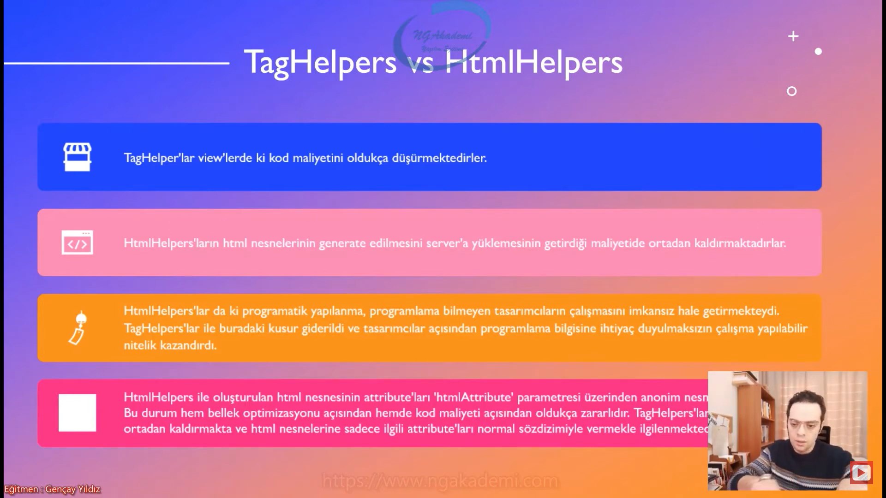

- TagHelper'ları kullanabilmek için View'lere  `@addTagHelper *, Microsoft.AspNetCore.Mvc.TagHelpers` namespace'inin eklenmesi gerekmektedir.

- TagHelper'lar özünde bir sınıf olduklarından dolayı belirli bir kütüphanenin içerisinde barındırılmaktadır.

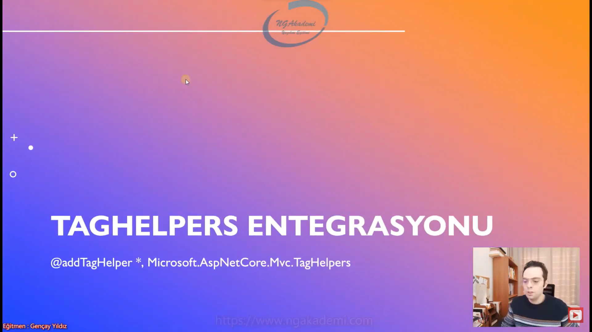
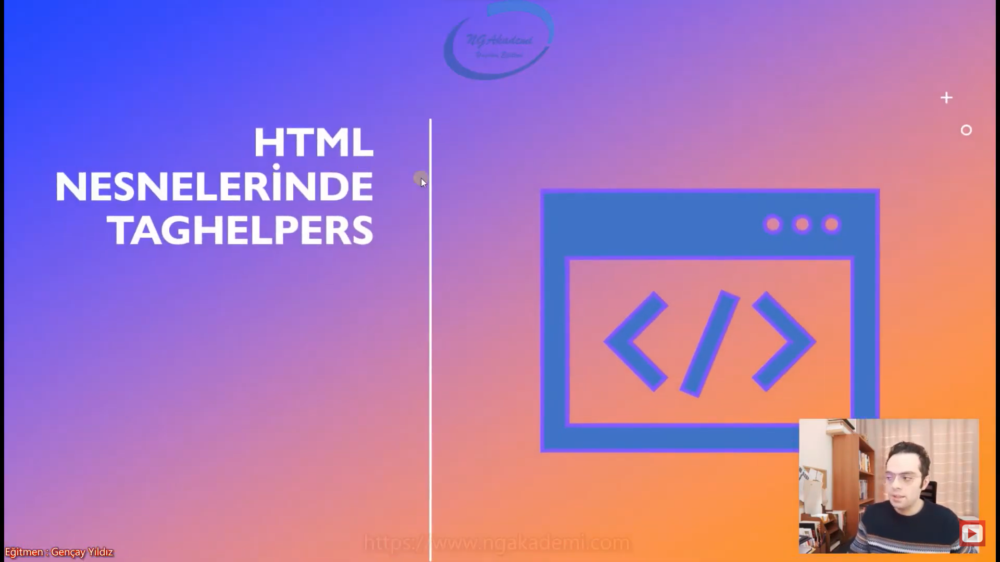


## FORM TAGHELPER
`<form action="/" asp-action="Index" asp-controller="Home" method="post"></form>`

- HtmlHelper ile çalışırken `Html.BeginForm()` yapısını kullanıyorduk.

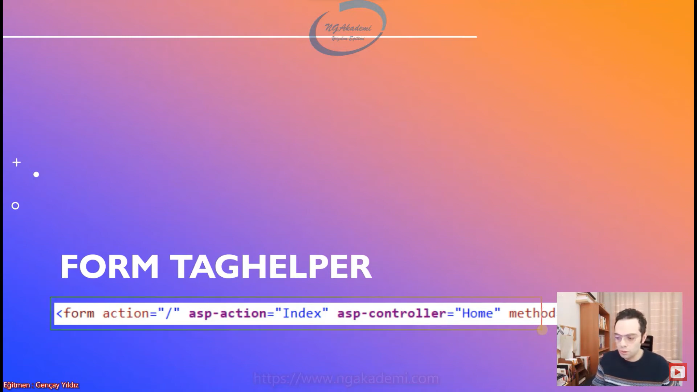

## INPUT TAGHELPER
- input nesnelerinde kullanabildiğimiz bu nesneler üzerinde belirli model binding işlemlerinde vs kullandığımız TagHelper'ımızdır.

```C#
<input type="text" asp-for=""/>
<select asp->
    <option value="value">text</option>
</select>
```

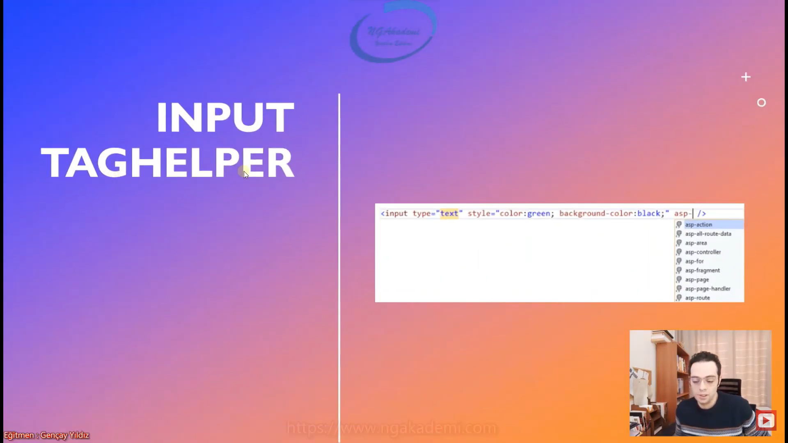

## CACHE TAGHELPER
- Elimizdeki verileri cache'leyebiliyoruz. InMemory'de bunları cache'leyebilmektedir.

```C#
<cache>
    Cache : @DateTime.Now
</cache>
<br />
@DateTime.Now
```

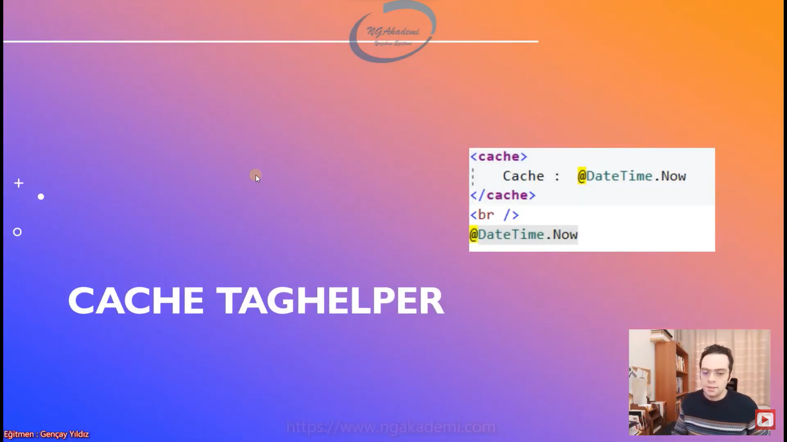

## ENVIRONMENT TAGHELPER
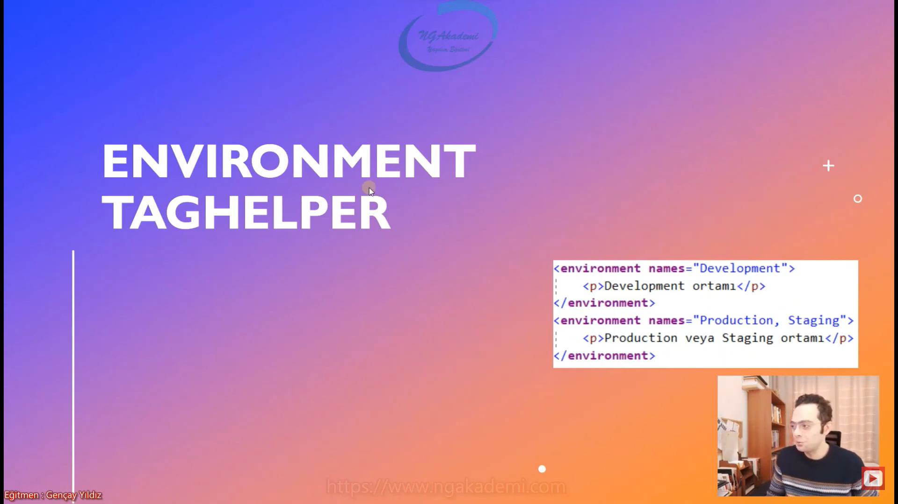

```C#
<environment names="Development">
    <p>Development Ortamı</p>
</environment>
<environment names="Production, Staging">
    <p>Production veya Staging Ortamı</p>
</environment>
```

## IMAGE TAGHELPER
- Tarayıcılar static dosyaları local cache üzerinde saklamaktadırlar.

- Cachelenmiş bir dosya tekrar istenildiği taktirde bunun için server'a istek gönderilmez ve local cache üzerinden ilgili dosyanın cache'I gönderilir. Böylece sayfalar ilk açılışlarından sonraki taleplerde daha hızlı yüklenebilmektedirler.

- Lakin bazen dosya adı değişmeden içeriği değişebilmektedir. Böyle bir durumda ilgili dosyanın cache'den değil, server'dan yüklenmesi gerekmektedir. Bu duruma biz ETag yöntemiyle müdahale edebilmekteyiz.

- Asp.NET Core MVC mimarisinde TagHelper'lar içerisinde static dosyalara etag yöntemini uygulayabilir ve dosyanın adı değişmesede içeriği değiştiği taktirde etag üzerinden bu değişikliği fark ederek ilgili dosyanın server'dan talep edileceği bilinebilmektedir.

- Sen bir web sitesi üzerinde giriş yaptıysan ve bu ilk girişinse bütün dosyalar ilgili web sitesinden yüklenir. Sen girişi yaptın sunucu sana bütün ne var yoksa sayfaya dair dosyaların hepsini yükleyecektir. Senin tarayıcına yüklenen bu dosyalara artık bir sonraki istekte eğer ki bir değişiklik yoksa tekrardan yüklenmeyecek bunlar senin tarayıcındaki cache'den çekilecektir.  Sunucu diyor ki ya kardeşim her isteğe karşılık varolan statik dosyaları tekrar tekrar göndermektense bu dosyaları sana bir kere gönderecem gönderdiklerimi senin tarayıcın cache'leyecek bu cache neticesinde de biz artık bundan sonraki isteklerde onu kullanacağız.

- Senin yapmış olduğun istek neticesinde bu statik dosyalar değiştiyse ve bu değişiklikten haberdar değilsen burada tekrardan cache'deki dosyaları kullanacaksın. Böyle bir durumda Etag dediğimiz bir etiket/jeton kullanılır ve bu jeton üzerinden server'da ilgili statik dosyanın değişip değişmeme durumu fark edilir ve ona göre değiştiyse server'dan en güncel halleri çekilir.

- ImageTagHelper yani TagHelper'lar image'ler üzerinde belirli cache işlemleri yapılırken eğer ki data güncellendiyse ilgili image dosyası değiştirildiyse buradaki değişikliği yakalayabilmemiz için kendi dahilinde ETag yöntemini otomatik kullanmamızı sağlayabilmektedir.

```C#

```
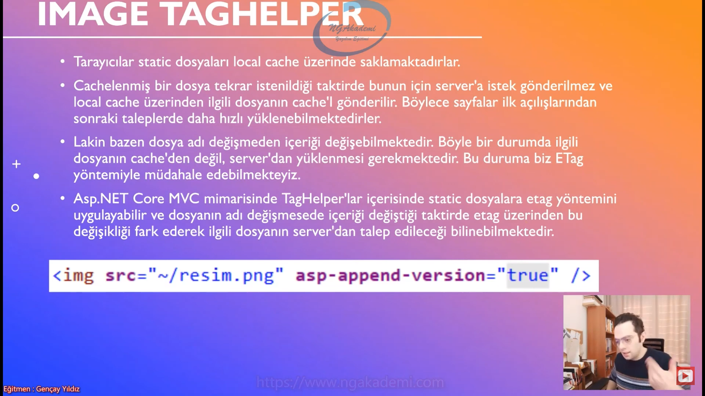

## PARTIAL TAGHELPER
- 
```C#
<partial name="~/Views/Product/Partials/ListPartial.cshtml" />
```

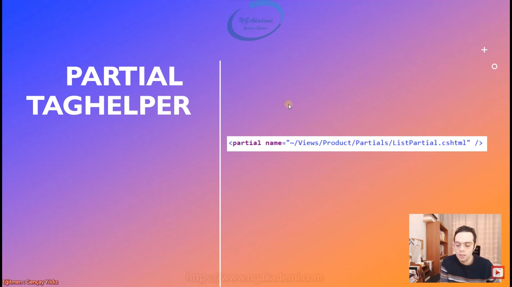

## REMOVE TAGHELPER
- TagHelper'ları eklediğimiz View'lerden tekrardan kaldırabiliyoruz.

```C#
@addTagHelper *, Microsoft.AspNetCore.Mvc.TagHelpers

@removeTagHelper *, Microsoft.AspNetCore.Mvc.TagHelpers


```

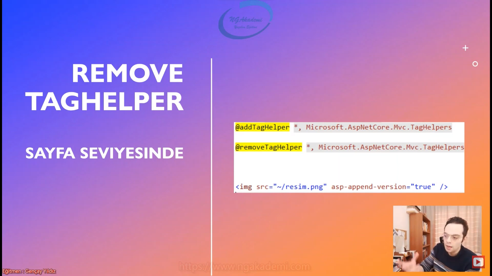

```C#
<form asp-action="Index" asp-controller="Home"></form>
<!form asp-action="Index" asp-controller="Home"></!form>
```
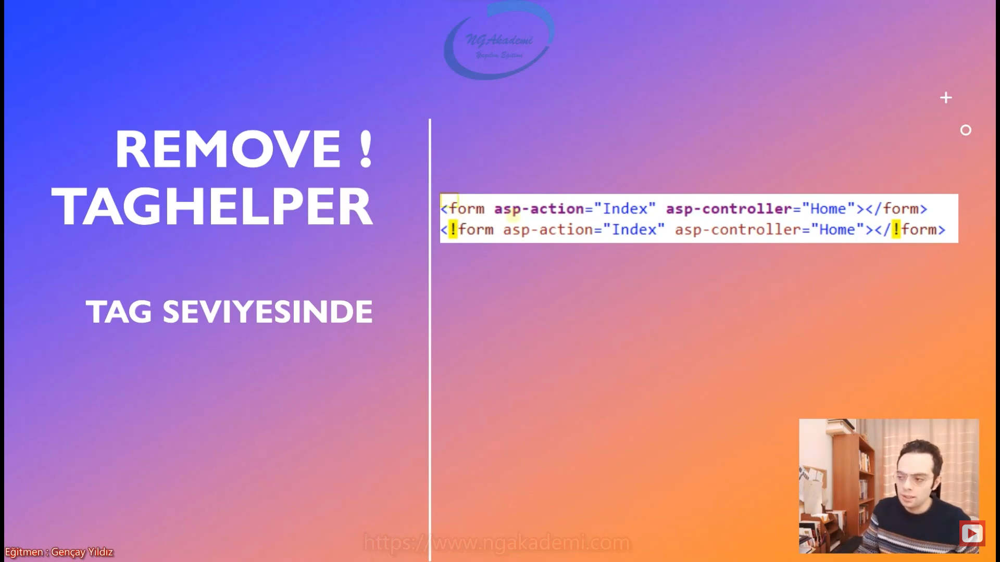

***
# 23) Asp.NET Core 5.0 - Custom TagHelpers Oluşturma
- Özel bir TagHelper oluşturmanın ihtiyacı normal bir projenin doğal seyrinde olan bir ihtiyaçtır. Nihayetinde gelişim sürecinde olan projelerde tekrar tekrar bazı yapıları oluşturmaktansa bunu tek seferlik oluşturmak ve her kullanman gereken noktada onu çağırıp kullanmak işin temel pratik çözümüdür. Tek seferde bir component mantığıyla olayı çözebilirsiniz.

- TagHelper'lar yapısal olarak bir sınıftır. Bizim Custom TagHelper oluşturabilmemiz için normal bir sınıf oluşturmamız gerekir.

- TagHelper sınıflarında esasında TagHelper'ın isminin ta kendisidir.

- Bir sınıfın TagHelper olabilmesi için `Microsoft.AspNetCore.Razor.TagHelpers.TagHelper` `abstract class`ından türemesi gerekmektedir.
 
```C#
public override void Process(TagHelperContext context, TagHelperOutput output)
{
    base.Process(context, output);
}
```
- context parametresinin içerisinde ilgili TagHelper'a vermiş olduğumuz bütün değerleri sizlere getirecektir. context sana kaynağı TagHelper'ı getirecek output ise bu TagHelper'ın yapacağı işleri sana sunacaktır. context o sırada tetiklenen TagHelper'ı sana getirecek bütün özellikleriyle beraber output kullanılan TagHelper'ın yerine çıktı olarak ne vereceksin onun ayarlarını konfigürasyonlarını bunun üzerinden yapıyorsun.

- `Process` fonksiyonu ise ilgili TagHelper'ın işlemini yapıldığı fonksiyondur.

- TagHelper üzerinde alacağımız attribute'ları property olarak alırsak direkt tanımlanabilir hale geleceklerdir.

- Yapısal olarak bir TagHelper içerisindeki property'lerle ve `Process` fonksiyonuyla ibaret. Property'lere değerleri almakta `Process`te ise bu değerleri işleyip output'unu sunmaktadır.

- Bir TagHelper oluşturduysanız oluşturulan TagHelper ismini sınıfın isminden almaktadır. Yahut farklı bir isim vermek isterseniz `[HtmlTargetElement]` attribute'u ile verebilirsiniz.

- TagHelper'ın işlevsellik gösterebilmesi/operasyonunu gerçekleştirebilmesi için `Process` metodunun override edilmesi gerekmektedir. Biz bu metot üzerinden gerekli operasyonu gerçekleştiriyoruz.

- `TagHelperContext context` : İlgili TagHelper'ı getirmekte. Attributes'ları UnıqueId gibi değerleri getirmektedir.

- `TagHelperOutput output`  : İlgili attribute'un çıktısını bizlere vermektedir.

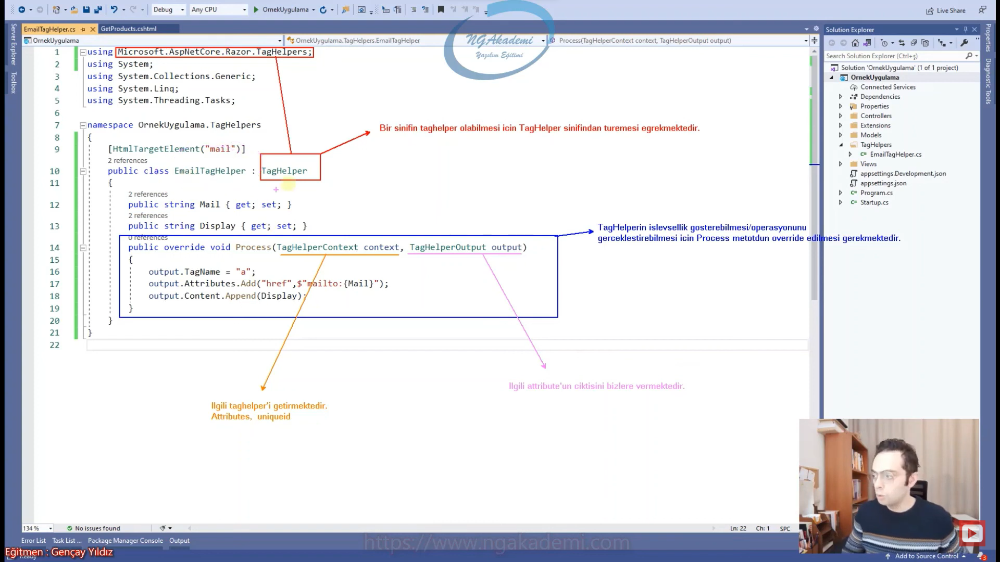

```C#
//******************* TagHelper *******************
using Microsoft.AspNetCore.Razor.TagHelpers;

namespace OrnekUygulama.TagHelpers
{
    //[HtmlTargetElement("mail")]
    public class EmailTagHelper : TagHelper
    {
        public string Mail { get; set; }
        public string Display { get; set; }
        public override void Process(TagHelperContext context, TagHelperOutput output)
        {
            output.TagName = "a";
            output.Attributes.Add("href",$"mailto:{Mail}");
            output.Content.Append(Display);
            //base.Process(context, output);
        }
    }
}

//******************* View *******************
@addTagHelper *, Microsoft.AspNetCore.Mvc.TagHelpers
@addTagHelper *, OrnekUygulama

<a href="mailto:musa.uyumaz73@gmail.com"></a>
<br />
<email mail="musa.uyumaz73@gmail.com" display="Musa Uyumaz Mail'i'"></email>
```