***
# 20) Asp.NET Core 5.0 - UrlHelpers - HtmlHelpers Fonksiyonları
- Helpers yapılanmaları adı üstünde yardımcı metotlar. 
    * UrlHelper: Url ile ilgili işlem yaparken manuel bir şekilde yapmaktansa hızlı bir şekilde buy işlemleri rotalara uygun URL oluşturmak olsun bunun gibi şeylerde sana yardımcı olmaktadır.
    * HtmlHelper: HTML ile ilgili çalışmalarda sana yardımcı metotlar tanımlamakta.
    * TagHelper: HTML etiketleriyle ilgili sizlere ekstradan yardımcı olabilmektedir.

- HtmlHelper ve UrlHelper Asp.NET Standart'ta gelen teknolojiyken TagHelper Asp.NET Core'da gelen bir teknolojidir.

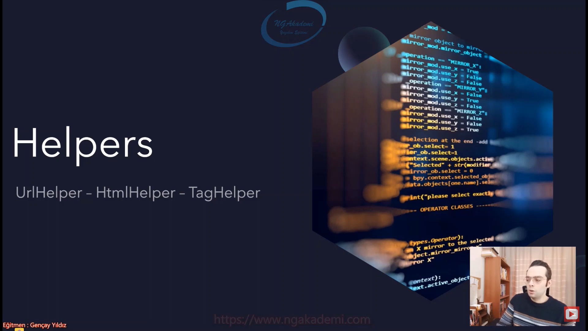

# UrlHelpers
- Asp.NET Core MVC uygulamalarında url oluşturmak için yardımcı metotlar içeren ve o anki url'e dair bizlere bilgi veren bir sınıftır.

|Metotlar|Property'ler|
|--------|------------|
|Action|ActionContext|
|ActionLink||
|Content||
|RouteUrl||

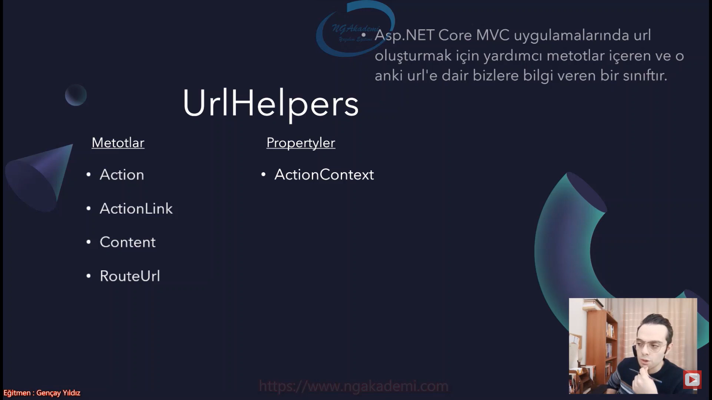

## Action Metodu
- Verilen Controller ve Action'a ait url oluşturmayı sağlayan metottur. Yani bir link oluşturacaksın sen bu linki manuel'de oluşturabilirsin. UrlHelper'ı kullanarakta oluşturabilirsin. Hedef controller ve action'ın neyse onu verdiğin zaman sana uygun bir şekilde linki oluşturacaktır.

```C#
Url.Action("index","product",new { id = 5 })
```
- `product/index/5`

- Asp.NET Core MVC mimarisinde controller sınıflarında yahut View yapılanmalarında/dosyalarında UrlHelper'a erişmek istiyorsanız `Url` property'sini kullanmanız yeterli. Base Class'tan geldiği için ekstradan bir tanımlama yapmanıza gerek kalmaz.

- Hedef controller'ın altındaki hedef action'a uygun bir link oluşturmak istiyorsanız bu metodu kullanabilirsiniz. Eğer varsa parametre tanımlamaları bunu da anonymous şekilde bu metottan verebilirsiniz.

- `Action` oluşturulacak Url'in ana dizinini oluşturmaz. Yani host,port ve protokol bilgisini barındırmaksızın direkt size url'in devamını verecektir.

- Senin o anda sistemde kullandığın Url yapılanması ne ise `Action` fonksiyonu o rotaya uygun bir url oluşturacaktır. `Action` fonksiyonu ve bundan sonraki fonksiyonların oluşturacağı yapılanmalar/url'ler sistemde kullanılan rotanın şemasından yola çıkarak oluşturulur. Yoksa nasıl oluşturacağını bilemez. Sistemde varolan rota şemalarından buradaki düzeni almaktadır.

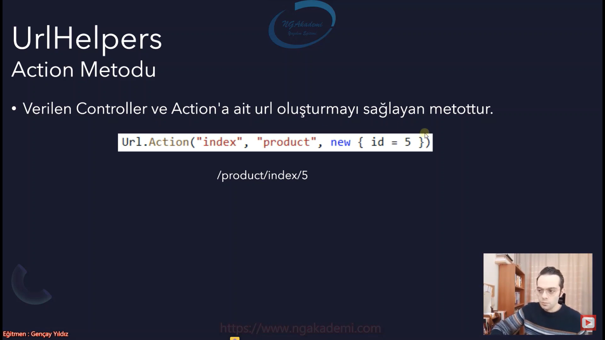

## ActionLink Metodu 
- Verilen Controller ve Action'a ait url oluşturmayı sağlayan bir metottur.

```C#
Url.Action("index","product",new { id = 5 })
```
- `https://localhost:5001/product/index/5`

- Oluşturan url temel host bilgisini protokol ve port bilgisini barındırır. Yani sitenin kendi adını da taşıyacaktır. Devamı ise rotadaki şablona uygun bir şekilde tasarlanacaktır.

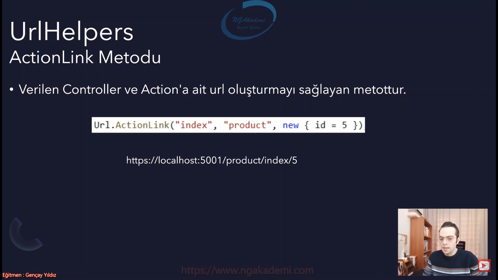

## Content Metodu
- Genellikle CSS ve Script gibi dosya dizinlerini programatik olarak tarif etmek için kullanmaktayız.

```C#
Url.Content("~/site.css")
```

- `UseStaticFiles` middleware'i ile gelen static dosya yapılanmasını bu metodun işlevselliğini daha efektif üstlenmektedir.

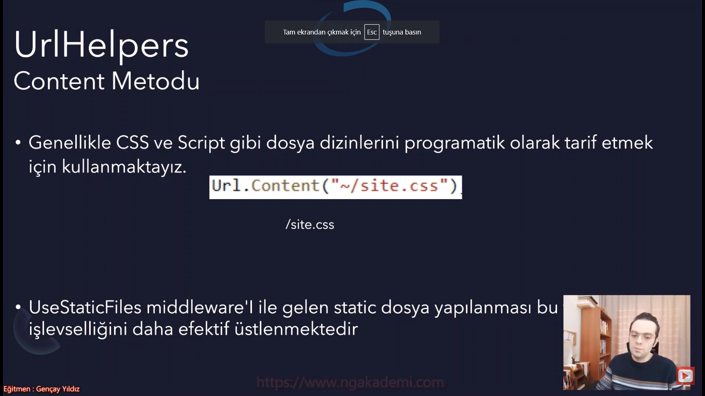

## RouteUrl
- Mimaride tanımlı olan Route isimlerine uygun bir şekilde url oluşturan bir metottur.

```C#
Url.RouteUrl("Default")
```
- `/Product/GetProducts`

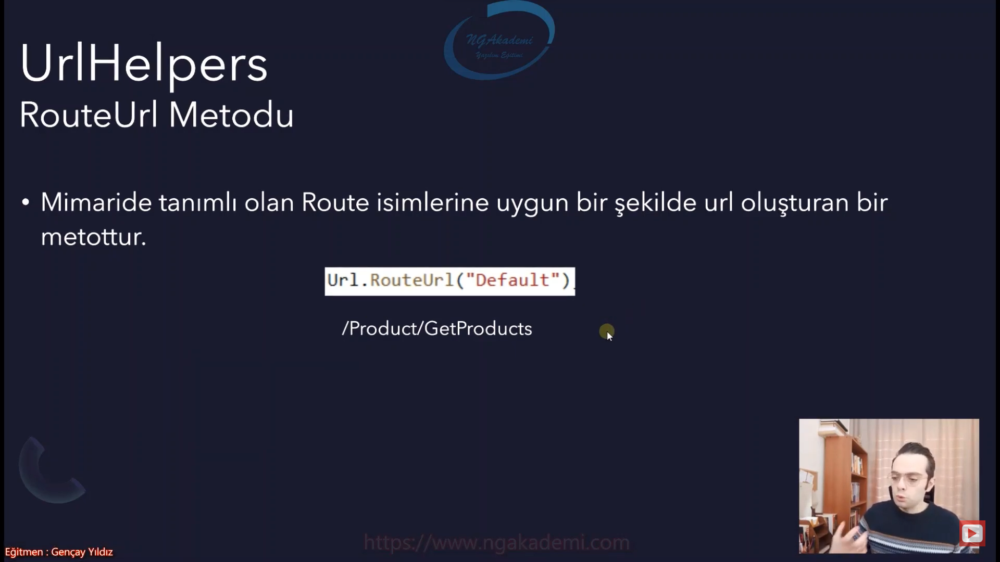

## ActionContext Property'si
- O anki url'e dair tüm bilgilere erişebilmemizi sağlayan bir property'dir.

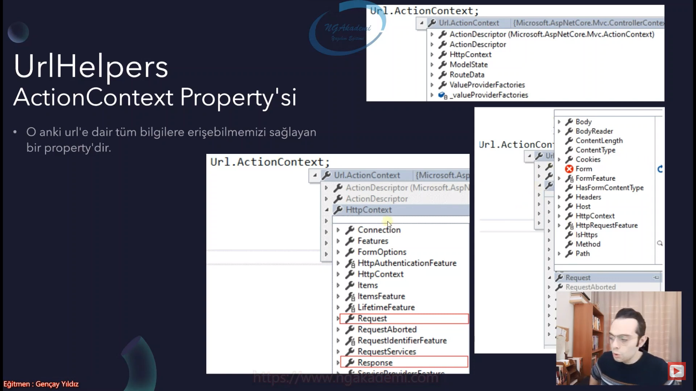

# HtmlHelpers
- Günümüzde çok fazla kullanılmamaktadır. Çünkü artık TagHelper'lar var. HtmlHelper'lar hem çok maliyetli hem de performanslı yapılanmalar. TagHelper'lar hem daha az maliyetli hem de daha performanslı yapılanmalar.

- Html etiketlerini server tabanlı oluşturmamızı sağlayan sözde yardımcı metotları barındırmakta.

- Server tabanlı Html etiketlerini oluşturmamızı sağlıyor ama durduk yere Html ile ilgili işlemlerde server'a yük bindiriyor. Hani sözde yardımcı olmuş oluyor amma bir yandan da bize daha pahalıya mâl olmuş oluyor.

- Hedeflenen .cshtml doyalarımızı render etmemizi sağlamaktadır.

- O anki context'e dair bilgileri edinmemizi sağlamaktadır.

- Veri taşıma kontrollerine erişmemizi sağlamaktadır.

|Metotlar|Propertyler|
|--------|-----------|
|Html.Partial|ViewContext|
|Html.RenderPartial|TempData|
|Html.HtmlActionLink|ViewData|
|Html Form Metotları|ViewBag|

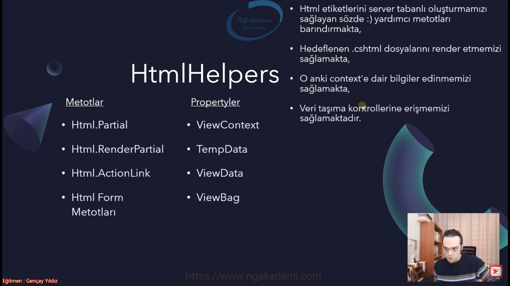

## Partial
- Hedef View'i render etmemizi sağlayan bir fonksiyondur.

- Elinde bir view'mı var. Bunu controller'dan gelen istek neticesinde render etmeyeceksin bir View'desin View esnasında belirli bir noktada `Html.Partial` ile hedef View'i çağırıp onu render edip çıktısını oraya verdirebilirsin. Yani illa bir controller'dan istek gitmesine gerek yok ilgili View'e.

```C#
<div style="border-top-color:ActiveBorder">
    @Html.Partial("~/Views/Product/Index.cshtml")
</div>
```
- Render edilen view'e ilgili action'dan model/data gönderilebilmektedir.

- Gelen veri taşıma kontrollerinin tüm verileri ve aynı şekilde gönderilen bütün model bazlı dataların hepsi kullanılan partial'lara taşınacaktır.

- Action View'inde direkt `View` metodu üzerinden gönderilen data'yı kullanabilirsin. Aynı şekilde bir bildiri de bulunmadığın taktirde Partial'da da data'yı kullanabilirsin. Ama View'de farklı bir datayken Partial View'de ekstradan farklı bir model gönderiyorsan artık partial view o model'ı karşılayabilir.

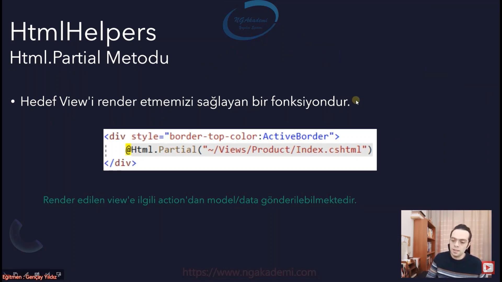

## RenderPartial
- Hedef View'i render etmemizi sağlayan bir fonksiyondur.

- `Partial` scope'a gerek kalmaksızın çağırılabilirken `RenderPartial` scope içerisinde çağırılmak zorunda. Bunun da sebebi `Partial` geriye `string` döndürürken `RenderPartial` `void` döndürür. Yani herhangi birşey döndürmez. Onun için bunu tetikleyebilmeniz için scope içerisinde C# kurallarıyla tetiklemeniz gerekmektedir.

```C#
<div style="border-top-color:ActiveBorder">
    @{Html.RenderPartial("~/Views/Product/Index.cshtml");}
</div>
```
- `Html.RenderPartial` sayfanın TextWriter'ını kullandığı için(yani Http response stream'e yazılıdğı için) Html.Partial'a nazaran daha hızlı render işlemini yürütür. Dolayısıyla daha performanslıdır.

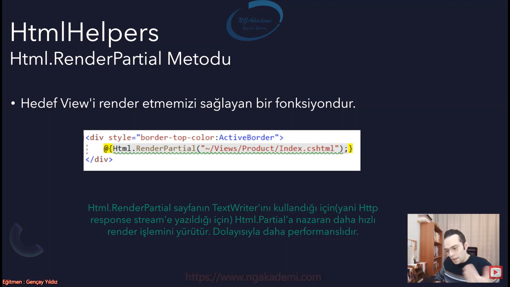

## ActionLink
- Url oluşturur.
```C#
@Html.ActionLink("Anasayfa","Index","Home")
```
- oluşturulan linki `<a href=/Home/Index>Anasayfa</a>` tag'inde verir.

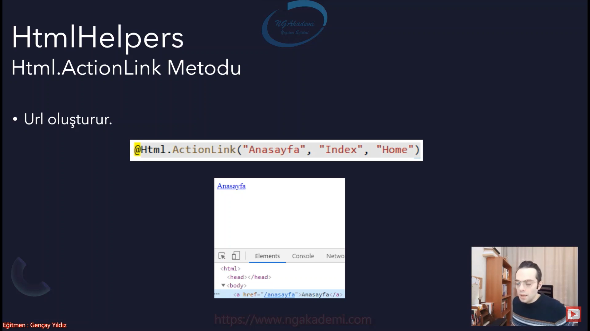

## Html Form Metotları
- Kullanıcıyla etkileşime girmemizi sağlayan form ve input nesneleri oluşturmamızı sağlayan metotlardır.
    * Html.BeginForm
    * Html.CheckBox
    * Html.TextBox
    * Html.Display
    * Html.Password
    * Html.TextArea
    * Html.ValidationMessage

```C#
// --------- Metotlar ---------
@Html.BeginForm()
@Html.CheckBox("cb")
@Html.TextBox("txt")
@Html.Display("display")
@Html.Password("pwd")
@Html.TextArea("area")
@Html.ValidationMessage("vldt")

// --------- Oluşan Nesneler ---------
<form action="/product/getproducts" method="post">
    <input id="cb" name="cb" type="checkbox" value="true">
    <input id="pwd" name="pwd" type="password">
    <textarea id="area" name="area"></textarea>
    <span class="field-validation-valid" data-valmsg-for="vldt" data-valmsg-replace="true"></span>
</form>
```
- HtmlHelper ile form ve input nesnesinin oluşturulması server tarafından üstlenildiği için ekstradan maliyetli yapılanmalardır. Bu maliyeti ortadan kaldırmak için Asp.NET Core MVC'de TagHelpers yapıları gelmiştir.

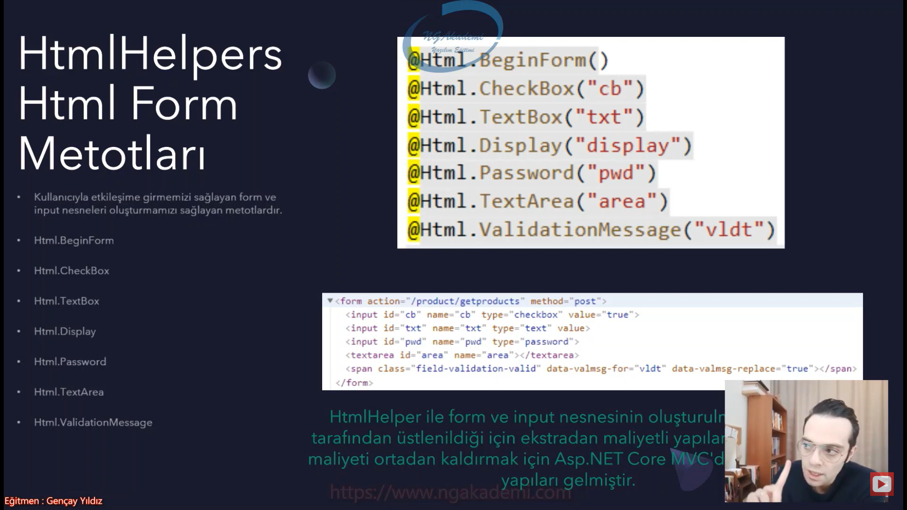

***
# 21) Asp.NET Core 5.0 - Custom HtmlHelper Fonksiyonu Oluşturmak
- HtmlHelper'lar Html nesneleri oluştururken bizlere yardımcı olan hazır metodları barındıran bir kütüphane.

- Her Html nesnesi talep ettiğimizde bunun ayarlarını vermek zorunda mıyız? Tabikide değiliz. Eğer ki birçok noktada bu şekilde customize edilecek Html formatlarına ihtiyacımız varsa biz custom bir şekilde sırf o işe odaklı sırf o nitelikleri barındıran HtmlHelper nesnesi oluşturabiliriz. Extension metot yazarak oluşturabiliriz.

- Bir şeyin Custom halini oluşturmak istiyorsanız extension metotlarını kullanabilirsiniz. Herhangi bir nesnenin/yapının/değerin customize edilmiş halini extension üzerinden çok rahat bir şekilde kendinize formatlandırabilirsiniz.

```C#
//******************* Controller *******************
public class ProductController : Controller
{
    public IActionResult GetProducts()
    {
        return View();
    }
}
//******************* View *******************
@using OrnekUygulama.Extensions

@Html.TextBox("txtadi",null,new {style="background-color:green; color:white"})

@Html.CustomTextBox("txtCustomAdi",null,"Adınız")
//******************* Extension *******************
public static class Extensions
{
    public static IHtmlContent CustomTextBox(this IHtmlHelper htmlHelper, string name, string value = "", string placeHolder = null)
        => htmlHelper.TextBox(name, value, new
        {
            style = "background-color:black;color:white;font-size:30px;",
            @class = "form-input",
            a = "a",
            b = "b",
            placeholder = placeHolder
        });
}
```