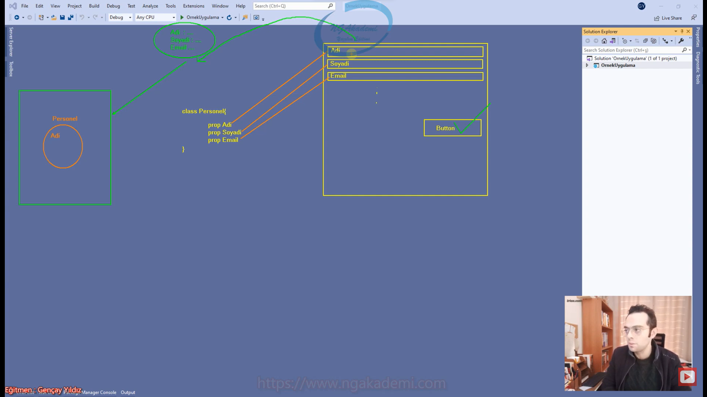
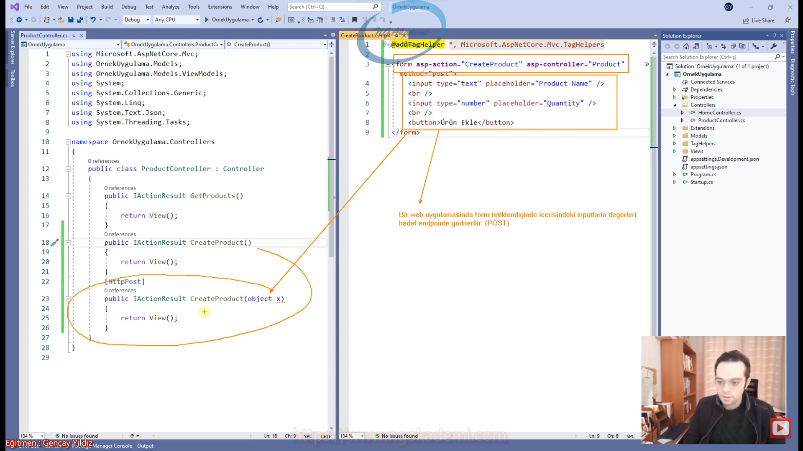
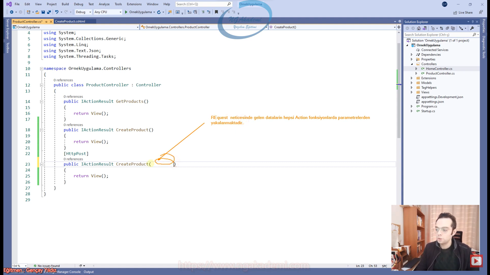
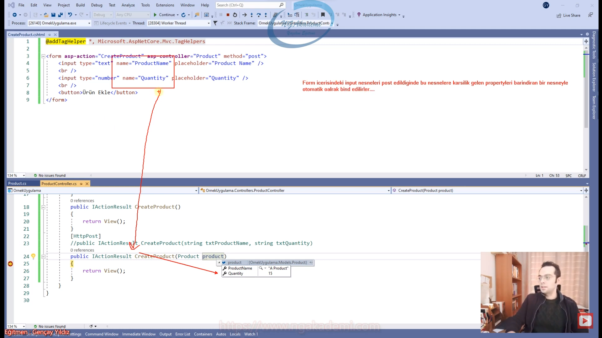

***
# 24) Asp.NET Core 5.0 - Model Binding Mekanizması
- Http request ile gelen verilerin ayrıştırılarak ilgili controller'daki bulunan action metotlarında uygun herhangi bir türe dönüştürülmesi işlemidir. 

- Biz kullanıcıların sunucuya yapmış olduğu isteklerde bazen kullanıcıdan gelen veriler olacaktır bu verileri biz POST neticesinde yakalıyorduk. Gelen verileri burada anlamlı bu verilere karşılık olan türlerle yakalamak istiyorsanız bu gelecek olan verilerle senin projende/uygulamanda bir sınıfın ya da bir `struct`'ın bunun bind edilmesi gerekiyor.

- Gelen verileri kendi türlerinde yani normal salt halde de karşılayabiliriz veyahut buradaki gelecek olan verilere karşılık bir sınıf/model tasarlayarız. Tasarladığımız bu modelle gelecek olan verileri bind edecem işte bu bind neticesinde hangi veri hangi property'e gideceğini bileceğinden dolayı formdan/kullanıcıdan gelecek dataları ben daha anlamlı benim açımdan daha anlamlı olan sınıflarla bu sınıfların instance'larıyla karşılayıp yönetebileceğim.

- Adı üzerinde model binding yani elimizdeki model'la/türle gelecek olan veriyi bağlar. 

- Kullanıcının form üzerinden girmiş olduğu dataları biz controller'lar da kendimize ait türlerde yakalamak istediğimizde burada model binding'i kullanıyoruz. Gönderilen data bizim tanımladığımız ve bind ettiğimiz model'a dönüştürülüp ilgili sınıfın instance'ı üzerinden gelen dataları yönetmemizi sağlamaktadır.

- Bir action metot varsayılan olarak `HttpGET` türündendir. `GET` isteklerini karşılar.

- Eğer ki bir View'de Form üzerinde TagHelper'lardan yararlanırken `asp-controller` attribute'unu/parametresini doldurmazsanız/girmezseniz o View'in bulunduğu Controller'ı baz alır. Yani varsayılan o controller'ı baz alır.

- Bir form nesnesini tetikleyebilmeniz için ilgili form nesnesinde en az bir tane button/submit nesnesi olması gerekiyor.

- Bir web uygulamasında form tetiklendiğinde içerisindeki inputların/kullanıcıyla iletişime girmemizi sağlayan Html nesnelerinin değerleri hedef endpoint'e gönderilir.(POST)

- Request neticesinde gelen dataların hepsi Action fonksiyonlarda parametrelerden yakalanmaktadır.

- Parametrelerde ilgili inputlardan gelen değerleri yakalayabilmek için inputların name değerlerine ihtiyacımız vardır.

- Gelen dataları yakalarken ekstradan bir dönüşüm yapmana gerek yok. Türü ne olursa olsun burada direkt yakalayabilirsin.

- Bir uygulamada tabiki de formdan aldığınız veriler ya da kullanıcıdan gelen veriler böyle 1 tane 2 tane input ve değer barındıran veriler olmuyor. Bazen bir veri geliyor yani herşey içinde yok yok. Şimdi böyle bir veriyi karşılayabilmen için her bir inputa karşılık tek tek parametre tanımlama ya da `IFormCollection` dediğimiz tür var bununla da karşılayabiliyoruz. Veri sayısı çoğaldıkça veriyi yönetebilmen zorlaşacak. Nasıl karşıladığından ziyade veri çoğaldıkça yöentimi zorlaşacak.

- Gelecek olan veriler çoğaldıkça çoğalan bu verileri karşılamak ve yönetmek için bizim daha efektif sonuçlara ihtiyacımız var. Daha doğrusu süreçlere ihtiyacımız var. İşte burada model binding'i kullanabiliriz.

- Input'lardan gelen verileri elde ederken bunlaru bir tür olarak bir nesne olarak elde etmem daha kolay olacak çünkü kullanırken içeride başka bir yere bu verileri gönderirken uzaktaki bir servise gönderirken dönüştürürken veritabanına kaydederken artık aklına ne geliyorsa yapacağın bütün işlemlerde bu verileri daha rahat yönetebilmeni sağlayan Model'la karşılaman en doğrusu olacaktır.

- Form içerisinde kullanıcıdan gelecek olan datalarda input'ların name'leriyle bu postu karşılayacak olan action'da kullanmış olduğumuz parametrenin eğer bir `class`'sa ve bu `class`'ın property isimleri inputların name'leriyle aynıysa bunlar otomatik bind ettirilirler. Sistem tarafından bunlar otomatik bind edilir.

- Form içerisindeki input nesneleri post edildiğinde bu nesnelere karşılık gelen property'leri barındıran bir nesneyle otomatik olarak bind edilirler...

- `asp-for` direktifi bizim sayfanın model'ına ait olan türün hangi property'siyle input'u bind edeceğimizi bildirir.

- TagHelper'da `asp-for` direktifi ilgili input nesnesini sayfanın model'ına bind etmemizi sağlayan bir mekanizmadır.

- Bind iki taraflıdır.

- Gelen veriyi biz otomatik bizim sistemimizdeki projemizdeki herhangi bir türle karşılama stratejisine model binding diyoruz.
