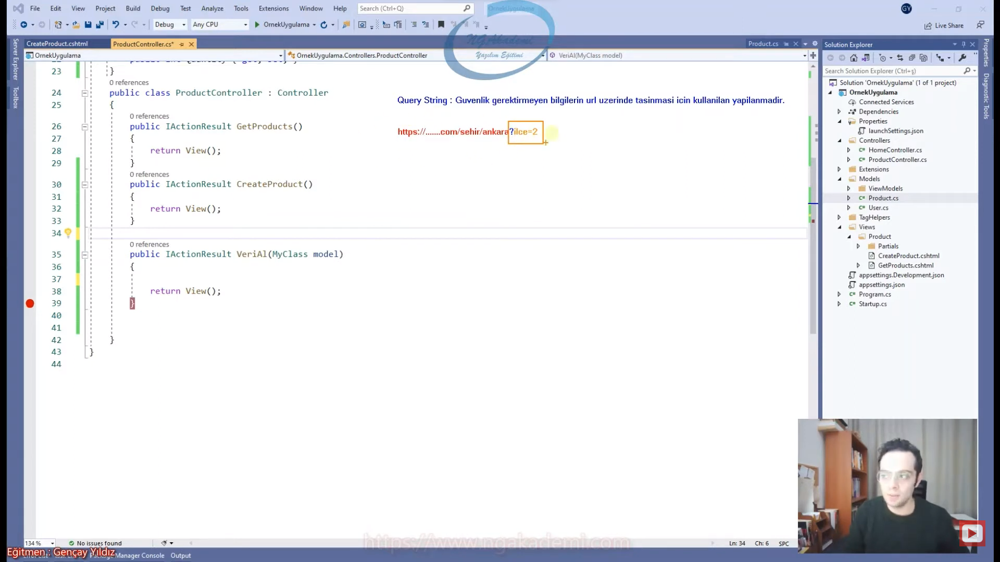
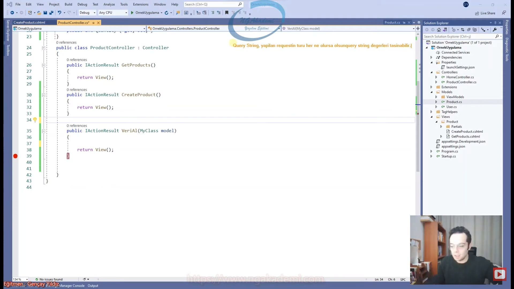
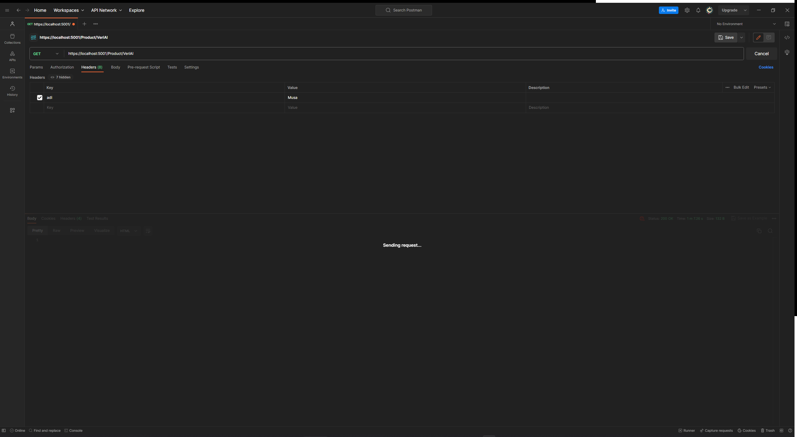
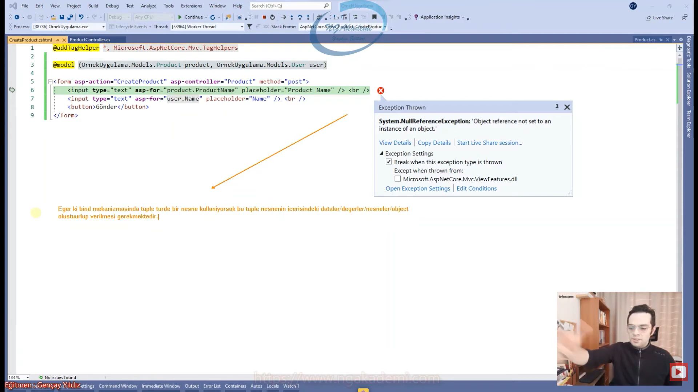

***
# 25) Asp.NET Core 5.0 - Kullanıcıdan Veri Alma Yöntemleri - Form Üzerinden Veri Alma 
- Veri Alma Yöntemleri
    * Form üzerinden veri alma (bind edilmiş)
    * Form üzerinden veri alma (bind edilmemiş)
    * Query String üzerinden veri alma
    * Route Parametreleri üzerinden veri alma
    * Header'lar üzerinden veri alma
    * Ajax/Client tabanlı yapılan istekler üzerinden veri alma

- Kullanıcıdan veriyi almanın tek yöntemi kullanıcının bize istek göndermesi. Tabiki de farklı yöntemler var. Fakat bizim inceleyeceğimiz kullanıcı taraflı verilen kendi rızasıyla yapmış olduğu istek neticesinde gelen dataları yakalamaktır.

- Bize kullanıcının bir istek göndermesi lazım bu datanın bu isteğin herhangi bir yerinde tutulmuş olması gerekiyor Örneğin body'sinde olabilir. Header'da olabilir. Ya da bu request'te query string değerleri olabilir. Route parametrelerinde olabilir. Yani bir şekilde gelen isteğin belirli noktalarını kullanıcı verilerini yerleştiriyor. 

- İllaki bir tetikleyici mekanizmanın olması gerekiyor Nerede çalışırsan çalış nereden veri çekmek istersen iste.

- Bir kullanıcı var ve bu kullanıcının veri girebileceği bir sayfa var o sayfayı biz genellikle html'in bize sağlamış olduğu `<form>` etiketi üzerinden tasarlarız çünkü `<form>` kullanıcının girmiş olduğu o dataları girdiği inputları kendi içerisinde tanımlamamızı sağlıyor ve bu tanımlanan inputları tek seferde belirli bir sunucuya göndermemizi sağlayabiliyor. Dolayısıyla sen bir forma girilen dataların hepsini yani oradaki input nesnelerine girilen dataların hepsini tek bir form sayesinde bir yere postalayabiliyorsun.

- `<form>` kullanıcıdan veri almamızı sağlayan input nesnelerindeki verileri server'a göndermemizi sağlayan en temel veri alma nesnelerinden birisidir. Html tabanlıdır.

- Form üzerinden veri alma iki türlüdür. Post ve Get olarak veri alabiliyoruz. Put ve Delete Html form yapılanmasında pek fazla kullanılmıyor. Dolayısıyla veri gönderirken ya da veri alırken kullanılan bir yapılanmadır.

- Kullanıcıdan veri alacaksak Form'da Post'u kullanmamız gerekiyor.

- Senin tasarladığın formun içine koymuş olduğun input'lar o form tarafından direkt hedef sunucuya post edilecektir. Tabi sen Get yapabiliyorsun ama veri göndereceksen onun Post etmen lazım.

- `<input>` değerinin `<form>`un tetiklenmesi neticesinde değerini taşıyacaksan Yani buradaki `<input>`'un bu nesnenin değerini yakalayıp ilgili server'a gönderip orada yakalayacaksam eğer bu `<input>`'a bir tane `name` değeri vermem gerekiyor. `name` `<form>` içerisindeki ilgili `<input>`ların datalarını ayırabilmek için birbirlerinden kullanılan bir parametredir. Dolayısıyla `<form>`'da `<input>`'ları `name`lerle ayırmamız gerekecektir.

- İlgili `<form>` tetiklendiği zaman hedef endpoint neresiyse `<form>` içerisindeki tüm `<input>`lar `name`lerine/`name` değerlerine/`name` isimlerine karşılık ayrılacak ve ilgili sunucuya gönderilmiş olacak bizde burada bu verileri yakalamış olacağız.

- Gelen request'teki dataların %95'ini karşılayan action'daki parametre kısmında yakalarız.

- Dataları yakalamak için `IFormCollection` dan yararlanabiliriz. `IFormCollection` `Microsoft.AspNetCore.Http` `namespace`'i altından gelen bir arayüzdür. Bu arayüz sayesinde Post edilen `<form>`un içerisindeki tüm `<input>` nesnelerinin dataları yakalanabilmektedir. Biz bu dataları `name` değerine göre ayırt edip yakalayabiliyoruz.

```C#
[HttpPost]
public IActionResult VeriAl(IFormCollection datas)
{
    string value1 = datas["txtValue1"];
    string value2 = datas["txtValue2"];
    string value3 = datas["txtValue3"];

    return View();
}
```

- Biz `name` değerleriyle eşleşmiş parametrelerle de bu `<input>`'lardaki değerleri karşılayabiliyoruz.

- İlgili gelebilecek olan `<input>`taki değeri karşılayabilecek olan bir parametre tanımlayıp onu `<input>`'un `name` değeriyle bind etmemiz gerekiyor.

```C#
[HttpPost]
public IActionResult VeriAl(string txtValue1,string txtValue2, string txtValue3)
{
    
    return View();
}
```

- Kullanıcıdan gelen değerleri bu değerlere karşılık gelecek bir tür ile bir nesnenin ya da bir `class`,`struct`,`record` olabilir bunlardan herhangi birinin instance'ı ile yakalayabilmekteyiz.

```C#
[HttpPost]
public IActionResult VeriAl(Model model)
{
  return View();
}

public class Model
{
    public string TxtValue1 { get; set; }
    public string TxtValue2 { get; set; }
    public string TxtValue3 { get; set; }
}                                           
```

- Form üzerinden bind edilmiş verileri almak için ilgili view'de `<input>`'a karşılık bir binding işlemi gerçekleştirmeniz gerekiyor.

```C#
//------------------ View ------------------
@addTagHelper *, Microsoft.AspNetCore.Mvc.TagHelpers
@model OrnekUygulama.Model.Product

<form asp-action="VeriAl" asp-controller="Product" method="post">
    <input asp-for="ProductName" type="text"  /><br />
    <input asp-for="Quantity" type="text" /><br /> 
    <button>Gönder</button>
</form>

//------------------ Controller ------------------
[HttpPost]
public IActionResult VeriAl(Product model)
{

    return View();
}
```

- Veri taşınırken yine oradaki `name` değerleri önemlidir. Sen bir `<input>` nesnesini herhangi bir türe bind ettiğinde aslında ilgili input oluşturulurken ona `name` değerleri veriliyor.

- Bind'da hangi modeli kullandıysan Post neticesinde o model türünde ilgili dataları karşılamak idealdir. Burada türe bağımlılık yoktur. Esasında bu türün bind etmiş olduğun property'lerine karşılık name değerlerinde `<input>`lar oluşturulucağından dolayı o `name` değerlerini barındıran farklı bir türle de karşılama yapabiliyorsun.

## C# Examples 
```C#
//------------------ View ------------------
@addTagHelper *, Microsoft.AspNetCore.Mvc.TagHelpers
@model OrnekUygulama.Model.Product

<form asp-action="VeriAl" asp-controller="Product" method="post">
    <input asp-for="ProductName" type="text"  /><br />
    <input asp-for="Quantity" type="text" /><br /> 
    <button>Gönder</button>
</form>
//------------------ Controller ------------------
using Microsoft.AspNetCore.Http;
using Microsoft.AspNetCore.Mvc;
using OrnekUygulama.Model;

namespace OrnekUygulama.Controllers
{
    public class ProductController : Controller
    {
        public IActionResult CreateProduct()
        {
            return View();
        }
        //[HttpPost]
        //public IActionResult VeriAl(IFormCollection datas)
        //{
        //    string value1 = datas["txtValue1"];
        //    string value2 = datas["txtValue2"];
        //    string value3 = datas["txtValue3"];

        //    return View();
        //}
        //[HttpPost]
        //public IActionResult VeriAl(string txtValue1,string txtValue2, string txtValue3)
        //{

        //    return View();
        //}
        //[HttpPost]
        //public IActionResult VeriAl(Model model)
        //{

        //    return View();
        //}
        [HttpPost]
        public IActionResult VeriAl(Product model)
        {

            return View();
        }
    }
    public class Model
    {
        public string TxtValue1 { get; set; }
        public string TxtValue2 { get; set; }
        public string TxtValue3 { get; set; }
    }
    public class MyClass
    {
        public string ProductName { get; set; }
        public int Quantity { get; set; }
    }
}
//------------------ Model ------------------
namespace OrnekUygulama.Model
{
    public class Product
    {
        public string ProductName { get; set; }
        public int Quantity { get; set; }
    }
}
```

***
# 26) Asp.NET Core 5.0 - Kullanıcıdan Veri Alma Yöntemleri - QueryString Üzerinden Veri Alma
- Biz web uygulamasında belirli verilerimizi gizli formatlarda taşımayı tercih ediyoruz ama bazı veriler vardır ki güvenlik gerektirmeyen bilgilerdir bunlar genellikle ve url üzerinde hızlı bir şekilde taşıyabiliriz. Url üzerinde taşımamızın sebebi yapılan istek neticesinde sunucuya hızlı bir şekilde eriştirebilmek. Yani hedef endpointimiz neresiyse bu illaki bir sunucu değil bir serviste olabilir. Bu servise ilgili güvenlik gerektirmeyen verileri hızlı bir şekilde göndermek istiyorsak QueryString yapısını kullanabiliyoruz.

- Güvenlik gerektirmeyen bilgilerin url üzerinde taşınması için kullanılan yapılanmadır.



- Biz tabi içerik olarak QueryString'in sadece kullanıcılardan bize veri taşıyan bir yapılanmaymış gibi bahsediyor olabiliriz ama esasında böyle bir mekanizma değil QueryString bir tek kullanıcılardan veri almamakta esasında ilgili yazılımın ilgili uygulamanın istek yapacağı servislere yahut sunuculara bu isteklerde hızlı bir şekilde veri taşımasını sağlayan yapılanmadır. Yani esasında yazılım kullanıyor buradaki bilgiyi. Ama biz en nihayetinde kullanıcıdan da QueryString üzerinden doğrudan ya da dolaylı bir şekilde verilerimizi alabildiğimizden dolayı normalde kullanıcı değil sen yazılımsal operasyonlar neticesinde QueryString'e değerler koyabilir ve bu değerleri ilgili işlemlerde operasyonlarda çok rahat kullanabilirsin.

- QueryString bir POST işleminin neticesi değildir.  QueryString'te bir değer taşıyorsak bu değer illaki POST'ta değil herhangi bir istek neticesinde taşınabilir.

- QueryString yapılan request'in türü her ne olursa olsun QueryString'in değerleri taşınabilir.



- Url üzerinde QueryString parametresi tanımlayabilmek istiyorsanız url'in en sonunda `?` operatörünü koyuyorsunuz ve bundan sonra QueryString parametrelerinizi tanımlayabiliyorsunuz.

- QueryString değerlerini yakalamak istiyorsanız parametre üzerinden ilgili QueryString'e karşılık gelen bir parametre tanımlayabilirsiniz.

- `product/verial?a=5&b=ahmet` => QueryString'de birden fazla parametre girilebilir bunun için `&` operatörünü kullanırız.

- Gelen değerleri karşılayabilecek bir türde karşılamanız en doğrusudur. Gelen değeri farklı bir türle yakalamaya çalışırsan herhangi bir hata vermeyecektir ama ilgili parametre değeri yakalayamacaktır.

- QueryString'ten gelen değerleri gelen request'in için girerek'te QueryString değerlerini okuyabiliriz.

- `QueryString queryString = Request.QueryString;` //Request yapılan endpoint'e query string parametresi eklenmiş mi eklenmemiş mi bununla ilgili bilgi verir.

- QueryString parametrelerine karşılık gelecek property isimlerini barındıran bir tür tanımlamanız yeterli olacaktır.

- Kullanıcıyla yapılan etkileşimler neticesinde yapılan veri transferlerinin bir şekilde gönderilen verileri sunucu tarafında yakalanıp işlenmesi.

## C# Examples
```C#
using Microsoft.AspNetCore.Http;
using Microsoft.AspNetCore.Mvc;

namespace OrnekUygulama.Controllers
{
    public class ProductController : Controller
    {
        public IActionResult GetProducts()
        {
            return View();
        }
        public IActionResult CreateProduct()
        {
            return View();
        }
        //public IActionResult VeriAl(string a,string b)
        public IActionResult VeriAl(QueryData queryData)
        {
            QueryString queryString = Request.QueryString; //Request yapılan endpoint'e query string parametresi eklenmiş mi eklenmemiş mi bununla ilgili bilgi verir.
            string a =Request.Query["a"].ToString();
            string b =Request.Query["b"].ToString();
            return View();
        }
    }
    public class QueryData
    {
        public int A { get; set; }
        public string B { get; set; }
    }
}
```

***
# 27) Asp.NET Core 5.0 - Kullanıcıdan Veri Alma Yöntemleri - Route Parameter Üzerinden Veri Alma
- `UseEndpoints()` diye bir middleware'imiz var. Şimdi bu middleware içerisinde clienttan bu server'a gelecek olan isteklerin rotalarını belirleriz. Route parametreleri ise bu rota üzerinde değerler taşıyabiliyoruz. Aynen QueryString gibi. Rotanın içerisine belirli değerlerimizi gömebiliyoruz bunlarla beraber istek yaptığımızda ilgili değerler ilgili sunucuya gönderilmiş oluyor. QueryString'e çok benziyor.

- Rotalar kendi fıtratlarında parametrelerden oluşur. Yani değerlerden oluşur.

- Rotalarda biz custom parametrelerde tanımlayıp o parametreye uygun koyduğumuz değeri sunucuya gönderebiliyoruz. QueryString güvenli olmayan verilerde kullandığımız bir veri taşıyıcı iken rotalar gömülü olarak yerleştirdiğimiz parametrelerde en azından güvenlik bir nebze olsun sağlanabilmektedir. Daha uygun bir formatta url oluşturmamızı sağlamaktadır.

- Örenğin QueryString => `?userid=5` demek ki bir user'ın id'sine karşılık geldiği alenen belli. Rota da belli de en azından rota da bunun id değeri olup olmadığı sunucu tarafında hangi değerle/nasıl yakalanacağı bilinmemekte.

- QueryString'te server'da yapılacak eylemin yakalanabilmesi için hangi parametrenin kullanıldığı bilinmekte. Ama rotada yok. Yani QueryString güvenlik açığı verir.

- Route üzerinde veri taşıyabilmek için route'un ilgili veriyi karşılayabileceği bir parametre ihtiyacı vardır. Eğer ki biz default'u kullanıyorsak zaten id değerini taşıyabiliriz. Default'ta id dışında başka değerler taşıyamayız.

- Rotaya uygun bir şekilde id parametresine yerleştirilen değeri burada yakalayabilmek istiyorsam yapmam gereken sadece rotadaki parametreye/parametrenin ismine uygun bir değişken tanımlamaktır.

- Rotada önemli olan oradaki parametrenin ismidir.

- Esasında Route yapılanması QueryString'e çok benzer. Davranış olarakta birebir aynı. QueryString'te verileri nasıl karşılıyorsanız Route'da da aynı şekil karşılıyorsunuz.

- Parametreden karşılayabilirsin hatta bu parametrede bu değeri karşılayabilecek bir tür oluşturup onunla karşılayabiliyorsun. Hatta request üzerinden de karşılama yapabiliyorsunuz.

- `Request.RouteValues` property'si sana route parametrelerini getirecektir.

- controller ve action'da nihayetinde bir parametredir. controller ve action sistem tarafından ön tanımlı parametrelerdir. Yani controller ve action dendiği zaman senin bunu karşılamana gerek yok controller ve action ilgili mvc mimarisinde gelen bu parametrelere karşılık olan hangi controller'ın hangi action'ı hangi fonksiyonun tetiklenebileceği bildirilebiliyor. Bunu sen tanımlamıyorsun mimari zaten bu isimlerden otomatik yakalıyor.

- `endpoints.MapDefaultControllerRoute();` => Sistem tarafından default tanımlanmış rotayı getirir.

- Her bir route parametresi kendisine sıralı bir şekilde karşılık gelen değeri karşılayacaktır. Url'deki sırası önemlidir!!!

- QueryString ile Route güvenlikle alakalı ilgili datayı hangi değişken ismiyle taşıdığınızı gizlemeyle alakalı bir fark sağlıyor. Nihayetinde route yapılanmaları hani daha gizli bir şekilde veriyi taşımamızı sağlarken  QueryString alenen açık güvensiz bir şekilde taşımamızı sağlıyor.

```C#
<a asp-action="Index" asp-controller="Home" asp-route-a="ahmet" asp-route-b="mehmet" asp-route-id="123" asp-route-x="asfasdgafaf">Content</a> //Burada gerekli şekilde parametreler route dizaynına göre yerleştirilecektir. Ama eğer ki route dizaynında olmayan bir parametre varsa querystring olarak yerleştirilecektir.

{controller=Home}/{action=Index}/{a}/{b}/{id}
``` 

## C# Examples
```C#
//****************** Controller ******************
using Microsoft.AspNetCore.Mvc;

namespace OrnekUygulama.Controllers
{
    public class ProductController : Controller
    {
        public IActionResult GetProducts()
        {
            return View();
        }
        public IActionResult CreateProduct()
        {
            return View();
        }
        //public IActionResult VeriAl(string id,string a,string b)
        public IActionResult VeriAl(RouteData routeData)
        {
            var values = Request.RouteValues;
            return View();
        }
    }
    public class RouteData
    {
        public int Id { get; set; }
        public string A { get; set; }
        public string B { get; set; }
    }
}
//****************** View ******************
@addTagHelper *, Microsoft.AspNetCore.Mvc.TagHelpers

<form asp-action="VeriAl" asp-controller="Product" method="post">
    <input type="text" /> <br />
    <input type="text" /> <br />
    <button>Gönder</button>
</form>

<a asp-action="Index" asp-controller="Home" asp-route-a="ahmet" asp-route-b="mehmet" asp-route-id="123" asp-route-x="asfasdgafaf">Content</a>

{controller=Home}/{action=Index}/{a}/{b}/{id}
//****************** Program.cs ******************
namespace OrnekUygulama
{
    public class Program
    {
        public static void Main(string[] args)
        {
            var builder = WebApplication.CreateBuilder(args);

            // Add services to the container.
            builder.Services.AddControllersWithViews();

            var app = builder.Build();

            // Configure the HTTP request pipeline.
            if (!app.Environment.IsDevelopment())
            {
                app.UseExceptionHandler("/Error");
                // The default HSTS value is 30 days. You may want to change this for production scenarios, see https://aka.ms/aspnetcore-hsts.
                app.UseHsts();
            }

            app.UseHttpsRedirection();
            app.UseStaticFiles();

            app.UseRouting();

            app.UseAuthorization();

            app.UseEndpoints(endpoints =>
            {
                endpoints.MapDefaultControllerRoute();
                endpoints.MapControllerRoute("CustomUrl","{controller=Home}/{action=Index}/{a}/{b}/{id}");
            });

            app.Run();
        }
    }
}
```

***
# 28) Asp.NET Core 5.0 - Kullanıcıdan Veri Alma Yöntemleri - Header Üzerinden Veri Alma
- Kullanıcıdan veri almayı başarabilmemiz için kullanıcıdan bir request/istek almamız gerekiyor.

- Kullanıcının yapmış olduğu istekte/request'te birçok farklı alandan değerlerimizi ilgili sunucuya taşıyabiliyoruz. Amaç veri taşıyabilmek.

- Kullanıcının göndermiş olduğu request'te/http isteğinde bulunan veridir.

- Header'lar genellikle ilgili istekle alakalı nitelikleri barındırır. 

- Header dediğimiz yapılanmaları authorization işlemlerinde Jwt token gibi bu tarz yapılanmaları header'lara koyup authorization'ının karşılığında koyup header'ları kullanıp o şekilde yetkilendirmeleri sağlıyoruz.

- Header'lar isteklerde belirli verileri taşımamızı sağlayan nitelendirici bir kalıptır/başlıklardır.

- Tarayıcılar istek yapmamızı sağlıyor amma velakin header'ları manuel bir şekilde doldurmamıza müsaade etmiyor.

- Postman yapısal olarak bir istekte bulunmamızı herhangi bir endpointe istekte bulunmamızı sağlayan bir arayüzdür. Endpoint'e karşılık bildirdiğin türde istekte bulunmanı sağlayan bir arayüz. Tabi ki de bu isteklerde bulunurken bu isteğin body'sine de header'ına da müdahale edebiliyorsunuz.

- İster Post ister Put ister Get farketmiyor herhangi bir istek türünde istek yapabilirsiniz. Nihayetinde header'ınızda bir data varsa buraya taşınacaktır.

- Header'lar genellikle parametre üzerinden değilde `Request.Headers` property'si üzerinden yakalanır.

- Header'lar diğer yapılar gibi davranışsal kullanılmaz. Header gelen istekte ayrı özel bir bölüm gibi özel nitelikleri barındıran bir alan gibi düşünülebilir.

- Header'larda Türkçe, Japonca, Arapça karakter kulanılmaz. Sadece Latince karakterler ile bildirim yapmak zorundasınız. 



```C#
//****************************** Controller ******************************
using Microsoft.AspNetCore.Mvc;

namespace OrnekUygulama.Controllers
{
    public class ProductController : Controller
    {
        public IActionResult VeriAl()
        {
            var headers = Request.Headers;
            return View();
        }
    }
}
```

***
# 29) Asp.NET Core 5.0 - Kullanıcıdan Veri Alma Yöntemleri - Ajax Tabanlı Veri Alma
- Ajax Client tabanlı istek yapmamızı sağlayan ve bu isteklerin sonuçlarını almamızı sağlayan bir Javascript temelli mimaridir.

- Gönderdiği javascript objesini yakalayabilmek için bunun property'lerine gelecek bir class oluşturup ilgili nesneyi karşılayabilirsin.

- Bir uygulamada client tabanlı çalışabilmek için/ajax tabanlı çalışabilmek için ajax'ı destekleyen herhangi bir UI teknolojisini/kütüphanesini kullanabilirsiniz.(JQuery)

- Biz ajax tabanlı istek yapacaksak ve yapacağımız istekler Get ya da Post istekleriyse eğer `$.post()` veya `$.get()` kullanabiliriz. Eğer Put ya da Delete'i kullanacaksanız buradan `$.ajax` fonksiyonuyla Put'u ve Delete'i de kullanabilirsiniz.

- [JQuery ile Post İsteği](https://api.jquery.com/jquery.post/)

- Gelen json formattaki dosyayı/datayı burada ilgili türe Mvc mimarimiz otomatik dönüştürebiliyor. Yani parametredeki türe Deserialization işlemini gerçekleştirebiliyor. Normalde eğer karşılamasaydı bunu `string` olarak karşılayıp içeride/method body'sinde ilgili türe dönüştürmen gerekirdi.

- Ekstradan elinizdeki endpointe QueryString değerleri girebilir istek neticesinde ilgili değerleri yakalayabilirsiniz. Route parametreleri girebilir ve değerleri yakalayabilirsiniz. Yapmış olduğunuz isteğin illa ki post olmasına gerek  yoktur.

- Client tabanlı gelen bütün isteklerde yapı neyse o yapıya rahat bir şekilde erişebiliyorsunuz.

## C# Examples
```C#
//************************* Controller *************************
using Microsoft.AspNetCore.Mvc;

namespace OrnekUygulama.Controllers
{
    public class ProductController : Controller
    {
        public IActionResult CreateProduct()
        {
            return View();
        }
        [HttpPost]
        public IActionResult VeriAl(AjaxData ajaxData)
        {
            return View();
        }
    }
}

//************************* View *************************
@addTagHelper *, Microsoft.AspNetCore.Mvc.TagHelpers

<script src="https://code.jquery.com/jquery-3.7.0.min.js"></script>

<button id="btnGonder">Gönder</button>

<script>
    $("#btnGonder").click(() => {
        $.post("https://localhost:5001/product/verial", { a: "a data", b: "b data" })
    });
</script>

//************************* Model *************************
namespace OrnekUygulama.Models
{
    public class AjaxData
    {
        public string A { get; set; }
        public string B { get; set; }
    }
}
```

***
# 30) Asp.NET Core 5.0 - Tuple Nesne Post Etme ve Yakalama
- Tuple nesnesi içerisinde birden fazla değer barındırabilen tek bir tanımlamalık söz dizimi açısından dil tarafından desteklenen birden fazla nesneyi tanımlayan değişkendir.

- MVC mimarisinde genellikle View katmanında tekil nesneler model olarak kullanılsada bazı durumlarda tuple nesneleri model olarak kullanmamız gerekebilir.

- Bir view dosyasının herhangi bir türe bind edilebilmesi için öncelikle model'ın belirtilmesi gerekiyor. Haliyle bu tür bir eğer ki tuple nesnesiyse yine de o tuple nesnesinin türünün bildirilmesi gerekiyor.

- Tuple nesnesi üzerinden bir bind mekanizması ortaya koymak istiyorsanız öncelikle tuple nesnesinin içerisinde nesnelerimizin null olmaması gerekiyor.

- Eğer ki bind mekanizmasında tuple türde bir nesne kullanıyorsak bu tuple nesnenin içerisindeki datalar/değerler/nesneler/objectler'in oluşturulup verilmesi gerekmektedir. Yani null olmaması gerekir. Nihayetinde OOP mantığıyla düşünün tuple tek başına bir nesneyse bunun içerisindeki bir item'ı/elemanı çağırıyorsun eğer o null'sa null olan birşeyi çağıramazsınız uygulama patlar. Dolayısıyla tuple'da bir bind mekanizmasını kullanıyorsanız illa ki o tuple nesnenin içerisindeki değerleri vermeniz gerekiyor. 



```C#
// Hatalı Kullanım
public IActionResult CreateProduct()
{
    return View();
}

[HttpPost]
public IActionResult CreateProduct((Product product,User user ) model)
{
    return View();
}
```

- Bu değerleri ise ilgili formu açacak olan Get fonksiyonundan veririz.
```C#
// Hatalı Kullanım
public IActionResult CreateProduct()
{
    (Product, User) tuple = new();
    return View(tuple);
}

[HttpPost]
public IActionResult CreateProduct(Product product User user)
{
    return View();
}
```

- Gönderdiğiniz tuple nesnesinin içerisindeki her bir elamanı ayrı parametre olarak tanımlamanızda yeterli olacaktır. Tuple mı geldi? Gelen tuple'ın içerisindeki her bir elemanı ayrı bir parametreyle yakalamaya çalışırız. Eğer ki bu şekilde de yakalamaya çalışırsanız burada da bir açık var ve yine yakalayamazsınız Bind işlemi view'de başarılıyken controller'da başarısız olur. Gönderilen data tuple türünde olduğundan dolayı controller'da bizim hangi nesneye ait parametre olduklarını bind ederek bildirmemiz gerekiyor. Tuple içindeki hangi property ise onun ismini bildiririz

```C#
//******************************* View *******************************
@model (OrnekUygulama.Models.Product product, OrnekUygulama.Models.User user)
//******************************* Controller *******************************
public IActionResult CreateProduct()
{
    (Product, User) tuple = new();
    return View(tuple);
}
[HttpPost]
public IActionResult CreateProduct([Bind(Prefix = "Item1")] Product product, [Bind(Prefix = "Item2")] User user)
{
    return View();
}
```

- Siz view'de bu parametrelere ne kadar farklı isimler versenizde `Prefix`'te bind ederken mecbur tuple'ın soldan sağa Item1, Item2, Item3 olacak şekilde isimlendirmeniz gerekir. Yani view'de belirttiğiniz alias'lar işlemez/geçerli olmaz.

## C# Examples
```C#
//******************************* View *******************************
@addTagHelper *, Microsoft.AspNetCore.Mvc.TagHelpers

@model (OrnekUygulama.Models.Product product, OrnekUygulama.Models.User user)
<form asp-action="CreateProduct" asp-controller="Product" method="post">
    <input type="text" asp-for="product.ProductName" placeholder="Product Name"/><br />
    <input type="text" asp-for="user.Name" placeholder="Name" /><br />
    <button>Gönder</button>
</form>
//******************************* Controller *******************************
using Microsoft.AspNetCore.Mvc;
using OrnekUygulama.Models;

namespace OrnekUygulama.Controllers
{
    public class ProductController : Controller
    {
        public IActionResult GetProducts()
        {
            return View();
        }

        public IActionResult CreateProduct()
        {
            (Product, User) tuple = new();
            return View(tuple);
        }
        [HttpPost]
        public IActionResult CreateProduct([Bind(Prefix = "Item1")] Product product, [Bind(Prefix = "Item2")] User user)
        {
            return View();
        }
    }
}
//******************************* Model *******************************
namespace OrnekUygulama.Models
{
    public class Product
    {
        public int Id { get; set; }
        public string ProductName { get; set; }
        public int Quantity { get; set; }
    }
}
namespace OrnekUygulama.Models
{
    public class User
    {
        public int Id { get; set; }
        public string Name { get; set; }
        public string LastName { get; set; }
    }
}
``` 