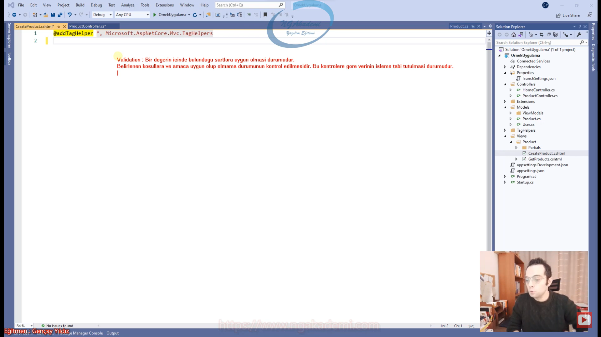
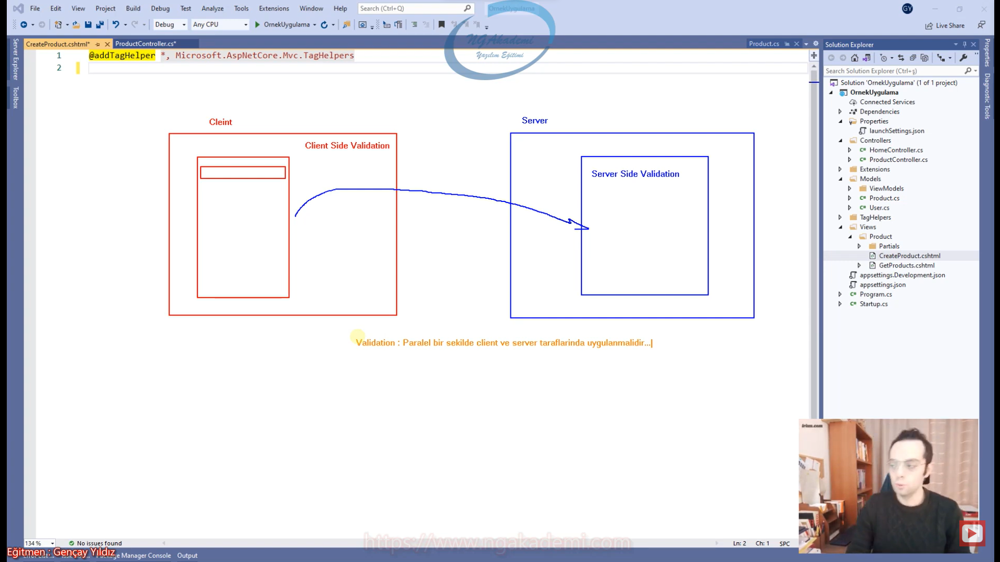

***
# 31) Asp.NET Core 5.0 - Kullanıcıdan Gelen Verilerin Doğrulanması Validations
- Gelen verilerden hangilerini işleyip hangilerini işlememiz gerektiğini bulunduğumuz şartlara uygun olan verilerin hangileri olduğunu ayıklamamızı sağlayan yapılanma validation'dır.

- Biz web uygulamsı geliştiriyoruz. Geliştirdiğimiz web uygulaması sadece tek taraflı veri akışı sağlamaz. Web uygulaması bir tek kullanıcıya veri vermez kullanıcıdan da sunucu tarafında veri alabilen bir yapılanmadır.

- Soru şu her selamun aleyküm diyen veriyi alacak mıyız? Gelen her veriyi sen veritabanına kaydedecek misin?/İşleme tabi tutacak mısın?/Ne olursa olsun çarpıp bölecek misin? Bu sorularn cevaplarını ihtiyaçlar belirleyecektir.

- Web uygulamalarında kullanıcıdan gelen verileri genellikle doğruladıktan sonra işleme tabi tutarız. 
    * Örneğin bir email formatında değere ihtiyacım var. Yani kullanıcının email girmesi gerekiyor. Girilen email'in email formatında olup olmaması bizim için önemlidir. Çünkü gelen değerin email olup olmadığını sen formatından yola çıkarak anlarsın. 
    * Ya da adamdan TC kimlik no istiyorsundur. 15 karakterlik bir değer girdi diyelim normalde TC dediğin 11 karakterli olmalıdır. Bak burada TC kimlik numarasına özel yapacağın bir operasyonu aşan farklı bir durum var bu durumu engellemen lazım yani demelisin ki kardeşim 11 karakterden aşağı da olamaz yukarı da olamaz senin girdiğin değer kesinlikle 11 haneli olmalı. Bu doğrulama doğrulandıktan sonra buradaki yapmış olduğun kontrol doğrulandıktan sonra elindeki değerle TC kimlik numarası işlemleri yapabilirsin.
    * Zorunlu girilmesi gereken değerler vardır eleman girmemiştir. Şimdi girilmeyen değerler olduğu durumda sen neye göre işlem yapacaksın. Nereden bileceksin işlem yapacağını. Ya da yapacağın işlemi neyin üzerinde yapacaksın zorunlu girilmesi gereken değerlere ihtiyacın var kullanıcı girmemiş Post etmiş işte böyle bir durumda yine doğrulamayı yapacaksın Doğrulanmadığı sürece kullanıcıyı uyaracaksın. 
    
- Yani biz kullanıcıdan gelen her selamun aleyküm denilen veriyi işlemiyoruz. Bunları bizim belirlediğimiz şartlara göre uygun olupp olmama durumlarını değerlendirip ona göre işlemlerimizi operasyonlarımızı gerçekleştiriyoruz.

- Kullanıcıdan gelen datanın server tarafında kontrol edilip doğrulanmasıdır Validation.

- Validation : Bir değerin içinde bulunduğu şartlara uygun olması durumudur. Belirlenen koşullara ve amaca uygun olup olmama durumunun kontrol edilmesidir. Bu kontrole göre verinin işleme tabi tutulması durumudur.

- Kullanıcıdan gelen veri sistemdeki şartlara uygunsa bu veri işlenmeyi hakeden veridir. 

- Gelen verinin belirli koşullara ve amaca uygun olup olmadığı durumlarda sen işlemini operasyonunu gerçekleştirirsen yazılım ne kadar amaca yönelik ne kadar sürdürülebilir bir yazılım olur? Dolayısıyla gelecek veri doğru/doğrulanmış veri olmalıdır ki ona göre operasyonumuzu gerçekleştirebilelim. Yani yazılım dediğin ayırt edici bir özelliğe sahip olmalı kullanıcıdan gelen verileri ayırt edebilmeli.
    * Ben kullanıcıya mail mi atacağım ilk önce kullanıcıdan mailini almam gerekiyor. Kullanıcıdan gelen mail verisinin bir mail olup olmama durumunu yazılım ayırt edip kullanıcıya ona göre işlem yapmalı. İşleminde ya kullanıcıyı uyarmalı kardeşim lütfen doğru mail adresi girin ya da mail adresini girdiyse bu arkadaş operasyon ne ise onu yapmalı mail göndermeli.Belirlenen koşullara ve amaca uygun olup olmama durumundan kastımız Burada kullanıcıdan gelen datanın mail olup olmadığını anlayabilmektir.

- Yani sen veriyi doğruluyorsun belirli koşulların ve amacın var. Bunlara uygun olup olmama durumuna göre elindeki veriyi ya işleme tabi tutarsın ya da gerekirse kullanıcıyı uyarırsın sana doğru veriyi gönderecektir. Ya da sistemi durdurursun vs. yani işlemini/operasyonunu buradaki veri merkezli hale getirmiş olursun.


 
- Validation bir yazılımda özellikle web yazılımında 2 türlüdür. Bizim bir client'ımız var bir de server'ımız var. Şimdi client'tan server'a kullanıcı client'ı kullanarak belirli datalarını gönderiyor. Şimdi client datalarını gönderirken biz gelen dataları server'da validation işlemine tabi tutuyoru. Yani kontrol ediyoruz. Eğer ki yapılan validation server tarafında gerçekleştiriliyorsa biz buna Server Side Validation diyebiliriz. Bir de bunun ikinci yüzü client tarafında da validation yapılması gerekmektedir. Sen client'ta kullanıcıdan aldığın verileri önce burada denetleyip ardından server'a gönderirsen server'daki yükü de azaltmış olursun. 
    * Kullanıcı client'a bir TC kimlik numarası girecek sen tc kimlik numarasınının temel validation'ı 11 karakterli olmasıdır. Öncde bunu client'ta kontrol edersin eğer ki zaten client'ı geçiyorsa %90 doğrulanmıştır doğru veriyi gönderiyordur. Server'da da yine kontrolünü yaparsın ama en azından aldığın önlemi %100'e yakın bir şekilde önlem haline getirmiş olursun en azından client'ta da server'da da b,r validation kontrolün söz konusu olmuş olur. Zaten kullanıcı client'taki validation'la çok fazla derdi olmadığından dolayı client'takine uygun bir şekilde değerlerini girecek ona göre işlemini yapacak server'ıda çok fazla yormak zorunda kalmayacaksın. 

- Client tabanlı alınan validation'lar aynı şekilde server tabanlı da alınmak zorunda iki türlüdür validation hem kullanıcının kullanmış olduğiu client'ta sen doğrulama yaparsın hem de gelen veriyi bir de server'da doğrulama yaparsın ki ne olur ne olmaz.

- Client'ta validation'ı ben yaptıysam kullanıcı zaten buna riayet etmek zorunda demek ki client'taki validation'a uygun bir şekilde datayı gönderebildiyse bana benim server'da bir daha validation yapmama gerek var mı? 
    * Kesinlikle server'da validation kontrolü yapmanız gerekecektir. 
    
- Validation'ları client bazlı alanlar server'da gerek görmemektedir. Bu kesinlikle hatadır çok büyük bir risktir. Çünkü iyi ya da kötü niyetli bir client kullanıcısı client'taki validation'ları çok rahat müdahale ederek aşabilmektedir. Yani senin orada yapmış olduğun kontrolü herhangi bir kullanıcı çok rahat bir şekilde aşabilmektedir. Dolayısıyla client'a biz çok fazla güvenmeyiz. Client'tan gelen verileri en son nihai olarak bir de server'da check ederiz ki hani duruma göre operasyonumuzu net emin bir şekilde gerçekleştirebilelim. Ama kullanıcıyı da fazla yormamak kullanıcıyı da hızlı bir şekilde bilgilendirmek server'daki de yükleri bir nebze olsun azaltabilmek için client bazlı validation'ını da ortaya koyarız ki dersin adama işte buraya bu veriyi gireceksin client bazlı adam zaten iyi niyetli birisiyse kullanıcı ilgili verileri girip gönderecek server'da da aynı veriler check edileceğinden dolayı sıkıntı olmayacaktır. Ama kötü niyetli bir kişi client'taki validation'ları aşabileceğinden dolayı oraya bambaşka bir şekilde aşıp değerler girebilir sen bunu server'da keinlikle tekrardan kontrol etmek zorundasın.
    * Örneğin ben mobil bankacılık kullanıyorum. Mobilin arayüzü var benim telefonumda. Telefonum client oluyor arkada bu uygulamanın çalıştığı yerde server oluyor. Ben buradaki client'ı kullanarak Server'lara istek gönderiyorum. Şimdi bana diyor ki Tc Kimlik No gir. Burada ben tc kimlik numaramı doğru girene kadar server'a zaten istek göndermemi müsaade etmiyor. Eğer ki ben burayı doğru girersem gönderecektir göndermeme müsaade edecektir. Göndereceğim server'a giden datalarda tekrar kontrol edilecektir. Adam niye client'ta bu validation'ı bize uyguluyor? Çünkü burada uyguluyor ki ben buraya doğru girip girmediğimi hızlı bir şekilde bana burada da uyarı yapsın Yani yanlış girdiğim değeri gönderip geldikten sonra aa yanlış girmişim dedirttirmemek için bana da yardımcı olamk için yani kullanıcı deneyimi dediğimiz özelliği arttırabilmek için validation her daim uygulanır amma velakin client tabanlı validation server tabanlı validation'ın üstüne gölge çekemez. İlla ki client'ta yaptığınızı server'da yapacaksınız.

- Validation paralel bir şekilde client ve server taraflarında uygulanmalıdır...



- Verileri post ettiğimde ilgili verileri yakaladığımda işleme tabi tutmadan önce validation dediğimiz mekanizmaları devreye sokmamız gerekmektedir. 

- Sen eğer ki veri doğrulama yapılanmasını koşul yapılarıyla if'le switch'le bunun gibi yapılanmalarla yapmaya çalışıyorsan inanılmaz derece de çöp kod yazıyorsun demektir.

- Kullanıcıdan gelen dataları siz belirli bir doğrulamaya tabi tutacaksanız eğer bunu `if-else` `switch`'le yapmamalısınız. Çünkü `if-else` `switch`'le yapılan validation'lar inanılmaz çöp kod oluşturmanıza sebep olacaktır.

- Veriyi doğrulamayı koşul yapılarıyla sağlayabilirsiniz ama bu hiçte doğru bir yöntem olmayacaktır. Nedeni de maliyetli kod oluşturmanızı sağlayacak yönetilebilirliği ve esnekliği ciddi manada zedelenmiş altyapısız bir yapılanma oluşturmuş olacağınızdan dolayı.

```C#
//Sıkıntılı Durum
public IActionResult CreateProduct(Product model)
{
    if (!string.IsNullOrEmpty(model.ProductName) && model.ProductName.Length <= 100 && model.Email)
    {

    }
    return View();
}
```

- Validation'larda model'a validaton kuralları oluşturuyoruz. Yani benim kullanıcıdan gelen datayı yakalayacak model'a belirli annotation'slar bildiriyorum ve bu bildirilen annotations'lar üzerinden gelen dataları check ediyorum. Zaten annotations'lar bana benim bildirmiş olduğum şartları amaçları kuralları uyup uymadığına dair ilgili verilerle alakalı bilgiler döndürmekte Bu da benim için gayet efektif bir çözüm demek oluyor.

- `[Required(ErrorMessage="")]` => bu attribute ile birlikte belirtilen propertynin içinde o datanın olması gerekmektedir. Girilmediği taktirde property'deki bu data annotations validation'ı doğrulanmamış bir şekilde döndürecektir. Hatta `ErrorMessage` parametresini doldurarak kullanıcıya mesaj bile verebiliriz. 

- `[StringLength(maximumLength:100,ErrorMessage ="")]` => Bununla birlikte girilen datanın maximum kaç karakter olabileceğini belirleriz.

- `[EmailAddress(ErrorMessage ="Lütfen doğru bir email adresi giriniz.")]` => Girilen değerin email olup olmadığını kontrol eder.

```C#
public class Product
{
    [Required(ErrorMessage = "Lütfen propduct name'i giriniz.")]
    [StringLength(maximumLength: 100, ErrorMessage = "Lütfen product name'i en fazla 100 karakter giriniz.")]
    public string ProductName { get; set; }
    public int Quantity { get; set; }
    [EmailAddress(ErrorMessage ="Lütfen doğru bir email adresi giriniz.")]
    public string Email { get; set; }
}
```

- Biz bu datayı check ederken `ModelState` dediğimiz yapılanmayı kullanırız. `ModelState` dediğimiz yapılanma da MVC mimarisinin kendi özünde bulunan bir yapılanmadır.

- `ModelState` : MVC'de bir type'ın data annotations'larının durumunu kontrol eden ve geriye sonuç dönen bir property.

- Sen isteği gönderdin gelen isteği parametre'de karşıladın değil mi? İşte bu karşıladığın nesnenin varsa validation ayarları buna göre arkada sistem işlemekte validation durumunu ModelState'te tutmaktadır.

- Burada parametreyle gönderilen değeri yakaladık ya yakaladığın anda zaten MVC mimarisinde ModelState kendisi durumunu tutmakta. Artık doğrulamaları yaptı doğrulama neticelerini tutmakta.

- Kullanıcıdan girmiş olduğu verilerde eğer ki validasyonlara uymayan datalar söz konusuysa alınan hatalar da biz kullanıcıya direkt hata mesajlarını gösterebiliriz. Bunun için View'de ilgili input'lara karşılık hata mesajlarını göstereceğimiz `<span></span>`'lar oluştururuz. `<span></span>`'larda TagHelper'dan bir tane var `asp-validation-for` diye bir tane TagHelper var. Bu da şu anlama geliyor buradan `<span></span>`'a `asp-validation-for` üzerinden bind ettiğiniz property'nin eğer ki validation'ı doğrulanmadığı taktirde varsa mesajı gelecek buradaki `<span></span>`'a yazdıracaktır.

- `<span></span>` `asp-validation-for` üzerinden hataı yakalamak istiyorsan eğer ModelState.IsValid değilse yani dorğulanmamışsa yapman gereken gelen model'ı tekrardan View'e göndermek. Göndermesen'de olur tabiki'de hem model'ı gönder kullanıcı yapmış olduğu hatayı görsün hem de ModelState kendi içerisinde errors'u dolu olarak geleceğinden dolayı bir daha view'e gidiyorsun ya ModelState'in hataları dolu gidecektir. Bu hatalardan `asp-validation-for`lara karşılık gelecek keylerin message'ları da ilgili `<span></span>`a yerleştirilecektir.

- Sen DataAnnotations'larla model'larının validasyonlarını bildir. Bildirdikten sonra Post Et Post ettiğinde zaten geri kalan her şeyi MVC hallediyor. Bir tek sana kalan halledilen validasyon kontrollerinin state'ini kontrol etmek. Duruma göre true ise operasyonu gerçekleştirmek false ise demek ki validasyonlar geçerli değil bu false'luk durumuna göre gerekli operasyonları aksiyonları almak. Biz genellikle kullanıcıya bilgilendiririz ve Log tutarız. 

- ASP.Net Core MVC mimarisinde dataannotations'larla validation oluşturduysanız bu property'lerle bind edilen input nesnelerini otomatik bu validation'lar client tabanlı UI'a taşınacaktır. Dolayısıyla senin orada oluşturmuş olduğun validation bir nebze olsun MVC'nin dinamizmi sayesinde client'a da yansıtılacak ve input'ta max değer aralığı eklenmiş olacaktır. Yani sen bunu server kısmında bildiriyorsun server bu sayfayı render ederken oradaki validation'ı geliyor buradaki input'a yerleştiriyor. MVC'nin güzel yanlarından birisidir.

- Kötü niyetli bir kullanıcı client tabanlı validasyonları inspect sayesinde çok rahat aşabilmektedir.

- Hem client tabanlı kontrol yapacağız ama client tabanlıya hiçbir zaman güvenmeyeceğiz aynı kontrolü server bazlı da gerçekleştireceğiz.

- ModelState dediğimiz property bizim hata durumlarını yönetmemizi ve incelememizi sağlayan oradan hata mesajlarını elde etmemizi sağlayan güzel efektif bir validation kontrolünü sağlayan bir yapılanma. MVC mimarisinde hazır getirilmektedir.

- Hatalarımızı tek bir yerde de toplayarak göstermek için `asp-validation-summary` attribute'unu kullanırız.
```C#
<div asp-validation-summary="All">
</div>
```
- Burada All dersek eğer bu div içerisine bu sayfaya gelen model'ın state'inde error/hata varsa eğer hepsi buraya doldurulacaktır.

- Client tabanlı validation'lar belirli kütüphaneler aracılığı ile daha hızlı daha efektif bir şekilde alınabilmektedir. Ama normal bildiğiniz Js ya da JQuery ile de client tabanlı böyle ilkel seviye de validation kontrolü yapabilirsiniz. İster client'ta profesyonel bir validation kontrolü yapmış olun isterseniz elinizde manuel yazdığınız temel düzeyde bir validasyon kontrolü olmuş olsun farketmiyor her daim client'taki validasyon = server'daki validasyon olması gerekiyor. Server'da da validasyon kontrollerini yapmamız gerekir.

- DataAnnotations'larda tek sorumluluk prensibine aykırılık durumu söz konusudur. Bununla ilgili fluentvalidation dediğimiz yapılanma ve model data type dediğimiz tür ile validation sorumluluğunu başka sınıflara üstlenmeyi sağlayan yapılanmalar vardır.

## C# Examples
```C#
//***************************** Controller *****************************
using Microsoft.AspNetCore.Mvc;
using Microsoft.AspNetCore.Mvc.ModelBinding;
using OrnekUygulama.Models;
using System.Collections.Generic;
using System.Linq;

namespace OrnekUygulama.Controllers
{
    public class ProductController : Controller
    {
        public IActionResult CreateProduct()
        {
            return View();
        }
        [HttpPost]
        public IActionResult CreateProduct(Product model)
        {
            //if (!string.IsNullOrEmpty(model.ProductName) && model.ProductName.Length <= 100 && model.Email)
            //{

            //}
            //`ModelState` : MVC'de bir type'ın data annotations'larının durumunu kontrol eden ve geriye sonuç dönen bir property.
            if (!ModelState.IsValid)
            {
                //Loglama 
                //Kullanıcı bilgilendirme
                //ViewBag.HataMesaj = ModelState.Values.FirstOrDefault(x => x.ValidationState == ModelValidationState.Invalid).Errors[0].ErrorMessage;
                List<KeyValuePair<string, ModelStateEntry>> messages = ModelState.ToList();
                return View(model);
            }
            //İşleme/Operasyona/Algoritmaya tabi tutulur.

            return View();
        }
    }
}
//***************************** Views *****************************
@addTagHelper *, Microsoft.AspNetCore.Mvc.TagHelpers
@model OrnekUygulama.Models.Product

<div asp-validation-summary="All">

</div>

<form asp-action="CreateProduct" asp-controller="Product" method="post">
    <input type="text" asp-for="ProductName" placeholder="Product Name" />
    <span style="color:red" asp-validation-for="ProductName"></span> <br />

    <input type="number" asp-for="Quantity" placeholder="Quantity" />
    <span style="color:red" asp-validation-for="Quantity"></span> <br />

    <input type="email" asp-for="Email" placeholder="Email" />
    <span style="color:red" asp-validation-for="Email"></span> <br />

    <button>Gönder</button>
</form>
//***************************** Models *****************************
using System.ComponentModel.DataAnnotations;

namespace OrnekUygulama.Models
{
    public class Product
    {
        [Required(ErrorMessage = "Lütfen propduct name'i giriniz.")]
        [StringLength(maximumLength: 100, ErrorMessage = "Lütfen product name'i en fazla 100 karakter giriniz.")]
        public string ProductName { get; set; }
        public int Quantity { get; set; }
        [EmailAddress(ErrorMessage ="Lütfen doğru bir email adresi giriniz.")]
        public string Email { get; set; }
    }
}
```

***
# 32) Asp.NET Core 5.0 - ModelMetadataType İle Validation Sorumluluğunu Başka Bir Sınıfa Yükleme
- Bizler validationları entity sınıflarında yani entityframework'teki entity modellarımızda veritabanındaki tablolara karşılık gelen onları modelleyen sınıflarımızda oluşturmayız oluşturmak istemeyiz. validasyonlar genellikle ViewModel'larda uygulanır.

- Yani mümkün mertebe entity modellarınızda validasyonları işte data annotations attribute'larını falan kullanmayacaksınız.

- Viewmodellarımızda da kullandığımız data annotations ile oluşturulan validasyonlar solid prensiplerindeki tek sorumluluk(Single Responsibility Principle)'a aykırılık oluşturuyor olabilir çünkü bir sınıf sade ve sadece tek bir amaca odaklanmalıdır. Bu amaç tabiki de göreceli olarak senle ben çiziyoruz yani birisi tarafından ya da prensibi ortaya koyanlar tarafından bu sınır çizilmez.

- Sınıfa baktığınız zmaan bu sınıf bir model mıdır? yoksa validation'ların uygulandığı bir sınıf mıdır? diye sorduğunuzda tek sorumluluk prensibine aykırılık olduğu gayet aşikardır.

- Tek sorumluluk prensibi temelde bir sınıfın bir metodun bir yapının mümkün mertebe sade ve sadece tek bir amaca odaklı çalışmasını savunan bir prensiptir.

- Validation'larımızı daha efektif daha solid prensiplere uygun bir şekilde kullanmak için 2 yöntemimiz vardır.
    * ModelMetaDataType dediğimiz attribute ile validation tanımlamalarını/sorumluluğunu farklı sınıflara üstlendirebiliriz.
    * FluentValidation yapılanmasını/kütüphanesini kullanabiliriz. 

- Buradaki amaç sade ve sadece validasyona odaklanmış bir sınıf tasarlamak.

- Bir sınıfın validasyonlarını taşıyan bir MetaData olduğunu bildirebilmek için `[ModelMetadataType(typeof(ProductMetadata))]`

```C#
[ModelMetadataType(typeof(ProductMetadata))]
public class Product
{
    public string ProductName { get; set; }
    public int Quantity { get; set; }
    public string Email { get; set; }
}

public class ProductMetadata
{
    [Required(ErrorMessage ="Lütfen product name'i giriniz.")]
    [StringLength(100,ErrorMessage ="Lütfen product name'i en fazla 100 karakter giriniz.")]
    public string ProductName { get; set; }
    [EmailAddress(ErrorMessage ="Lütfen doğru bir email adresi giriniz.")]
    public string Email { get; set; }
}
```

- Product sınıfının validasyonlarının ProductMetadata sınıfından alınacağını bildirmiş olduk ve böylece ilgili property'lerin hangileri ProductMetadata'da tanımlıysa tanımlanmış olan validasyonlarında geçerli olduğunu söylemiş oluyoruyz. Bundan sonra sistem her ne kadar Product üzerinden veriyi taşısanızda bu product'la ilgili mimarimiz karşılığı olan metadata'daki validasyonları devreye sokacak bunları doğrulayacak ve ona göre işlemleri yapmamızı sağlayacaktır.

- Sistem burada bizim model'ımızı/entity'mizi/viewmodel'ımızı validasyondan arındırıp daha temiz hale getirmemizi sağlayabiliyor ve bu şekilde sorumluluğu farklı bir sınıfa üstlendirip işlemler yapmamızı sağlayabilmektedir. 

- Bizim burada temel amacımız şu olabilir. Validasyonları belli bir katmanda yönetmek ve bir sınıf içerisinde bir viewmodel içerisinde tüm property'lere validasyon yazmayacaksanız bunları daha sade bir şekilde sadece yazılacak olanları temsil etmek istiyorsanız bu şekilde metadata sınıflarıyla çalışabilirsiniz.

## C# Examples
```C#
//***************************** Controllers *****************************
using Microsoft.AspNetCore.Mvc;
using Microsoft.AspNetCore.Mvc.ModelBinding;
using OrnekUygulama.Models;
using System.Collections.Generic;
using System.Linq;

namespace OrnekUygulama.Controllers
{
    public class ProductController : Controller
    {
        public IActionResult CreateProduct()
        {
            return View();
        }

        [HttpPost]
        public IActionResult CreateProduct(Product model)
        {
            if (ModelState.IsValid)
            {
                List<KeyValuePair<string, ModelStateEntry>> messages = ModelState.ToList();

                return View(model);
            }

            return View(model);
        }
    }
}
//***************************** Views *****************************
@addTagHelper *, Microsoft.AspNetCore.Mvc.TagHelpers
@model OrnekUygulama.Models.Product

<form asp-action="CreateProduct" asp-controller="Product" method="post">
    <input type="text" asp-for="ProductName" placeholder="ProductName" /><br />
    <input type="number" asp-for="Quantity" placeholder="Quantity" /><br />
    <input type="email" asp-for="Email" placeholder="Email" /><br />
    <button>Gönder</button>
</form>
//***************************** Models *****************************
using Microsoft.AspNetCore.Mvc;
using OrnekUygulama.Models.ModelMetaDataTypes;

namespace OrnekUygulama.Models
{
    [ModelMetadataType(typeof(ProductMetadata))]
    public class Product
    {
        public string ProductName { get; set; }
        public int Quantity { get; set; }
        public string Email { get; set; }
    }
}
//***************************** MetadataTypes *****************************
using System.ComponentModel.DataAnnotations;

namespace OrnekUygulama.Models.ModelMetaDataTypes
{
    public class ProductMetadata
    {
        [Required(ErrorMessage ="Lütfen product name'i giriniz.")]
        [StringLength(100,ErrorMessage ="Lütfen product name'i en fazla 100 karakter giriniz.")]
        public string ProductName { get; set; }
        [EmailAddress(ErrorMessage ="Lütfen doğru bir email adresi giriniz.")]
        public string Email { get; set; }
    }
}
```

# 33) Asp.NET Core 5.0 - FluentValidation Kütüphanesi İle Validation İşlemleri
- FluentValidation Validasyonel işlemleri daha efektif bir şekilde gerçekleştirmemizi sağlayan hazır bir kütüphanedir.

- Eğer ki data annotations'larla validasyonel operasyonlar gerçekleştirirsek bunlar Solid prensiplerinden tek sorumluluk prensibi dediğimiz Single Responsibility principle'ı aştığından/aykırı davrandığından dolayı kullanımı doğru olmayacaktır.

- FluentValidation kütüphanesi de hem solid prensiplerini %100 uygulamakta hem de validasyonel operasyonları farklı sınıflara %100 taşımamızı sorumluluğunu yüklememizi sağlayan ve yönetilebilirliği daha kolay olan bir yöntem sağlamaktadır. Ondan dolayı FluentValidation'ı tercih etmekteyiz.

- FluentValidation kütüphanesini ASP.Net Core uygulamasında kullanabilmek için kütüphaneyi projeye yüklememiz gerekmektedir.

- ModelState dediğimiz validasyonel durumları model'ın durumuyla ilgili bilgileri dönen hazır bir mimarimiz bulunmaktadır. Oradaki mimariyi es geçipte farklı bir kütüphaneyi kullanmak çok doğru olmayacaktır. Dolayısıyla FluentValidation'da kullanabilirliğini arttırabilmek için bizim MVC mimarisindeki ModelState yapılanmasıyla entegre edilebilir şekilde kendini geliştirmiştir. FluentValidation MVC'deki ModelState ile ortak çalışıyor. Onunla entegre edilmiştir.

- Entity'lerle ilgili ya da ViewModel'larla ilgili yani kullanıcıdan/client'tan gelecek olan verileri karşılayıp gerekli validasyonel operasyonları üstlenecek olan entity'lerimin üzerinde yapacağım validasyonları uygulamada bir yerde tutmam lazım. Bu validasyonları nerede tutulursa tutulsun bunun sisteme bildirilmesi gerekiyor. Bu bildirmeyi tek tek yapabilirsiniz. Yani birden fazla Validator'ınız olabilir bunların hepsini gelip sisteme tek tek bildirebilirsiniz ya da sistemden bu servisten mimari üzerinde reflection üzerinden assembly'den kendisini bulmasını da isteyebilirsiniz.

- Onlarca Validator'mız olabiliyor bunların hepsini sisteme entegre etmektense kardeşim bunları kendin bul beni de yorma demek için `RegisterValidatorsFromAssemblyContaining<>()` isimli fonksiyonumuz var. Buradan vereceğimiz sınıfın bulunduğu assembly ne ise o assembly içindeki bütün validator'ları bulacak sisteme otomatik entegre edecektir. Genellikle bu durumda önceden Startup.cs şimdi ise Program.cs dosyasını vermeyi tercih ederiz. Burada bizim oluşturduğumuz validation'ları barındıracak olan validator sınıflarını otomatik `RegisterValidatorsFromAssemblyContaining<>()` fonksiyon sayesinde bulacak ve kullanacak.

- Kullanıcıdan gelecek olan dataları karşılayacak olan ViewModel'larımın ya da entity sınıflarımın üzerine validasyon operasyonlarını uygulamam gerekiyor bunun için Validator'ları yazarız.

- Birden fazla model'a ya da viewmodel'a uygun bir şekilde validator uygulayabilirsiniz.

- Sistemdeki kullanılan sınıflardan hangisinin validator sınıfı olduğunu ayırt edebilmek için ilgili sınıfın `AbstractValidator<>`dan türemesi gerekmektedir. Burada hangi viewmodel'ı/türü/model'ı validate edeceksek generic olarak vermemiz gerekmektedir.

- `RegisterValidatorsFromAssemblyContaining<>()` fonksiyon uygulamada bu assembly içerisinde `AbstractValidator<>`dan türeyen tüm sınıfları bir validator sınıfı olduğunu algılayacak ve bunları yakalayacak bunları tüketecek validator olarak kullanmamızı sağlayacak.

- Adamlar demişler ki sen sınıfını `AbstractValidator<>`dan türet gerekli şartlarını sınırlılıklarını constructor içine gir demişler. Constructor'da base class'tan gelen `RuleFor()` fonksiyonlarıyla artık validasyon yazabiliriz. `RuleFor()` Senin generic olarak vermiş olduğun tür hangisiyse ona uygun bir şekilde validasyon oluşturmanı sağlayacaktır.

- `AbstractValidator<>`dan türeyen sınıfı tanımladın constructor içerisinde rule'lerini/kurallarını tanımladın bunlardan sonra yapman gereken bişey yok. Çünkü Program.cs'te `RegisterValidatorsFromAssemblyContaining<Program>()` Program'ın bulunduğu assembly'nin içerisindeki bütün validator sınıflarını bul ve gerekli validasyonları uygula. Bundan sonrası artık mimari kendiliğinden uygulamaya gelen bütün model'lara karşılık kullandığımız viewmodel'ların karşılığı olan bir validator varsa onu devreye sokacak ve validasyon sonuçlarını bize ModelState'le getirecektir.

## C# Examples
```C#
//***************************** Controller *****************************
using Microsoft.AspNetCore.Mvc;
using Microsoft.AspNetCore.Mvc.ModelBinding;
using OrnekUygulama.Models;

namespace OrnekUygulama.Controllers
{
    public class ProductController : Controller
    {
        public IActionResult CreateProduct()
        {
            return View();
        }
        [HttpPost]
        public IActionResult CreateProduct(Product product)
        {
            if (!ModelState.IsValid)
            {
                List<KeyValuePair<string, ModelStateEntry?>>? messages = ModelState.ToList();

                return View(product);
            }

            return View();
        }
    }
}
//***************************** View *****************************
@addTagHelper *, Microsoft.AspNetCore.Mvc.TagHelpers
@model OrnekUygulama.Models.Product

<div asp-validation-summary="All">

</div>

<form asp-action="CreateProduct" asp-controller="Product" method="post">
    <input type="text" asp-for="ProductName" placeholder="Product Name"/>
    <span style="color:red" asp-validation-for="ProductName"></span><br />

    <input type="number" asp-for="Quantity" placeholder="Quantity" />
    <span style="color:red" asp-validation-for="Quantity"></span><br />

    <input type="email" asp-for="Email" placeholder="Email" />
    <span style="color:red" asp-validation-for="Email"></span><br />
    <button>Gönder</button>
</form>
//***************************** Model *****************************
namespace OrnekUygulama.Models
{
    public class Product
    {
        public string ProductName { get; set; }
        public int Quantity { get; set; }
        public string Email { get; set; }
    }
}
//***************************** Validators *****************************
using FluentValidation;
using OrnekUygulama.Models;

namespace OrnekUygulama.Validators
{
    public class ProductValidator : AbstractValidator<Product>
    {
        public ProductValidator()
        {
            RuleFor(p => p.Email).NotNull().WithMessage("Email boş olamaz!");
            RuleFor(p => p.Email).EmailAddress().WithMessage("Lütfen doğru bir Email giriniz.");

            RuleFor(p => p.ProductName).NotNull().NotEmpty().WithMessage("Lütfen product name'i boş geçmeyiniz.");
            RuleFor(p => p.ProductName).MaximumLength(100).WithMessage("Lütfen product name'i 100 karakterden fazla girmeyiniz.");
        }
    }
}
//***************************** Program.cs *****************************
using FluentValidation.AspNetCore;

var builder = WebApplication.CreateBuilder(args);

// Add services to the container.
builder.Services.AddControllersWithViews().AddFluentValidation(x => x.RegisterValidatorsFromAssemblyContaining<Program>());


var app = builder.Build();

// Configure the HTTP request pipeline.
if (!app.Environment.IsDevelopment())
{
    app.UseExceptionHandler("/Error");
    // The default HSTS value is 30 days. You may want to change this for production scenarios, see https://aka.ms/aspnetcore-hsts.
    app.UseHsts();
}

app.UseHttpsRedirection();
app.UseStaticFiles();

app.UseRouting();

app.UseAuthorization();

app.UseEndpoints(endpoints =>
{
    endpoints.MapDefaultControllerRoute();
});

app.Run();
```