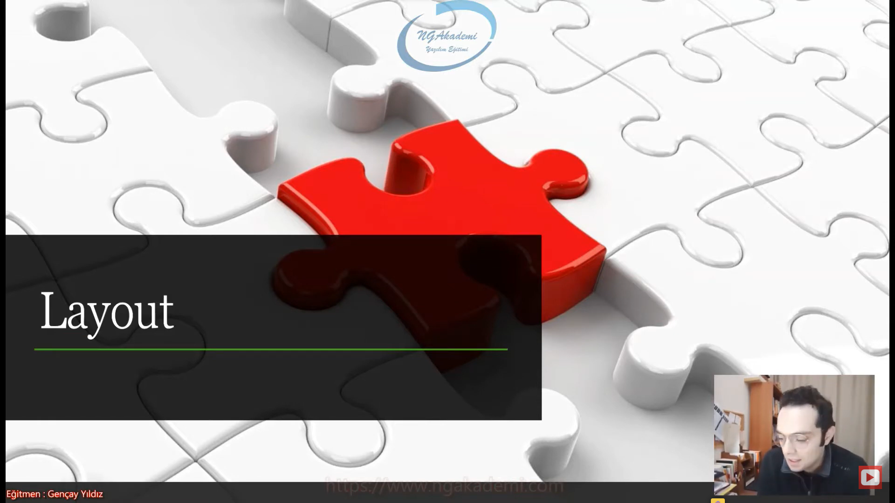
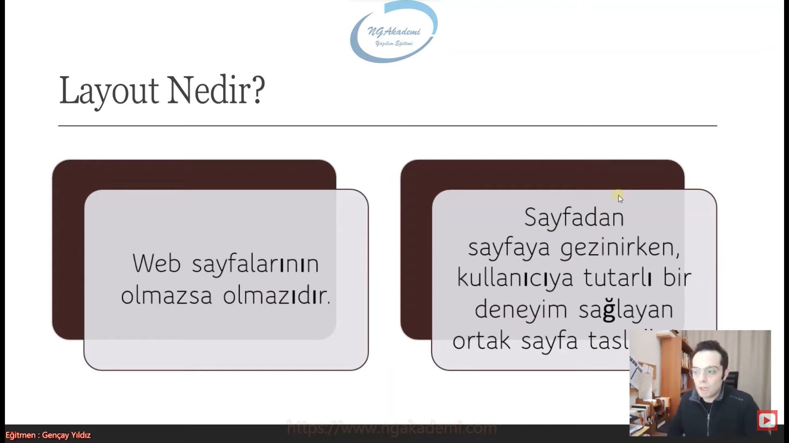
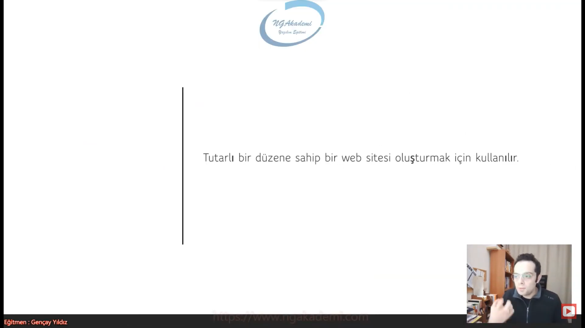
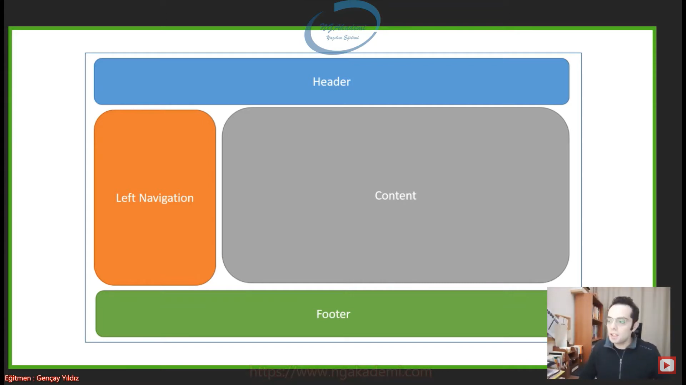
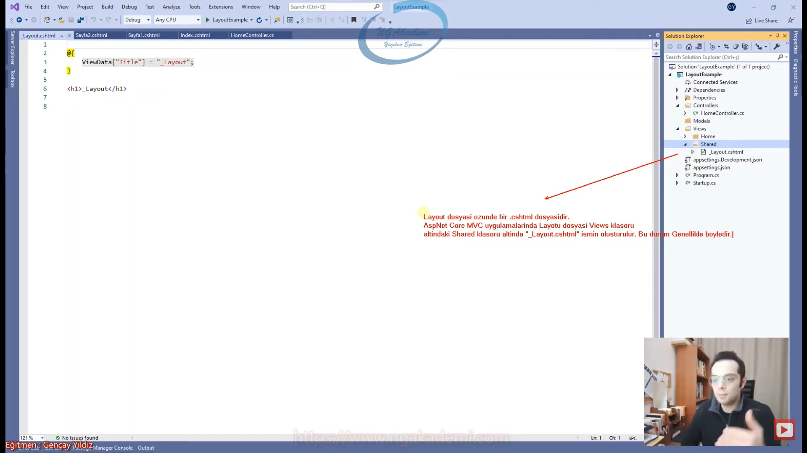
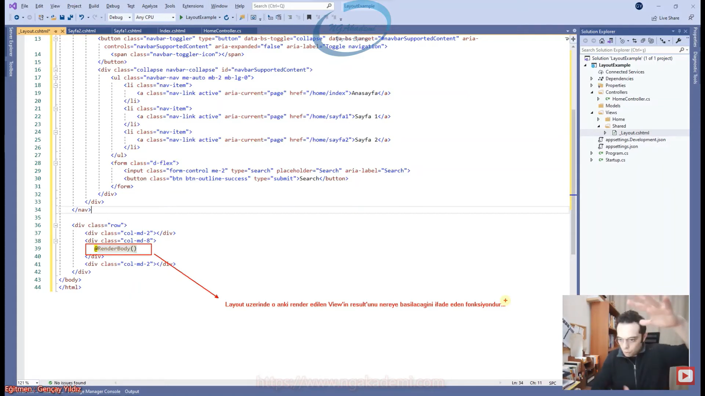
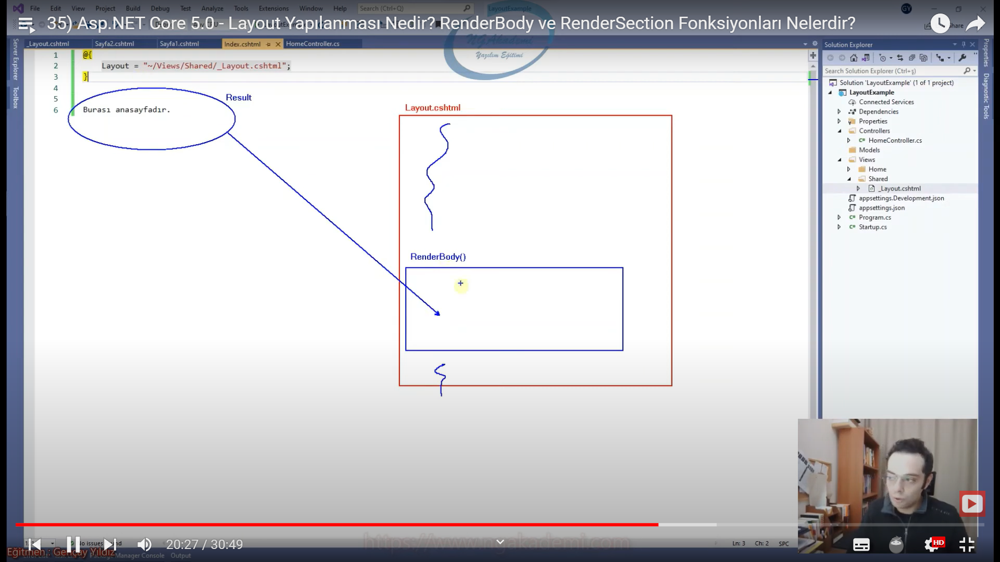
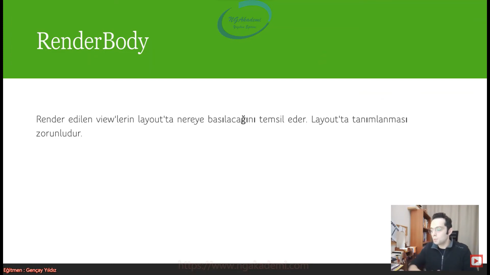
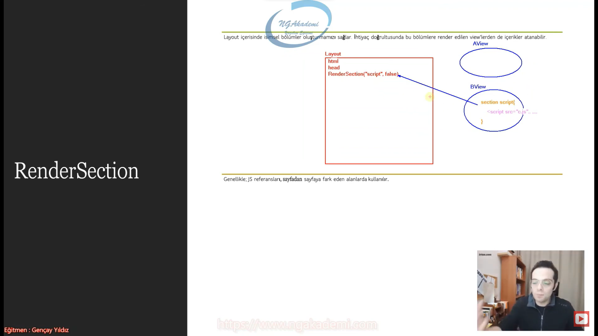
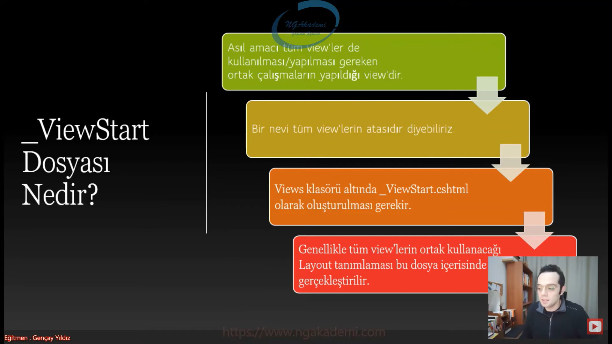

***
# 35) Asp.NET Core 5.0 - Layout Yapılanması Nedir? RenderBody ve RenderSection Fonksiyonları Nelerdir?


- Ben bir web sayfası tasarladım bu web sayfasında değişkenlik gösteren alan sadece content kısmı olmasına rağmen ve her bir sayfada her bir view çıktısında değişkenlik göstermeyen menüm var. Yazılımcı açısından olayı değerlendirirsek her bir View içerisinde tekrar eden sayfadan sayfaya değişkenlik göstermeyen buradaki menünün olması hatta HTML taslağının olması sizce ne kadar doğru? Bu hiç doğru bir yöntem değil Bunun birçok negatif getirisi olacaktır. Burada 3 sayfa üzerinde konuşuyoruz diyelim ki 4.sayfa eklemeye çalıştığımızda her bir sayfaya gidip bu 4.sayfa için o linki eklemem gerekiyor. 3 tane sayfanın olduğu kıytırıkdan bir web uygulamasında bile tek tek bu dördüncü sayfanın linkini eklemem gerekiyorsa siz düşünün gerçek iş hayatında profesyonel bir web uygulamasında diyelim 50 tane sayfa var 51.'yi eklemek istiyorsan eğer 50 sayfaya gidip bunu tek tek eklemen lazım. Benzer mantıkla diyelim bişey değiştirmen gerekiyor diyelim logoyu değiştireceksin.  Bütün sayfalarda değiştirmen gerekiyor. Ya da ekstradan bir reklam yayınlaman lazım banner koyman lazım her sayfaya gidip tek tek bunları yapman gerekecek. Bunun ne yazılımla ne de programcılıkla alakası var. Bu bildiğimiz ameleus dediğimiz yöntemle yapılan bişey.

- Her sayfada tekrar eden yapılanmaları her sayfaya fiziksel olarak koyarsanız bu şekilde bu işin içinden çıkamazsınız.

- Bizim web sayfalarımızda tekrar eden yapılanmaları biz bir ortak sayfaya koysak ve sayfadan sayfaya değişiklik gösteren alanları içerikleri sadece ilgili View'de oluştursak ve tekrar eden yapıları ilgili view  render edilirken tekrar eden yapıları ortak dosyadan alıp tekrar etmeyen yapıları da buna dahil edip sonucu bize topyekün verse. Daha doğru bir sonuç elde etmez miyiz? Aslında sonucu aynı şekilde elde ederiz ama süreç işlevsel açıdan daha doğru olmaz mı?

```C#
//************************ VİEWS ************************
//************************ Anasayfa ************************
<html xlmns="http://www.w3.org/1999/xhtml">
<head>
    <link rel="stylesheet" href="https://cdn.jsdelivr.net/npm/bootstrap@4.0.0/dist/css/bootstrap.min.css" integrity="sha384-Gn5384xqQ1aoWXA+058RXPxPg6fy4IWvTNh0E263XmFcJlSAwiGgFAW/dAiS6JXm" crossorigin="anonymous">
    <script src="https://cdn.jsdelivr.net/npm/bootstrap@4.0.0/dist/js/bootstrap.min.js" integrity="sha384-JZR6Spejh4U02d8jOt6vLEHfe/JQGiRRSQQxSfFWpi1MquVdAyjUar5+76PVCmYl" crossorigin="anonymous"></script>
    <script src="https://code.jquery.com/jquery-3.2.1.slim.min.js" integrity="sha384-KJ3o2DKtIkvYIK3UENzmM7KCkRr/rE9/Qpg6aAZGJwFDMVNA/GpGFF93hXpG5KkN" crossorigin="anonymous"></script>
    <script src="https://cdn.jsdelivr.net/npm/popper.js@1.12.9/dist/umd/popper.min.js" integrity="sha384-ApNbgh9B+Y1QKtv3Rn7W3mgPxhU9K/ScQsAP7hUibX39j7fakFPskvXusvfa0b4Q" crossorigin="anonymous"></script>
</head>
<body>
    <nav class="navbar navbar-expand-lg navbar-light bg-light">
        <a class="navbar-brand" href="#">Navbar</a>
        <button class="navbar-toggler" type="button" data-toggle="collapse" data-target="#navbarSupportedContent" aria-controls="navbarSupportedContent" aria-expanded="false" aria-label="Toggle navigation">
            <span class="navbar-toggler-icon"></span>
        </button>

        <div class="collapse navbar-collapse" id="navbarSupportedContent">
            <ul class="navbar-nav mr-auto">
                <li class="nav-item">
                    <a class="nav-link" href="/home/index">Anasayfa</a>
                </li>
                <li class="nav-item">
                    <a class="nav-link" href="/home/sayfa1">Sayfa 1</a>
                </li>
                <li class="nav-item">
                    <a class="nav-link" href="/home/sayfa2">Sayfa 2</a>
                </li>
            </ul>
            <form class="form-inline my-2 my-lg-0">
                <input class="form-control mr-sm-2" type="search" placeholder="Search" aria-label="Search">
                <button class="btn btn-outline-success my-2 my-sm-0" type="submit">Search</button>
            </form>
        </div>
    </nav>

    <div class="row">
        <div class="col-md-2"></div>
        <div class="col-md-8">
            Burası Anasayfadır.
        </div>
        <div class="col-md-2"></div>
    </div>
</body>
</html>
//************************ sayfa 1 ************************
<html xlmns="http://www.w3.org/1999/xhtml">
<head>
    <link rel="stylesheet" href="https://cdn.jsdelivr.net/npm/bootstrap@4.0.0/dist/css/bootstrap.min.css" integrity="sha384-Gn5384xqQ1aoWXA+058RXPxPg6fy4IWvTNh0E263XmFcJlSAwiGgFAW/dAiS6JXm" crossorigin="anonymous">
    <script src="https://cdn.jsdelivr.net/npm/bootstrap@4.0.0/dist/js/bootstrap.min.js" integrity="sha384-JZR6Spejh4U02d8jOt6vLEHfe/JQGiRRSQQxSfFWpi1MquVdAyjUar5+76PVCmYl" crossorigin="anonymous"></script>
    <script src="https://code.jquery.com/jquery-3.2.1.slim.min.js" integrity="sha384-KJ3o2DKtIkvYIK3UENzmM7KCkRr/rE9/Qpg6aAZGJwFDMVNA/GpGFF93hXpG5KkN" crossorigin="anonymous"></script>
    <script src="https://cdn.jsdelivr.net/npm/popper.js@1.12.9/dist/umd/popper.min.js" integrity="sha384-ApNbgh9B+Y1QKtv3Rn7W3mgPxhU9K/ScQsAP7hUibX39j7fakFPskvXusvfa0b4Q" crossorigin="anonymous"></script>
</head>
<body>
    <nav class="navbar navbar-expand-lg navbar-light bg-light">
        <a class="navbar-brand" href="#">Navbar</a>
        <button class="navbar-toggler" type="button" data-toggle="collapse" data-target="#navbarSupportedContent" aria-controls="navbarSupportedContent" aria-expanded="false" aria-label="Toggle navigation">
            <span class="navbar-toggler-icon"></span>
        </button>

        <div class="collapse navbar-collapse" id="navbarSupportedContent">
            <ul class="navbar-nav mr-auto">
                <li class="nav-item">
                    <a class="nav-link" href="/home/index">Anasayfa</a>
                </li>
                <li class="nav-item">
                    <a class="nav-link" href="/home/sayfa1">Sayfa 1</a>
                </li>
                <li class="nav-item">
                    <a class="nav-link" href="/home/sayfa2">Sayfa 2</a>
                </li>
            </ul>
            <form class="form-inline my-2 my-lg-0">
                <input class="form-control mr-sm-2" type="search" placeholder="Search" aria-label="Search">
                <button class="btn btn-outline-success my-2 my-sm-0" type="submit">Search</button>
            </form>
        </div>
    </nav>

    <div class="row">
        <div class="col-md-2"></div>
        <div class="col-md-8">
            Burası sayfa1dir.
        </div>
        <div class="col-md-2"></div>
    </div>
</body>
</html>
//************************ sayfa 2 ************************
<html xlmns="http://www.w3.org/1999/xhtml">
<head>
    <link rel="stylesheet" href="https://cdn.jsdelivr.net/npm/bootstrap@4.0.0/dist/css/bootstrap.min.css" integrity="sha384-Gn5384xqQ1aoWXA+058RXPxPg6fy4IWvTNh0E263XmFcJlSAwiGgFAW/dAiS6JXm" crossorigin="anonymous">
    <script src="https://cdn.jsdelivr.net/npm/bootstrap@4.0.0/dist/js/bootstrap.min.js" integrity="sha384-JZR6Spejh4U02d8jOt6vLEHfe/JQGiRRSQQxSfFWpi1MquVdAyjUar5+76PVCmYl" crossorigin="anonymous"></script>
    <script src="https://code.jquery.com/jquery-3.2.1.slim.min.js" integrity="sha384-KJ3o2DKtIkvYIK3UENzmM7KCkRr/rE9/Qpg6aAZGJwFDMVNA/GpGFF93hXpG5KkN" crossorigin="anonymous"></script>
    <script src="https://cdn.jsdelivr.net/npm/popper.js@1.12.9/dist/umd/popper.min.js" integrity="sha384-ApNbgh9B+Y1QKtv3Rn7W3mgPxhU9K/ScQsAP7hUibX39j7fakFPskvXusvfa0b4Q" crossorigin="anonymous"></script>
</head>
<body>
    <nav class="navbar navbar-expand-lg navbar-light bg-light">
        <a class="navbar-brand" href="#">Navbar</a>
        <button class="navbar-toggler" type="button" data-toggle="collapse" data-target="#navbarSupportedContent" aria-controls="navbarSupportedContent" aria-expanded="false" aria-label="Toggle navigation">
            <span class="navbar-toggler-icon"></span>
        </button>

        <div class="collapse navbar-collapse" id="navbarSupportedContent">
            <ul class="navbar-nav mr-auto">
                <li class="nav-item">
                    <a class="nav-link" href="/home/index">Anasayfa</a>
                </li>
                <li class="nav-item">
                    <a class="nav-link" href="/home/sayfa1">Sayfa 1</a>
                </li>
                <li class="nav-item">
                    <a class="nav-link" href="/home/sayfa2">Sayfa 2</a>
                </li>
            </ul>
            <form class="form-inline my-2 my-lg-0">
                <input class="form-control mr-sm-2" type="search" placeholder="Search" aria-label="Search">
                <button class="btn btn-outline-success my-2 my-sm-0" type="submit">Search</button>
            </form>
        </div>
    </nav>

    <div class="row">
        <div class="col-md-2"></div>
        <div class="col-md-8">
            Burası sayfa2dir.
        </div>
        <div class="col-md-2"></div>
    </div>
</body>
</html>
```

- İşte biz burada View'den View'e tekrar etmeyen/sonucu değişmeyen menüdür sol menüdür alt menüdür vs. gibi alanları tuttuğumuz ortak alana layout diyoruz. Çünkü buna web geliştirirken ihtiyacımız olacak. İşte ihtiyacımız olan bu parçaya/dosyaya biz layout yapılanması diyoruz.
 
- Sen herbir sayfada ortak olan noktaları her bir view içerisinde tekrar tekrar tanımlarsan bunun yönetilebilirliği 0'a düşer. Hatta negatife de iner. Halbuki sen bunu ortak bir noktaya koyarsan ortak noktada yapılan tüm değişiklikler bu ortak noktayı baz alan sayfalara otomatik yansıtılacağından dolayı yönetimi de esnekliği de geliştirilebilirliği de muazzam derece arttıracaktır. İşte biz bu yapılanmya/ihtiyaca layout yapılanması diyoruz.

- Web sayfalarının olmazsa olmazıdır.

- Layout'suz bir web uygulasmı geliştirmek rezillik gibi bişeydir.

- Sayfadan sayfaya gezinirken kullanıcıya tutarlı bir deneyim sağlayan ortak sayfa taslağıdır.

- Bütün UI teknolojilerde Layout olmazsa olmaz çünkü tekrar eden yapılanmaların dışında değişkenlik gösteren alanları yönetmek bizim işimiz. Tekrar edenleri bir merkezden alacaksın.

- Sayfadan sayfaya gezinirken tutarlı bir deneyim sağlamaktan kastımız şimdi sen tekrar eden kısımları her bir sayfada tek tek oluşturursan bunların yönetilebilirliği zor olacağından dolayı herhangi bir değişiklik esnasında bazı sayfalarda unutabilirsin. Haliyle tutarsızlık meydana gelebilir. Halbuki sen tekrar eden kısımları layouyt üzerinde tanımlamış olsaydın tutarlı bir şekilde çalışmanı sağlayacak burada biz kullanıcı deneyimini sağlayan bir ortak sayfa taslağı diyeceğiz



- Tutarlı bir düzene sahip bir web sitesi oluşturmak için kullanılır.

- Sayfadan sayfaya değişkenlik göstermeyen alanları layout'ta tanımlıyoruz.



- Yazılımcı dediğin probleme analitik bir çözüm sağlar hani bodoslama ameleus dediğimiz felsefeyle çözüm sağlayacağına normal layout gibi yapılanmalarla ortak merkezi çözümler sağlamak yazılımcılık ahlakına da uygundur.

- Bir sayfada header left navigation footer alanları genellikle değişkenlik göstermeyen alandır. Amma velakin content alanı ise sayfadan sayfaya değişkenlik gösteren her sayfanın kendi içeriğine bastığı alandır. Bunu `RenderBody()` isimli fonksiyonla sağlamaktadır. yani content alanlarını başka view'lerde tanımlarsın layout'ta da bu fonksiyonu kullanırsın.



- Layout dediğimiz dosya özünde bir view dosyasıdır yani .cshtml dosyasıdır. Bu dosya View içerisinde istediğin herhangi bir yerde oluşturulabilir. Amma velakin biz genellikle layout dosyasını Views'ın altında Shared adlı klasörün içinde oluştururuz.

- Layouz özünde bir View dosyasıdır.

- View'ın altında Shared altında _Layout.cshtml dosyası Layout dosyası olarak kullanılmaktadır.

- Layout dosyası özünde bir .cshtml dosyasıdır. AspNet Core MVC uygulamalarında Layout dosyası Views klasörü altındaki Shared klasörü altında '_Layout.cshtml' isminde oluşturulur. Bu durum genellikle böyledir.

- Ama sen farklı bir dizinin altında farklı bir isimde .cshtml dosyası oluşturabilir ve bunu bir layout dosyası olarak kullanabilirsin.



- Sayfadan sayfaya değişkenlik gösterecekten kastımız ilgili view'deki çıktı neyse buraya basılacak yani view'in mahiyetindeki öz verisi neyse buraya basılacak geri kalan tekrar eden yapıları layout'tan alacak.

- View'den view'e değişiklik gösteren veriyi ise `RenderBody()` fonksiyonu ile basabiliriz.

- `RenderBody()` Layout üzerinde o anki render edilen View'in result'unun nereye basılacağını ifade eden fonksiyondur. Yani senin layout'un var sayfadan sayfaya tekrar edecek yapılar belli değişkenlik gösterecek kısmı şurası demek. İşte bu fonksiyon bu kısım view'den gelecek artık hangi View'i render ediyorsan onun çıktısı buraya basılacaktır. Yani burası değişkenlik gösteren ana/merkez body olduğunu bildirmiş oluyoruz.



- View'ler render edilirken hangi layout dosyasını baz alacaklarını senin View'lere bildirmen gerekiyor.

```C#
@{
    Layout= "~/Views/Shared/_Layout.cshtml"
}
```

- Bu bildirimden sonra Herhangi bir view render edilirken artık hangi .cshtml dosyasını layout dosyası olarak baz alacağını biliyor ilgili layout dosyası render edilecek ilgili alanlar oluşturulacak oluşturulduğu zaman bu view'deki çıktı/ view'in öz verisi Layout `RenderBody()` 'ye yerleştirilecektir.

- View render edilirken öncelikle sen mevcut _Layout.cshtml'i bir render et View'in çıktısını body'sini ise ilgili render edilen _Layout.cshtml `RenderBody()` fonksiyonuyla işaret edilen alanına bas. Haliyle layout sana ilgili tekrar eden yapıları getirecek tekrar etmeyen sayfadan sayfaya değişkenlik gösteren alanı/result'u ise sen buradaki `RenderBody()`in olduğu yere bas demiş oluyorsun.



- Layout'tan tekrar eden sayfadan sayfaya değişmeyen yapıları bize layout getirecek değişen kısımları ise ilgili view'in result'undan alacaktır. Çalışırken `RenderBody()` kalkar. İlgili o anda render edilen View'in çıktısı buraya basılır.

- Artık tekrar eden yapıları tek bir dosya üzerinden yönetebiliyorum. Sisteme yarın 3. 5. 10. 50. sayfalar gelse dahi bunların sadece tek bir dosya üzerinden linklerinin oluşturulması yeterli olacaktır. Bu sayfayı baz alan bütün View dosyaları buradan ilgili değişiklikleri direkt yakalayacağından dolayı hepsine yansıtılacaktır. Bu da bana inanılmaz derece de yönetilebilir az maliyetli ve efektif bir web geliştirme yaklaşımı sağlamaktadır.

- Layout'suz web miamrisi geliştirilmez.

- Değişkenlik göstermeyen alanlar layout'tan geldi değişeknlik gösteren alan ise `RenderBody()` tarafından işaretlenen alana yerleştirildi.

- `RenderBody()` Render edilen view'ların layout'ta nereye basılacağını temsil eder. Layout'ta tanımlanması zorunludur.

- Bir .cshtml dosyası eğer ki layout olarak kullanılıyorsa %100 içerisinde `RenderBody()` tanımlanması yapılmak zorundadır. Birden fazla da olamaz. Kesinlikle bir tane tanımlanmalıdır. Birden fazla da tanımlayamaz hata alırsınız.



- `RenderSection()` layout içerisinde isimsel bölümler oluşturmamızı sağlar. İhtiyaç doğrultusunda bu bölümlere render edilen view'lerden de içerikler atanabilir.

- `RenderSection()` Genellikle, JS referansları, sayfadan sayfaya fark eden alanlarda kullanılır.

- Layout'un içerisinde ekstradan ana `RenderBody()`'nin dışında farklı parçalarda oluşturmak istiyorsanız `RenderSection()`ı kullanabilirsiniz.

 ```C#
 <div class="row">
    <div class="col-md-2">
        @RenderSection("solmenu")
    </div>
    <div class="col-md-8">
        @RenderBody()
    </div>
    <div class="col-md-2"></div>
</div>
 ```

 - Eğer ki `RenderSection()`ı üstteki şekilde kullandınız bu overload'la ve bu view dosyasını layout olarak kullanan farklı view'ler var. Eğer ki layoutta `RenderSection()` kullanılıyorsa ve bu layoutu kullanan view render ediliyorsa uygulama patlayacaktır. Çünkü `RenderSection()` ilgili view tarafından tüketilmelidir. Oraya bir değer gönderilmesi gerekecektir aksi taktirde hata verecektir.

 - Eğer ki sen layout'ta bulunan `RenderSection()`'ın zoraki kullanılmasını istemiyorsan View'den View'e opsiyonellik gösterecekse ikinci parametresine(required parametresine) `false` demen yeterli olacaktır. `false` dersen eğer ilgili view tarafından bu section kullanılmıyorsa eğer hata vermeyecektir. Eğer ki demezsen ya da `true` dersen illaki kullanmak zorundasın. Bu layoutu baz alan tüm viewlarde bu section kullanılması gerekecek yok eğer `false` dersen kullanmasına gerek kalmayacaktır.

 ```C#
 @section solmenu{

}
 ``` 
 - Üstteki şu anlama geliyor layouttaki solmenu isimli `RenderSection()`'da tanımlanmış alana bu view render edilirken buradan istediğim değeri yollayabiliyorum.

 - `RenderSection()` View'de ekstradan alan tanımlamamıza yarıyor. Ana `RenderBody()`nin/ana body'nin dışında view'den müdahale edebileceğiniz sayfadaki noktalarıda `RenderSection()`la tanımlama yapabiliyorsunuz. 

 - `RenderSection()` sayfada birden fazla bölüm oluşturmanızı sağlayan bir fonksiyondur.

 - Bir sayfa vardır belirli Javascript kütüphanelerini kullanır kimisi kullanmaz. Sen naparsın ilgili html içerisinde head'in içerisinde bir tane section tanımlarsın AView'ini render ederken herhangi bir kütüphaneye ihtiyacın olmayabilir ama BView'ini render ederken senin kesinlikle burada bir js kütüphanesine ihityacın olabilir bunu BView'inde ilgili layout'a ekletmek istiyorsan `section`ı kullanabilirsin.
 
- Sayfaya göre ekstradan bir bölümsel işlem yapacaksan JS dosyalarını biz `section` ile sayfalar arasında ayırabiliyoruz.

 

***
 # 36) Asp.NET Core 5.0 - _ViewStart ve _ViewImports Dosyaları Nelerdir?
 - Asıl amacı tüm view'ler de kullanılması/yapılması gereken ortak çalışmaların yapıldığı view'dir.

 - _ViewStart'ta esasında bir .cshtml dosyasıdır.

 - View'le alakalı çalışma yaptığımız tüm operatif view'ler özünde bir .cshtml dosyasıdır.
    * Layout'ta bir .cshtml. Bir başka view tarafından layout olarak işaretliyorsan artık o .cshtml layout özelliği kazanan terminolojide o şekilde nitelendirilen bir view'dir. 
    * Benzer mantıkla _ViewStart. _ViewStart'ta yine bir view olacak ama sen bunun isminden bu özelliği niteliği buna kazandırmış olacaksın.
    * Bir başka göreceğimiz _ViewImports o da bir view olacak .cshtml o da isminden ilgili niteliği kazanacak.

- Asp.Net Core MVC mimarisinde view yapılarının hepsi özünde bir .cshtml'dir. Sadece yapacağı/alacağı sorumluluğa göre terminolojik olarak farklı bir şekilde isimlendirilmektedir.

- _ViewStart'ta bir viewdır asıl amacı tüm viewlarda kullanılacak yapılacak işlemleri ortak olarak yapmamızı sağlayan ana bir view'dir.

- Bir nevi tüm view'lerin atasıdır diyebiliriz.

- Herhangi bir view'i sunucuda render ediyorsanız eğer varsa _ViewStart önce bu render edilir ardından senin view'in artık hangisiyse o render edilecektir.

- Amaç olarak ortak çalışma yapmamızı sağlayan bir .cshtml dosyasıdır.

- Views klasörü altında _ViewStart.cshtml olarak oluşturulması gerekir. Aksi taktirde mimari tarafından herhangi bir view'in başlangıç view'i olup olmadığını bildiremezsiniz. İsmi ve konumu çok önemli

- Bazı view'lerde isimler çok önemlidir. Özellikle _ViewStart ve _ViewImports

- Genellikle tüm view'lerin ortak kullanacağı Layout tanımlaması bu dosya içerisinde gerçekleştirilir.

- Tüm view'lerde ayrı ayrı layout tanımlaması yapmaktansa biz layout tanımlamasını _ViewStart dosyası üzerinden yapmayı tercih ediyoruz.

 

 - Layout tanımlamsını tüm view'lerden yapmak yönetilebilirliği zayıflatacaktır. Nihayetinde biz tekrar eden yapılanmalardan mümkün mertebe kaçıyoruz. Yani bir yazılımcının huyudur zaten bu. Bir şey tekrar ediyorsa eğer biz ona takılırız. onu tekilleştirme çabasına düşeriz. Her bir view dosyasında tek tek tanımlama ypacağımıza biz bunu tek bir noktada tanımlamak istersek eğer burada yapabileceğimiz/çalışabileceğimiz tek dosya _ViewStart dosyası olacaktır.

 - _ViewStart dosyası öncelikli olarak render edilir.

 - _ViewStart bu şekilde başlangıç/ortak tanımlamaları yaptığımız ve her view'e etki eden çalışmaları yaptığımız bir dosya. Genellikle bu dosyada bütün view'ler tarafından kullanılan yapılar kullanılır.

 - Başlangıç view'ine ilgili layoutu verdikten sonra artık hangi view'i render ediyorsan o view doğal olarak buradaki layout dosyasını baz alıp render edilecektir. Bununla alakalı ekstradan çalışma yapmanıza gerek kalmayacaktır. Yani bundan sonra sistemde yüklemiş olduğunuz oluşturmuş olduğunuz herhangi bir view dosyasında ekstradan layoutu bildirmenize gerek yok çünkü default olarak _ViewStart dosyasını baz alacağından dolayı otomatik layout tanımlanmış olacaktır.

 - Eğer ki genelin dışında istisnai hareket edip herhangi bir view'de _ViewStart'taki tanımlamayı ezmek istiyorsanız layout tanımlamasını ilgili sayfada layout değerine `null` vermeniz yeterli olacaktır. Ya da başka bir layout kullanmak isterseniz o kullanacağınız layoutun path'ini yazabilirsiniz. Mevcut _ViewStart'taki layout tanımlamasını bu şekilde ezebilirsiniz.

 - _ViewImports Razor sayfaları için kütüphane ve namespace tanımlamalarını sayfa sayfa farklı tanımlamaktansa ortak/merkezi olarak tanımlamamızı sağlayan dosyadır.

 - Views klasörü altında _ViewImports.cshtml isminde oluşturulmalıdır.

- _ViewImports ve _ViewStart dosyaları esasında ortak tanımlama dosyalarıdır. İkisinin arasındaki teknik fark _ViewImports programatik tanımlamaları using blokları gibi namespace tanımlamaları gibi bunları yapmamızı sağlarken _ViewStart ise programatiğin dışında layout gibi ya da ortak kullanılan html tabanlı çalışmaları yaptığımız dosyadır.

- _ViewImports'ta programatik import işlemlerini yaparız. Genellikle using bloklarının tanımlanması olsun TagHelper kütüphanelerinin tanıumlanması olsun bu şekilde çalışmaları _ViewImports dosyası içerisinde gerçekleştirmekteyiz.

- Views klasörü altında _ViewImports.cshtml isminde bir dosya varsa bu dosya içerisindeki using tanımlamalarının hepsi mimarideki View'ler tarafından benimsenecektir ve ilgili using'lerin/namespacelerin altındaki class'lara direkt erişim sağlanabilecektir.

- View'ler üzerinde varolan bir entity'e ya da viewmodel'a erişmemiz gerektiğinde ya `@model LayoutExample.Models.Product` bu şekilde namespace'ini bildirmemiz gerekiyordu ya da ilgili view üzerinde `using LayoutExample.Models` ilgili namespace altındaki bütün sınıfları bu şekilde View bazlı kullanılabilir hale getiriyorduk. Ama biz bu şekilde çalışmalarda tüm view'lerde kullanılacak belirli namespace'lerin bu şekilde tek tek tanımlanmasını View bazlı tanımlanmasını çok fazla tercih etmiyoruz bu hem bizim için maliyetli olmakta hem de yorucu olmakta. Dolayısıyla bu şekildeki genel tanımlamaları _ViewImports dosyası altında gerçekleştiriyoruz.

- Artık mimaride Views klasörü altında _ViewImports isimli dosyamız varsa bunun içinde yapılan tüm using tanımlamaları mimaride global bir şekilde erişilebilir olacaktır.

- Benim artık belirli bir namespace altındaki sınıflara erişebilmem için tekrar tekrar namespace tanımlaması yapmama gerek kalmıyor _ViewImports üzerinden yapılan bu çalışma neticesinde tüm view'lere gerekli using tanımlamaları tek çatı altından yapılmış oluyor.

- Herhangi bir view tabanlı TagHelper kütüphanesini tanımlamamıza gerek kalmaksızın _ViewImports üzerinden tek çatı altından bu tanımlamayı da sağlayıp direkt view'lerde operasyonlarımıza odaklanabiliyoruz.

## C# Example
```C#
//************************ _ViewImports ************************
@using LayoutExample.Models
@addTagHelper *, Microsoft.AspNetCore.Mvc.TagHelpers
//************************ _ViewStart ************************
@{
    Layout = "~/Views/Shared/_Layout.cshtml";
}
//************************ Product ************************
namespace LayoutExample.Models
{
    public class Product
    {

    }
}
//************************ Sayfa2 ************************
@{
    Layout = null;
}

@{
    Product product = new();
}

@section solmenu{
    <ul>
        <li>A</li>
        <li>B</li>
        <li>C</li>
        <li>D</li>
    </ul>
}

Burası sayfa 2'dir.
```
