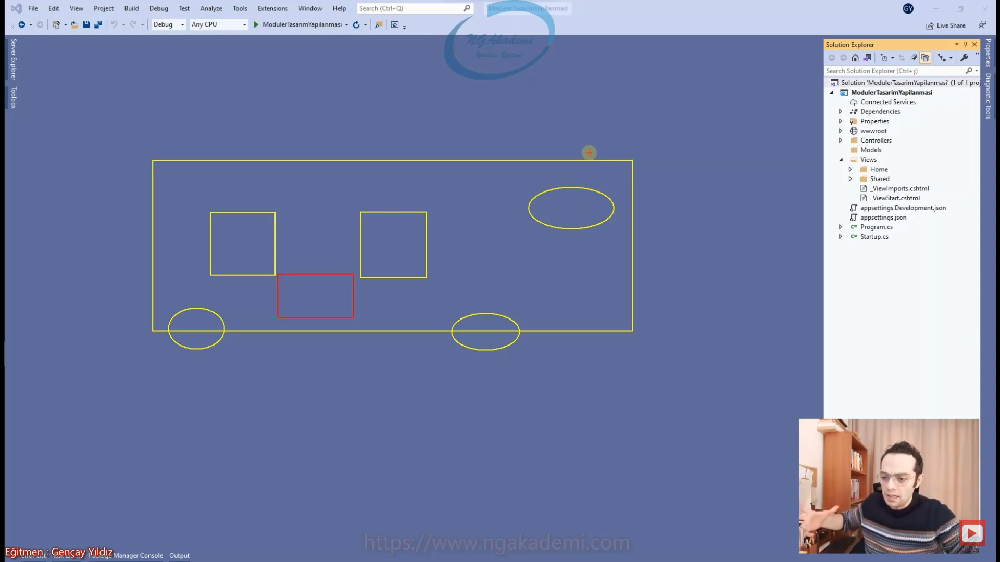
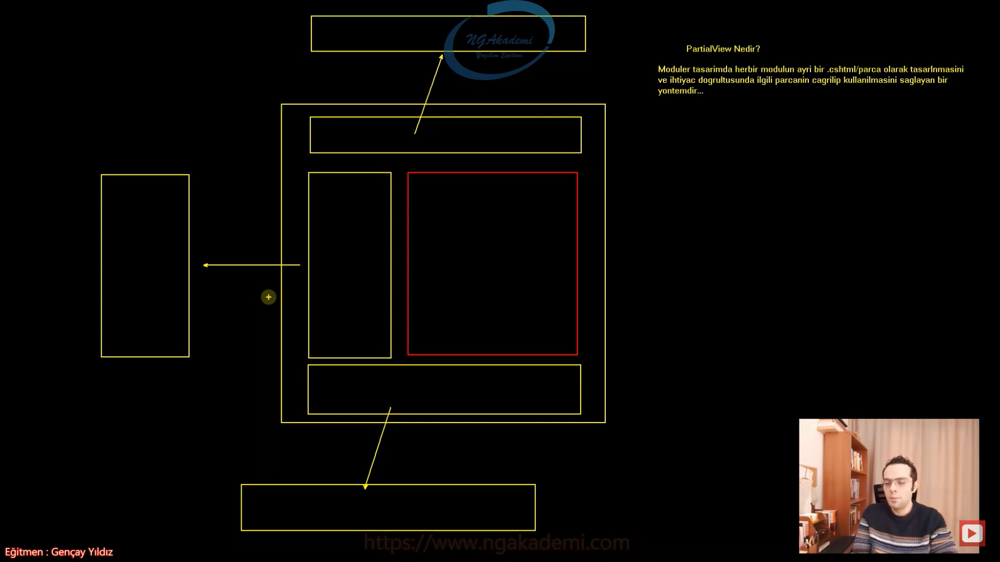
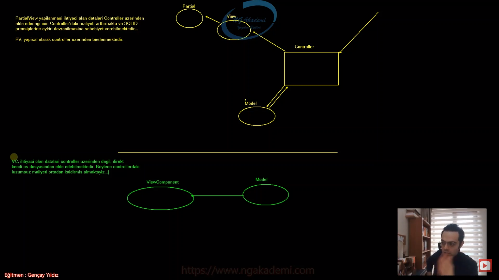
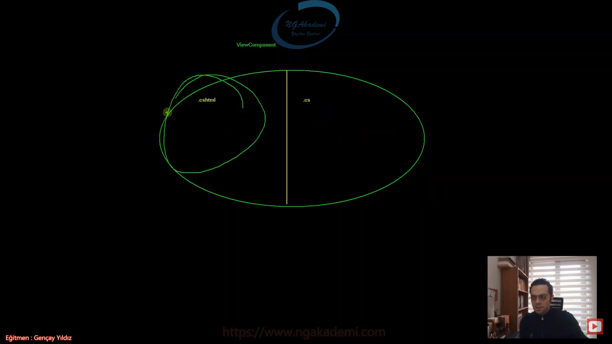
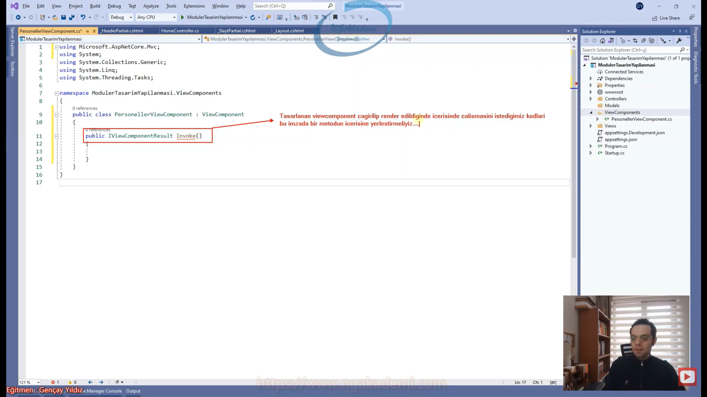

# 37) Asp.NET Core 5.0 - Modüler Tasarım Yapılanması Nedir? Nasıl Uygulanır?
- Modüler tasarım günlük hayatta da sık sık karşımıza çıkmaktadır. Şimdi bir arabamız var ve bu arabamızn varsayalım ki direksiyonu var. Tabi tekerleri var koltuğu var vs. Bunun motoru var. Diyelim ki arabanın herhangi bir parçasında örneğin direksiyonunda bir sıkıntı olduğu zaman eğer ki direksiyondaki sıkıntı tekeri haliyle tekerdeki sıkıntı koltuğu koltuktaki sıkıntı motoru motordaki distrübitörü vs. yani ufacık bir sıkıntı alakasız yerleri etkiliyor olsaydı sizce araba sektörü dünyada bu noktaya gelebilir miydi? Araba tek başına bir bütün olabilir belki ama yapısal olarak esasında küçük parçaların bir araya gelerek bir bütün oluşturduğu yapılanmadır araba dediğimiz olay.

- Yani arabada bir tasarım mevcut ve bu tasarım bizim birazdan varacağımız modüler tasarım. Arabanın birden fazla parçanın bir araya gelerek bütün oluşturmasını bize getirmiş olduğu fayda şudur ki arabanın herhangi bir parçasında herhangi bir arıza meydana geldiği zaman sadece o parçaya odaklanarak o arızayı çözmemizi sağlayabiliyor. Örneğin direksiyonda bir sıkıntı yaşadınız direksiyonda yaşanan sıkıntı sadece direksiyonu etkiliyor ne tekerde ne de farklı parçalarda bu sıkıntının oraya geçmesini sağlıyor. Yani ilgili sıkıntı diğer parçaları etkilemiyor. Tabiki bütünü etkiliyor o ayrı mesele ama sizin sadece problem açısından odaklanmanız gereken parça sıkıntıyı yaşadığınız parça oluyor. Dolayısıyla geliştirilen günümüzdeki arabalar da bile motorunun ayrı parça iskeletinin ayrı parça vitesinin direksiyonun tekerlerinin ayrı parça olması bu araba sektöründe arabanın hem gelişimini hem de tamirini/bakımını inanılmaz derecede kolaylaştırmaktadır. Aksi taktirde araba da bu şekilde parça bütün ilişkisi olmasaydı da tek bir parça olarak oluşturulmuş olsaydı arabanın camındaki bile herhangi noktasındaki ufacık bir sıkıntı bütünü etkileyeceğinden dolayı direkt arabayla ilgili herhangi bir esneklik söz konusu olmayacaktı ve çok saçma olacaktı. Yani düşünsene viteste sıkıntı yaşıyorsun arabanın şanzımanına kadar bütün mekanizmayı ilgilendiriyor o sıkıntı çünkü hepsi birbirine bağlı. Dolayısıyla bu doğru bir yaklaşım olmayacaktı arabalar bile modüler bir anlayışla geliştirilmektedir.



- Yaradan nasıl yaratmış bütün olarak bir bedeni özünde organ dediğimiz parçalardan ibaret yaratmış. Bu parçaların bir araya gelmesi neticesinde insanın bedeni meydana gelmekte. İnsan örneğin dişi ağrıdığı zaman bu diş ağrısı ayağını ilgilendiriyor mu? ilgilendirmiyor. miden ağrıdığı zaman gözlerindeki görmeyle ilgili bir yeti kaybı oluşuyor mu oluşmuyor. Kulağındaki bir problem senin ellerindeki dokuyu ilgilendiriyor mu? ilgilendirmiyor çünkü yaradan bile bizi yaratırken modüler bir tasarımda yaratmış. Organlarımızın birbirinden bağımsız olması demek organlarımızda yaşanan herhangi bir problemin bütüne yansımaması demektir. Dolayısıyla sen dişinle ilgili bir ağrı olduğu zaman kime gidiyorsun? diş doktoruna gidiyorsun yani sana aynı anda beyin cerrahı, diş doktoru, mide ile ilgili doktor gelmiyor. Problem neredeyse lokal olarak orayla ilgilenip problemi çözüyorsun.

- Yaradanın bile bu şekilde yarattığı bir mekanizma/pattern/düzen var ortada haliyle bize de artık yapacağımız çalışmalarda buradaki ahlakı yapacağımız çalışmalara uygulamak düşmektedir. Biz buna modüler tasarım yapılanması diyoruz.

- Modüler tasarım günlük hayatta kainatta her yerde var. Nereye bakarsanız her yerde görebileceğiniz bir pattern'dır. Dolayısıyla OOP'de bile SOLID prensiplerinin temelinde bile Single Responsibility Principle dediğimiz tek sorumluluk prensibinde bile bir modülerlik anlayışı vardır. 

- Yani modülerlik dediğimiz olay parça bütün ilişkisi. Bütün işlemleri tek bir sorumluluğu üstlenecek parçaların bir araya gelerek bütünü oluşturması.

- Modüler tasarım yapılanması sadece bir teknolojiye/kütüphaneye/sisteme özel olamaz. Bu bir mantıktır. Bu mantık kullanacağınız mimari hangisi ise ona uyarlanır. Hayatınızda istediğiniz her yere uyarlayabilirsiniz.

- Bir sayfayı parçalayarak yönetmek yönetilebilirlik açısından daha iyi olacaktır.

- Geliştirdiğiniz web uygulamalarda tasarımları parçalamanız;
    1. size yapacağınız işi hızlı bir şekilde odaklanmanızı sağlar.
    2. Hata ihtimalinizi düşürür.
    3. View'i yani UI kısmını MVC'de özellikle efektif bir şekilde yönetebilmenizi sağlıyor.

- Bütün componentlerin/bileşenlerin yani işlem yapan belirli yapıların tek bir view'da tanımlanması bir profesyonel yazılım tasarımı açısından çok ta doğru değil. Dolayısıyla bizim yaklaşım olarak burada örneğin header'ımız mı var bunu ayrı bir partial'a/modüle koymamız lazım. Orada yönetmemiz gerekiyor header'la ilgili gerekli navbar çalışmalarını ve onu buraya referans etmemiz lazım. Slaytın mı var slayt'ı ayrı bir partial'a alacaksın onun üzerinden yöneteceksin. Menün mü var menüyü ayrı bir partial orada yönetip buraya referans edeceksin Bu mantıkla web mimarisini geliştireceksin. Netice olarak senin o anki view'in birden fazla parçadan bir bütün oluşturacak ve yönetilebilirlik açısından da olması gereken ideal bir tasarım ortaya koyulmuş olacaktır. Haliyle içinde her şeyi barındıran bir sayfa ideal bir tasarım olmayacaktır.

- Bir web uygulamasında modüler tasarımı kullanmak için MVC mimarisinde iki yapı vardır. Biri `PartialView` diğeri `ViewComponent`.
 
- Bir bütün olarak düşünebileceğiniz bir web sayfasında örneğin yukarıda bir menü vardır. Sol tarafta bir menü daha vardır. Aşağıda başka bir footer dediğimiz yapılanma vardır vs. Sen bunların hepsini tek bir sayfadan yönetiyorsan bu ideal bir tasarım değildir. Bunların hepsini parçalaman gerekecek. Yani yapıları bir view/.cshtml olarak tasarlayacaksın. Farklı modüllerde tasarladığın bu parçaları kullanman gerektiği noktalarda gelip referans etmen yeterli olacaktır. Bir parçayı referans ettiğinde o parçayı oraya eklemiş/yerleştirilmiş oluyorsun.

- Modüler tasarım yapılanmasında sayfa değişikliklerini de hızlı bir şekilde yapabilirsiniz. Eğer ki sen bir yapıyı sen modüler bir şekilde referans ediyorsan yerini değiştirmek istediğinde hızlı bir şekilde yer değişikliği yapabilirsin. Kaynak koda giderek kompleks kodlar arasında işte kes ve yapıştır yapacağımıza ilgili referansı alıp başka bir yere yerleştirdiğinizde ilgili modül oraya direkt ha deyince yerleştirilecek yani sayfa tasarımına da hızlı bir şekilde müdahale edebilme şansı yakalamış olacaksınız. İdeal tasarımı modüler tasarım yapılanmasıyla ortaya koyabilmekteyiz.

- `PartialView` modüler tasarım yapılanmasında her bir modülü ayrı bir view olarak tasarlamamızı sağlayan ve bunların parça view olarak ana view'de birleştirmemizi sağlayan bir tekniktir.

- Modüler tasarımda her bir modülün ayrı bir .cshtml/parça olarak tasarlanmasnı ve ihtiyaç doğrultusunda ilgili parçanın çağırılıp kullanılmasını sağlayan bir yöntemdir...

- Herhangi bir view dosyasını bir parça olarak kullanmanızı sağlayan bir yöntemdir. Örneğin bir sayfa üzerindeki bir parçayı başka bir view'den alacaksanız yani bir modül olarak kullanacağınız view dosyasından alacaksanız `PartialView` üzerinden ilgili view'i çağırarak o alana gömebilirsiniz. Biz buna modüler tasarım yaklaşımı diyeceğiz. `ViewComponent` ta da aynısını yapabiliriz.

- `PartialView` da `ViewComponent` da özünde ikisi de aynı farklı bir dosyayı/view'i render edip oraya parça olarak yerleştirmeni sağlıyor böylece modüler bir yönetim sağlamış oluyor. 

- Modüler tasarımda her bir modülün ayrı bir .cshtml olarak ayrılmasını tasarlanmasını sağlıyor ve bunları ihtiyaç doğrultusunda ilgili noktaylarda referans edip çağırmamızı sağlayan yapılanmaya biz `PartialView` yapılanması diyoruz.



- Bir modüler tasarım yapacağınız view üzerinde öncelikle parçalayacağınız modülleri iyice tespit edin.

- `PartialView` ayrı bir view dosyasıdır bunları bir dizinde tutup çağırmamız yeterli olacaktır.

- Bir controller'a ait bir partial oluşturacaksanız eğer yapmanız gereken views klasörü altındaki controller'ın view klasörüne controller'a ait bir partial dizini oluşturmak.

- Referans olarak göstermenin 3 yöntemi vardır.
    1. `RenderPartial() fonksiyonu ile` => `@{Html.RenderPartial("~/Views/Home/Partials/_HeaderPartial.cshtml");}`
    2. `Partial() fonksiyonu ile` => `@Html.Partial("~/Views/Home/Partials/_HeaderPartial.cshtml")`
    3. `Partial tag helper'ıyla` => `<partial name="~/Views/Home/Partials/_SlaytPartial.cshtml" />`

- Mümkün mertebe parçalanmalıdır. Olabilecek en doğru bölümleri seçip parçalamanız sizin yararınıza olacaktır.

- `PartialView` ile sen yönetilebilirliği desteklemiş olacaksın. İdeal tasarım da bu şekilde olacaktır. `PartialView` de yapmış olduğun çalışma import/eklendiği/dahil edildiği yerde/ana modüle yansıtılacaktır.

- Hangi alanda çalışacaksan işine odaklanabilmen için modüler tasarımda çalışman kesinlikle tavsiye edilmektedir.

- Mümkün mertebe bir view içerisindeki farklı bileşenleri biz ayrı parçalara alıp bunları bir parça bütün ilişkisiyle ilgili view üzerinde çalışıp bütünleştiriyoruz. Bizim için daha efektif/hızlı/verimli bir çalışma süreci sağlamış olur.

- Üretilen datayı controller'dan partial'a göndermek istiyorsam yapmam gereken herhangi bir veri gönderme yöntemiyle partial'a taşımak. İlk önce view'e taşımak. Şimdi sen istersen model'dan gönderebilirsin. İster veri taşıma kontrollerinden örneğin `ViewBag`ten gönderebilirsin farketmiyor. Controller'da oluşturmuş olduğun datayı gönderdiğin zaman bu data öncelikle hangi view'e render ediliyorsa ona taşınacaktır. Tabiki de senin view'in render edilirken Layout'un da bir yandan render edileceğinden dolayı farketmiyor partial'ların layout'ta ya da ilgili view'inde olabilir farketmeksizin bunların altındaki partial'lara otomatik datalar taşınacaktır.

- Yani sen herhangi bir view'de de partial kullanıyorsundur ya da bu view'in kullanmış olduğu layout'ta da partial kullanıyorsundur farketmeyecektir. Sen view'i render etmeye talep gönderdiğinde bu view'in layout'u da render edileceğinden dolayı gönderdiğin data layout'unda da partial'ına ya da view'in de partial'ından erişilebilir olacaktır.

- Modüler tasarım yapılanmasında parçalara/modüllere data göndermeniz gerekiyorsa bunu bildiğiniz yöntemlerle çok rahat bir şekilde yapabilirsiniz.

- Varsayılım ki view'e farklı partial'a farklı datalar göndereceğiz işte burada bunun için diğer yöntemleri(ViewBag,ViewData,TempData) kullanmalıyız. Daha sonrasında bu veriyi ilgili yerde yani partial'ı çağırdığımız/eklediğimiz/eklediğimiz yerde çağırmalıyız.

```C#
//************************** Controller **************************
public IActionResult Index()
{
    ViewBag.images = new List<string> { "doga3.jpg", "doga3.jpg", "doga2.jpg" };

    object o = new();
    return View(o);
}
//************************** View **************************
<div class="row">
    <div class="col-md-12">
        <partial name="~/Views/Home/Partials/_SlaytPartial.cshtml", model="@ViewBag.images" />
    </div>
</div>
//************************** Partial **************************
@model List<string>

@{
    var m = Model;
    if (true)
    {

    }
}

<div id="carouselExample" class="carousel slide">
    <div class="carousel-inner">
        <div class="carousel-item active">
            
        </div>
        <div class="carousel-item">
            
        </div>
        <div class="carousel-item">
            
        </div>
    </div>
    <button class="carousel-control-prev" type="button" data-bs-target="#carouselExample" data-bs-slide="prev">
        <span class="carousel-control-prev-icon" aria-hidden="true"></span>
        <span class="visually-hidden">Previous</span>
    </button>
    <button class="carousel-control-next" type="button" data-bs-target="#carouselExample" data-bs-slide="next">
        <span class="carousel-control-next-icon" aria-hidden="true"></span>
        <span class="visually-hidden">Next</span>
    </button>
</div>
```

- T türünde model bazlı veri geliyorsa sen T1 türünde farklı bir model'ı kullanacaksan eğer model bazlı bu şekilde bir yaklaşımla ilgili view'de/model'da/model de/modüler yapılanma da çalışma sergileyebilirsin.

- `RenderSection` kullanıldığı durumlarda `PartialView`'lerden `RenderSection`a biz herhangi bir değer gönderemiyoruz.

- `RenderSection`lar `PartialView`'ler üzerinden erişilebilir yapılar değillerdir.


## C# Examples
```C#

//**************************************** Controller ****************************************
using Microsoft.AspNetCore.Mvc;

namespace ModulerTasarimYapilanmasi.Controllers
{
    public class HomeController : Controller
    {
        public IActionResult Index()
        {
            ViewBag.images = new List<string> { "doga3.jpg", "doga3.jpg", "doga2.jpg" };

            object o = new();
            return View(o);
        }
    }
}
//**************************************** View ****************************************
@{
    ViewData["Title"] = "Index";
    Layout = "~/Views/Shared/_Layout.cshtml";
}

<h1>Merhaba, sitemize hoş geldin... </h1>
<p class="align-center">Bu bir örnek sayfadır.</p>
//**************************************** Layout ****************************************
<!DOCTYPE html>
<html lang="en">
<head>
    <title>Bootstrap 5 Website Example</title>
    <meta charset="utf-8">
    <meta name="viewport" content="width=device-width, initial-scale=1">
    <link href="https://cdn.jsdelivr.net/npm/bootstrap@5.3.1/dist/css/bootstrap.min.css" rel="stylesheet">
    <script src="https://cdn.jsdelivr.net/npm/bootstrap@5.3.1/dist/js/bootstrap.bundle.min.js"></script>
</head>
<body>
    @* @Html.Partial("~/Views/Home/Partials/_HeaderPartial.cshtml") *@
    @*  @{
    Html.RenderPartial("~/Views/Home/Partials/_HeaderPartial.cshtml");
    } *@
    <partial name="~/Views/Home/Partials/_HeaderPartial.cshtml" />
    <div class="container">
        <div class="row">
            <div class="col-md-12">
                <partial name="~/Views/Home/Partials/_SlaytPartial.cshtml" , model="@ViewBag.images" />
            </div>
        </div>
        <div class="row">
            <div class="col-md-2">
                <partial name="~/Views/Home/Partials/_LeftMenuPartial.cshtml" />
            </div>
            <div class="col-md-8">
                <main class="pb-3">
                    @RenderBody()
                </main>
            </div>
            <div class="col-md-2">
                @RenderSection("sagTaraf",false)
            </div>
        </div>
    </div>

    <partial name="~/Views/Home/Partials/_FooterPartial.cshtml" />
</body>
</html>
//**************************************** PartialView ****************************************
//**************************************** _HeaderPartial.cshtml ****************************************
<header>
    <nav class="navbar navbar-expand-lg bg-body-tertiary">
        <div class="container-fluid">
            <a class="navbar-brand" href="#">Sayfa Başlığı</a>

            <div class="collapse navbar-collapse" id="navbarSupportedContent">
                <ul class="navbar-nav me-auto mb-2 mb-lg-0">
                    <li class="nav-item">
                        <a class="nav-link active" aria-current="page" href="#">Anasayfa</a>
                    </li>
                    <li class="nav-item">
                        <a class="nav-link" href="#">Privacy</a>
                    </li>
                    <li class="nav-item">
                        <a class="nav-link" href="#">Sayfa 1</a>
                    </li>
                </ul>
            </div>
        </div>
    </nav>
</header>

@section sagTaraf{
    <h3>asafasfasfsgasef</h3>
}
//**************************************** _SlaytPartial.cshtml ****************************************
@model List<string>

@{
    var m = Model;
    if (true)
    {

    }
}

<div id="carouselExample" class="carousel slide">
    <div class="carousel-inner">
        <div class="carousel-item active">
            
        </div>
        <div class="carousel-item">
            
        </div>
        <div class="carousel-item">
            
        </div>
    </div>
    <button class="carousel-control-prev" type="button" data-bs-target="#carouselExample" data-bs-slide="prev">
        <span class="carousel-control-prev-icon" aria-hidden="true"></span>
        <span class="visually-hidden">Previous</span>
    </button>
    <button class="carousel-control-next" type="button" data-bs-target="#carouselExample" data-bs-slide="next">
        <span class="carousel-control-next-icon" aria-hidden="true"></span>
        <span class="visually-hidden">Next</span>
    </button>
</div>
//**************************************** _LeftMenuPartial.cshtml ****************************************
<ul class="list-group">
    <li class="list-group-item">Anasayfa</li>
    <li class="list-group-item">Sayfa 1</li>
    <li class="list-group-item">Sayfa 2</li>
    <li class="list-group-item">Sayfa 3</li>
    <li class="list-group-item">Sayfa 4</li>
    <li class="list-group-item">Sayfa 5</li>
</ul>
//**************************************** _FooterPartial.cshtml ****************************************
<footer class="border-top footer text-muted">
    <div class="container">
        &copy; 2023 - ModulerTasarimYapilanmasi - Laylaylom galiba sana göre sevmeler...
    </div>
</footer>
```

# 38) Asp.NET Core 5.0 - ViewComponent Nedir? Nasıl Oluşturulur? Nasıl Kullanılır?
- `ViewComponent` modüler tasarım yapısını oluşturmamızı sağlayan modüler tasarım yapılanmasında kullanmamızı sağlayan ve .Net Core mimarisinde gelen bir yapılanmadır. Esasında `PartialView`le aynı amaca hizmet ederler ama teknik olarak aralarında fark vardır.

- Gelen isteği controller karşılar. Gelen istek neticesinde eğer veriye ihtiyacı varsa bu veriyi model'dan alır. Model'dan datayı aldıktan sonra data view'e gönderilir. View render edilir ondan sonra requeste result edilecek.

- `PartialView`in tükettiği bir data varsa bu datanın kesinlikle controller'dan gelmesi gerekmektedir.

- `ViewComponent`i de bir parça olarak kullanılabilir ve eğer veriye ihtiyacın varsa bu veriyi controller'ı hiç yormaksızın direkt model'dan alabilir.

- Normalde bir Modüler tasarım yapılanmasında `PartialView` olur `ViewComponent` olur farketmiyor bu iki yapılanmada gelecek veriyi controller'dan alıyorsak her ikisinde de bir veriye ihtiyacımız varsa ve bu veri controllerdan gelecekse burada bir tezatlık ortaya çıkar.

- `PartialView` yapılanmasında veriye ihtiyacımız olduğunda bu veri controller'dan geliyorsa bu controller istek mi karşılayacak veri mi üretecek üretilen veriler üzerinden gerekli transferi mi sağlayacak hadi view istedi view'in partial'ına mı data gönderecek vs. yani sen burada controller'ı çok fazla meşgul ediyorsun ve controller partial'lara da data göndermek zorunda kalıyor. Ana view'e data göndermek ayrıdır tamam ama birden fazla partial kullanan bir view'in her bir partial'ına data göndermek ve bunu controller üzerinden yapmak controller'ın maliyetini arttıracaktır. Controller'ın amacını saptıracaktır.

- `ViewComponent` diyor ki ya kardeşim bu component'i herhangi bir view'in neresinde kullanıyorsan kullan kendi backendi var yani kendi .cs dosyası var oradan ilgili veriyi çekebilirsin. Haliyle her bir `ViewComponent` ana view'den bağımsız bir içerik temsil ediyorsa bu içerikleri bu ana view'i render eden controller'dan değilde kendi backend'inden kendi .cs dosyasından direkt veritabanına bağlanıp çekebilir. Servislere bağlanıp çekebilir artık nasıl çekiyorsa farketmiyor sadece artık kendi bünyesindne kendi dahilindeki backendinden çekmeli. Backend'inden kastımız `ViewComponent`in arka tarafında bir tane .cs dosyası var. Controller değil istek almaz bu .cs dosyası sadece bu `ViewComponent` tetiklendiğinde o .cs dosyası da tetiklenir. Onun üzerinden gider veritabanı işlemlerini gerçekleştirir ne controller'a dokunur ne de istek sürecindeki herhangi bir şeye müdahale eder. Dolayısıyla bu daha efektif olmaktadır.

- Gelen istek neticesinde gittin personelleri aldın personeller geldi gönderdin reklamıydı son dakika haberleriydi vs'ydi falan burada `PartialView` kullanıyorsanız hepsini controller'dan göndermek zorundasınız. Ama `ViewComponent` kullanıyorsanız controller sadece personelleri gönderir geri kalan reklamıydı viewcomponent kendisi gider reklamları çeker getirir. Son dakika haberleri gider kendisi son dakika haberlerini çeker getirir. Haliyle controller'daki maliyet bu şekilde düşürülmüş olur. Controller'lardaki tek sorumluluk prensibi de hemen hemen yerine getirilmiş olur. Belki orada farklı ihtiyaçlarını olabilir yerine getirmeye yakınlaşmış olursunuz. Nihayetinde Controller işine daha çok odaklanabilir lüzumsuz verileri ekstradan getirmek zorunda kalmayabilir. Lüzumsuz dediğim veriler işte reklam gibi son dakika haberleri gibi ekstradan sayfada ana verinin dışındaki verileri `ViewComponent` kendisi getirecektir zaten. Controller'da buradaki ilişkiyi sağlamayacak.

- `ViewComponent` yapılanması adı üstünde component zaten modern UI tabanlı çalışmaların hepsinde component mantığı vardır. Nedir bu copmponent dediğimiz yapılanma bir bileşen tek bir işe odaklanmış tek bir sorumlulukla işi halleden yapılar bileşenler. 

- `ViewComponent` ve `PartialView`ler özünde aynı amaca hizmet ederken teknik olarak daha farklı çalışmaktadırlar.

- `PartialView` yapılanması ihtiyacı olan dataları controller üzerinden elde edeceği için controller'daki maliyeti arttırmakta ve SOLID prensiplerine aykırı davranılmasına sebebiyet vermektedir...

- `PartialView` yapısal olarak controller üzerinden beslenmektedir.

- `ViewComponent` ihtiyacı olan dataları controller üzerinden değil, direkt kendi .cs dosyasından elde edebilmektedir. Böylece controller'daki lüzumsuz maliyeti ortadan kaldırmış olmaktayız...

- `ViewComponent` direkt hedef odaklı çalışmaktadır. Yani ilgili veriyi hızlı bir şekilde elde edebiliyor ve sadece o veriyi elde edebiliyor hangi dataya ihtiyacı varsa sadece onunla ilgili çalışma sergiliyor.  



- `ViewComponent` iki yapılanmadan oluşur. Biri .cshtml dosyası iken diğeri ise bu .cshtml dosyasının beslendiği .cs dosyası. Haliyle .cs dosyasında programatik işlemler gerçekleştirirken .cshtml de ise görsel view'la ilgili işlemler gerçekleştiriyoruz. 

- `ViewComponent` dependency injection mekanizmasını view dosyasında kullanılabilir haldedir. Yani bir `ViewComponent`'ı render ederken dependency injection constructor üzerinden gerçekleştirebiliyorsunuz.

- yapısal olarak `ViewComponent` inşa etmek için ilk önce .cs kısmını daha sonra ise .cshtml kısmını inşa etmemiz gerekir. Sana bunu bir bütün olarak veren hazır ide bulunmamaktadır. Burada senin bunu tasarlaman gerekiyor.



- Bir `ViewComponent` class'ı oluşturuyorsanız yapacağınız işleme göre isim vermeniz gerekmektedir. 

- `ViewComponent`leri oluştururken isminin sonuna ViewComponent koymak adettendir.

- Bir class'ın `ViewComponent` olabilimesi için `Microsoft.AspNetCore.Mvc` altındali `ViewComponent` class'ından türemesi gerekmektedir. Bu class'ta istediğiniz işlemleri yapabilirsiniz. Senin `ViewComponent`ı tetiklediklerinde tetiklenme esnasında backend'de çalışmasını istediğiniz kodları `public IViewComponentResult Invoke()` imzalı metotta tanımlamanız gerekmektedir.

- Tasarlanan `ViewComponent` çağırılıp render edildiğinde içerisinde çalışmasını istediğimiz kodları `public IViewComponentResult Invoke()` imzada bir metodun içerisine yerleştirmeliyiz...



- `IViewComponentResult` esasında bir `ActionResult`tur.

- `ViewComponent`in View'i ise bu `ViewComponent`i kullanacağınız hangi controller'sa o controller'ın altında barındırabilirsiniz.

- `ViewComponent` render edilirken render edilecek `ViewComponent`ın view'ini bulabilmesi için iki yere bakmaktadır;
    1. O anda kullanıldığı controller'ın views klasörü altındaki klasörünün altında components diye bir klasör arar ve onun altında da hangi `ViewComponent`sa o `ViewComponent`ın ismine karşılık bir klasör arayacaktır ve herhangi bir view belirtilmediyse direkt default .cshtml'i arayacak onu kendi view'i olarak render edecek ve sana sonucu döndürecektir. Burada Controller bazlı hareket edersen tüm controller'ın altına bu çalışmayı yapmak zorundasın Bu da ciddi manada maliyetli olabilir.
    2. Shared altında Components isimli klasör oluşturulur aynı mantık daha sonra o shared'ın altındaki components'ın altında `ViewComponent`in ismine karşılık gelen bir klasör ve içine default.

- Bunların View'ini daha farklı yerlerde konumlandırmak için `ViewComponent` içerisinde `View()` metoduna ilgili path'leri doldurmanız gerekmektedir.

- Controller bazlı çalışıyorsanız controller bazlı ayarlama yapmanız gerekiyor. Ya da uygulama bazlı çalışıyorsanız uygulama bazlı bir şekilde ayarlamayı gerçekleştirmeniz gerekmektedir.

- `@await Component.InvokeAsync("Personeller")` Fonksiyonu üzerinden gerekli tetiklemede bulunabilirsiniz. Sadece bildirmeniz gereken viewmodel'in ismi.
    * Personeller isimli `ViewComponent` sistem tarafından yani reflection ile bulunacak ve gerekli ilişkili viewi render edilip bastırılacaktır.

- `ViewComponent` direkt kendi .cs dosyasından verileri çekiyor `PartialView`ler ise controller üzerinden datalarını beklemektedir. Partial yapılanmasında kesinlikle ve kesinlikle datalarla ilgili veritabanından ya da servislerden veri çekecekseniz controller'ı fazla meşgul etmeksizin bu işlemi bu operasyonu gerçekleştirebilmek için `ViewComponent`i kullanmanızı tavsiye ederim.

- `ViewComponent`in view'i üzerinden yapılan herhangi bir post isteği `ViewComponent`in .cs'i üzerinden karşılanabilecek mi?
    * `ViewComponent`ların .cs dosyaları controller mekanizması gibi çalışamamakta sadece ve sadece `GET` operasyonlarında çalışabilmekte yani siz belirli veri gönderecekseniz o zaman render edebilmektesiniz. Aha herhangi bir gelen isteği `ViewComponent` sınıflarında karşılayamazsınız. İstekleri sadece ve sadece controllerlardaki action'larda karşılayabilirsiniz. Dolayısıyla yapılan bir POST işlemini ya da PUT olur DELETE olur farketmiyor hatta GET isteğinde bile sadece controller'larda karşılayabilmekteyiz. Haliyle böyle bir durumda ihtiyacınız olduğunda `ViewComponent`ın view dosyasında bir form tasarladıysanız bunun POST neticesini sizin bir controller'a yönlendirmeniz gerekecektir.

- `ViewComponent`ler fonksiyonel yani parametrik çalışır. Render edilme esnasında `ViewComponent`a buradan gönderdiğimiz değerler ya da parametreler üzerinden .cs üzerinde farklı değerleri handle edebilmekte ve ona göre buradan verilecek render neticesinde verilecek çıktılara müdahale edebilmekteyiz. Yani `ViewComponent` tersine bir data göndermemizi sağlayıp o dataya uygun modüler sonuçlar elde etmemizi sağlayan güzel bir yapılanmadır. Zaten component dediğimiz yapılanmalar bu şekilde çalışırlar. `PartialView`den de ayıran noktası budur. `PartialView` de akış tek yönlüdür. Yani sen PartialView'i render ederken controllera müdahale edemezsin çünkü controller partialview'i render etmiştir çoktan. Ama `ViewComponent`te ise controller olamdığından dolayı ilgili .cs'i tetiklemeden önce .cs'e davranışlarını belirleyebileceğiniz değerleri gönderip ona göre handle işlemlerine müdahale edebiliyorsunuz yani çıktıyı da değiştirebiliyorsunuz. Bunu da `@await Component.InvokeAsync("Personeller")` metodun ikinci parametresinden yaparız. İkinci parametreye gelip herhangi bir değer verip bunu .cs dosyasına yani backend'e gönderebilirsiniz.

- `@await Component.InvokeAsync("Personeller",new{id = 5})` bu nesneyi verdiğimiz zaman bu nesne bizim `ViewComponent`a gelecek ve `ViewComponent` bu nesneyi yakalayabilecektir. Senin vermiş olduğun oradaki anaonim türü `ViewComponent` `public IViewComponentResult Invoke(int id)` burada direkt parametre olarak karşılayacaktır.

- `[NonViewComponent]` attribute'u ile `ViewComponent`ların nitelikleri ezilebilir. Olur mu olur bazen mimaride bir sınıftan tasarladığınız belirli nitelik kazandırdığınız sınıflarınızı farklı amaçlarla kullanmak isteyebilirsiniz dolayısıyla o sınıfın render edilebilen ya da çağırılabilen ya da ezilebilen ihtiyacını yapabilecek bir sınıf olmasını istemeyebilirsiniz. Böyle bir durumda ilgili sınıfları kendi özelliklerini ezmek isteyebilirsiniz. `ViewComponent`ta da böyle bir ihtiyacınız olursa `ViewComponent`tan türeyen herhangi bir sınıfın `ViewComponent` olamıdığını bildirebilmek için `[NonViewComponent]` attribute'u tarafından işaretlenmesi yeterli olacaktır.

- `ViewComponent`lar `PartialView`lere nazaran daha da uzatıyor kod maliyetini arttırıyor gibi düşünebilirsiniz ama efektifliği ve asenkron yapılanmayı daha hızlı sağlayabildiği için `ViewComponent` yapılanmasını kesinlikle tavsiye ederim.

## C# Examples
```C#
//********************** ViewImports **********************
@using ModulerTasarimYapilanmasi
@using ModulerTasarimYapilanmasi.Models
@addTagHelper *, Microsoft.AspNetCore.Mvc.TagHelpers

//********************** Layout **********************
<!DOCTYPE html>
<html lang="en">
<head>
    <title>Bootstrap 5 Website Example</title>
    <meta charset="utf-8">
    <meta name="viewport" content="width=device-width, initial-scale=1">
    <link href="https://cdn.jsdelivr.net/npm/bootstrap@5.3.1/dist/css/bootstrap.min.css" rel="stylesheet">
    <script src="https://cdn.jsdelivr.net/npm/bootstrap@5.3.1/dist/js/bootstrap.bundle.min.js"></script>
</head>
<body>
    @* @Html.Partial("~/Views/Home/Partials/_HeaderPartial.cshtml") *@
    @*  @{
    Html.RenderPartial("~/Views/Home/Partials/_HeaderPartial.cshtml");
    } *@
    <partial name="~/Views/Home/Partials/_HeaderPartial.cshtml" />
    <div class="container">
        <div class="row">
            <div class="col-md-12">
                <partial name="~/Views/Home/Partials/_SlaytPartial.cshtml" , model="@ViewBag.images" />
            </div>
        </div>
        <div class="row">
            <div class="col-md-2">
                <partial name="~/Views/Home/Partials/_LeftMenuPartial.cshtml" />
            </div>
            <div class="col-md-8">
                <main class="pb-3">
                    @RenderBody()
                </main>
                <div class="row">
                    <div class="col-md-12">
                        @await Component.InvokeAsync("Personeller",new{id = 5})
                    </div>
                    </di>
                </div>
                <div class="col-md-2">
                    @RenderSection("sagTaraf",false)
                </div>
            </div>
        </div>

        <partial name="~/Views/Home/Partials/_FooterPartial.cshtml" />
</body>
</html>
//********************** ViewComponent .cs**********************
using Microsoft.AspNetCore.Mvc;
using ModulerTasarimYapilanmasi.Models;

namespace ModulerTasarimYapilanmasi.ViewComponents
{
    [NonViewComponent]
    public class PersonellerViewComponent : ViewComponent
    {
        public IViewComponentResult Invoke(int id)
        {
            List<Personel> datas = new()
            {
                new(){Adi="Şuayip",Soyadi="Abi"},
                new(){Adi="Hüseyin",Soyadi="Sümer"},
                new(){Adi="Rıfkı",Soyadi="Bilmemneoğlu"},
                new(){Adi="Şakir",Soyadi="Çorumlu"},
                new(){Adi="Hilmi",Soyadi="Celayir"}
            };
            return View(datas);
        }
    }
}
//********************** ViewComponent cshtml **********************

@model List<Personel>

<table class="table">
    <thead>
        <tr>
            <th scope="col">Adi</th>
            <th scope="col">Soyadi</th>
        </tr>
    </thead>
    <tbody>
        @foreach (Personel personel in Model)
        {
            <tr>
                <td>@personel.Adi</td>
                <td>@personel.Soyadi</td>
            </tr>
        }
    </tbody>
</table>

//********************** Models **********************
namespace ModulerTasarimYapilanmasi.Models
{
    public class Personel
    {
        public string Adi { get; set; }
        public string Soyadi { get; set; }
    }
}

```