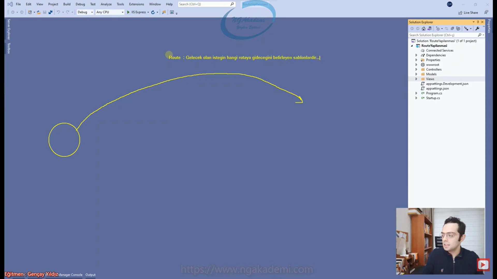
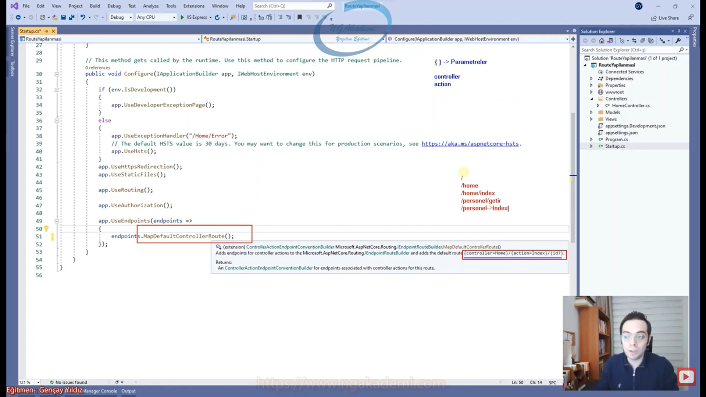
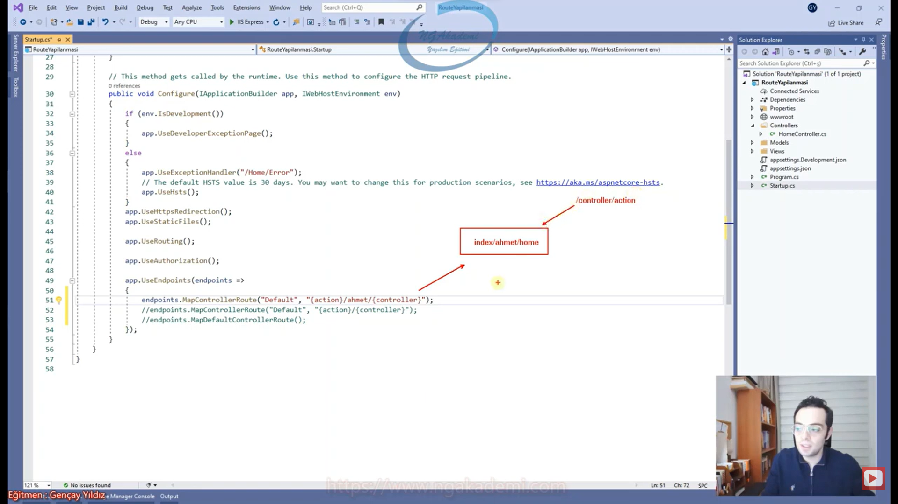
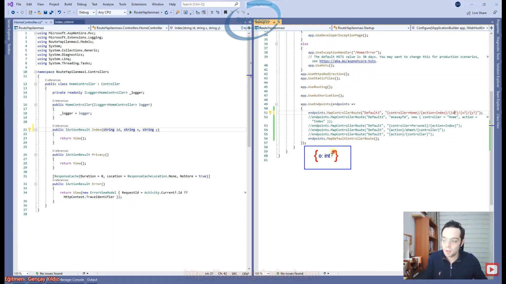
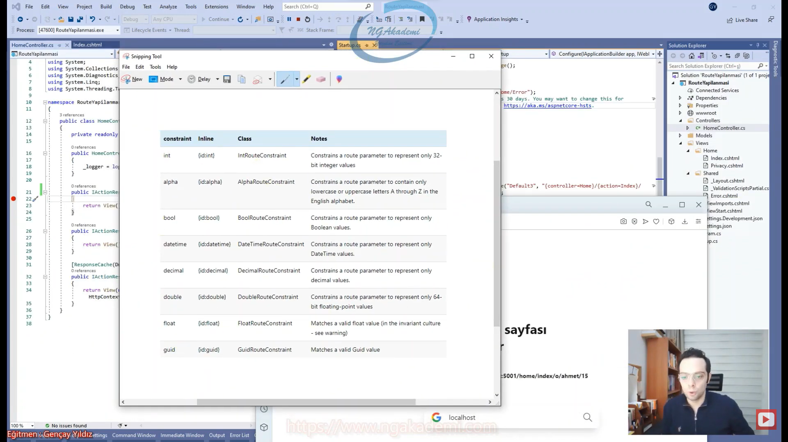
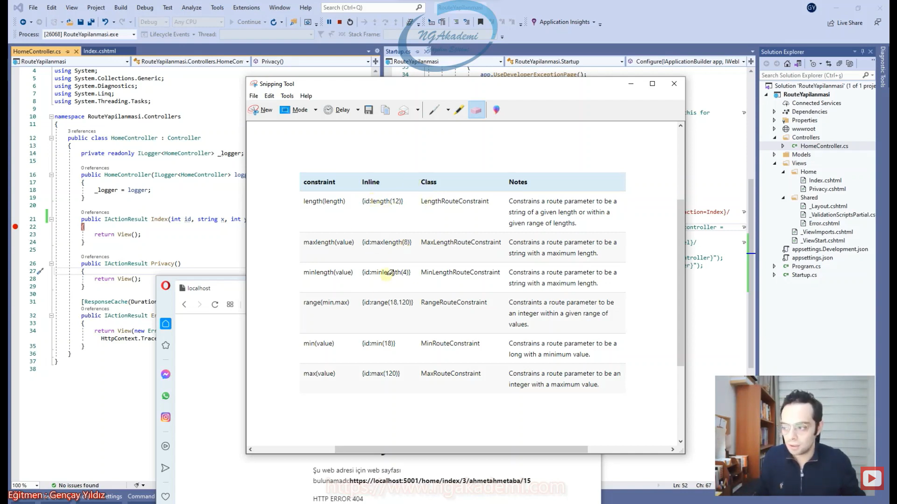
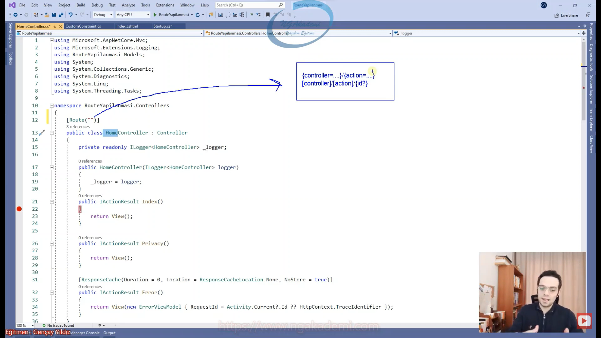
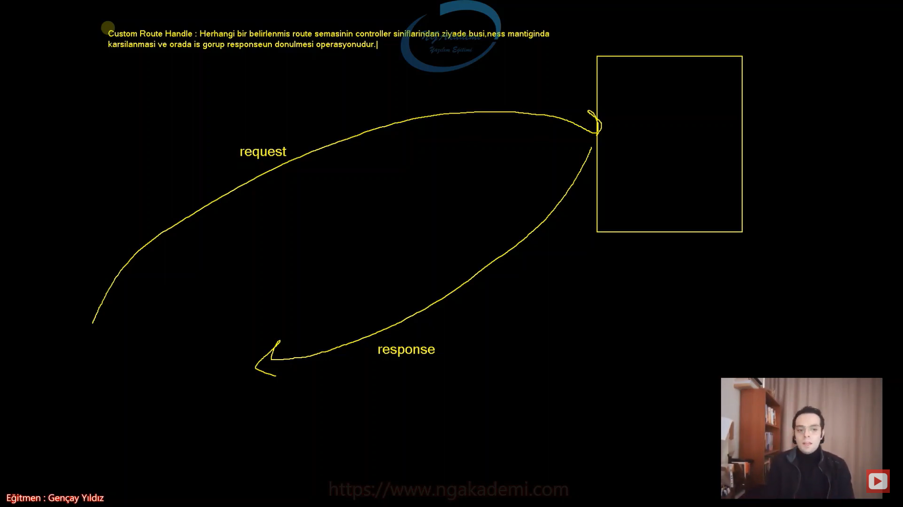

# 39) Asp.NET Core 5.0 - Derinlemesine Route Yapılanması
- Route yapılanması rotalarımızı yani gelen isteklerde hangi controller'ı tetikleyeceğimizi belirlememizi sağlayan ayırt edebilmemizi sağlayan bir mekanizmadır.

- Route web uygulamalarında önemlidir. Çünkü gelen isteğin ne şekilde yapılacağını yani rotasını belirleyen yapılanmaya biz route/rota yapılanması diyoruz. Dolayısıyla client'tan bir istek gelecek bu isteğin nereye ne şekil geleceğini bu istekteki endpoint'in rotası belirleyecektir. Onun Route şablonu belirleyecektir.

- Route: Gelecek olan isteğin hangi rotaya gideceğini belirleyen şablonlardır.



- Hatta MVC'deki karşılığı gelen istekteki bu rota üzerinden biz hangi controller'ı ayağa kaldıracağımızı yani hangisini tetikleyeceğimizi ve ona göre işlem yapacağımızı belirliyoruz. Dolayısıyla rota isteği nereye yapacağını ne şekilde yapacağını bildiren şablon. Bu istek neticesinde hangi controller'ı ayağa kaldıracağını tabiki de bilebiliyorsun ama bunu senle ben mi yapıyoruz? Hayır Asp.Net Core MVC mimarisini kullanıyorsanız eğer `program.cs` dosyasındaki `UseRooting()` middleware'i bu işlemi gerçekleştirmektedir.

- `UseRooting()` middleware'i yapısal olarak tetiklendiği zaman gelen request'teki rotaları ayırmakta ve ilgili rotaya karşılık gelen controller hangisiyse onu ayağa kaldırmakta ve gerekli action'ı tetiklemektedir.

- Otomatik bir şekilde middleware'ler tetiklenir. Ekstradan bir işlem yapmaksızın buradaki middleware'ler zaten otomatik tetiklenir. Herhangi bir istek geldiğinde. Bu tetiklenme esnasında ilgili rota ayrıştırılıp hangi controller'ın ayağa kaldırılması gerekiyorsa o işlemi o sorumluluğu o isteğe karşı cevabı verecek controller initialize ettiriliyor ve ona göre geriye sonuç döndürülüyor. İşlemler yapıp sonuçlar döndürüyor. Tabi bu süreçte senin herhangi bir şey yapmana gerek yok. Tek yapman gereken bişey var süreçte önceden rotaları tarif etmen gerek.
 
- `UseEndpoints()` middleware'i ise kendi içerisinde rotaları tutan tarif etmemizi tanımlamamızı sağlayan bir yapılanma. İşte buradaki endpoint'te de rotalarımızı tanımlayacağız.

- Gelen rotayı ayrıştırma işlemini `UseRooting()` middleware'inde gerçekleştirirken rotaları tanımlama operasyonlarını da `UseEndpoints()` middleware'inde gerçekleştirirsin.

- `endpoints.MapDefaultControllerRoute()` bu MVC mimarisinde rotalardan default olanı/tanımlanmış/ön tanımlanmış olanı bizlere sunmaktadır ve diyor ki kardeşim benim sana default olarak sağlamış olduğum controller route'la gelen istekleri eşleştiririm ben diyor ve ona göre hangi controller'ı tetikleyeceksem buradan ayırt ederim diyor.

- `{controller=Home}/{action=Index}/{id?}` default olarak bize getirmiş olduğu rotadır. 

- Bir rota oluşturuyorsanız `{}`ler rotanın içinde parametrelere karşılık gelmektedir. İsmi controller ve action geçen varsa sistem tarafından ön tanımlı parametrelerdir. Yani burada controller'a karşılık gelenin sistem/mimari tarafından mimarinin controller'larına karşılık gelen değeri taşıdığı bilinmektedir. Aynı şekilde de action hangi controller'daysak onun altındaki herhangi bir action yani metoda karşılık geldiği sistem tarafından biliniyor. Ama bunların dışında herhangi bir parametre görürsen bil ki o custom bir parametredir. Örneğin id'de olduğu gibi.

- Mimari controller'a ve action'a verilen değerleri hangi controller ve hangi action olarak algılarken yani şunu bilecek sistemdeki controller'lara bakacak ve onun altındaki action'lara bakacak bunun dışındaki diğer parametreler ise ister default'ta olsun istersen sen kendin tanımlamış ol custom parametre olarak nitelendirilecektir. Yani `/{id?}` değerini okumak ayrıdır. Bunu sistem okumaz ön tanımlı değildir.

- `endpoints.MapDefaultControllerRoute()` şeması otomatik ön tanımlı bir rota getiriyor. Ondan bahsetmiyoruz parametre öntanımlarından bahsediyoruz.

-  Yapısal olarak `endpoints.MapDefaultControllerRoute()`'u kullanıyorsanız bu `{controller=Home}/{action=Index}/{id?}` bu formatta bir rota istiyor ve rotada hangi seviye controller hangi seviye action yazacağınızı bu formatta istiyor vermiş olduğunuz değerlere göre ilgili controller'ın altındaki action'ı tetikleyecektir. 

- `{controller=Home}` eğer ki controller boş gelirse varsayılan default olarak Home `{action=Index}` action'da boş gelirse varsayılan default olarak Index'i tetikleyecektir. 

- `{controller=Home}/{action=Index}/{id?}` bu rotaya `/` isteği gönderirsem `id` nullable olduğundan dolayı zaten göndermek zorunda değilim direkt Home altındaki Index tetiklenecektir. Benzer mantıkla `/Home` controller'ı gönderir action'ı göndermezsem Home altındaki Index yine tetiklenecektir. Benzer mantıkla `/Home/Index` direkt alenen belirtirsem belirttiğim adrese göre Home altında Index'i yine tetikleyecektir. 

- `/personel/getir` burada gidecek personel varsa controller onu ayağa kaldıracak ve getir isimli action'ı arayacak varsa invoke edecektir. Daha sonra gerekli response'u alıp ilgili kullanıcıya yönlendirecek.

- `/personel` controller var personel Home'u eziyor yani oradaki default'u eziyorsun amma velakin ikincisi olmadığından dolayı action varsayılan olarak Index'e karşılık gelecek haliyle görmesende yazmasanda burada personel controller'ının altındaki Index tetiklenecektir. 



- Diyelim ki ben bu rotayı özelleştirmek istiyorum örneğin controller en sonunda alınsın istiyorum mevcut parametrelerim başta alınsın istiyorum ya da farklı araya statik olacak değerle koyup URL'i ona göre şekillendirmek istiyorum böyle bir ihtiyacımız olursa default route'lar oluşturacağız.

- `endpoints.MapControllerRoute()` fonksiyonu default'un dışında customize edilmiş rotalar oluşturmanızı sağlayan bir fonksiyondur.

- Her bir controller route'un bir ismi olmalı ve unique olmalıdır.

- `endpoints.MapControllerRoute("Default","{action}/{controller}")` eğer ki sen bu route'u baz alıyorsan bundan sonraki gelecek olan istekler önce action daha sonra controller olacak şekilde gelmesi gerekir. Aksi taktirde hedef controller'ların altındaki action'ları tetikleyemezsiniz. Customize ettiğinizde sıralama hiza şekil aradaki statik değerler her şey sana bağlı.

- `endpoints.MapControllerRoute("Default","{action}/ahmet/{controller}");` => burada ise buna göndereceğin değerler kesinlikle bu şekilde olmalı=> `index/ahmet/home` action'ı bildireceksin ardından ahmet ardından controller Böyle bir link olur ama biz genellikle kullanmayız. Genel geçer kural önce controller ardından action'dı. Bu default olandı. Sen bunu özelleştirebilirsin. İstediğin gibi saçma da olsa url'ler oluşturabilirsin.



- Eğer ki biz bunlara default değer vermezsek boş geldikleri taktirde mimari hata verecektir. Yani controller'a sen boş bir değer gönderirsen herhangi bir değer göndermezsen hop kardeşim ben neyi çalıştıracağımı bilemeyeceğim diyecek haliyle hata verecek. Ama herhangi bir değer gönderirsen bu değerler sayesinde boş gelme durumunda bunlar direkt baz alınacağından dolayı hata verilmeyecektir.

- Özelleştirilmiş rotaları daha da özelleştirmek istiyorsanız `endpoints.MapControllerRoute("Default2", "anasayfa", new { controller = "Home", action = "Index" });` bu yöntemi kullanabilirsiniz. Burada bu metodun 3. parametresine anonim olarak verdiğimiz değerler bizi kurtaracaktır. anasayfa diye bir rota oluşturdum eğer buna bir istek geliyorsa controller'ı home olan action'ı da index olan adrese gitsin. Fiziksel bir kabuklama yapmış oluyorsun. Yani sen controller = "Home", action = "Index" i tetiklerken statik bir değerle tetiklemiş oluyorsun. Bu şekilde bir kullanımda ise url üzerinde parametre almıyorsun direkt statik bir url'e arkada yönlendirmeyi sağlamış oluyorsun. Genellikle tercih edilir mi edilmez mi bilmem ama ben tercih ediyorum web uygulamalarında belirli sayfalara yönlendirme yaparken onları statikmiş gibi gösterebilmek için bu yöntemi kullanıyorum.

- Eğer ki birden fazla endpoint oluşturacaksanız yani rota tasarlayacaksanız bu rotaları özelden genele olacak şekilde sıralayın. Çünkü ilk önce özeller kontrol edilsin ki en son genele gidebilsin yani genelin geçerli olduğu durum en sonuncu durum olsun. Onun için buradaki sıralama önemlidir.

- Tanımladığımız özel/custom rotaların her birinin ismi unique olması gerekiyor aynı anda aynı isimde birden fazla rota tanımlamamanız gerekmektedir.

- Custom ya da default farketmiyor herhangi bir rotanız mevcutsa Asp.Net Core MVc mimarisinde oluşturduğunuz url'lerin her biri uygun olan rota üzerinden oluşturulacaktır.

```C#
@Html.ActionLink("Anasayfa","Index","Home")

<a asp-action="Index" , asp-controller="Home">Anasayfa</a>

// Eğer ki bir link oluşturursanız oluşturulacak link uygun olan bir rota tarafından kabuklanacaktır. Yani ya kardeşim ben bu adreslere bir link oluşturacağım buna en uygun rota hangisidir diye bakacak ve ona göre buradaki adresi oluşturacaktır.
```
- Oluşturmak için talep ettiğimiz url yapılanmasında TagHelper olur ya da HtmlHelper üzerinden talep ettiğiniz url hedef controller ve action fiziksel olarak burada rotaya sahip olduğundan dolayı otomatik olarak o controller ve action'a yönlendirilecektir.

- Dolayısıyla sizin tanımlamış olduğunuz rotaların mimari tarafından url oluştururken ve bunun gibi ekstradan işlemler yaparken baz alındığını görmüş olduk. Çünkü bir yere yönlendirme yaparkende yönlendirilecek adresi oluşturmak için tek tek elinle manuel çalışma yapmana gerek yok. Anasayfaya mı yönlendireceksin sen yine Home Index'le ilgili bir url oluşturabilirsin zaten sistemin/mimarin yine anasayfayı çıktı olarak verecektir.

- Oluşturduğumuz rotalarda tabikide farklı değerler taşıyabilmek için parametreler oluşturabilmekteyiz. `{}`ler üzerinden taşınan değerler bizim için parametre olarak değerlendiriliyor. Parametreden kasıt değişken. Yani oluşturmuş olduğun linkin üzerinde `home/index/1` 1 değeri arka planda bir id'ye karşılık gelecek şekilde bir parametre olarak nitelendiriliyor. Benzer mantıkla biz istek yaparken default'ta controller isimleri ve action isimleri değişebiliyor. Çünkü statik değer değil orası bir controller ve action parametresi olduğu için farklı controller ve action isimlerini bildirebiliyoruz. 

- Her ne kadar custom bir parametre tanımlayacak olsakta esasında ön tanımlı parametrelerle birebir aynı şekilde custom parametre tanımlayabiliyorsunuz. Burada istediğiniz kadar parametre tanımlayabilirsiniz. `endpoints.MapControllerRoute("Default3","{controller=Home}/{action=Index}/{id?}/{x?}/{y?}");`

- İlgili url üzerinde parametrelerimiz eğer nullable değilse mecbur o parametrelere belli bir değer girilmesi gerekecektir. Kah default olarak girilebilir kah manuel bir şekilde girilmesi gerekecektir. Ama gelen istekte kesinlikle o parametreye değerin gelmesi gerekecek. Ortadan birisi nullable olması çok mantıklı hareket olmayacaktır. O yüzden buradaki formatlandırma da dikkatli olunması gerekir.

- Url'den gelen parametrelerdeki değerlerin türleri normal şartlarda sistem tarafından belli olmaz yani bütün türlerin değerlerini taşıyabilecek bir parametre oluşturmuş oluyorsunuz. Dolayısıyla sen buradaki parametreye herhangi bir türde değer verebiliyorsun.

- Biz burada istediğimiz türde parametre verebiliyoruz. İlgili action tetiklendiğinde ilgili parametreleri yakalamak istiyorsanızda bu parametrelerin isimlerine karşılık gelen parametreler barındırabilir. Bu parametre isimlerine karşılık gelen property isimleri olan bir class'lada karşılama yapabilir. Biz genellikle url üzerinden gelen dataları karşılarken çok böyle profesyonel bir çalışma ya da kompleks bir çalışma yapmıyorsak direkt action'larda parametre olarak yakalıyoruz.

- Buradaki parametrelerin değerlerinin geleceği türleri bilemeyeceğimizden dolayı gönderilen değerleri en geniş türle karşılamanız doğru olacaktır. `string`le karşılamak daha doğru olacaktır. Çünkü ne gönderirsen gönder `string` oradaki değeri karşılayacak.

- Route'lardaki parametreleri belirli değerler/türlerle kısıtlayabiliyoruz. Örneğin id kesinlikle `int` olacak diyorum ve o rotada id `int`ten başka şansı kalmıyor. İşte biz buna Route Constraint'leri diyoruz.

- `{o:int?}` => Senin parametren süslü parantezin içerisinde dolayısıyla bunun içerisine vermiş olduğun örneğin o isimli parametre isminin yanına gelip türünü bildiriyorsun. İşte bu ifade sayesinde o parametresinin alacağı değerleri hangi türde olacağını bildirmiş oluyorsun. Hem türünü bildirip hem de türünü bildireceksek tür? yapacaksın



- `short`, `byte` tanımlaması yapamamaktayız. Bunlarla alakalı çok fazla teferruata gerek yok. Çünkü siz belirli parametrelerde sayısal değer taşıyacaksanız buraya `int` yazabiliyorsunuz ama `short` yazamıyorsunuz aslında. `short`'u çünkü `int` kapsadığından dolayı `int` ile karşılanmanız gerekecektir. Benzermantıkla örneğin bir parametrenin sadece `string` parametre almasını istiyorsan diğer türleri almasını istemiyorsam buraya gelip sadece `string` yazmanız doğru olmayacaktır çünkü yazmadığınız taktirde zaten bütün türler esasında `string`le ifade edilebileceğinden dolayı sen zaten buna direkt `string` özelliği tanımlamış oluyorsun.

- Burada dikkat etmen gereken nokta constraint uygularken sayısal değerlerde sadece `int` kullanabiliyoruz. `int` dışında başka bir sayısal ifadenin kullanılmadığını hata verdiğini görüyoruz gözlemliyoruz. 

- Sayısal ifadelerde `int` kullanabiliyorsun ama ondalıklı sayılarda daha farklı ondalıklı türlerde `decimal`'ı `double`'ı ve `float`'ı kullanabiliyorsun. Uniquidentifier türlerde `guid`'i kullanabiliyorsunuz. Tarihsel formatlarda tarihsel bir değer olacaksa girilecek değer `datetime`'ı kullanabiliyorsunuz. `alpha` sadece ingilizce karakterlerde ingilizce harflerden a'dan z'ye kadar olanları yalnız bunları küçük harf ya da büyük harf olacak şekilde kullanmamızı sağlayabiliyor.



- `{x:length(12)}` => Bir parametrenin kaç karakter olacağına kadar ifadeler de bildirebiliyoruz. Bu şekilde bir bildirim yaptığınızda buraya gelecek metinsel ifadenin 12 karakter olacağını bildirmiş oluyorsunuz.
    * `length(12)` => Bu değerler kaç karakter olması gerektiğini bildirebiliyoruz.



- Regex constraint'ler uygulayabiliriz.

- `{x:alpha:length(12)?}` Belirli constraint'lerde kombin yapabiliyoruz. İlgili parametre `int` olsun yahut `alpha`'nın dışında da şu kadar karakter olsun. Hem alfanumerik hem de 12 karakter olmak zorunda x parametresine gelen değer.

- `IRouteConstraint` interface'i üzerinden custom rotalar oluşturabiliyoruz.

- Rotadaki parametrelere custom constraint oluşturacaksak eğer `IRouteConstraint` interface'ini kullanmamız gerekiyor. Haliyle bu interface'i kullanmak sadece varolan bir sistemi kullanmak değil bunu bir concrete'ini yani somut nesnesine ihtiyacımız olacak.

- Custom olarak oluşturduğumuz constraint'i sistemde kullanabilmek için yapmamız gereken işlem oluştrudğumuz constrainti uygulamaya configure olarak eklemek

```C#
//**************** Custom Constraint ****************
namespace RouteYapilanmasi.Constraints
{
    public class CustomConstraint : IRouteConstraint
    {
        public bool Match(HttpContext? httpContext, IRouter? route, string routeKey, RouteValueDictionary values, RouteDirection routeDirection)
        {
            return true;
        }
    }
}
//**************** Program.cs ****************
builder.Services.Configure<RouteOptions>(options =>
{
    options.ConstraintMap.Add("custom", typeof(CustomConstraint));
});
```

- Uygulamalarımızdaki rotaları program.cs dosyasında merkezi bir hale getirip tutabilmekteyiz. Dolayısıyla rotalarımızın hepsini tek bir alanda tanımlayarak yönetebilmekteyiz. Ama bu bir yöntemdir bir tercihtir. Bir de bunun dışında ayrıyetten attribute'larla controller bazlı controller'lara özel route tanımlamaları gerçekleştirebilmekteyiz.

- Bu şekilde yapmış olduğumuz yöntem konvensiyonel yani geleneksel olarak geçmekte. Program.cs üzerinde yapılan rotalar merkezi hale getiriliyor. Biz buna geleneksel yaklaşım diyoruz. Bir de attribute ile yaklaşım var. Controller bazlı attribute üzerinden yürütülen route operasyonudur.

- Controller bazlı rota tanımlama sürecinde herhangi bir konvensiyonel rota tanımına ihtiyacımız olmayacaktır.

- Herhangi bir controller kendine ait gelecek olan istekte kendisini tetikletebileceği rotayı kendi üzerinde belirleyebilmektedir. Bunun içinde `[Route]` attribute'unu kullanmaktayiz. `[Route]` attribute'u sayesinde controller bazlı rotalarımızın şemalarını belirleyebiliyoruz.

- Bir controllera gelecek olan isteğin öncelikle controller seviyesinde hangi formatta olduğunu bildirmem lazım daha sonra da action'ı ayırt edebilmem lazım. Bunun için özelleştirilmiş bir metinsel değer de kullanabilirsiniz. Ya da ön tanımlı olan parametreleri de kullanabilirsiniz.

- Attribute tabanlı bir routing kullanıyorsan ön tanımlı özel parametrelerimiz köşeli parantezlerle tanımlanmakta `[controller]/[action]/{id?}` ama varsa bir özel parametreniz/kendime ait/custom parametrelerimiz `{}` ile tanımlanmalıdır.



- Her ne kadar `[Route]` attribute'u ile routing operasyonu gerçekleştiriyor olsak bile program.cs'te `endpoints.MapControllers()` demeniz lazım. Bu da kardeşim controller'larda gelen isteği controller'lardaki rotalarla eşleştir demiş oluyorsunuz.

- .Net Core yapılanmasında standart framework'teki API'larla MVC yapılanmasındaki controller'lar ayrıydı ama .Net Core'da bunlar birleştirildi. Yani sen MVC'de kullanmış olduğun controller'ı bizzat API'da da kullanıyorsun.

- Action'ı özelleştirmek için action bazlı tanımlama yapmamız gerekmektedir. Çünkü bir controller'da birden fazla action bulunabilir.

- Genellikle MVC yapılanmasında konvensiyonelin kullanıldığını görürsünüz. Yani geleneksel olarak bütün rota şablonları program.cs dosyasında merkezi olarak yönetilir. Ama API yapılanmalarında özellikle servis yapılanmalarında vs tüm API'lar controller bazlı route şablonlarının yapıldığını göreceksiniz.

- Temel MVC mimarisinde konvensiyonel yaklaşımı sergilerken API'larda geleneksel olarak değil Attribute üzerinden routing işlemlerini yapıyor olacağız.

## C# Examples
```C#
//************************* Controller *************************
using Microsoft.AspNetCore.Mvc;
using RouteYapilanmasi.Models;
using System.Diagnostics;

namespace RouteYapilanmasi.Controllers
{
    //[Route("[controller]/[action]")]
    [Route("ana")]
    public class HomeController : Controller
    {
        private readonly ILogger<HomeController> _logger;

        public HomeController(ILogger<HomeController> logger)
        {
            _logger = logger;
        }
        [Route("in/{id?}")]
        public IActionResult Index(int? id)
        {
            return View();
        }

        public IActionResult Privacy()
        {
            return View();
        }

        [ResponseCache(Duration = 0, Location = ResponseCacheLocation.None, NoStore = true)]
        public IActionResult Error()
        {
            return View(new ErrorViewModel { RequestId = Activity.Current?.Id ?? HttpContext.TraceIdentifier });
        }
    }
}

//************************* Program.cs *************************
using Microsoft.Extensions.DependencyInjection;
using RouteYapilanmasi.Constraints;

var builder = WebApplication.CreateBuilder(args);

// Add services to the container.
builder.Services.AddControllersWithViews();
builder.Services.Configure<RouteOptions>(options =>
{
    options.ConstraintMap.Add("custom", typeof(CustomConstraint));
});

var app = builder.Build();

// Configure the HTTP request pipeline.
if (!app.Environment.IsDevelopment())
{
    app.UseExceptionHandler("/Home/Error");
    // The default HSTS value is 30 days. You may want to change this for production scenarios, see https://aka.ms/aspnetcore-hsts.
    app.UseHsts();
}

app.UseHttpsRedirection();
app.UseStaticFiles();

app.UseRouting();

app.UseAuthorization();

app.UseEndpoints(endpoints => //Buradaki sıralama önemlidir. Özelden --> Genele
{
    //endpoints.MapControllerRoute("Default3", "{controller=Home}/{action=Index}/{id:custom}/{x:alpha:length(12)?}/{y:int?}");
    //endpoints.MapControllerRoute("Default2", "anasayfa", new { controller = "Home", action = "Index" });
    //endpoints.MapControllerRoute("Default", "{controller=Personel}/{action=Index}");
    //endpoints.MapControllerRoute("Default","{controller=Personel}/musa/{action=Index}");
    //endpoints.MapControllerRoute("Default","{action}/ahmet/{controller}");
    //endpoints.MapControllerRoute("Default","{action}/{controller}");
    //endpoints.MapDefaultControllerRoute();
    endpoints.MapControllers();
});

app.Run();

//************************* Index *************************
@{
    ViewData["Title"] = "Home Page";
}

<div class="text-center">
    <h1 class="display-4">Welcome</h1>
    <p>Learn about <a href="https://docs.microsoft.com/aspnet/core">building Web apps with ASP.NET Core</a>.</p>
</div>


@Html.ActionLink("Anasayfa","Index","Home")

<a asp-action="Index" , asp-controller="Home">Anasayfa</a>

//************************* Custom Constraint *************************
namespace RouteYapilanmasi.Constraints
{
    public class CustomConstraint : IRouteConstraint
    {
        public bool Match(HttpContext? httpContext, IRouter? route, string routeKey, RouteValueDictionary values, RouteDirection routeDirection)
        {
            var idValue = values[routeKey];
            return true;
        }
    }
}
```

# 40) Asp.NET Core 5.0 - Custom Route Handler Nedir? Nasıl İnşa Edilir?
- Standart bir web uygulamasında request response mimarisine dayalı bir şekilde iletişim sağlanır.

- Client bir tane request atar server'da bir işlem yapılır ve response olarak client'a geri döner.

- Bu mimari üzerinde client'tan gelen request'in server'da hangi alan tarafından karşılanacağını bilebilmesi için asp.net core yapılanmasında routing şemaları geliştirilmiştir.

- Routing request'in yapıldığı endpoint'in şablonuna/yapısına göre ilgili server'da hangi controller'ı ve onun altındaki hangi action'ının tetikleneceğini mimari tarafından bilinebilir hale getirir. Dolayısıyla Routing rotamızı belirlemiş oluyor. 

- Sen eğer ki yapmış olduğun bir uygulamada client'ın göndermiş olduğu örneğin product/getproducts endpoint'ine bir istek geldiğinde biliyorsun ki tüm product'ları dönmen gerekiyor. Benzer mantıkla product/addproduct geliyorsa he demek ki bir product geliyor bunu eklemen gerekiyor. İşte bu iki farklı operasyonu birbirinden ayırabilmen için rotalar üzerinde biz hareket ediyoruz ve her bir rota kendisini uygun formatına uygun bir controller altındaki action'ı tetikleme göreviyle bize eşlik etmektedir.

- Asp.net Core uygulamalarında bir request geldi gelen request'in rotasına uygun bir şekilde controller'ın tetiklenmesi lazım. Request'lerin avantajları sana hangi controller'ın hangi action'ını tetiklenebileceğini bildirebiliyorsun. Controller'larını ayırabiliyorsun. Ama dikkat request'e gelen talep neticesinde sen bir controller tetiklemek zorundasın bir yandan da dezavantajı budur. Yani biz her gelen request'i controller'la mı karşılamak zorundayız. Bir nevi evet. 

- Request'leri sadece controller'ların karşılaması bizim için ciddi manada bağlayıcı unsur. Bu demek oluyor ki kesinlikle bir controller sınıfı tasarlaman lazım ve kesinlikle belirli operasyonlar basit orta ölçekli ya da büyük/devasa operasyonlar controller'lar üzerinde gerçekleştirilmesi gerekiyor anlamına geliyor.

- Gelen istekleri direkt controller'ın dışında farklı handle sınıflarına yönlendirsek ve ilgili isteğe karşılık sonucu orada gerçekleştirip döndürsek böyle bir ihtiyacımız oldu diyelim controller'dan bağımsız çalışmamız gerekiyor. Bir şeyi handle etmem lazım bir şeyi gelen isteği gelen rotayı customize edip controller üzerinde değilde bir action üzerinde operasyon üzerinde işlemi gerçekleştirmek değilde klasik MVC'den çıkıp normal bir handle operasyonu gerçekleştirmem gerekiyor. Diyelim ki request geldi bu request sadece belirli bir image formatlandırması yapacak sadece image'in boyutunu ayarlaması gerekecek işte bunun için bir controller'ı yormanın anlamı yoktur işte buradaki anlamsızlığı ortadan kaldırma ihtiyacına istinaden Custom Route yapılanması oluşturulmuştur. Custom Route Custom rotalar oluşturmak değil burada kastedilen custom route handle operasyonu Yani rota olacak custom ya da genelleştirilmiş önemli değil olan rotanın controller'a değil custom handle edilecek sınıfa yönlendirilmesini istiyoruz.

- Custom Route Handle operasyonlarında eğer ki biz controller'dan bağımsız business mantığında direkt isteği karşılayıp operasyon gerçekleştirmek istiyorsak işte bu operasyonu gerçekleştirilmiş sınıfa özelleştirilmiş bir şekilde tanımlamamız lazım ve belirli bir endpoint'le eşleştirmemiz lazım. Biz buna Custom Route Handle(Özelleştirilmiş Rota Operasyonu) diyoruz.

- Custom Route Handle: Herhangi bir belirlenmiş route şemasının controller sınıflarından ziyade business mantığında karşılanması ve orada iş görüp response'un dönülmesi operasyonudur.

- Biz günlük hayatta ya da iş hayatında yapmış olduğumuz çalışmalarda gelen request'lerin hepsini controller'larda karşılamak istemeyebiliriz. Gelen request'leri bazen özelleştirilmiş sınıflarda karşılamak isteriz ve oralarda işlemek isteriz Böyle durumlarda gelen request'i controller'da değilde herhangi bir sınıfta karşılayıp operasyon gerçekleştirmek istiyorsanız gelecek olan request'in rotasına uygun bir tane Custom Route Handle oluşturmanız lazım yani gelen isteği hande edebileceğiniz/karşılayabileceğiniz bir sınıf oluşturmanız lazım. Dikkat bu sınıf artık bir controller değil.

- Bir resim uygulaması yaptığınızı düşünün ya da bir dosya formatlandırma uygulaması yaptığınızı düşünün belirli operasyonları belirli işlemleri controller üzerinde yapmaktansa biz bunu direkt Custom Route Handle'larla özel sınıflara dağıtabilir ve o özel sınıflar üzerinde operasyonu daha da spesifik hale getirebiliriz.

- Bir isteği özelleştirebilmek controllerdan bağımsız daha da business mantığına odaklanmış bir yapılanmada karşılayabilmek istiyorsanız Custom Route Handler oluşturmanız lazım. Tabiki de bu operasyon daha gelişmiş yapılanmalarda yani mimarisel noktalarda kullanılan bir operasyondur. Burada ne yapıyorsanız birebir zaten gelen request'i controller'da da karşılayıp uygulayabilirsiniz Ama bu işlem spesifik noktalarda uygulanır.



- Controller'lar gelen request'i karşılayıp istenen veriyi üretmekten sorumlu kıldığımız sınıflarımızdır. Dolayısıyla controller aslında zaten benim gelen isteği karşılayıp sonucu döndürmem için yeterli bir sınıftır.

- Eğer ki sen herhangi bir sayfa açacaksan ya da bir view render edeceksen ya da örneğin genel geçer repository'le vs. bunlarla veritabanından verilerini alıp kullanıcıya sunacaksan kullanıcıdan gelen verileri vs. alıp veritabanına işleyeceksen bu tarz operasyonlarda Custom Route Handler'a ihtiyacın yok. Genel geçer operasyonlarda controller'ı kullanacaksın.

- Genel geçer operasyonlarda klasik controller mekanizmasıyla gelen request'i karşılayıp gerekli operasyonu gerçekleştireceksin. 

- Genel geçer operasyonlardan kasıt authorization'lardan tut işte kullanıcı kaydından tut kullanıcıyla yapılan bütün etkileşimlerden tut bunlarda klasik controller'ları kullan onda sıkıntı yok. Ama bir operasyon aşırı derecede spesifikse orada custom route handler oluşturacaksın.

- `endpoints.Map` Map ile başlayan bütün fonksiyonlarımız bizim esasında rotalarla ilgili çalışma yapmamızı sağlayan fonksiyonlar. Öyle ya da böyle rota ayarlıyorsun.

- `endpoints.Map()` => bu da diyor ki ya kardeşim senin burada belirli controller'ların dışında ekstradan bir sınıf tasarlayıp orada request'i karşılamak istiyorsan sadece bununla çalışabilirsin. İkinci parametrede diyor ki ya kardeşim tamam bu endpointe bir istek geldiğinde biz herhangi bir controller ayağa kaldırmayacağız ama sen bu isteği karşılayacak bir tane metot tanımlamalısın buraya. İşte bu metodu da ikinci parametredeki delegasyonla sağlıyor. RequestDelegate türünden olan bu parametre sayesinde verebileceğimiz metot her neyse bu isteği bu metot karşılayacaktır. Dolayısıyla ben bu metodu herhangi bir sınıfa koyduğumda o sınıf benim için iş mantığını yürüten bir sınıf olabilir dolayısıyla bu sınıf üzerindeki yapılan operasyonlarda ilgili request'e karşılayan operasyonlar olacaktır.

- Bir delegate kendi imzasına uygun fonskiyonu temsil edebilmektedir. 

- `public delegate Task RequestDelegate(HttpContext context);` : Kardeşim ben bir delagate'im ve benim temsil edebileceğim metotlar şu tarz metotlardır;
    1. Geriye `Task` dönecek.
    2. Parametre olarakta `HttpContext` türünde bir parametre alacak.
- Geriye kalan ismi cismi önemli değil metodun ismi herhangi bir şey olabilir parametrenin ismi de herhangi birşey olabilir. Ama burada imza kısmı birebir aynı olmak zorunda. İsimler dışında imzanın iskeleti birebir aynı olmak zorunda.

- `async` ilgili fonksiyonun hani asenkron yapılanma olabileceğini temsil ediyor ve geriye Task döndürmesini sağlıyor. Kendisi otomatik bu işlemi sağlıyor.

- Program.cs'te çok fazla iş yapılır ama bu konfigürasyonlar mümkün mertebe farklı noktalarda gerçekleştirilip burada çağrılır. Burayı biz ne kadar sade tutarsak konfigürasyon yapılanmasına hakimiyetimiz o kadar sağlam olacaktır.

```C#
app.UseEndpoints(endpoints =>
{
    endpoints.Map("example-route", async c =>
    {
        //https://localhost:5001/example-route endpoint'e gelen herhangi bir istek Controller'dan ziyade direkt olarak buradaki fonksiyon tarafından karşılanacaktır.
        // Bu rotaya bir istek gönderdiğimizde ki bu istek Get olabilir Post olabilir Put olabilir herşey olabilir. Yani bu isteklerin hepsini burada sağlayabiliyorsunuz o da var. Bu istekler neticesinde istek metotların herhangi birisiyle buradaki fonksiyonu tetikleyip işlemi gerçekleştirebiliyorsun. Ne olmuş oluyor controller tetiklenmemiş oluyor ne olmuş oluyor herhangi bir controller initialize etmediğimizden dolayı ekstradan bir maliyeti de ortadan kaldırmış oluyoruz. Tabi buradaki operasyonu farklı bir sınıfa koyarsak o sınıftan initalize operasyonu sağlayacağız o da ekstradan maliyet geri dönmüş olacak ama en azından yapacağın operasyonda artık controller action controller'ın ekstradan oradan view getiriyor yok başka bir nimetleri var onları getiriyor ya bunların hiçbirini ben kullanmıyorum kardeşim ben sadece buraya gelen istek neticesinde bir operasyon yapacağım bırak sadeleştir. Sadece o operasyona odaklanmak istiyorum diyorsan işte bu şekilde çalışabilirsin.
    });

    endpoints.MapControllerRoute(
    name: "default",
    pattern: "{controller=Home}/{action=Index}/{id?}");
});
```
- https://localhost:5001/example-route endpoint'e gelen herhangi bir istek Controller'dan ziyade direkt olarak buradaki fonksiyon tarafından karşılanacaktır.
- Bu rotaya bir istek gönderdiğimizde ki bu istek Get olabilir Post olabilir Put olabilir herşey olabilir. Yani bu isteklerin hepsini burada sağlayabiliyorsunuz o da var. Bu istekler neticesinde istek metotların herhangi birisiyle buradaki fonksiyonu tetikleyip işlemi gerçekleştirebiliyorsun. Ne olmuş oluyor controller tetiklenmemiş oluyor ne olmuş oluyor herhangi bir controller initialize etmediğimizden dolayı ekstradan bir maliyeti de ortadan kaldırmış oluyoruz. Tabi buradaki operasyonu farklı bir sınıfa koyarsak o sınıftan initalize operasyonu sağlayacağız o da ekstradan maliyet geri dönmüş olacak ama en azından yapacağın operasyonda artık controller action controller'ın ekstradan oradan view getiriyor yok başka bir nimetleri var onları getiriyor ya bunların hiçbirini ben kullanmıyorum kardeşim ben sadece buraya gelen istek neticesinde bir operasyon yapacağım bırak sadeleştir. Sadece o operasyona odaklanmak istiyorum diyorsan işte bu şekilde çalışabilirsin.

- `endpoints.Map("example-route",new ExampleHandler().Handler());` example-route'a gelen request ExampleHandler() sınıfının Handler metodunda karşılandı diyelbiliriz.

- Resim denilen dosyalar web uygulamalarının olmazsa olmazıdır. Herhangi bir eticaret uygulamasında elinize aldığınızda şöyle bakıyorsunuz yani vitrinde bile ürünlerin kendilerinden önce resimleri karşımıza gelmektedir. Eğer ki bir yazılımcı resimlerle ilgili çalışmayı şu şekilde yaparsa gelenksel olarak resmin belirli bir boyutunu alıyorsun ve sunucuya koyuyorsun. Sunucuda bir tane resmin var ama sen web uygulamasında bu resmi kullanırken yeri gelecek bunu küçültmen gerekecek napıyorsun orada HTML tabanlı genişlik ve yükseklik ayarlarını veriyorsun orada ilgili resim küçültülmüş gibi gösteriyor Halbuki bakarsanız network kısmına senin yapmış olduğun istek neticesinde 10 boyutundaki resim yükleniyor sen oraya koymuşsun küçük bir şekilde ama yine 10 boyutunda yükleniyor. Halbuki arkada sunucu senin 10 boyutundaki resmini 3 boyutuna indirir 3 boyutunda olur ve sen o 3 boyutundaki dosyayı gönderir ve bu şekilde performanstan kazanmış olursun maliyeti de düşürmüş olursun. Resim boyutlandırmasını genellikle HTML tabanlı değil sunucu tabanlı yapmayı tercih ettiğimiz uygulamalar olabiliyor ve bu resim formatlandırma operasyonunu controller'larda değil(yapabilirsin) CustomRouteHandler'larda yapıyoruz. Çünkü resim boyutlandırma başka bir işlemin yok bunun için controller'a gerek yok herhangi bir controller'da kaç tane action tanımlayabilirsin ki bununla ilgili varsa öyle bir ihtiyacın yap. Ama controller'dan ziyada bunu route handler'da daha doğru daha efektif olabiliyor.
 
- Custom Route Handler dediğimiz yani gelen özelleştirilmiş rotaları handle ettiğimiz sınıflarımız metotlarımız spesifik/özel belirli durumlar için kullandığımız tekniktir.

- Bir asp.net Core uygulamasında image/video/mp3/pdf/css/js dosyaları bilmem aklına ne geliyorsa bu tarz dosyaların hepsini `wwwroot` klasörüne koymak zorundasın. `wwwroot` klasördeki dosyalara erişebilmek için `app.UseStaticFiles()` isimli middleware'i çağırman gerekiyor.

- Custom Route Handler'ları istediğimiz gibi isimlendirebiliriz.

- Custom Route Handler'larda iligli delagate uygun bir fonksiyon geriye döndürmelisiniz.

- `FileInfo` bir `system.IO` namespace'inin bir üyesidir. Haliyle herhangi bir dosyayı elde etmemizi sağlayan dosyayla ilgili bilgiler elde etmemizi sağlayan bir sınıftır.

- `MagickImage` kütüphanesi resmin boyutunu ayarlama operasyonlarını barındırıyor.

- `IDisposable` olan herhangi bir nesneyi `using` ile işaretleyebilirsiniz. İlgili fonksiyon görevini bitirdiği zaman yani fonksiyondan çıkıldığı zaman Garbage Collector ilgili nesnenin üstesinden gelecektir. Yani ilgili nesneyi imha edecektir.

- Profesyonel bir çalışmada resim boyutlandırmada/formatlandırmada querystring'ten width ve height değerleri alınır.

- Response'u eğer sen elinle manuel birşekilde tasarlıyorsan Response'su bir silersin. Bu gelenektir.

## C# Examples
```C#
//********************************************** Program.cs **********************************************
using CustomRouteHandler.Handlers;

var builder = WebApplication.CreateBuilder(args);

// Add services to the container.
builder.Services.AddControllersWithViews();

var app = builder.Build();

// Configure the HTTP request pipeline.
if (!app.Environment.IsDevelopment())
{
    app.UseExceptionHandler("/Home/Error");
    // The default HSTS value is 30 days. You may want to change this for production scenarios, see https://aka.ms/aspnetcore-hsts.
    app.UseHsts();
}

app.UseHttpsRedirection();
app.UseStaticFiles();

app.UseRouting();

app.UseAuthorization();

app.UseEndpoints(endpoints =>
{
    //endpoints.Map("example-route", async c =>
    //{
    //    //https://localhost:5001/example-route endpoint'e gelen herhangi bir istek Controller'dan ziyade direkt olarak buradaki fonksiyon tarafından karşılanacaktır.
    //    // Bu rotaya bir istek gönderdiğimizde ki bu istek Get olabilir Post olabilir Put olabilir herşey olabilir. Yani bu isteklerin hepsini burada sağlayabiliyorsunuz o da var. Bu istekler neticesinde istek metotların herhangi birisiyle buradaki fonksiyonu tetikleyip işlemi gerçekleştirebiliyorsun. Ne olmuş oluyor controller tetiklenmemiş oluyor ne olmuş oluyor herhangi bir controller initialize etmediğimizden dolayı ekstradan bir maliyeti de ortadan kaldırmış oluyoruz. Tabi buradaki operasyonu farklı bir sınıfa koyarsak o sınıftan initalize operasyonu sağlayacağız o da ekstradan maliyet geri dönmüş olacak ama en azından yapacağın operasyonda artık controller action controller'ın ekstradan oradan view getiriyor yok başka bir nimetleri var onları getiriyor ya bunların hiçbirini ben kullanmıyorum kardeşim ben sadece buraya gelen istek neticesinde bir operasyon yapacağım bırak sadeleştir. Sadece o operasyona odaklanmak istiyorum diyorsan işte bu şekilde çalışabilirsin.
    //});

    endpoints.Map("image/{imagename}", new ImageHandler().Handler(app.Environment.WebRootPath));

    endpoints.Map("example-route",new ExampleHandler().Handler());

    endpoints.MapControllerRoute(
    name: "default",
    pattern: "{controller=Home}/{action=Index}/{id?}");
});

app.Run();
//********************************************** ExampleHandler **********************************************
namespace CustomRouteHandler.Handlers
{
    public class ExampleHandler
    {
        public RequestDelegate Handler()
        {
            return async c => 
            {
               await c.Response.WriteAsync("Hello World");
            };
        }
    }
}
//********************************************** ImageHandler **********************************************
using ImageMagick;

namespace CustomRouteHandler.Handlers
{
    public class ImageHandler
    {
        public RequestDelegate Handler(string filePath)
        {
            return async c =>
            {
                FileInfo fileInfo = new($"{filePath}\\{c.Request.RouteValues["imagename"].ToString()}");
                using MagickImage magicK = new(fileInfo);

                int width = magicK.Width, height = magicK.Height;

                if (!string.IsNullOrEmpty(c.Request.Query["w"].ToString()))
                    width = int.Parse(c.Request.Query["w"].ToString());
                if (!string.IsNullOrEmpty(c.Request.Query["h"].ToString()))
                    height = int.Parse(c.Request.Query["h"].ToString());

                magicK.Resize(width, height);

                byte[]? buffer = magicK.ToByteArray();
                c.Response.Clear();
                c.Response.ContentType = string.Concat("image/", fileInfo.Extension.Replace(".", ""));

                await c.Response.Body.WriteAsync(buffer, 0, buffer.Length);
                await c.Response.WriteAsync(filePath);
            };
        }
    }
}
```