# 41) Asp.NET Core 5.0 - Middleware Nedir? Nasıl Oluşturulur?
- Client'tan gelen request neticesinde response dönene kadar olacak süreçlerin yapılacak işlemlerin sorumluluğunu üstlenen yapı middleware'dir.

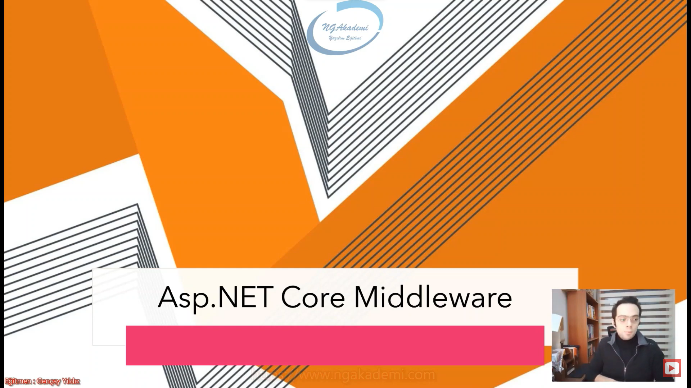

- Web uygulamasına client'tan gelen request'e karşılık verilecek response'a kadar arada farklı işlemler gerçekleştirmek ve sürecin gidişatına farklı yön vermek isteyebiliriz.

- Client bir request gönderiyor. Göndermiş olduğu bu request neticesinde sonuç olarak biz client'a response döndürüyoruz. İşte bu request neticesinde dönülen bu response sürecinde araya başka işlemler sokmak istiyorsak bunları bambaşka yöntemlerle sağlayabiliriz ama teknik olarak biz buradaki yapılanmaya middleware yapılanması diyoruz.

- Gelen request response'u dönene kadar arada farklı işlemler yapıyorsak bir başka deyişle request ile response arasına giriyorsak biz buna middleware/ara yazılım diyoruz.

- Yani geldi request'in arada bir işlem yaptın farklı işlemler gerçekleştirdin ve response'u geri döndürdün işte buradaki farklı işlemler bizim middleware'imiz olacaktır.

- Gelen istek controller iniatialize edilene kadar arada farklı işlemler yaptın controller initialize edildi. Controller'da da işlem yaptın controller'dan sonrada farklı işlemler'i devreye soktuğunu varsayalım bak controller'dan önce controller'dan sonra ve hatta controller'larında devreye sokulması hepsi ayrı bir middleware sürecidir. Yani sen request'ten response'a kadar arada hangi işlemleri yapıyorsan bunların hepsi zaten bir middleware üzerinde gerçekleşiyor.

- Controller'ın initialize edilip controller'daki komutların bile tetiklenmesi bizim için ayrı bir middleware/ara katman/ara yazılım.

- Bir web mimarisinde gelen request'le response arasına girip farklı işlemler yapıyorsanız o işlemlere biz ara yazılımlar yani middleware'ler diyoruz.

- Gelen Request'imiz var sonuç olarak response döneceğim. İşte request'ten response'u dönene kadar aradaki oluşan bütün işlemler/operasyonlar bizim için middleware.
    * Örneğin geldi isteğin adam dediki sana bütün kitapları döndür. Bütün kitapları istiyorum. O şekilde bir endpoint'e istek gönderdi. Sen naparsın direkt bütün kitapları döndürür müsün? Hayır ilk başta bir sorarsın değil mi? Yav kardeşim sen kimsin? bir authentication yaparsın değil mi? Burada bu authentication işlemini sorumluluğunu sen request'le response arasında yaptığın için ayrı bir middleware'de gerçekleştirirsin. Bir başka middleware'le authorization yaparsın dersin ki bu kitaplara erişme yetkin var mı? Bir başkasında başka bişeyi kontrol edersin? Ta ki bunların hepsi doğrulanır ya da buradaki işlemler neticesinde duruma göre request'ine ilgili result'u koyar döndürürsün. Tabiki de buradaki işlemler neticelerinden biri Asp.Net Core'daki controller'ların initialize edilmesidir. Bu da bir middleware'dir. Bu da bir middleware aracılığı ile gerçekleştirilir. Hatta `app.UseEndpoints()` sayesinde endpointlere eşleşen controller sayesinde endpoint'lere eşleşen controller'lar ayağa kaldırılmış olacaktır.

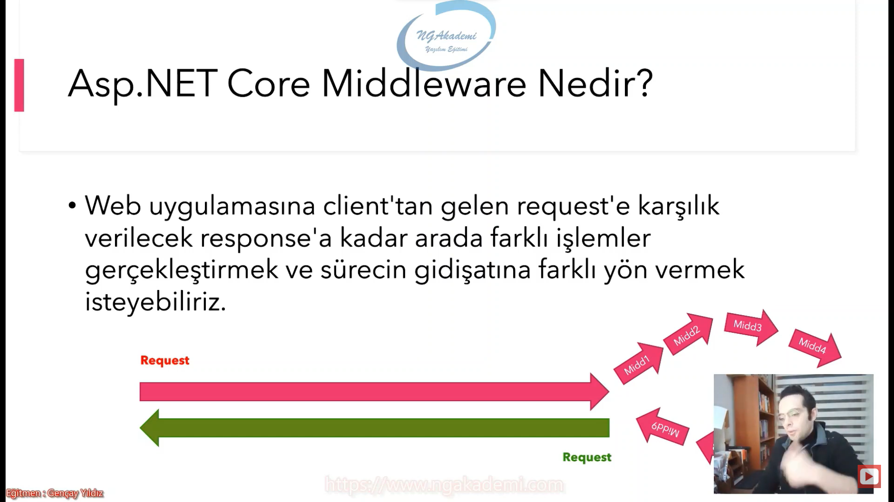

- Middleware'ler sarmal bir şekilde tetiklenirler.

- Bir middleware tetiklendiği zaman kendisi sona ermeden başka bir middleware'i tetikler ve onu bekler yani burada sarmal bir işlem söz konusudur.

- Request geldi 1.middleware'imiz tetiklendi. Buradaki işlem neyse onun yapıldığını varsay. Buradaki logic dışında 1.middleware kendisinden sonra gelen hangi middleware varsa onu next eder yani bir sonrakine geç onu tetikle der. Ama bunu dediği zaman kendisi sonlanmış olmaz hala ben devam ediyorum biraz recursive mantık var gibi düşünebilirsiniz. Benden sonraki middleware'i tetikle ben onun sonucu döndüğü zaman kendimi sonlandıracağım. Yani middleware'ler sarmal bir şekilde hareket ederler. Dolasyısyla gelen request 1.middleware next dediğinde 2.middleware'i tetikler. 1.middleware daha sonlanmadı. 2.Middleware tetiklendi. Bu da kendi logic'ini atladı next dedi sonrakini tetikledi. Bak hala ilk iki sonlanmadı. En sonuna kadar geldik diyelim middleware'den son middleware başlar logic'ini yapmaya artık herhangi bir next yapacağın middleware olmaığından dolayı kendi logic'ini tamamlar sonra bir önceki logici tamamlayarak devam eder. Bu şekilde sarmal gider ve geri gelir. Revursive mantık düşünün. C#'ta recursive fonksiyonlara girdiğinizde fonksiyon sonlanmadan kendi içerisindeki tetikliyor o da kendi içindekini tetikliyor öyle öyle gidiyor ta ki en son tetiklemede tetiklenen sırada bekleyenler tek tek tamamlanıp sonuç dönülüyor. Bunda da aynı mantık var.

- Ara yazılım dediğimiz yapılanmalarda amaç genellikle bir operasyonu gerçekleştirmekten ziyade gelen request'in sürecine/pipeline'ına bir katkıda bulunmak o süreci etkileyici kodlar oluşturmaktır. Dolayısıyla gelen request süreçten geçmeli ve bu süreç neticesinde response'u oluşturmalıdır.

- Gelen bir request'in response sürecine kadar sen burada middleware'i request girdiği zaman buradan response dönene kadar bu middleware'in sonlanmaması ya da sonlandığı zaman artık sonuç olarak response'un dönülmesi bundan sonra araya başka bir yazılımların girmemesi gerekiyor.

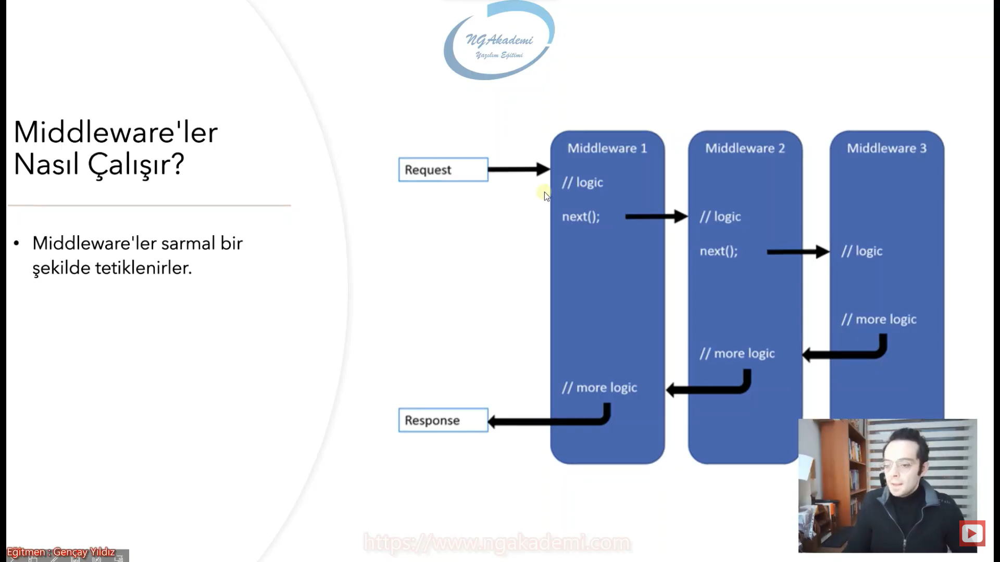

- Asp.NET Core, yapısal olarak middleware yapılanmasını destekleyen bir çekirdeğe sahiptir.

- Standart framework'te biz middleware'ler vs. böyle şeyleri devreye sokabilmek için 40 takla atıyoruz yani bambaşka yapılanma araya sokmanız lazım. Ama Asp.NET Core'da bütün çekirdek zaten middleware yapılanması üzerinden konfigüre ediliyor. Startup dosyasına giderseniz eğer startup dosyasındaki Configure fonksiyonu içerisindeki bütün fonksiyonlar bütün çalışmalar esasında bir middleware görevi görüyor.

- Bir MVC uygulamasını ayağa kaldırdığınızda direkt configure'un tetiklendiğini göreceksiniz.

- Configure fonksiyonu bizim Asp.NET Core mimarisinde uygulamada çağıracağımız bütün middleware'lerin konfigüre edildiği noktadır. Dolayısıyla buradaki middleware'ler tek tek tetiklenir. Buradaki sıralama önemlidir. Bir middleware bitmeden diğeri tetiklenir ki en sonuncuya geldiği zaman artık arka planda pipeline akış bütün middleware'leri tek tek geriye alır ondan sonra response'u geri döndürür. 

- Şimdi burada Asp.NET Core yapılanmasında middleware'leri Configure'de çağırıyoruz.

- Configure metodu içerisinde middleware'ler çağrılır. AspNET Core mimarisinde tümmm middleware'ler Use adıyla başlar...

- Midlleware'lerde tetiklenme sırası önemlidir. Çünkü bir middleware'e girdiği zaman o sonlanmadan bir diğerine giriyor bir diğerine giriyor böyle gidiyor dolayısıyla burada sıralama önemli. Onun biz genellikle Asp.NET Core yapılanmalarında örneğin Authorization işlemleri yapıyorsak önce Authentication middleware'ini çağırırız ardından Authorization middleware'ini çağırırız. Nedeni işte bu middleware'lerdeki öncelikle tetiklenme mevzusu. Oradaki sarmal davranış. Burada ilk önce Authentication yapman gerekiyor. Ardından authorization yapabilirsin. Önce senin kim olduğunu bilmem lazım ardından yetkilerini kontrol etmem lazım. Öncelikle Authentication'ın daha sonrasında Authorization'ın tetiklenmesi middleware'lerdeki bu tetiklenme sırasından kaynaklanıyor. Onun için burada middleware'lerin sıralaması çok önemli. `UseRouting()` `UseEndpoint()`'den önce gelmeli. Önce rotayı eşleştirmelisinki ardından ne olduğunu bilesin. Önce gelen rotayı bilmen lazım rotaları ayağa kaldırman lazım ardından hangi controller'ın tetikleneceğini bilebilirsin. Rotaları önce ayıracan sonra controller. Cors politikalarını belirlerken Routing'ten önce Cors politikalarını belirlenmesi gerekiyordu. Oradaki o `UseCors()` middleware'ini kullanırken `UseRouting()`'ten önce  belirlememiz gerekiyor.

- İşte buradaki request sürecindeki davranışların ne şekilde olacağını middleware'lerdeki işlevsel davranış önceliği belirliyor.

- Sen bir iş yapıyorsun öncelikle yağmuru kontrol edip daha sonra şemsiyeyi çıkarır açarsın değil mi?

- Middleware'de her ikisini random bir şekilde sıralayamazsın önce yağmuru kontrol edecek middleware'i tamamlaman/çağırman lazım ardından şemsiyeyi açacak middleware'ini çağırman lazım. Aksi taktirde buradaki sıralamayı değiştirirsen tamam çalışır önce şemsiyeyi açarsın daha sonrada kontrol edersin yağmuru ama bak tezatlığa bak şemsiyeyi açtığından dolayı zaten yağmuru kontrol bile edemezsin e hadi yağmur yağmıyorsa boşuna şemsiyeyi açmış olursun vs.

- Sıralamaları burada önemsemezseniz eğer hatalara kadar özellikle mantıksal hatalara kadar gidecektir. 

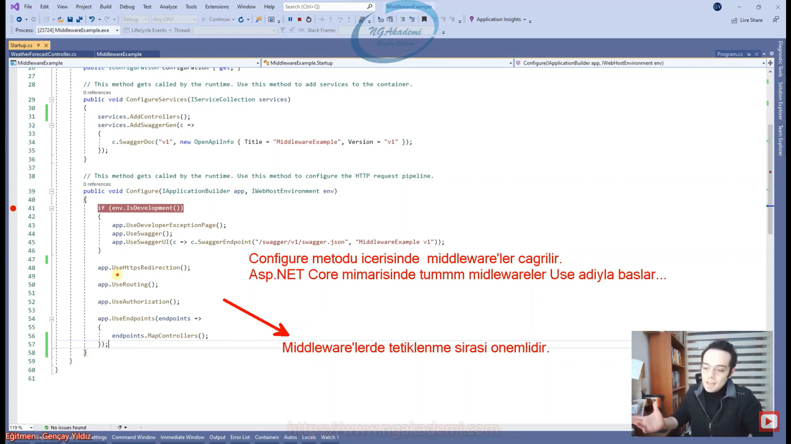

- `app.UseDeveloperExceptionPage()` => Bizim herhangi bir hata alındığında ExceptionPage'in kullanılıp kullanımayacağı oraya yönlendirip yönlendirilmeyeceğini bildiren bir middleware.
- `app.UseSwagger()` => Bir tane kütüphanemiz var API'daki endpointleri hızlı bir şekilde bize sunan. Bununla ilgili aktivasyon yapabilmemiz için bunu tetiklememiz gerekiyor.
- `app.UseSwaggerUI()` => Swagger'ın UI kısmı yani dashboard'ını bize sunar.
- `app.UseRoting()` => Route işlemlerinde gelen rotanın ayrılmasını sağlayan bir middleware
- `app.UseAuthorization()` => Kullanıcı yetkilerini kontrol eden kullanıcı yetkilerini check eden bir middleware.
- `app.UseEndpoints()` => Gelen endpointlerle map'leri eşleştirmemizi sağlayan bir middleware.

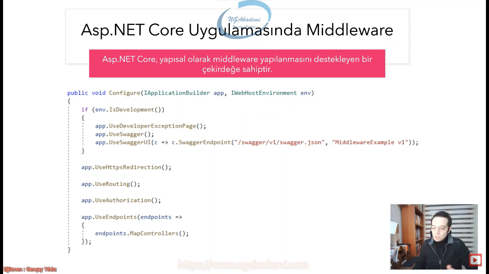

- Hazır Middleware'ler
    * `Run`
    * `Use`
    * `Map`
    * `MapWhen`

- Hazır middleware'ler içinde ekstradan bir işlem yapılan middleware'ler değil. Sen işlem yapmadığın sürece kendisi arka planda bir işlem yapmaz. Sen ekstradan hazır buradaki middleware'ler belirli davranışlara göre işlem yapabiliyorsun. 

- Asp.NET Core yapılanmasında 4 tane çekirdekte middleware geliyor. Bunlar içi boş senin doldurabileceğin ve farklı davranışlar sergileyen middleware'ler

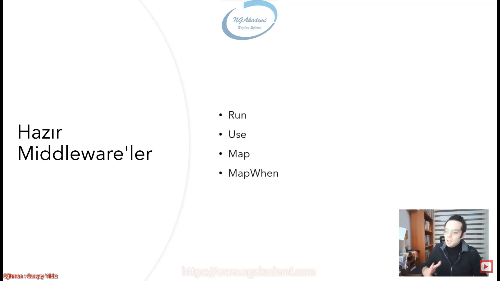

- `Run` fonksiyonu kendinden sonra gelen middleware'i tetiklemez!

- Diyelim ki bir operasyon yapacağız. Yapacağımız operasyonda gelen bir request'imiz olacak diyelim ki requestimiz geldi 1.middleware'i tetiledik 2.middleware eğer run'sa bu gelip 3. tetikleyemeyecektir. Burada kalacaktır.

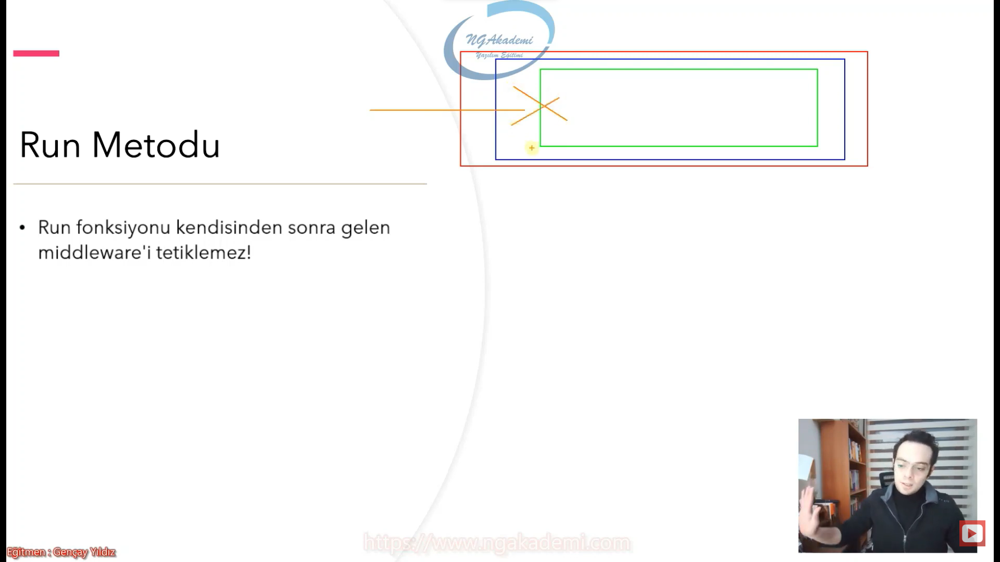

- Kendisinden sonra hanig middleware tanımlandıysa `Run()` fonksiyonuyla yapılan işlem operasyon kendisinden sonraki middleware'i tetiklemez e haliyle tetiklemediği için pipeline devam etmez direkt sonucu çıktıyı orada verecektir. Yani kendisinden sonrakini tetiklemeyeceğinede göre artık devam edecek. Kendisini tamamlayıp bundan sonra o noktaya kadar gelen bütün middleware'ler tamamlanacaktır. `Run()`dan sonra geri döner.

- Dolayısıyla kullanıldığı yerden sonraki middleware'ler tetiklenmeyeceğinden dolayı akış kesilecektir.

- Akışı kesmek istiyorsan yapacağın operasyon çok böyle spesifikse ve ondan sonraki middleware'lerin tetiklenmesini istemiyorsan `Run()` fonksiyonuyla operasyon gerçekleştirebilirsin. Biz buna bu etkiye kendisi akıştaki sonraki middleware'leri tetiklememesine Short Circuit diyoruz. Kısa devre yapan fonksiyondur bu middleware'dir.

- Bu etkiye Short Circuit(Kısa Devre) denir.

- İlk `Run()` fonksiyonu tetiklenecek sonrakiler tetiklenmeyecektir.

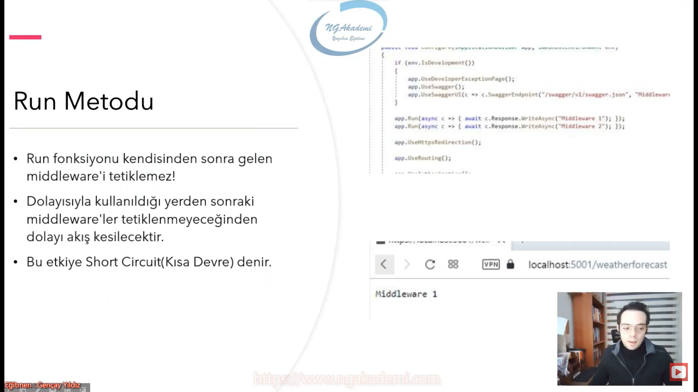

```C#
app.UseHttpsRedirection();

app.Run(async context =>
{
    await Console.Out.WriteLineAsync("Run Middleware");
});

app.UseStaticFiles();

app.UseRouting();

app.UseAuthorization();

app.MapControllerRoute(
    name: "default",
    pattern: "{controller=Home}/{action=Index}/{id?}");

app.Run();
```

- `Run()` metoduna nazaran, devreye girdikten sonra süreçte sıradaki middleware'i çağırmakta ve normal middleware işlevi bittikten sonra geriye dönüp devam edebilen bir yapıya sahiptir.

- Bildiğiniz sıradan gayet sade bir middleware'dir.

- `Use()` ikinci parametre alır. Burada yapısal olarak bu parametrede kendisinden bir sonra gelen middleware'i temsil edecek. Sen yapmış olduğun logic'te operasyonda/business'ta/işlemde her neyse bir yerden sonra eğer ki bir sonraki middleware'i tetiklemek istiyorsan buradaki parametresi üzerinden `Invoke()` demen yeterlidir. Bu parametre kendinden bir sonraki metodu temsil eden bir delegate'tir. Dolayısyla `Invoke()` ettiğinizde ilgili fonksiyonu tetikleyecektir.

- Sistem zaten mantığı bildiğinden dolayı İkinci parametre otomatik olarak kendisinden sonra gelen metot hangisiyse onu temsil edecektir. `Invoke()` demezsen sonraki metot tetiklenmez! Senin bir sonraki metodu tetikletebilmen için `Invoke()` etmen lazım. Kendi içinde bir sonraki metodu `Invoke()` ederek çalışır yani iradesiyle `Invoke()` etmesi gerekiyor. 

- `Run()` fonksiyonu neden kendinden sonraki middleware'leri tetiklemiyor? Çünkü içinde next yok benden sonrakini tetikle diyebilecek bir tane parametresi yok. Yani o parametreyle kendisinden sonra gelecek olan middleware'i temsil eden bir parametresi yok.

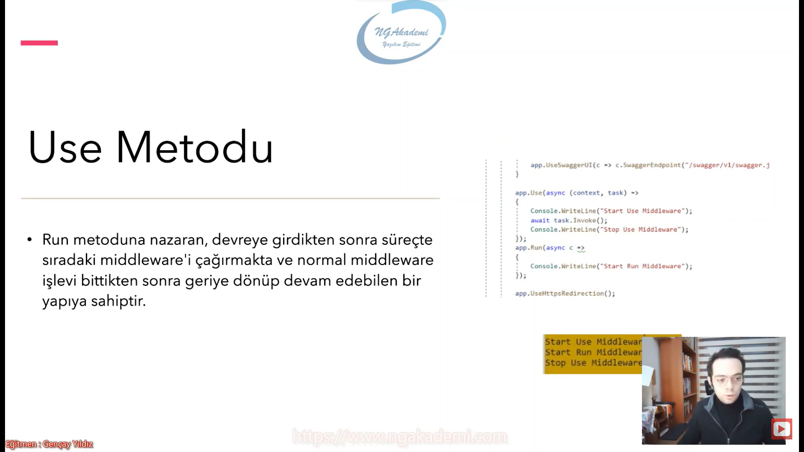
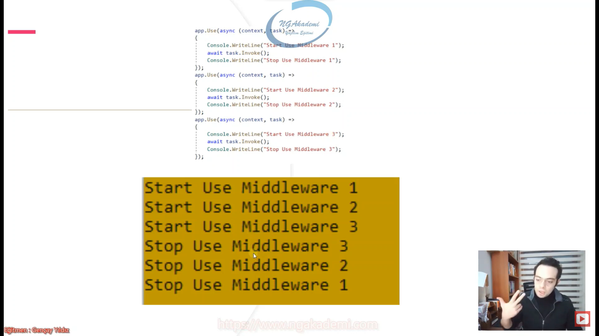

```C#
app.UseHttpsRedirection();

app.Use(async (context, next) =>
{
    await Console.Out.WriteLineAsync("Start Use Middleware");
    await next.Invoke();
    await Console.Out.WriteLineAsync("Stop Use Middleware");
});

app.Run(async context =>
{
    await Console.Out.WriteLineAsync("Run Middleware");
});

app.UseStaticFiles();

app.UseRouting();

app.UseAuthorization();

app.MapControllerRoute(
    name: "default",
    pattern: "{controller=Home}/{action=Index}/{id?}");

app.Run();
```

- Bazen middleware'i talep gönderen path'e göre filtrelemek isteyebiliriz. Bunun için `Use()` ya da `Run()` fonksiyonlarında if kontrolü sağlayabilir yahut `Map()` metodu ile daha profesyonel işlem yapabiliriz.

- Şu path'e herhangi bir istek geliyorsa şu middleware'i çalıştır ya da şu operasyonu gerçekleştir. Yok eğer bu path'e istek geliyorsa şu operasyonu gerçekleştir demen gerekebiliyor. İşte böyle durumlarda istersen `Use()` ya da `Run()` metotlarını kullanarak içerisinde akış kontrol mekanizmalarını kullanarak gerekli operasyonları yapabilirsiniz. Amma velakin middleware'in gelen talebin Path'ine göre filtrelemek istediğinizde `Map()` fonksiyonunu kullanmanız daha profesyonel işlem yapmanızı sağlayacaktır.

- `Map()` fonksiyonu filtreleme operasyonlarında kullandığımız bir fonksiyondur.

- `Map()` fonksiyonunu kullanıyorsanız sadece gelen request'in path'ine göre filtreleme yaparsın.

- Gelen request'in hangi endpoint'e olduğuna göre farklı middleware'leri devreye sokarak farklı davranışlarla ilgili request'i karşılayabiliyoruz. Bu amaçla kullandığımız bir fonksiyondur.

- Gelen talebin path'ine göre filtreleme yapmak istiyorsanız ve bu filtreleme neticesinde bambaşka middleware'leri devreye sokmak istiyorsanız `Map()` fonksiyonunu kullanabilirsiniz.

```C#
app.Use(async (context, next) =>
{
    await Console.Out.WriteLineAsync("Start Use Middleware 1");
    await next.Invoke();
    await Console.Out.WriteLineAsync("Stop Use Middleware 1");
});
app.Map("/weatherforecast", builder =>
{
    builder.Run(async c => c.Response.WriteAsync("Run middleware'i tetiklendi"));
});
app.Map("/home", builder =>
{
    builder.Use(async(context, task) =>
    {
        await Console.Out.WriteLineAsync("Start Use Middleware 1");
        await task.Invoke();
        await Console.Out.WriteLineAsync("Stop Use Middleware 1");
    });
});
```

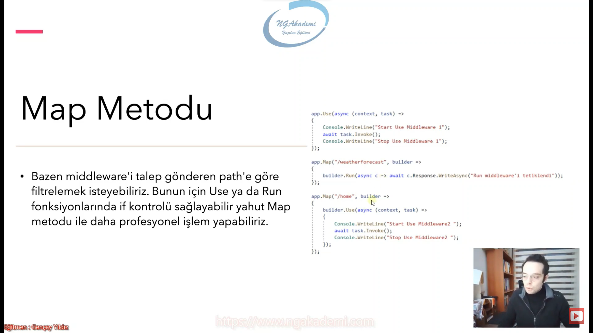

- `Map()` metodu ile sadece request'in yapıldığı path'e göre filtreleme yapılırken, `MapWhen()` metodu ile gelen request'in herhangi bir özelliğine göre bir filtreleme işlemi gerçekleştirilebilir.

- `Map()`te sadece gelen request'in path'ine göre/endpoint'ine göre filtreleme yapıyorsun. `MapWhen()` kullanıyorsan eğer gelen request'in herhangi bir özelliğine göre filtreleme işlemini sağlayabiliyorsun.

- Birinci parametre artık direkt path'in ismini almıyor direkt bir context alan bir func fonksiyon delagate alıyor. Tanımladığımız lambda metodu ile ilgili context'e gelen herhangi bir değerin üzerinde yapmış olduğumuz filtreleme üzerinden istediğim middleware'i devreye sokabiliyorum.

- Genellikle kullanacağımız yapılar bizim için `Run()` ve `Use()` fonksiyonları olacaktır.

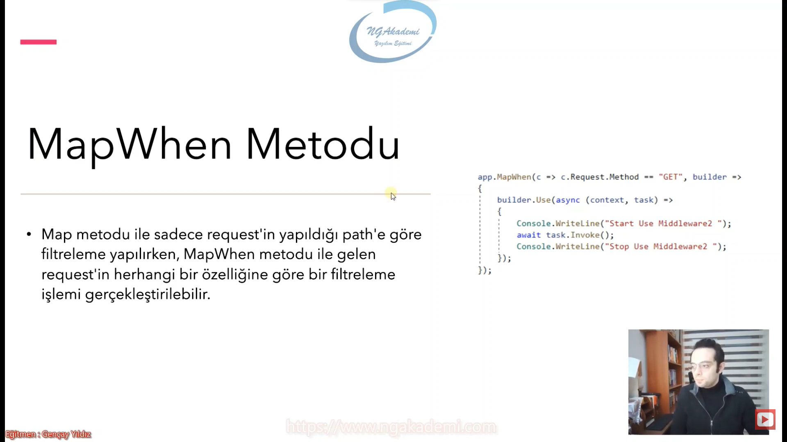

```C#
app.MapWhen(c => c.Request.Method == "GET", builder =>
{
    builder.Use(async (context, task) =>
    {
        await Console.Out.WriteLineAsync("Start Use Middleware 1");
        await task.Invoke();
        await Console.Out.WriteLineAsync("Stop Use Middleware 1");
    });
});
```

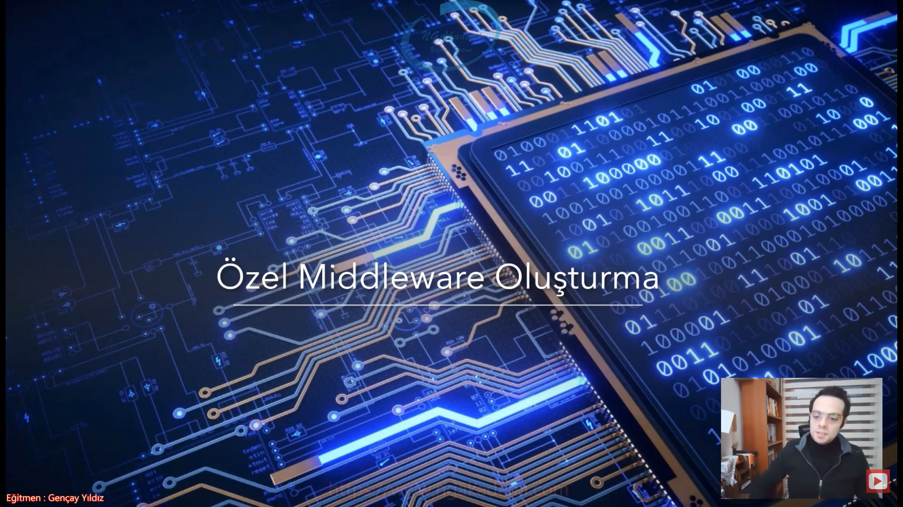

- Esasında özel bir özel middleware oluşturabilmek için yapmamız gereken fonksiyonları kullanmanız yeterli olacaktır. Ama biz daha özelleştirilmiş bir metot bir middleware üzerinden seyretmek istiyorsak bunu ayrı bir sınıf üzerinde de gerçekleştirebiliriz.

- sınıfsal olarak program.cs'teki metotlar gibi tasarlayacaksam yapmam gereken şudur: Bunu bir ayrı sınıfta davranışsal olarak tasarlayabilir extension fonksiyon olarakta burada çağırabilirim.

- Hangi middleware olursa olsun hepsi app parametresi üzerinden çağrılmış. Demek ki ben yazacağım middleware'i burada extension olarak `IApplicationBuilder`'a dahil edersem buradan çağırabilir ve mimarinin genel sistemin standardına ayak uydurabilirim.

- Sen istersen burada ilgili fonksiyonlarla gelip burada middleware işlemini gerçekleştirebilirsin. Amma velakin bizim best practice konularımız olacak Startup/program.cs dosyasının içini mümkün mertebe sade tut. Ne kadar sade tutarsan o kadar best practice açısından tasdiklenecek bir kod yazmış olursun. Dolayısıyla bizim program.cs'te yazacağımız kodlar mümkün mertebe farklı sınıflara dağıtılmış olması gerekiyor ki genel tavsiyelere/prensiplere best practice'lere uyabilelim. Bizim daha temiz burayı tutmamız hem bize yarayacaktır hem de bizim dışımızda başka birinin kodu yorumlamasına yarayacaktır. Dolayısıyla sen bir middleware oluşturacaksan burada oluşturma bunu başka bir yerde oluştur buradan çağır.

- Oluşturduğum middleware tetiklendiğinde kendi logic'ini yaptıktan sonra kendisinden sonra gelecek olan middleware'i tetikleyebilmesi lazım. Öncelikle kendisinden sonra gelecek olan middleware'i tetikleyebilmesi için o middleware'i işaretleyecek olan delegate'i burada tanımlamamız gerekiyor. Bunun için constructor'ı kullanabiliriz.

- Oluşturacağımız middleware içerisinde kesinlikle `public async Task Invoke(HttpContext context)` imzasında bir metot olması gerekiyor.
    * Bu middleware'den bir önceki middleware'in bunu tetikleyebilmesi için o middleware'in içerisinde olacak `RequestDelegate`'in temsil edebileceği uygun bir imzada metot bu. Yani bir önceki middleware'deki `RequestDelegate`'in bunu tetikleyebilmesi için o delagete'e uygun bir imza oluşturmuş olduk.

- 

```C#
public class HelloMiddleware
{
    RequestDelegate _next;
    public HelloMiddleware(RequestDelegate next)// Senden sonraki/bir sonraki next edeceğimiz hani invoke'layacağımız middleware'i sen ilk önce buradan bir karşıla. RequestDelegate olarak. Mimarimiz kendisi bu parametreye değeri verecek. Kendisi HelloMiddleware'in kullanıldığı noktadan sonra gelen middleware varsa eğer next'e otomatik onu kendisi verecektir benim ekstradan bişey yapmama gerek yok. Ama tetikleme işlemini gerçekleştirebilmem için burada operasyonel açıdan şöyle bir yaklaşım belirlemem gerekiyor: Dependency Injection yaparak değeri/diğer middleware'i elde ettim.
    {
        _next = next;
    }

    public async Task Invoke(HttpContext httpContext)//Bu middleware'den bir önceki middleware'in bunu tetikleyebilmesi için o middleware'in içerisinde olacak `RequestDelegate`'in temsil edebileceği uygun bir imzada metot bu. Yani bir önceki middleware'deki `RequestDelegate`'in bunu tetikleyebilmesi için o delagete'e uygun bir imza oluşturmuş olduk. Benim CustomMiddleware'imde yapacağım operasyonu burada yapacağım.
    {
        //Custom operasyon...

        await Console.Out.WriteLineAsync("Selamun aleykkkümmmmmm");
        await _next.Invoke(httpContext);//Oluşturmuş olduğumuz middleware içerisinde eğer ki ben bir sonraki metodu/middleware'i invoke etmezsem Short Circuit'e sebep olurum. Burada da bir kısa devre olur. Haliyle ben bir sonrakini invoke ediyorum ki devam etsin. kısa devre olmasın.
        await Console.Out.WriteLineAsync("Aleykümselam...");
    }
}
```

- Artık bu middleware'i sisteme extension olarak dahail etmem gerekiyor.

```C#
static public class Extension//Extension fonksiyonların hangi sınıfta bulundukları önemli değildir.
{
    public static IApplicationBuilder UseHello(this IApplicationBuilder applicationBuilder)//Hangi middleware'e bakarsanız bakın geriye genellikle IApplicationBuilder döndürür. Standart bu şekildedir.Adam diyor ki ben middleware'i eklediğim `IApplicationBuilder` neyse ben onu geri döndürüyorum ki sen istiyorsan fluent bir çalışma yapabil. Yani noktalarla .. diyerek middleware'leri ekleyebil diyor. Çalışılabilir formatta middleware geriye döndürüyor ki böyle bir standartımız var. İstersen başka bişey de döndürebilirsin burada.
    {
        return applicationBuilder.UseMiddleware<HelloMiddleware>();
    }
}
```

- `await _next.Invoke(httpContext);` Oluşturmuş olduğumuz middleware içerisinde eğer ki ben bir sonraki metodu/middleware'i invoke etmezsem Short Circuit'e sebep olurum. Burada da bir kısa devre olur. Haliyle ben bir sonrakini invoke ediyorum ki devam etsin. kısa devre olmasın.

- 


## C# Examples 
```C#
//********************************* Program.cs *********************************
using MiddlewareExample.Extensions;
using static System.Net.Mime.MediaTypeNames;

var builder = WebApplication.CreateBuilder(args);

// Add services to the container.
builder.Services.AddControllersWithViews();

var app = builder.Build();

// Configure the HTTP request pipeline.
if (!app.Environment.IsDevelopment())
{
    app.UseExceptionHandler("/Home/Error");
    // The default HSTS value is 30 days. You may want to change this for production scenarios, see https://aka.ms/aspnetcore-hsts.
    app.UseHsts();
}

app.UseHttpsRedirection();

#region Run
//app.Run(async context =>
//{
//    await Console.Out.WriteLineAsync("Run Middleware");
//});
#endregion
#region Use
//app.Use(async (context, next) =>
//{
//await Console.Out.WriteLineAsync("Start Use Middleware");
//await next.Invoke();
//await Console.Out.WriteLineAsync("Stop Use Middleware");
//});
//app.Run(async context =>
//{
//    await Console.Out.WriteLineAsync("Run Middleware");
//}); 
#endregion
#region Map
//app.Use(async (context, next) =>
//{
//    await Console.Out.WriteLineAsync("Start Use Middleware 1");
//    await next.Invoke();
//    await Console.Out.WriteLineAsync("Stop Use Middleware 1");
//});
//app.Map("/weatherforecast", builder =>
//{
//    builder.Run(async c => c.Response.WriteAsync("Run middleware'i tetiklendi"));
//});
//app.Map("/home", builder =>
//{
//    builder.Use(async(context, task) =>
//    {
//        await Console.Out.WriteLineAsync("Start Use Middleware 1");
//        await task.Invoke();
//        await Console.Out.WriteLineAsync("Stop Use Middleware 1");
//    });
//});

//app.Run(async context =>
//{
//    await Console.Out.WriteLineAsync("Run Middleware");
//});
#endregion
#region MapWhen
//app.MapWhen(c => c.Request.Method == "GET", builder =>
//{
//    builder.Use(async (context, task) =>
//    {
//        await Console.Out.WriteLineAsync("Start Use Middleware 1");
//        await task.Invoke();
//        await Console.Out.WriteLineAsync("Stop Use Middleware 1");
//    });
//});
#endregion

app.UseStaticFiles();

app.UseRouting();

app.UseHello();

app.UseAuthorization();

app.MapControllerRoute(
    name: "default",
    pattern: "{controller=Home}/{action=Index}/{id?}");

app.Run();
//********************************* HelloMiddleware *********************************
namespace MiddlewareExample.Middlewares
{
    public class HelloMiddleware
    {
        RequestDelegate _next;
        public HelloMiddleware(RequestDelegate next)// Senden sonraki/bir sonraki next edeceğimiz hani invoke'layacağımız middleware'i sen ilk önce buradan bir karşıla. RequestDelegate olarak. Mimarimiz kendisi bu parametreye değeri verecek. Kendisi HelloMiddleware'in kullanıldığı noktadan sonra gelen middleware varsa eğer next'e otomatik onu kendisi verecektir benim ekstradan bişey yapmama gerek yok. Ama tetikleme işlemini gerçekleştirebilmem için burada operasyonel açıdan şöyle bir yaklaşım belirlemem gerekiyor: Dependency Injection yaparak değeri/diğer middleware'i elde ettim.
        {
            _next = next;
        }

        public async Task Invoke(HttpContext httpContext)//Bu middleware'den bir önceki middleware'in bunu tetikleyebilmesi için o middleware'in içerisinde olacak `RequestDelegate`'in temsil edebileceği uygun bir imzada metot bu. Yani bir önceki middleware'deki `RequestDelegate`'in bunu tetikleyebilmesi için o delagete'e uygun bir imza oluşturmuş olduk. Benim CustomMiddleware'imde yapacağım operasyonu burada yapacağım.
        {
            //Custom operasyon...

            await Console.Out.WriteLineAsync("Selamun aleykkkümmmmmm");
            await _next.Invoke(httpContext);//Oluşturmuş olduğumuz middleware içerisinde eğer ki ben bir sonraki metodu/middleware'i invoke etmezsem Short Circuit'e sebep olurum. Burada da bir kısa devre olur. Haliyle ben bir sonrakini invoke ediyorum ki devam etsin. kısa devre olmasın.
            await Console.Out.WriteLineAsync("Aleykümselam...");
        }
    }
}
//********************************* Extension *********************************
using MiddlewareExample.Middlewares;

namespace MiddlewareExample.Extensions
{
    static public class Extension//Extension fonksiyonların hangi sınıfta bulundukları önemli değildir.
    {
        public static IApplicationBuilder UseHello(this IApplicationBuilder applicationBuilder)//Hangi middleware'e bakarsanız bakın geriye genellikle IApplicationBuilder döndürür. Standart bu şekildedir.Adam diyor ki ben middleware'i eklediğim `IApplicationBuilder` neyse ben onu geri döndürüyorum ki sen istiyorsan fluent bir çalışma yapabil. Yani noktalarla .. diyerek middleware'leri ekleyebil diyor. Çalışılabilir formatta middleware geriye döndürüyor ki böyle bir standartımız var. İstersen başka bişey de döndürebilirsin burada.
        {
            return applicationBuilder.UseMiddleware<HelloMiddleware>();
        }
    }
}
```