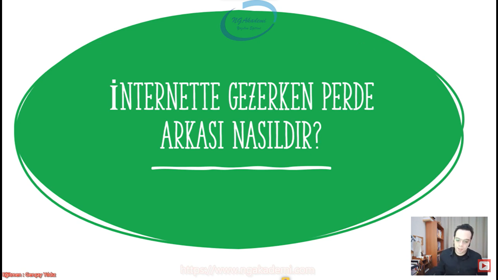
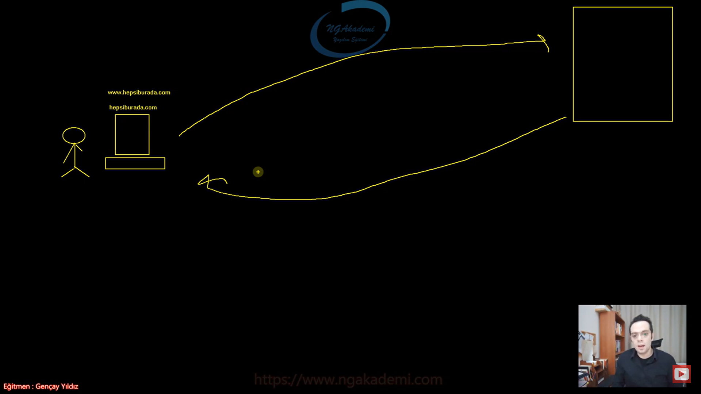
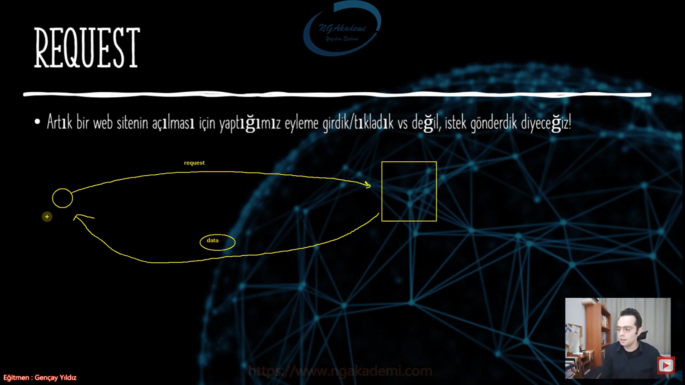

***
# 3) Asp.NET Core 5.0 - İnternette Gezerken Perde Arkası Nasıldır

- İnternette gezinti yaparken sen hepsiburada.com'a girmek istiyorsun diyelim. Direkt tarayıcı üzerinde www.hepsiburada.com yazıyorsun. En nihayetinde burada enter tuşuyla birlikte ilgili hedef siteye girmiş oluyorsun.

- İnternette girme ya da tıklama yoktur. Request/ istek atılır ve Response/cevap alınır. Sen kullanıcı olarak ilgili hepsiburada.com'a request atarsın bu request'i karşılayacak server dediğimiz mekanizma var. Orada karşıladıktan sonra sana ilgili sonucu üretir bu sonucu döndürür ve tarayıcında sen bu sonucu görmüş olursun.

- İnternetteki temeldeki mekanizma request response mantığına dayanır. Yani sen istek gönderirsin istek neticesinde server dediğimiz alan/mekanizma/kısım isteğe karşılık olan cevabı üretir ve yeniden sana gönderecektir. Buna da response denir.

- Artık bir web sitenin açılması için yaptığımız eyleme girdik/tıkladık vs değil, istek gönderdik diyeceğiz!

- Sen bir birey olarak bir web sitesine istek gönderirsin ilgili sunucuya. Sunucu sana istek neticesinde doğru cevabı yani response'u döndürecektir. İşte request dediğimiz olay senin isteğindir. Örneğin işte en çok satılan ürünleri istiyorum, triko kazak istiyorum yok işte ahmet değerinin sonuçlarını istiyorum hep bunları istiyorsun request atıyorsun bunlarla ilgili ve sana sonuçta her daim data olarak geri dönecektir. Tarayıcına yüklenecek ve sende bunlarla ilgili işlemlerini yapıyor olacaksın.

