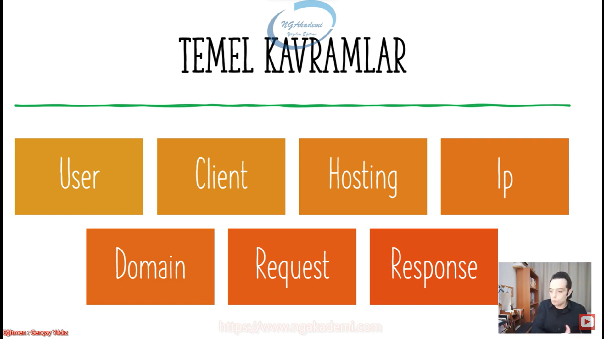
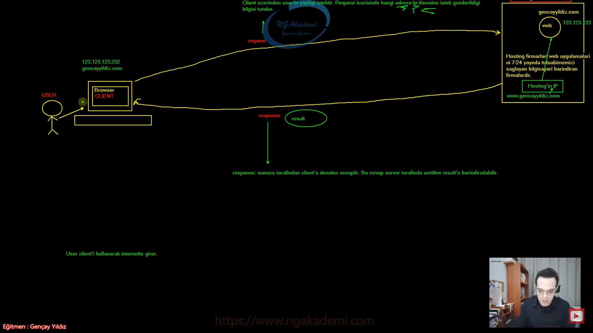
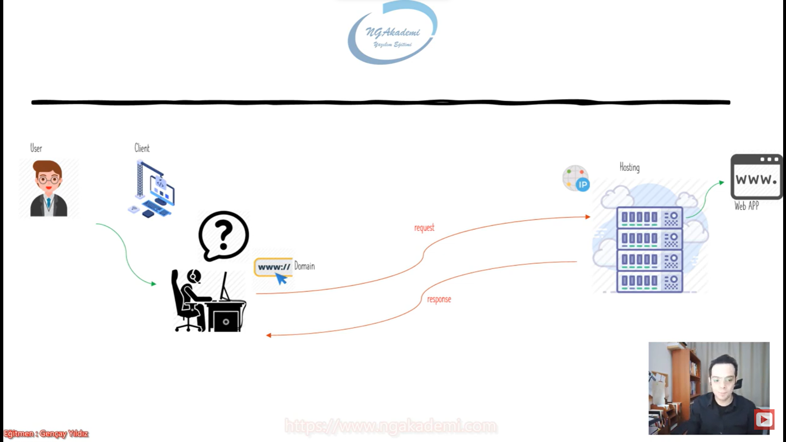

***
# 3) Asp.NET Core 5.0 - İnternette Gezerken Perde Arkası Nasıldır

- İnternette gezinti yaparken sen hepsiburada.com'a girmek istiyorsun diyelim. Direkt tarayıcı üzerinde www.hepsiburada.com yazıyorsun. En nihayetinde burada enter tuşuyla birlikte ilgili hedef siteye girmiş oluyorsun.

- İnternette girme ya da tıklama yoktur. Request/ istek atılır ve Response/cevap alınır. Sen kullanıcı olarak ilgili hepsiburada.com'a request atarsın bu request'i karşılayacak server dediğimiz mekanizma var. Orada karşıladıktan sonra sana ilgili sonucu üretir bu sonucu döndürür ve tarayıcında sen bu sonucu görmüş olursun.

- İnternetteki temeldeki mekanizma request response mantığına dayanır. Yani sen istek gönderirsin istek neticesinde server dediğimiz alan/mekanizma/kısım isteğe karşılık olan cevabı üretir ve yeniden sana gönderecektir. Buna da response denir.

- Artık bir web sitenin açılması için yaptığımız eyleme girdik/tıkladık vs değil, istek gönderdik diyeceğiz!

- Sen bir birey olarak bir web sitesine istek gönderirsin ilgili sunucuya. Sunucu sana istek neticesinde doğru cevabı yani response'u döndürecektir. İşte request dediğimiz olay senin isteğindir. Örneğin işte en çok satılan ürünleri istiyorum, triko kazak istiyorum yok işte ahmet değerinin sonuçlarını istiyorum hep bunları istiyorsun request atıyorsun bunlarla ilgili ve sana sonuçta her daim data olarak geri dönecektir. Tarayıcına yüklenecek ve sende bunlarla ilgili işlemlerini yapıyor olacaksın.

***
# 4) Asp.NET Core 5.0 - Temel Kavramlar(User-Client-Hosting-IP-Domain-Request-Response)
- Web programlamanın haricinde web'in altyapısında kullanılan kavramlardır. Bunlar web'in temel davranışıyla ilgili temel kavramlar. 
    * Örneğin user kimdir? Programlamayla alakalı bişey değil. User sensindir benimdir. Yani web'te ilgili işlemi yapacak olan birey.
    * Client kimdir? User'ın kullandığı teknolojidir. İlgili web uygulaması olur mobil uygulama olur vs.

- Günlük hayattan bir kiş var diyelim bu kişi internete girebilmek için Bilgisayar/tablet/mobil/telefon kullanıyor varsayalım. İlgili kişi kullanmış olduğu browser üzerinden internete giremk istiyor. ve girmek istediği site www.gencayyildiz.com 

- Bir web sitesine girebilmek için öncelikle o web sitesinin yeryüzünde erişilebilir olması lazım. Herhangi bir bilgisayarda değil evrensel bir noktada olması lazım ki sen kendi evindeki bir browser aracılığıyla yapmış olduğun istek neticesinde ilgili web sitesine erişebilmen lazım. Senin bilgisayarından www.bilmemne.com dediğin zaman karşına o web sitesi geliyorsa eğer demek ki bu web sitesi her yerden erişilebilir. Senin evinden internetinden ağından daha geniş kapsamlı bir noktada bulunuyordur. Bu web sitesi/uygulaması internette bir yerde tutuluyor.

- Web'e girmek isteyen kişi user'dır web'e giren user'ın web'e girmek için kullandığı teknoloji/alet/aparat/uygulama client'tır.

- User'ın internete girebilmek için/istek yapabilmek için kullanmış olduğu uygulama client'tır. Browser'da hangi uygulama çalışıyorsa o bizim client'tımızdır. Burada browser'da client olabilir/browser içerisindeki uygulama da client'ın olabilir. Client herşey olabilir. Genelde web siteleri ya da kullanıcılar client zannedilir. Aslında hayır Client dediğiniz bir pil bile akıllı pil ise yine client olabiliyor. Yani client istemci demektir. İsteği yapan şey demektir.
    * Örneğin televizyon izliyorum. Televizyonu izleyen ben User iken kumandayı kullanarak program değiştiriyorum ya ben bunla istek yapıyorum ya bu benim client'ım işte İstemcim bu benim. İsteği yapan bunu iradesine sahip olan kişi user istemci/client kumanda televizyon ise benim server'ım.

- User client'ı kullanarak internete girer.

- Şimdi internette www.gencayyildiz.com var bu site internette öyle lalettayin ortada gezmiyor bunu internette 7/24 saat açabilecek bir mekanizma olması lazım. 7/24 saat bunun erişilebilmesini sağlayacak bir bilgisayarın olması lazım Bu bilgisayara biz sunucu diyoruz. 

- Normalde ben kendi web sitemi gencayyildiz.com'u kendi bilgisayarımda dış dünyaya açabilirim. Dış dünyaya açtığım gencayyildiz.com'un 7/24 garantisini veremem. Elbette ki bir gün evimde internet kesilecek elbette ki elektrikler kesilecek elbette ki bilgisayarım yorulacak yeniden restart atılması gerecek vs. vs. Bir şekilde yayınlar kesilecek. Dolayısıyla ben internete koyulan bir uygulamanın ideali nedir? 7/24  ne zaman istek gönderiyorsan cevap alabileceğin bir uygulama olması lazım. İnternet web sitesi dediğin belirli saatler arasında açık olmaz her daim açık olur doğru mu? Normalde sen bunu kendi bilgisayarında yapabilirsin ama hosting firmaları diyor ki kardeşim diyor senin bunun bakımını işte elektrik kesintisini bilmem nesini falan tek başına üstlenmen ekstradan bir maliyet. Sen bana cüzi miktarda para ver ben senin adına buradaki 7/24 yayını üstlenirim kardeşim diyor bunda sıkıntı yok diyor. Yani hosting firmaları bizim adımıza 7/24 bakım yapılan yayında olan bir bilgisayar sağlıyor biz o bilgisayarı kiralıyoruz genellikle yıllık kiralarız. 3/6/5 aylık da kiralayanlar olabilir ve oraya koyarız.

- Hosting firmaları web uygulamalarını 7/24 yayında tutabilmemizi sağlayan bilgisayarı barındıran firmalardır.

- Hosting firmasını değil sen kendi bilgisayarını kullanabilirsin dedik ama buradaki maliyet senin web sitenin kesintisine sebep olabilecek durumları söz konusu olduğu için biz bunu genellikle tercih etmeyiz genellikle ben kendi bilgisayarımı kendi evimdeki buna göre ayarlamaktansa internete belli bir cüzi miktarda para verir hatta daha uygun bir maliyetle buradaki hizmeti sağlayabilirim. Tabiki de Hosting/Server/Sunucu yerine günümüzde cloud sistemlerde kullanılabilir. Azure Amazon vs gibi yapılanmaları da kullanıp internet uygulamanızı web uygulamanızı onlara da atabilirsiniz.

- Bizim user'ımız client üzerinden server'a belirli isteklerde bulunacak.

- İstek yapacak olan kişi user istemci/client sayesinde istek yapar. Client istek neticesinde hosting'e istek yapar yapılan bu istek neticesinde hosting benim web uygulamamı çalıştırıcaktır ve bunun sonucunda bana yani client'a response'u döndürecektir.

- Request neticesinde sunucudan gelen sonuca response deriz.

- Request : Client üzerinden User'ın yaptığı istektir. Request içerisinde hangi Adrese/Ip'ye/Domain'e istek gönderildiği bilgisi tutulur. Dolayısıyla bu bilgi eşliğinde client'ın yeryüzünde binlerce milyonlarca domain hosting olabilir bunlardan hangisine istek gönderdiğimizi ayırt edecektir. İşte buradaki ayırt etme operasyonu bizim IP üzerinden sağlanıyor. Çünkü Ip dediğimiz birbilerinden bağımsız unique farklı kimlikler. Yani internette her bir bilgisayara kimlik veriyor. İşte bizim hostingimizinde bir kimliği var hosting'ime ben ilgili IP'ye isteği gönderdiğimde Hosting'in içerisindeki benim web uygulamam orada işleniyor. İşlenip sonucu döndürülüyor. Yani milyonlarca hosting'in arasından hangisine istek gönderdiğimizi biz IP ile fark ediyoruz. Orada ayırıyoruz. Dolayısıyla hosting'in IP'si vardır.

- Senin web uygulamana bir tane IP veriyor hosting. Sen bu IP'ye istek gönderirsin. Normalde senin gönderdiğin istek www.gencayyildiz.com ama IP sayısal değerlerdir. IP dediğin kavram 123.123.123.232 gibi birşeydir IP ama biz günlük hayatta internette istek yaparken hedef olan web sitelerinin IP'lerini aklımızda tutmamız mı daha kolay olur yoksa anlamlı bir şekilde www.gencayyildiz.com olarak mı aklında tutman daha kolay olur. Tabiki de anlamlı olan daha kolay olacaktır. Dolayısıyla User'lara kolaylık olsun diye elimizdeki IP'lerle çalışmayız o IP'leri anlamlı isimlendirmelerle yönlendirmemizi sağlayan domain kavramıyla çalışırız. Yani sen elinde bir IP vardır bu www.gencayyildiz.com'un IP'si 123.123.123.232'dir örneğin ama bunun yönlendirilmiş domain'ide www.gencayyildiz.com'dur. İşte bu domain IP'ye yönlendirilmiştir. Sen gencayyildiz.com'a istek gönderdiğin zaman o hangi IP'yi tetikleyeceğini biliyor. Dolayısıyla o IP'ye yönlendirme yapıyor. İster web uygulamasının IP'sini kullan ister domain'ini kullan ikisi de aynı noktayı tetikleyecektir. Yeryüzündeki o tekil noktayı yani hosting'i tetikleyecek o hosting'e ilgili request gidecektir.

- Request'te biz adresi/Ip'yi/Domaini taşırız.Sen gencayyildiz.com'a istek göndereceksen giden istekte baktığın zaman header'ında gencayyildiz.com'a istek gönderiyor. IP'ye gönderiyorsan IP'nin ismi/ ta kendisi yazacaktır orada.

- Velhasıl biz burada isteğimizi adrese/IP'ye/domain'e gönderdiğimizde nereye gideceğini biliyor bu istek neticesinde hosting'imiz alıyor diyor ki ulan diyor bu web uygulamasına istek var bu istek neticesinde web uygulamasını arkada çalıştırıyor. O istek neticesinde artık hangi sayfayı render edecekse hangisini oluşturacaksa oluşturuyor ve onun oluşumu neticesinde bir tane result oluşturuyor oluşan bu result'u hosting'imiz response olarak geriye döndürüyor. Bu response içerisinde bir result var. Üretilen web çıktısını bize geri getiriyor. Gelen bu response browser'a tekrardan yükleniyor.

- API'larda API'ı tüketen farklı client'lar vardır o client'larda elde edebiliriz sonuçlarımızı. İlla browser olmasına gerek yok. Dolayısıyla normal bir internet kullanıcısı tarayıcı üzerinde buradaki istekleri yaptığı için hosting'ten gelen yani sunucuda render edilen sonuç result yeniden browser'a gönderilir request neticesinde gelen result browser'a gönderilir. Request neticesinde gelen result browser'a yüklenir sende ekranda web sitesini görmüş olursun.

- User client'ı kullanarak internete girmeye çalışıyor haliyle request gönderiyor IP'ye gönderiyor. Hosting'e ilgili sunucuya domain üzerinden gönderiyor.
    * Ben User'ım client'ım kumandam Hosting'e yani televizyona isteği gönderiyorum yani buradan televizyonu aç ya da herhangi bir kanalı aç dediğim zaman neyi açacağını hangi kanala gideceğini napacağını giden istek biliyor. Nereye gideceğini de biliyor. Dolayısıyla buradaki mantık birebir aynı. Sonuç olarak hosting nasıl ki web sitesini ilgili domain'e/IP'ye karşılık gelen web sitesini render edip bize geri result ediyorsa televizyonda ilgili isteğe karşılık gelen televizyon programını/ ilgili kanalı açıyor sana bunu geri döndürüyor. Yani görebiliyorsun ekranda. 

- IP anlamsız sayısal değerler Domain IP'ye yönlendirilmiş anlamlı metinsel bir değer. Yani gencayyildiz.com akılda daha çok kalıcı ama 123.123.123.123 gibi sayıyı akılda tutabilmek daha zor.

- İstemci farklı olabilir sonuçları farklı yerlerde görebiliriz. Daha gelişmiş yapılarda bunlar mümkün. Ama klasik bir web uygulamasında tarayıcı üzerinden yapmış olduğumuz istek sunucuya gider sunucuda işlenen render edilen web uygulaması response olarak yeniden tarayıcıya yüklenir bu işlem neticesinde de User'ımız ilgili çıktı üzerinde gerekli işlemlerini yapar tekrardan isteklerine devam eder.

1. User => Kişi isteği yapan insan.
2. Client => İstek yapılabilen uygulama/istemci
3. Request => Yapılan İstek
4. Response => İstek neticesinde render edilen result'u taşıyan sonuç yani client'ta cevap dönecektir sunucu. Sunucu tarafından client'a dönülen cevaptır. Bu cevap server tarafında üretilen result'u da barındırabilir. İlla ki bir result olmak zorunda da değildir.Bazen sen istek gönderirsin istek neticesinde gene başarılıdır bir sonuç döner dönen sonucun içerisinde bir result olmak zorundada değildir. Her zaman böyle bir şartlandırma da yapmayalım Ama genel anlamda da mantık bu şekilde işleyecektir.
5. Hosting => Buradaki sunucumuzun ta kendisi.
6. IP => Bir web uygulamasının eşsiz unique olmasını sağlayan rakamlar.
7. Domain => IP'ye yönlendirilmiş daha anlamlı bir isimlendirme 

- User sensin kullandığın tarayıcı senin client'ın istek gönderdin artık giriş yapmadın ya da tıklamadın istek neticesinde web sitesi render edildi bir response döndü response'un içinde o ekrana gelecek şekilli şemalli web sitesi aslında response'un içindeki result olacaktır.

- Geliştireceğiniz web uygulaması request alabilecek response döndürebilecek client'a gerekli bilgileri verebilecek client'tan gerekli bilgileri alabilecek şekilde bir mimari olması gerekiyor ki ancak o zaman web uygulaması olabilsin.

