# 42) Asp.NET Core 5.0 - Derinlemesine Dependency Injection - IoC Yapılanması
- Dependency injection bir tasarım desenidir. Yani bir strateji/mantık/matematik bir yapı değildir. 

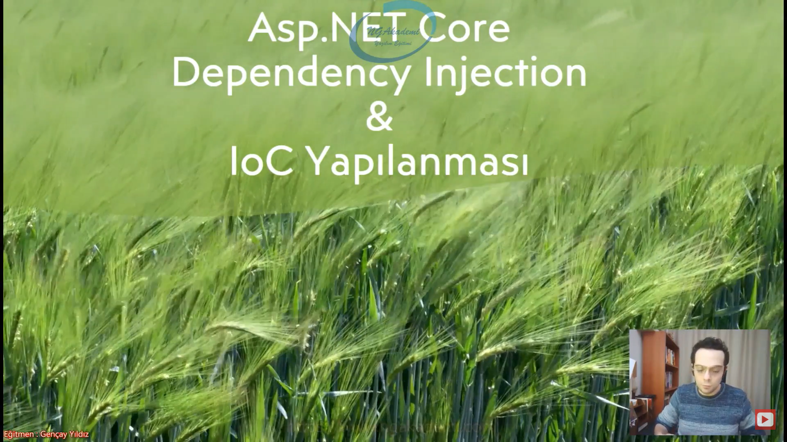

## Dependency Injection Nedir?
- Dependency bağımlılık demek. Dependency Injection ise bağımlılık enjeksiyonu. Birde SOLID prensiplerindeki Dependency Inversion dediğimiz ise bağımlılığın ters çevrilmesi.
 
- Dependency Inversion dediğimiz yapılanma bir prensip. Prensip nedir? Yaparsan doğru yapmazsan yanlış olmayan genel ilkelerdir. Adam demiş ki sana ya kardeşim kod yazarken şu bir prensibi edin hani şu ilkeyle kodunu yaz. Nedir o? Bağımlılıkları ters çevir.

- Dependency Inversion dediğimiz kavram bir prensiptir. Bu prensibi somut olarak prtaikte uygulamanın ta kendisi Dependency Injection design pattern'ıdır. 

- Sen ne diyorsun benim bir prensibim var benim yazmış olduğum kodlarda bağımlıklar kesinlikle tersine dönüşür/çevrilir. Bu benim prensibim işte ben bu prensibi uygun bir şekilde kod yazıyorsam Dependency Injection'la bunu pratikte/fiiliyatta gerçekleştirmiş oluyorum.

- Dependency Injection bağımlılıkların tersine dönüşebilmesi için yapılması gereken bir design pattern'mış.

- Siz OOP desteği olan bir programlama dilinde çalışırken kodlarımızı sınıflar içerisindeki metotlarda/property'lerde/indexer'larda vs. yani sınıf elemanları içerisinde kodlarımızı operasyonlarımızı yapıyoruz.

- Senin yazmış olduğun A class'ının içerisinde herhangi bir metot/property/indexer olur yani operasyonu/algoritmayı yazabildiğin yerlerden biri bu elemanlardan birinin içerisinde senin B sınıfına ihtiyacın var. B sınıfının nesnesine ihityacın var. A'da B'yi oluşturabilmen için `new B()` demen gerekir. Bu operasyon neticesinde B sınıfından bir tane nesne oluşturmuş oluyorsun. Haliyle ihtiyacını da burada gidermiş oluyorsun.

- Dependency Injection der ki herhangi bir sınıfın herhangi bir noktasında başka bir sınıfın nesnesine ihtiyacın varsa o sınıfın nesnesini `new` operatörüyle oluşturmamaya dikkat et. Eğer ki bunu yaparsan bağımlılık oluşur.
 
- A sınıfının içerisinde benim B'ye ihtiyacım var. B nesnesini `new` operatörüyle oluşturduğumda diyor ki A B'ye bağımlıdır diyor. 

- Bundan sonra B'nin üzerinde yapılan tüm değişiklikler A'yı etkileyecektir. 
    * Örneğin B'nin constructor'ına geldim constructor'ında herhangi birşeyi değiştirdim ne oldu A patladı. A'ya gidip nesneyi new'lediğin yerde o değişikliği uygulaman lazım. 
    * Benzer mantıkla B'nin üzerinde yapmış olduğun herhangi bir çalışma her daim A'ya yansıyacaktır. İşte böyle bir durumda biz B'deki bağımlılığı mümkün mertebe A'dan soyutlamalıyız. 

- Buradaki bağımlılık durumu A'nın üzerinde B'nin nesnesinin bu şekilde çağrılmasıdır. Bu şekilde `new` operatörüyle oluşturulmasıdır. Bu bağımlılık neticesinde burada fiziksel/net/somut bir şekilde kurmuş olduğun bu bağımlılıkla artık A'yı her türlü B'nin etkisi altında bırakmış oluyorsun.

- Bir metodun içerisinde farklı davranışlara göre operasyonlar yaparken her bir davranış değişikliğinde gidip kaynak kodu değiştirmekte bir bağımlılıktır. İşte bunun gibi bağımlılıklarda yapmamız gereken dependency injection design pattern'ını uygulamak.

- A sınıfı B'ye ihtiyacı olduğu sürece sana diyor ki burada `new`liyorsan bir bağımlılık oluşur diyor. İşte bu bağımlılığı A'nın B'ye olan bağımlılığını mümkün mertebe soyutla kardeşim diyor. Bu soyutlama operasyonuna Dependency Injection diyoruz.

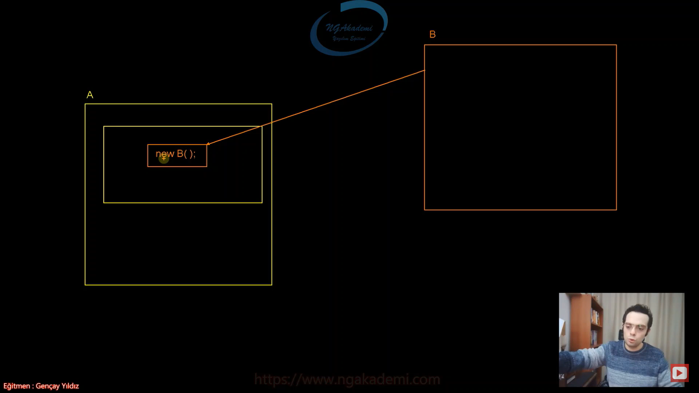

- Dependency Injection bağımlılıkları enjekte et.

- Bir sınıfın bir başka sınıfa olan bağımlılığını ortadan kaldırabilmek için yapmanız gereken çok fazla şey yok. Birkaç operasyondan biri enjekte etmek.

- A sınıfı B sınıfını kullanması gerekiyor. A sınıfının B'ye olan bağımlılığından dolayı bir gün ihtiyacı değişebilir. Örneğin C'ye D'ye E'ye gidebilir. Yani farklı sınıflara ihtiyacımız olabilir. İşte buradaki ihtiyaç farklılığına göre biz B'deki bu somut bağımlılığı bir şekilde ortadan kaldırabilmeli ve hızlı bir şekilde diğer bağımlılıkları devreye sokabilmeliyiz. Dolayısıyla benim sistemde hani birden fazla sınıfım olduğunu varsayın. Ben A'da B'ye bağlıyken C'ye olan ihtiyaçta napacam B'yi değiştirip burada `new C() `diyecem değil mi? Aynı şekilde ne olmuş oldu C'ye bağımlı olmuş oldum. C'nin işi bitti D ile ilgili çalışmam lazım. bir de gelecem `new D()` diyecem. Ya arkadaş ben her çalışma yapacağım sınıfla ilgili operasyonlarda bir öncekini silip daha sonra yenisi mi ekleyecem? İşte bağımlılık olduğu zaman zaten kaçınılmaz olan bir gerçeklik vardır. Bağımlılık durumlarında ihtiyaç değiştikçe kaynak kod değişir. İhtiyaç değişiyorsa kaynak kodu değiştirmen gerekiyor. En bariz bağımlılık göstergesidir. Bu çok efektif bir programlama değil.

- Dependency Injection şunları söylüyor: Kardeşim diyor oldu mu bu böyle bu bağımlılık falan olmadı sen boşver bu bağımlılığı buraya diyor bunların hani herhangi birini kullanma ihtimalin var ya sen buradan bağımlı olma bunlara dışarıdan bunlar enjekte edilebilsin. Örneğin bir tane metodun olsun constructor'ın olsun ya da bir property'in olsun farketmiyor. Bunların ortak bir atasını alan bir türden olsun. Örneğin bunların her biri `IClass`'tan türesin. Dependency Injection `IClass` türünden sen bir tane parametre al. Yeri geldi mi B'yi karşılar yeri geldi mi C'yi karşılar. yeri geldi mi D'yi karşılar. Benim ihtiyacım doğrultusunda yapılması gereken operasyon her neyse davranış değişiyorsa buradaki davranışa göre kodumu değiştirmek zorunda değilim artık ilgili nesneyi buradan/dışarıdan enjekte edebilirim operasyonuma.`IClass` arayüzü sayesinde biz elimizdeki operasyonel sınıfları sisteme ya da o andaki operasyona/algoritmaya/çalışmaya dahil edebiliyoruz. İşte bu dahil etme esnasında sen ekstradan kodu değiştirmene gerek var mı? Burada bir kalıtımsal durum söz konusu. İşte buradaki kalıtımsal stratejiyi uygulamak Dependency Injection. 

- Adam diyor ki sana ya kardesim senin sınıfının içerisinde başka bir sınıfa ihtiyacın varsa sen bu sınıfı `new`'leyerek oluşturma bunu parametreden al. Parametreden aldığın sürece başın ağrımaz.

- Bir sınıf bir başka sınıfı kendi içerisinde `new` operatörüyle instance'ını oluşturuyorsa o sınıf ilgili sınıfa bağımlı oluyor. Dolayısıyla oluşturulan sınıfa oluşturan sınıf bağımlı oluyor. Buradaki bağımlılığı ortadan kaldırabilmek için bu sınıfı biz parametreden almayı tercih ediyoruz. Gün gelir davranış değişir başka muadil sınıfları devreye sokmamız gerekir ortak bir base oluşturuyoruz bu base üzerinden bütün operasya ilgili sınıflarımızı dahil ediyoruz.

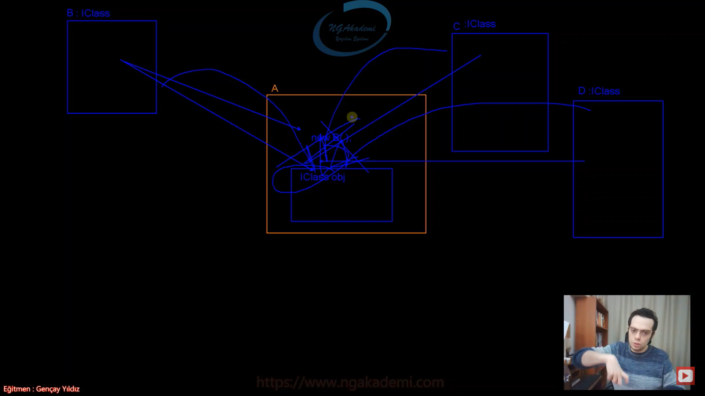
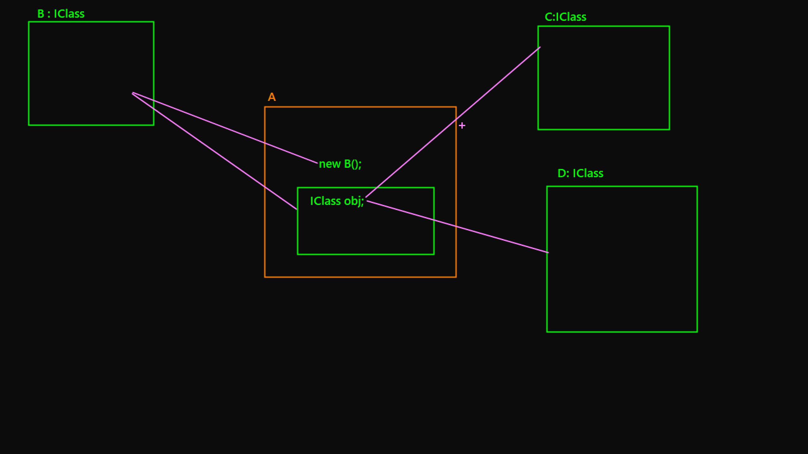

- Elinde A özellikleri olan B özellikleri olan bir sınıfın C özellikleri olan bir sınıfın olsun. Şimdi eğer ki sen bu şekilde dışarıdan enjekte etmeyip direkt A'yı kullanıyorsan gün gelir B ile ilgili işlemler yapmak istiyorsan A'nın kodlarını temizleyip B ile ilgili işlemleri yerine koyman lazım. Bu doğru bir kod anlayışı değil. Dolayısıyla dışarıdan enjekte edilebilir kod anlayışı dışarıdan verilen koda göre içerideki sistemin davranışını şekillendirmesi işte bu Dependency Injection'ın ta kendisi.

- Hatta Dependency Injection birçok design pattern'ında temelinde kullanılan bir tasarım desenidir.

- Bağımlılık oluşturacak parçaların ayrılıp, bunların dışarıdan verilmesiyle sistem içerisindeki bağımlılığı minimize etme işlemidir.

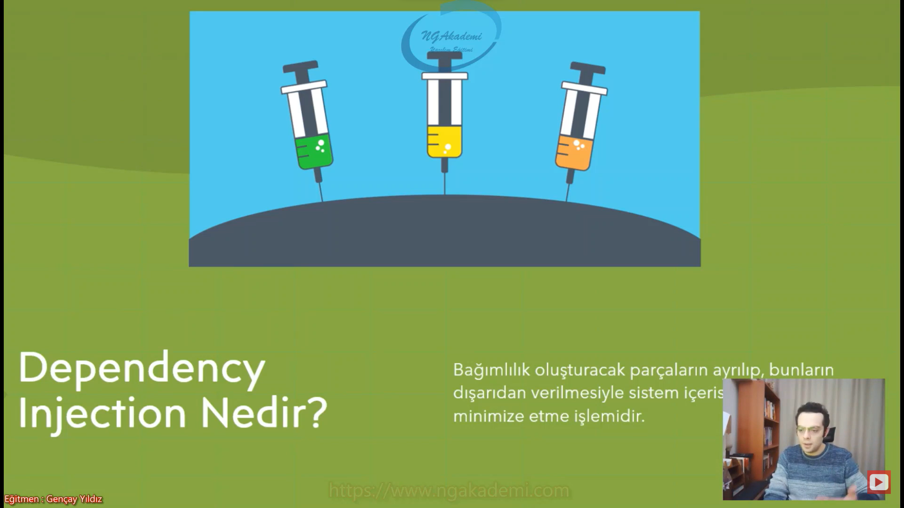

- Yani, temel olarak oluşturulan bir sınıf(class) içerisinde başka bir sınıfın nesnesini new anahtar sözcüğüyle oluşturulmamasını söyleyen bir yaklaşımdır Dependency Injection.

- Şimdi bir sistem var ortada bu sistemde ben sisteme bir özellik katmak istiyorsam bu özelliği katabilmek için kodu değiştirmektense bu özelliği alabilecek bir yapılanmada/tarzda kodu inşa etmem gerekecek. Dolayısıyla sen özelliği verdiğin anda zaten kod bunu alıp absorbe edebilecek. Yani çalıştırabilecek bir sisteme sahip olması gerekecek ona göre o matematikle bunu kodlaman gerekiyor. İşte bu matematiği uygulama Dependency Injection.

- Dışarıdan bir özellik dışarıdan bir sınıf harici/farklı bir bağımlılık devreye sokabiliyorsun.

- Şimdi burada önemli olan kavram bağımlılık demiştik. Bakın ben sigara içen birisiysem eğer sigaraya bağımlıyım değil mi? Ama ben bir tek Parliament içiyorsam parliament'e bağımlılıkla sigaraya olan bağımlılık ayrı şeydir. Bağımlılık dediğimiz olay burada sigaraya bağımlılık olmalıdır. Tek bir sigaraya bağımlılık olursa birgün o sigara kalmadımı kriz doğar doğru mu? Çünkü başka bir sigarayı içemiyorumn anlamına gelecektir. Burada dependency dediğimiz olay parliament değil sigara olmalı dependency injection dediğimiz olay benim sigaraya ihtiyacım oldumu herhnagi bir sigara ihtiyacımı giderebilmeli.

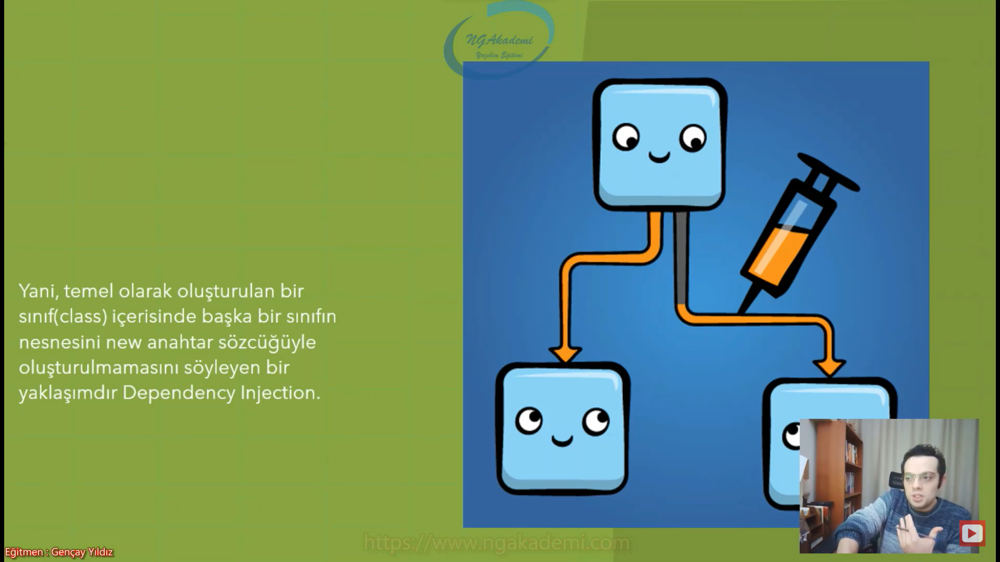

- Sınıf içerisinde ihtiyaç olan nesnenin ya constructor'dan ya da setter metoduyla parametre olarak alınması gerektiğini savunur.

- Böylece her iki sınıfı birbirinden izole etmiş olduğumuzu savunmaktadır.

- Gerçek bir uygulamada siz bir sınıfı başka bir sınıfa parametrelerle arayüzler aracılığıyla aktardığınızda bunun size getirisini belki o an göremesenizde ileride daha net görebilmektesiniz.


- Dependency Injection, bağımlılıkları soyutlamak demektir.

- Dependency Injection bağımlılıkları koparmak demek değildir ama. Ben sigara bağımlısıyım ben sigara bağımlılığımdan vazgeçmiyorum sigara bağımlısıyım ama parliament'e olan bağımlılığımı soyutlayarak artık bir üst segmente sigaraya çıkarıyorum ve herhangi bir sigarayla ihtiyacımı giderebiliyorum. Dolayısıyla burada parliament'e sadece bağımlı birisi olsam malbora içmem gerektiği taktirde parliament'ı bırakıp malborayla ilgili ekstradan bir hazırlık yapmam gerekir. Onunla ilgili çalışma yapmam gerekir. Ağız tadımı değiştirmem gerekir. Ama eğer ki ben dependency injection uygularsam yani bağımlılığı enjekte edilebilir bir hale getirirsem ben bir sigaraya bağımlı değilim ben sigaraya bağımlıyım diyebilirsem böyle bir durumda herhangi bir sigarayı istediğim zaman direkt içebilirim.

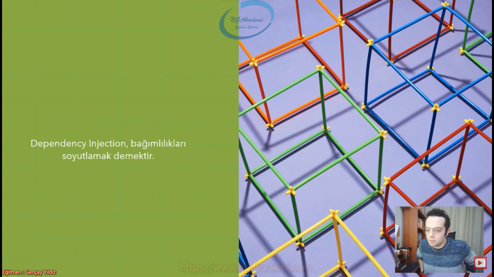

## IOC Nedir?
- Sınıflarımızın bağımlılığını azaltmak için bağımlılıkları Dependency Injection ile dışarıdan alabiliriz demiştik.

- Ancak bazı durumlarda sınıfımız içerisinde çok sayıda arayüze referans vermemiz gerekebilir.

- Aynı anda birden fazlasına ihtiyaç duyabilirsin A B'ye duyuyordu. A B'ye C'ye D'ye yani hepsine aynı anda duyabilir. İşte böyle bir durumda biz hepsine ayrı ayrı referans vererek hani artık yazdığımız koddaki maliyeti arttırmaktansa kod karmaşasına neden olmaktansa bunun için bu işlemi otomatik bir şekilde yapacak olan container'lara bu sınıfların nesnelerini veririz ve ihtiyaç doğrultusunda bu container üzerinden bu nesneleri elde ederiz. İşte buna Inversion of Control denilir. Bu da kontrolün ters çevrimi demektir.

- Bu durumda her biri için dependency injection kodu yazmamız gerekecektir ki bu durum sonunda bir kod karmaşasına neden olacaktır.

- Bunun için bu işlemi otomatikleştiren ve kod tekrarını engelleyen bir yapı kurmamız gerekecektir.

- Bu yapıya Inversion of Control denmektedir.

- A ve B diye bir sınıfın var. A'da B'yi kullanırken `new B();` dersen bağımlılık olur. Bir bağımlılık varsa A'yı yöneten B olur. B'de herhangi bir patlama herhangi bir B'nin kodunda/kaynağında bir değişiklik söz konusu olduğunda A'da B'ye göre davranış sergilemek zorunda kalacak. Dolayısıyla bu zaten istediğimiz bir durum değil. Ama buradaki kontrol B'nin elindeymiş gibi düşünebilirsiniz. Bir de C sınıfımız olsun şimdi ben C sınıfından bir nesne oluşturacaksam ya da C ile ilgili operasyonlarıma devam edeceksem burada da `new C()` demem lazım. Dolayısıyla böyle bir durumda kontrol nesnelerimde olur. Onların direkt birebir muhattap olunması gereken sınıftır bunlar.

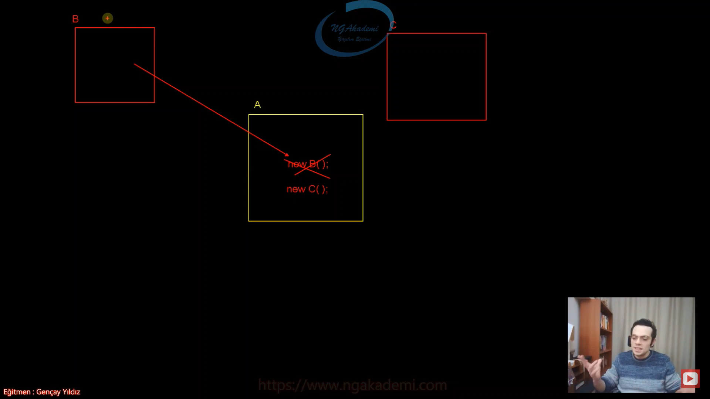

- Elimizde Otobüs ve taksi sınıfları var. A sınıfı da ben olayım. Ben otobüse bineceksem `new Otobus();` oluşturmam gerekiyor değil mi? Vazgeçtim taksiye bineceğim ben çok fazla otobüse bindim param birikti Taksiye bineceğim dediysem eğer yapmama gereken şey Otobüsün kodlarını temizleyeceğim `new Taksi();` diyeceğim. Şimdi gün gelir uçağa bineceksen bunun kodlarını temizleyeceksin uçak diyeceksin. Yahu böyle kod mu yazılır? İhtiyaç değişiyor bu ihtiyaca binaen sen dakika başı kodu değiştiriyorsun. Böyle bir durumda Dependency Injection'dan yararlanıyoruz. Bu şekilde ben sınıfımda ITasit türünden bir parametre alırım. Bu şekilde buraya Hem taksi gelebilir hem de Otobüs gelebilir. Kontrol tersine dönmüş oldu. Artık taksinin ya da otobüsün gelip gelmeyeceğini hangisinin kullanılıp kullanılmayacağını kararını developer vermeye başladı. Developer diyor ki ben bu sınıfı kullanırken ister otobüs nesnesi veririm ona göre çalışırsın ister taksi nesnesi veririm ona göre çalışırsın. Artık buradaki kontrol developer'ın/kodu yazan adamın kararına bağlı. Kontrol tersine döndü.

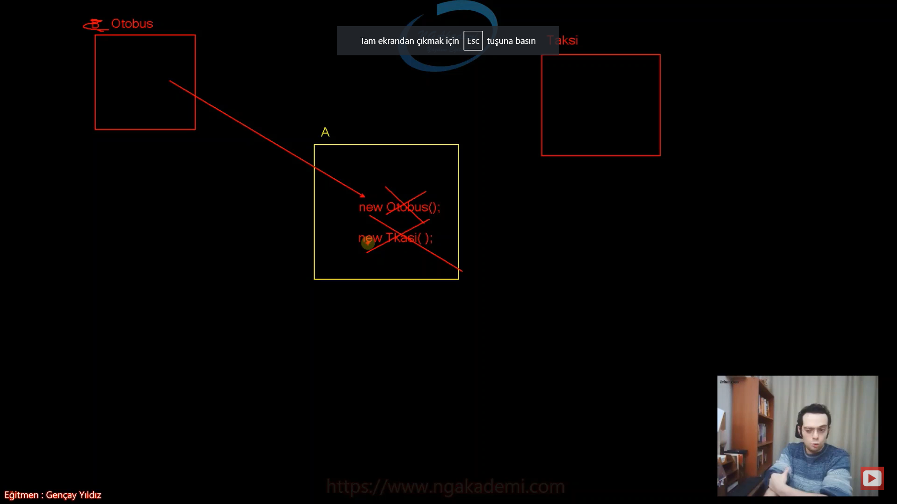
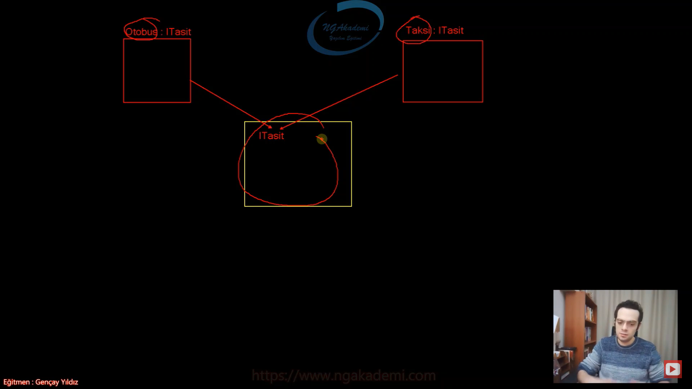

- Şimdi devlet kurumuyuz diyelim. Memurlarımıza ben direkt bağlıysam mesela Ahmet bir iş var kesinlikle Ahmet yapacak başka kimse yapamayacak şimdi burada her ne kadar daire başkanı da olsan ülkenin de başkanı olsam o işi birtek Ahmet yapıyorsa yani ben Ahmet'e bağlıysam yandık. Çünkü Ahmet birgün olmayabilir hastalanır kaçabilir uyuyabilir. İşimiz her türlü aksayacaktır. Ama Ahmet'in dışında biz bu kontrolü tersine çevirsek ben şunu desem ya kardeşim Ahmet'in dışında benim atayabildiğim herhangi bir kişi herhangi bir memur bu işi yapabilsin. Diyebilmek istiyorsam Ahmet'ten bağımlılığı kontrolü koparmak istiyorsam burada Dependency Injection zaten bunu sağlayacaktır. İşte bizde buna Inversion of Control diyeceğiz. Yani bağımlılığı tersine çevireceğiz. Ben Ahmet'e bağlıydım artık bu işi herhangi bir memur yapabilir diyecem dolayısıyla bütün memurlar bana bağlı. Sen yap dediğimde direkt o yapacak yok sen yap dersem direkt o yapacak hangisini seçtiysem. Bağımlılık tersine dönüyor. Bir personele daire başkanının bağımlı olması mı daha doğrudur. Yoksa bağımlılığın tersine dönüp bütün personellerin daire başkanına bağlı olması daha doğrudur.
 
- Bağımlı olduğun sınıflarını container dediğimiz yapılanmanın içerisine koyuyorsun. Esasında bu özünde bir dictionary/koleksiyon. Dictionary koleksiyonunun içerisine sen diyorsun ki al kardeşim bir tane örneğin X sınıfından bir nesne Y sınıfından bir nesne Z sınıfından bir nesne. Bütün türlerine karşılık nesneler bu container içinde tutuluyor. Benim ihtiyacım olduğu zaman hangisini istiyorsam onu çağırıyorum. Kontrol tersine dönmüş oluyor bu bağımlılıklarda yine bağımlıyım belki ben yine onlara ama en azından kontrolü bende olmuş oluyor.
 
 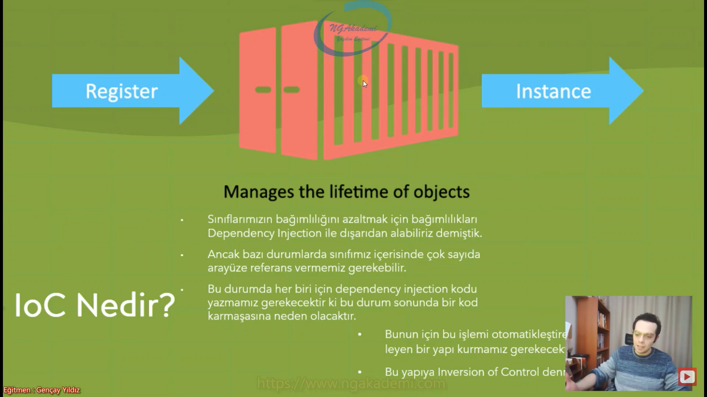

## IoC Çalışma Mantığı
- Dependency Injection kullanılarak enjekte edilecek olan tüm değerler/nesneler IoC Container dediğimiz bir sınıfta tutulurlar.

- Ve ihtiyaç doğrultusunda bu değerler/nesneler çağrılarak elde edilirler.

- Değerler/nesneler kaydedilir. Talep ettiğin zamanda kaydedilen instance sana döndürülüyor.

 

## Asp.NET Core'da IoC Yapılanması
- Asp.NET Code kendi özünde dahilinde IoC yapılanmasıyla gelen bir mimariye sahip.

- .NET uygulamalarında IoC yapılanmasını sağlayan third party frameworkler mevcuttur.
    * Structuremap
    * AutoFac
    * Ninject
    * Vs...
- Asp.NET Core mimarisi, bu third party kütüphaneler kadar yetenekli olmasada içerisinde built-in(dahili) olarak IoC Container modülü barındırmaktadır.

 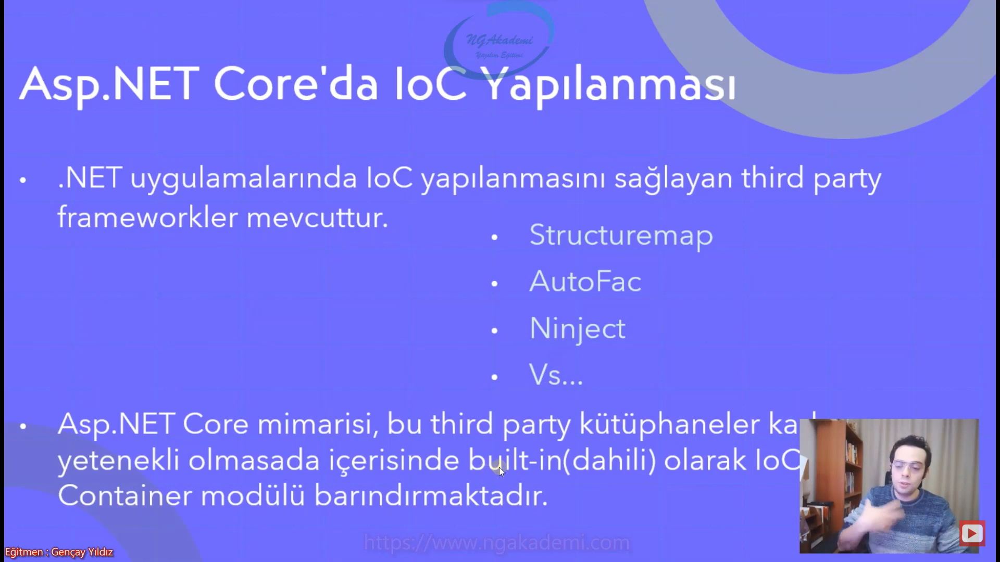

## Built-in IoC Container
- Built-in IoC Container, içerisine koyulacak değerleri/nesneleri üç farklı davranışla alabilmektedir.

### Singleton IoC Davranışı
- Uygulama bazlı tekil nesne oluşturur. Tüm taleplere o nesneyi gönderir.

- Uygulama bazlı tekil nesne oluşturan ve tüm taleplerde bu container'dan yapılan tüm taleplerde o nesneyi döndüren bir davranıştır.

- İstediğin kadar talep yap istediğin kadar request içerisinde talep yap bunların hepsine/ ilgili tüm taleplere tek bir nesne döndürülücektir.

- Bir talepte nesnenin herhangi bir değeri değiştiriliyorsa sonraki taleptede aynı nesne gönderileceği için o değeri değiştirilmiş haliyle gönderilecektir.

### Scoped IoC Davranışı
- Her request başına bir nesne üretir ve o request pipeline'ında olan tüm isteklere o nesneyi gönderir.

- Kardeşim sen binlerce request alabilirsin. Her request'e karşılık ben sana bir tane nesne üreteceğim. Vermiş olduğun container'daki nesneden bir tane model alacam sana her request'in içerisindeki taleplerden bu nesneyi gönderecem. Başka bir request'e başka bir nesne gönderecem.

- Container'a bir tane türden koyuyorum ve diyorum ki kardeşim bunu scoped olarak koy diyorum. Şimdi bir tane request geldi bu gelen request'elere karşılık her bir request için ayrı/farklı bir nesne üretilecek ve bu nesneleri ilgili request'lerdeki taleplerde gönderecek.

### Transient IoC Davranışı
- Her request'in her talebine karşılık bir nesne üretir ve gönderir.

- Yani burada önceden bu nesneyi üretmiştim bundan tasarruflu davranalım falan filan yok.

- En maliyetlisi budur.

- Her bir reuqest'e ayrı ayrı nesneler oluşturup gönderecektir.

- Diyelim ki 1000000 request geldi Singleton'da bu 1000000 request'in içerisinde her request'in içinde bir kere talepte bulunursa Singleton tek bir nesneyi aynı 1000000 isteğe göndermiş olacaktır. Ama Singleton çalıştığın için sadece 1 tane nesne olacaktır. Eğer Scoped'ta çalışıyorsan 1000000 isteğe karşılık 1000000 nesne oluşturulacak bu 1000000 isteğin içerisindeki her bir talebe karşılık bu nesneler gönderilecektir. Transient'te ise diyelim ki 1000000 isteğin var. Her bir isteğin içerisinde 10 tane talep var. Burada isteğe bakmayacak diyecek ki kaç tane talep var 10 tane 10 * 1000000 nesne yani 10000000 nesne oluşacak.

- Scoped'u her daim kullanmak doğru değildir. Singleton nesne kullanmam gereken durumlarda ne yapacağım belki anlık olarak ilgili nesnenin içerisindeki değerin değişmesi gerekiyor. Belki her talepte farklı bir değerde çalışacağım ben. Dolayısıyla Scoped ve Transient'inde buradaki çözümü gerçek uygulamalara daha yatkın. Hepsini kullanacaksın ama davranışlarını bilip ihtiyacın doğrultusunda hangisini nerede kullanman gerektiğini bileceksin. Bişeyi değerlendirirken bu bundan daha mı iyi hangisi daha çok kullanılır gibi değerlendirmek doğru değil yanlışa götürür. Hangisine ihtiyacın varsa onu kullanacaksın.

- Container içerisindeki nesneler ihtiyacım olduğu zaman ilgili sınıfta bu container'ın içindeki nesneleri talep edebileceğim ama `new` operatörüyle herhangi bir oluşum yapmayacağımdan dolayı bağımsızlık enjeksiyonunu da sağlamış olacağım e container kullandığımdan dolayı da kontrolü tersine dönüştürmüş olacağım.


- MVC API ya da Razor Page -yaklaşımı benimsemiş bir uygulamada çalışıyor olabilirsin farketmez. Bu yapılanmayı hangi yaklaşımda çalışıyorsanız çalışın hepsinde uygulayabilirsiniz. Nihayetinde çekirdek aynı olduğundan dolayı tüm yaklaşımlara ortak servisleri ortak nimetleri sunuyor. Dolayısıyla uygulamamız Asp.NET Core olduğu sürece buradaki herşey diğer uygulamalarda da/yaklaşımlarda da geçerli olacaktır.

- Web uygulamarında genellikle servis yapılanmalarını kullanıyoruz belirli fiiliyatları yürütebilmek için belirli operasyonları gerçekleştirebilmek için servis yapılanmaları oluşturuyoruz. Loglama operasyonu yapacağım ve bu log operasyonu esnasında kimi servisimiz olsun Console'a loglama işlemi gerçekleştirsin. Kimisi de bir text'e text tabanlı bir dosyaya gerçekleştirsin. Dolayısıyla bu iki farklı operasyonu yapacak ayrı servisler oluşturmam lazım. Ben bir request'le Console'a ya da text'e bir log atacaksam eğer burada ilgili servise erişmek ve bu serviste ilgili gerekli fonksiyonları çağırıp Loglama işlemini sağlamak.

## Asp.NET Core Uygulamasında Örnek Servislerin Oluşturulması
```C#
//********************* TextLog *********************
public class TextLog
{
    public void Log()
    {

    }
}
//********************* ConsoleLog *********************
public class ConsoleLog
{
    public void Log() 
    {

    }
}
//********************* HomeController *********************
public class HomeController : Controller
{
    public IActionResult Index()
    {
        //Index'e istek geldiği zaman Console'a ya da text'e bir log atacaksam eğer burada ilgili servise erişmek ve bu serviste ilgili gerekli fonksiyonları çağırıp Loglama işlemini sağlamak. Sen eğer bu servislere erişmeye çalışırken eğer ki burada `new` operatörünü ilgili servislerden nesne üretiyorsan işte burada bağımlılık söz konusudur. Bu kod tehlikelidir. Çünkü senin bağımlılık yarattığın bu servisle bu yapılanmada yarın bir değişiklik olabilir. ConsoleLog tuttuğunu herhangi bir noktada TextLog'una dönüştürme yapman gerekebilir. Böyle bir durumda davranışın/ihtiyacın değiştiği taktirde kaynak kodu gelip değiştirme durumu zaten bizim için yeterli bir handikaptır.
        // İlk başta benim buradaki bağımlılığı soyutlamam lazım. Benim burada new operatörüyle ilgili servisleri oluşturmamam lazım. Bunun içinde Dependency Injection'dan yararlanacağız.
        // IoC yapılanmasıyla Dependency Injection'ı desteklersem daha efektif bir sonuca varabilirim. Dolayısıyla benim IoC yapılanması kullanmam lazım yeri gelecek Console'u yeri gelecek
    Text'i ilgili IoC'in bana sağlamıl olduğu controller'a yerleştireceğim hem burada bağımlılıklarımı soyutlamış olacam hem de yönetimi tersine dönüştürmüş olacağım. Kontrol tersine
    dönmüş olacak ben hangisini kullanmak istiyorsam sistem onu kullanıp ona göre işlem gerçekleştirecek. Dolayısıyla ideal tasarıma kavuşmuş olacağız.
        

        //ConsoleLog log = new();
        //log.Log();
        TextLog log = new();
        log.Log();
        return View();
    }
}    
```
## Built-in IoC - IServiceCollection
```C#
//********************* Example *********************
using DependencyInjection.Services;

namespace DependencyInjection
{
    public class Example
    {
        public Example()
        {
            IServiceCollection services = new ServiceCollection();//.Net mimarisinde IServiceCollection türü dahili/built-in gelen IoC yapılanmasını barındıran bir türdür. O yapılanmanın arayüzüdür.
            // Bu tür Microsoft.Extensions.DependencyInjection namespace'i altından gelmektedir.
            // Bu container'a istediğim değeri ekleyebiliyorum. Sistemden hazır gelen servisleri ekleyebilirsiniz. Servis eklemek demek ilgili servisin sınıflarını kullanılabilir vaziyette mimarinin container'ına eklemek demek. Örneğin sen buradan Cors mu ekliyorsun. Cors politiklarına dair gerekli sınıfların hepsini buradaki mimarinin servisine yani container'ına ekliyorsun ki yarın lazım olursa çağırdığında direkt gelsin diye.
            // Buradaki fonksiyon arka planda bu container'a gerekli eklemelerde bulunuyor.
            // Burada custom/kendimize ait servisleri eklemek için Add() fonksiyonuyla direkt ekleme işlemi yapabilirsiniz. Add'den sonra ismi olanlar özel servisleri belirlerken direkt ne olduğu belli olan servislerken customize edilmiş kendime ait bizzat özel servislerimizi sisteme eklemek için Add() fonksiyonunu kullanabilirsiniz. Bu fonksiyon üzerinden Container'a istediğim herhangi bir sınıfı ekleyebilirim. Kökünde hepsinin Add() fonksiyonu var gibi düşünebilirsiniz.
            // Add() fonksiyonu ile biz esasında .NET mimarisinde gelen hazır dahili IoC mekanizmasının container'ına ilgili nesnelerimizi/değerlerimizi ekleyebiliyoruz.
            

            services.Add(new(typeof(ConsoleLog), new ConsoleLog()));
            services.Add(new(typeof(TextLog), new TextLog()));// Property vs. varsa bunların içerisinde koyulacak nesnenin orada ilk oluşturulacak nesnenin hangi değerlerde olması gerektiğini de buradan bildireceksiniz.
            
            ServiceProvider provider = services.BuildServiceProvider(); // Bu container'a eklenmiş değerleri biz bu fonksiyon ile elde edebiliyoruz. Bu bana ilgili container'ı direkt oluşturacaktır. Artık provider/sağlayıcı direkt net/somut bir container verecek.
            provider.GetService<ConsoleLog>();//Generic olarak bildirdiğin türe karşılık gelen nesne herneyse sana onu döndürecektir. 
            provider.GetService<TextLog>();
        }
    }
}
//********************* Program.cs *********************
//Bir servis oluştururken bunu sisteme dahil edereken nerede konfigüre edeceğim? Startup'ta ya da Program.cs'te değil mi? ConfigureServices diye bir fonksiyonum var haliyle burada sisteme yani mimariye dahil edeceğim bu uygulamada çalışacak olan bütün servisleri buradaki builder.Services üzerinden mimariye uygulamaya dahil etmiyor muyum? ediyorum. 
// IServiceCollection türü bizim container'ımızın ta kendisi.
// builder.Services'e vereceğin tüm değerler ilgili mimaride oluşturulacak container'a dahil ediliyor. Uygulamayı çalıştırdığında bu container'da ayağa kaldırılıyor. Herhangi bir controller üzerinde servise vs. ihtiyacın olduğu taktirde gelip new falan demeden ilgili nesneyi talep edebiliyorsun.

// Add services to the container.
builder.Services.AddControllersWithViews();
builder.Services.Add(new(typeof(ConsoleLog), new ConsoleLog()));// Bu nesne üzerinden ben bütün davranışlara göre ilgili nesnelerimi container'a verebiliyorum.
//builder.Services.Add(new(typeof(TextLog), typeof(TextLog), ServiceLifetime.Transient));
builder.Services.Add(new(typeof(TextLog), new TextLog()));//Davranış default olarak singleton'dır.
// Biz Add() fonksiyonunu çok fazla kullanmayız. Çok efektif değil çünkü.

```

## Container'a Eklenen Nesnenin Constructer’ı Parametreliyse Ne Yapılmalı? 
```C#
//********************* ConsoleLog *********************
namespace DependencyInjection.Services
{
    public class ConsoleLog
    {
        public ConsoleLog(int a)
        {
            
        }
        public void Log() 
        {

        }
    }
}
//********************* Program.cs *********************
builder.Services.AddSingleton<ConsoleLog>();//Bütün isteklerde bütün taleplerde aynı nesneyi/tek bir tane nesneyi kullanıp onu gönderiyor. Bu şekilde kullanıyorsan eğer vermiş olduğun tür ne olursa olsun ondan bir tane nesne oluşturur. Yok eğer vermiş olduğun tür nesne oluşturulabilir bir sınıftır belki ama constructor'ı default değildir yani parametre alan bir constructor'ı vardır. O zaman direkt kendisi nesne oluşturamayacak kendisi burada new T();'yi baz alır normalde sen ne verdiysen o T'den bir nesne oluşturmaya çalışacak. Haliyle parametre alan bir constructor'ı varsa bunu kullanamazsın çünkü runtime'da patlayacaksın.
//Constructor'ın parametre alıyorsa bu davranışı sergileyemezsin. Hata alacaksın mantıken. Yok eğer parametre almıyorsa bununla direkt koyabilirsin.
builder.Services.AddSingleton<ConsoleLog>(p => new ConsoleLog(3)); //Constructor'da parametre varsa bunu kullanırız.

builder.Services.AddScoped<ConsoleLog>();//Tüm isteklerde ayrı bir tane bu nesneden oluşturacak her bir isteğin talebine o nesneden gönderecek.
builder.Services.AddScoped<ConsoleLog>(p=> new(5));

builder.Services.AddTransient<ConsoleLog>();// Her isteğin her talebine talebe özel nesne üretip üretip nesneyi gönderecektir.
builder.Services.AddTransient<ConsoleLog>(p => new(5));
```

## Nesne Bildirimlerinde Uyulması Gereken Abstraction Mantığı
- IoC yapılanmasını kullanırken aynı işi yapan servisleri ortak bir türün altında toplarız niye? Çünkü istediğim zaman istediğimi dahil edeyim istediğimi çağırabileyim istediğimi dışarıdan enjekte edebileyim. Dolayısıyla biz bu tarz çalışmalarda container'a vereceğimiz nesnelere bir ortak interface ile abstraction'a tabi tutarız. O interface üzerinden sisteme dahil ederiz.

```C#
//********************* ILog *********************
namespace DependencyInjection.Interfaces
{
    public interface ILog// IoC yapılanmasını kullanırken aynı işi yapan servisleri ortak bir türün altında toplarız niye? Çünkü istediğim zaman istediğimi dahil edeyim istediğimi çağırabileyim istediğimi dışarıdan enjekte edebileyim. Dolayısıyla biz bu tarz çalışmalarda container'a vereceğimiz nesnelere bir ortak interface ile abstraction'a tabi tutarız. O interface üzerinden sisteme dahil ederiz.
    {
        void Log();
    }
}
//********************* ConsoleLog *********************
using DependencyInjection.Interfaces;

namespace DependencyInjection.Services
{
    public class ConsoleLog : ILog
    {
        public ConsoleLog(int a)
        {
            
        }
        public void Log() 
        {

        }
    }
}
//********************* TextLog *********************
using DependencyInjection.Interfaces;

namespace DependencyInjection.Services
{
    public class TextLog : ILog
    {
        public void Log()
        {

        }
    }
}
//********************* Program.cs *********************
builder.Services.AddScoped<ILog>(p => new ConsoleLog(5));// ILog isteği geldiği zaman sen ConsoleLog ekle. Biz talep ederken bu nesneyi container'dan ILog türünden talep edeceğiz. Dolayısıyla ilgili nesne bize ILog türünden gelecektir. Burada polimorfizm kuralları geçerli olacaktır. Yani bildiğimiz klasik OOP kuralları geçerli olacaktır.
// Gün geldi ConsoleLog yerine TextLog lazım olursa ilgili yere TextLog yazmanız yeterli olacaktır.
builder.Services.AddScoped<ILog>(p => new TextLog());
// Bağımlılık tersine dönmüş yani ben hangisini çağırırsam ona göre o gelecek o işlem yapacak. Yani benim buraya TextLog yazmam sistemde bütün log mekanizmasının Text'te loglama yapmasının talimatını verdiğim anlamına gelecektir.
builder.Services.AddScoped<ILog, TextLog>();
// ILog türünden container'a bir TextLog nesnesi koy.
// Parametrenin ILog'tan türemiş olması gerekiyor
// Parametrenin nesne üretilebilir constructor'ı default/boş/parametresiz olan bir nesne olması gerekiyor.
```

## Controller Constructor’ından Nesne Talebinde Nasıl Bulunulur?
- Controller'ların constructor'ları üzerinden biz direkt IoC container'ının içindeki nesneleri talep edebilmekteyiz. Dependency Injection yapılanmasının pratikte Constructor üzerinden enjeksiyon mekanizması var. Bir de Setter property'ler üzerinden de bu enjeksiyon mekanizması söz konusu olabilmekte.

```C#
//********************* Program.cs *********************
builder.Services.AddScoped<ILog>(p => new ConsoleLog(5));// ILog isteği geldiği zaman sen ConsoleLog ekle. Biz talep ederken bu nesneyi container'dan ILog türünden talep edeceğiz. Dolayısıyla ilgili nesne bize ILog türünden gelecektir. Burada polimorfizm kuralları geçerli olacaktır. Yani bildiğimiz klasik OOP kuralları geçerli olacaktır.
// Gün geldi ConsoleLog yerine TextLog lazım olursa ilgili yere TextLog yazmanız yeterli olacaktır.
builder.Services.AddScoped<ILog>(p => new TextLog());
// Bağımlılık tersine dönmüş yani ben hangisini çağırırsam ona göre o gelecek o işlem yapacak. Yani benim buraya TextLog yazmam sistemde bütün log mekanizmasının Text'te loglama yapmasının talimatını verdiğim anlamına gelecektir.
builder.Services.AddScoped<ILog, TextLog>();
// ILog türünden container'a bir TextLog nesnesi koy.
// Parametrenin ILog'tan türemiş olması gerekiyor
// Parametrenin nesne üretilebilir constructor'ı default/boş/parametresiz olan bir nesne olması gerekiyor.

//********************* HomeController *********************
public class HomeController : Controller
{
    private readonly ILog _log;
    public HomeController(ILog log)//Container'daki ILog türündeki nesne her neyse sen onu buraya getir bir bakayım diyorsun. Artık ilgili nesneyi sana buraya getirecektir. 
                                   //İlgili nesneyi property/field olarak global bir hale getireceksin ardından bu global property'i istediğin yerde kullanacaksın.
    {
        _log = log;
    }

    public IActionResult Index()
    {
        _log.Log();// Buradaki log'a ne geldiği önemli değil. Console'mu geldi Text'mi geldi farketmiyor artık bir standardı var. 
        return View();
    }
}
```

## Action Bazında Nesne Talebinde Nasıl Bulunulur? FromServices Attribute’u
- Hangi nesneyi bekliyorsak o nesneye dair parametrede `[FromServices]`  ile işaretlenmiş bir parametre koymamız gerekecek.
```C#
//********************* HomeController *********************
public class HomeController : Controller
{
  
    public IActionResult Index([FromServices]ILog log)// Herhangi bir post neticesinde beklemeyeceksem direkt container'dan gelen nesneyle eşleştirilmesini bekleyeceksem [FromServices] attribute'unu kullanmam yeterli olacaktır.
                                                    //ILog log türünden olan bu değeri kardeşim Services'tan yani container'dan getir buradaki parametreye bağla.
    {
        log.Log();
        return View();
    }
}
```

## View’de Nesne Talebinde Nasıl Bulunulur? @inject
- Eğer ki MVC ya da razor pages kullanıyorsanız View dosyalarında da direkt controller'a müdahale etmeden controller'da çalışma yapmaksızın direkt view'de de inject işlemi yapmanız gerekebilir.

```C#
//********************* Index.cshtml *********************
@inject DependencyInjection.Services.Interfaces.ILog log
```

## C# Examples
```C#
//******************************* HomeController *******************************
using DependencyInjection.Models;
using DependencyInjection.Services;
using DependencyInjection.Services.Interfaces;
using Microsoft.AspNetCore.Mvc;
using System.Diagnostics;

namespace DependencyInjection.Controllers
{
    public class HomeController : Controller
    {
        //private readonly ILog _log;
        //public HomeController(ILog log)//Container'daki ILog türündeki nesne her neyse sen onu buraya getir bir bakayım diyorsun. Artık ilgili nesneyi sana buraya getirecektir. 
        //                               //İlgili nesneyi property/field olarak global bir hale getireceksin ardından bu global property'i istediğin yerde kullanacaksın.
        //{
        //    _log = log;
        //}

        public IActionResult Index([FromServices]ILog log)// Herhangi bir post neticesinde beklemeyeceksem direkt container'dan gelen nesneyle eşleştirilmesini bekleyeceksem [FromServices] attribute'unu kullanmam yeterli olacaktır.
                                                          //ILog log türünden olan bu değeri kardeşim Services'tan yani container'dan getir buradaki parametreye bağla.
        {
            //Index'e istek geldiği zaman Console'a ya da text'e bir log atacaksam eğer burada ilgili servise erişmek ve bu serviste ilgili gerekli fonksiyonları çağırıp Loglama işlemini sağlamak. Sen eğer bu servislere erişmeye çalışırken eğer ki burada `new` operatörünü ilgili servislerden nesne üretiyorsan işte burada bağımlılık söz konusudur. Bu kod tehlikelidir. Çünkü senin bağımlılık yarattığın bu servisle bu yapılanmada yarın bir değişiklik olabilir. ConsoleLog tuttuğunu herhangi bir noktada TextLog'una dönüştürme yapman gerekebilir. Böyle bir durumda davranışın/ihtiyacın değiştiği taktirde kaynak kodu gelip değiştirme durumu zaten bizim için yeterli bir handikaptır.
            // İlk başta benim buradaki bağımlılığı soyutlamam lazım. Benim burada new operatörüyle ilgili servisleri oluşturmamam lazım. Bunun içinde Dependency Injection'dan yararlanacağız.
            // IoC yapılanmasıyla Dependency Injection'ı desteklersem daha efektif bir sonuca varabilirim. Dolayısıyla benim IoC yapılanması kullanmam lazım yeri gelecek Console'u yeri gelecek Text'i ilgili IoC'in bana sağlamıl olduğu controller'a yerleştireceğim hem burada bağımlılıklarımı soyutlamış olacam hem de yönetimi tersine dönüştürmüş olacağım. Kontrol tersine dönmüş olacak ben hangisini kullanmak istiyorsam sistem onu kullanıp ona göre işlem gerçekleştirecek. Dolayısıyla ideal tasarıma kavuşmuş olacağız.


            //ConsoleLog log = new();
            //log.Log();
            //TextLog log = new();
            //log.Log();

            //_log.Log();// Buradaki log'a ne geldiği önemli değil. Console'mu geldi Text'mi geldi farketmiyor artık bir standardı var. 
            log.Log();
            return View();
        }

        public IActionResult Privacy()
        {
            return View();
        }

        [ResponseCache(Duration = 0, Location = ResponseCacheLocation.None, NoStore = true)]
        public IActionResult Error()
        {
            return View(new ErrorViewModel { RequestId = Activity.Current?.Id ?? HttpContext.TraceIdentifier });
        }
    }
}
//******************************* Program.cs *******************************
using DependencyInjection.Services;
using DependencyInjection.Services.Interfaces;

var builder = WebApplication.CreateBuilder(args);

//Bir servis oluştururken bunu sisteme dahil edereken nerede konfigüre edeceğim? Startup'ta ya da Program.cs'te değil mi? ConfigureServices diye bir fonksiyonum var haliyle burada sisteme yani mimariye dahil edeceğim bu uygulamada çalışacak olan bütün servisleri buradaki builder.Services üzerinden mimariye uygulamaya dahil etmiyor muyum? ediyorum. 
// IServiceCollection türü bizim container'ımızın ta kendisi.
// builder.Services'e vereceğin tüm değerler ilgili mimaride oluşturulacak container'a dahil ediliyor. Uygulamayı çalıştırdığında bu container'da ayağa kaldırılıyor. Herhangi bir controller üzerinde servise vs. ihtiyacın olduğu taktirde gelip new falan demeden ilgili nesneyi talep edebiliyorsun.

// Add services to the container.
builder.Services.AddControllersWithViews();
//builder.Services.Add(new(typeof(ConsoleLog), new ConsoleLog()));// Bu nesne üzerinden ben bütün davranışlara göre ilgili nesnelerimi container'a verebiliyorum.
////builder.Services.Add(new(typeof(TextLog), typeof(TextLog), ServiceLifetime.Transient));
//builder.Services.Add(new(typeof(TextLog), new TextLog()));//Davranış default olarak singleton'dır.
// Biz Add() fonksiyonunu çok fazla kullanmayız. Çok efektif değil çünkü.
//builder.Services.AddSingleton<ConsoleLog>();//Bütün isteklerde bütün taleplerde aynı nesneyi/tek bir tane nesneyi kullanıp onu gönderiyor. Bu şekilde kullanıyorsan eğer vermiş olduğun tür ne olursa olsun ondan bir tane nesne oluşturur. Yok eğer vermiş olduğun tür nesne oluşturulabilir bir sınıftır belki ama constructor'ı default değildir yani parametre alan bir constructor'ı vardır. O zaman direkt kendisi nesne oluşturamayacak kendisi burada new T();'yi baz alır normalde sen ne verdiysen o T'den bir nesne oluşturmaya çalışacak. Haliyle parametre alan bir constructor'ı varsa bunu kullanamazsın çünkü runtime'da patlayacaksın.
//Constructor'ın parametre alıyorsa bu davranışı sergileyemezsin. Hata alacaksın mantıken. Yok eğer parametre almıyorsa bununla direkt koyabilirsin.
//builder.Services.AddSingleton<ConsoleLog>(p => new ConsoleLog(3)); //Constructor'da parametre varsa bunu kullanırız.

//builder.Services.AddScoped<ConsoleLog>();//Tüm isteklerde ayrı bir tane bu nesneden oluşturacak her bir isteğin talebine o nesneden gönderecek.
//builder.Services.AddScoped<ConsoleLog>(p=> new(5));

//builder.Services.AddTransient<ConsoleLog>();// Her isteğin her talebine talebe özel nesne üretip üretip nesneyi gönderecektir.
//builder.Services.AddTransient<ConsoleLog>(p => new(5));

builder.Services.AddScoped<ILog>(p => new ConsoleLog(5));// ILog isteği geldiği zaman sen ConsoleLog ekle. Biz talep ederken bu nesneyi container'dan ILog türünden talep edeceğiz. Dolayısıyla ilgili nesne bize ILog türünden gelecektir. Burada polimorfizm kuralları geçerli olacaktır. Yani bildiğimiz klasik OOP kuralları geçerli olacaktır.
// Gün geldi ConsoleLog yerine TextLog lazım olursa ilgili yere TextLog yazmanız yeterli olacaktır.
builder.Services.AddScoped<ILog>(p => new TextLog());
// Bağımlılık tersine dönmüş yani ben hangisini çağırırsam ona göre o gelecek o işlem yapacak. Yani benim buraya TextLog yazmam sistemde bütün log mekanizmasının Text'te loglama yapmasının talimatını verdiğim anlamına gelecektir.
builder.Services.AddScoped<ILog, TextLog>();
// ILog türünden container'a bir TextLog nesnesi koy.
// Parametrenin ILog'tan türemiş olması gerekiyor
// Parametrenin nesne üretilebilir constructor'ı default/boş/parametresiz olan bir nesne olması gerekiyor.

var app = builder.Build();

// Configure the HTTP request pipeline.
if (!app.Environment.IsDevelopment())
{
    app.UseExceptionHandler("/Home/Error");
    // The default HSTS value is 30 days. You may want to change this for production scenarios, see https://aka.ms/aspnetcore-hsts.
    app.UseHsts();
}

app.UseHttpsRedirection();
app.UseStaticFiles();

app.UseRouting();

app.UseAuthorization();

app.MapControllerRoute(
    name: "default",
    pattern: "{controller=Home}/{action=Index}/{id?}");

app.Run();
//******************************* TextLog *******************************
using DependencyInjection.Services.Interfaces;

namespace DependencyInjection.Services
{
    public class TextLog : ILog
    {
        public void Log()
        {
            Console.WriteLine("Text dosyasına loglama işlemi gerçekleştirildi....");
        }
    }
}
//******************************* ConsoleLog *******************************
using DependencyInjection.Services.Interfaces;

namespace DependencyInjection.Services
{
    public class ConsoleLog : ILog
    {
        public ConsoleLog(int a)
        {
            
        }
        public void Log() 
        {
            Console.WriteLine("Console loglama işlemi gerçekleştirildi....");
        }
    }
}
//******************************* ILog *******************************
namespace DependencyInjection.Services.Interfaces
{
    public interface ILog// IoC yapılanmasını kullanırken aynı işi yapan servisleri ortak bir türün altında toplarız niye? Çünkü istediğim zaman istediğimi dahil edeyim istediğimi çağırabileyim istediğimi dışarıdan enjekte edebileyim. Dolayısıyla biz bu tarz çalışmalarda container'a vereceğimiz nesnelere bir ortak interface ile abstraction'a tabi tutarız. O interface üzerinden sisteme dahil ederiz.
    {
        void Log();
    }
}
//******************************* Index.cshtml *******************************
@inject DependencyInjection.Services.Interfaces.ILog log
@{
    ViewData["Title"] = "Home Page";
}

<div class="text-center">
    <h1 class="display-4">Welcome</h1>
    <p>Learn about <a href="https://docs.microsoft.com/aspnet/core">building Web apps with ASP.NET Core</a>.</p>
</div>
//******************************* Example *******************************
using DependencyInjection.Services;

namespace DependencyInjection
{
    public class Example
    {
        public Example()
        {
            IServiceCollection services = new ServiceCollection();//.Net mimarisinde IServiceCollection türü dahili/built-in gelen IoC yapılanmasını barındıran bir türdür. O yapılanmanın arayüzüdür.
            // Bu tür Microsoft.Extensions.DependencyInjection namespace'i altından gelmektedir.
            // Bu container'a istediğim değeri ekleyebiliyorum. Sistemden hazır gelen servisleri ekleyebilirsiniz. Servis eklemek demek ilgili servisin sınıflarını kullanılabilir vaziyette mimarinin container'ına eklemek demek. Örneğin sen buradan Cors mu ekliyorsun. Cors politiklarına dair gerekli sınıfların hepsini buradaki mimarinin servisine yani container'ına ekliyorsun ki yarın lazım olursa çağırdığında direkt gelsin diye.
            // Buradaki fonksiyon arka planda bu container'a gerekli eklemelerde bulunuyor.
            // Burada custom/kendimize ait servisleri eklemek için Add() fonksiyonuyla direkt ekleme işlemi yapabilirsiniz. Add'den sonra ismi olanlar özel servisleri belirlerken direkt ne olduğu belli olan servislerken customize edilmiş kendime ait bizzat özel servislerimizi sisteme eklemek için Add() fonksiyonunu kullanabilirsiniz. Bu fonksiyon üzerinden Container'a istediğim herhangi bir sınıfı ekleyebilirim. Kökünde hepsinin Add() fonksiyonu var gibi düşünebilirsiniz.
            // Add() fonksiyonu ile biz esasında .NET mimarisinde gelen hazır dahili IoC mekanizmasının container'ına ilgili nesnelerimizi/değerlerimizi ekleyebiliyoruz.
            

            services.Add(new(typeof(ConsoleLog), new ConsoleLog(5)));
            services.Add(new(typeof(TextLog), new TextLog()));// Property vs. varsa bunların içerisinde koyulacak nesnenin orada ilk oluşturulacak nesnenin hangi değerlerde olması gerektiğini de buradan bildireceksiniz.
            
            ServiceProvider provider = services.BuildServiceProvider(); // Bu container'a eklenmiş değerleri biz bu fonksiyon ile elde edebiliyoruz. Bu bana ilgili container'ı direkt oluşturacaktır. Artık provider/sağlayıcı direkt net/somut bir container verecek.
            provider.GetService<ConsoleLog>();//Generic olarak bildirdiğin türe karşılık gelen nesne herneyse sana onu döndürecektir. 
            provider.GetService<TextLog>();
        }
    }
}
```
