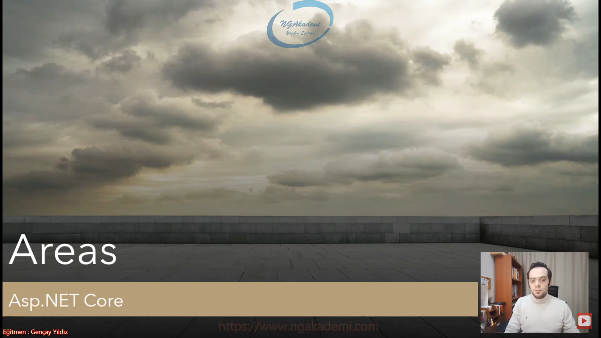
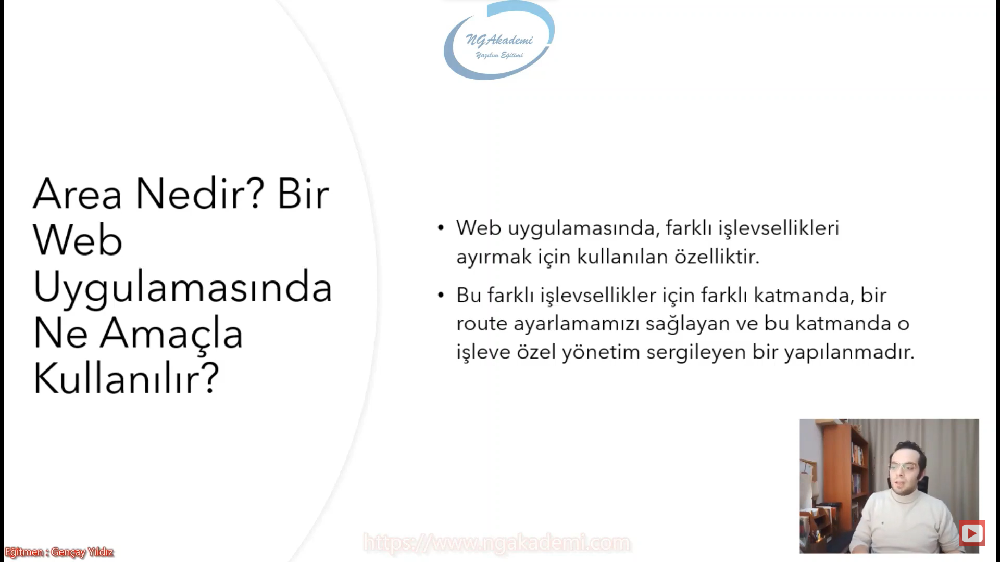
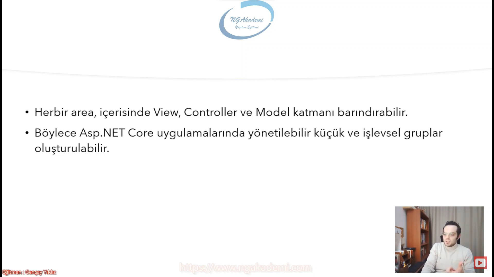
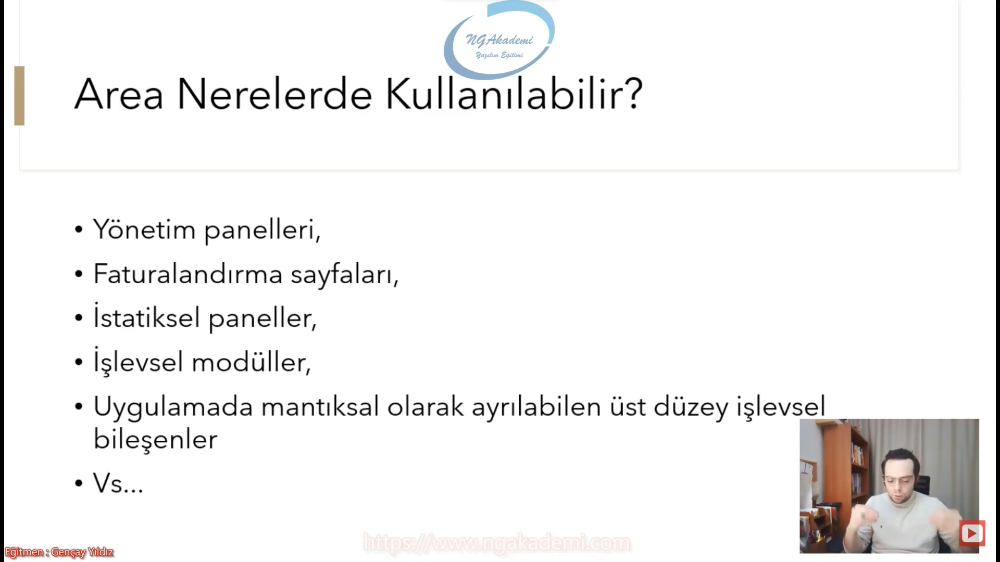
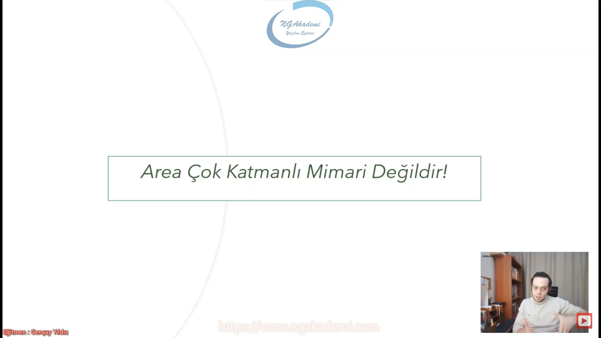
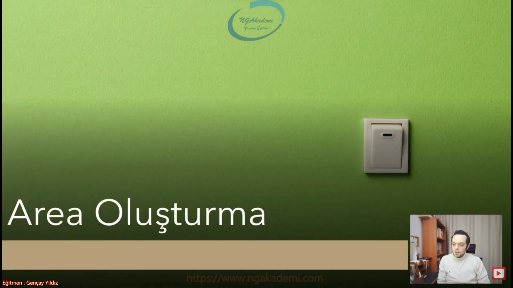
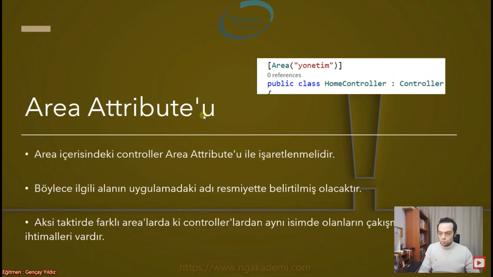
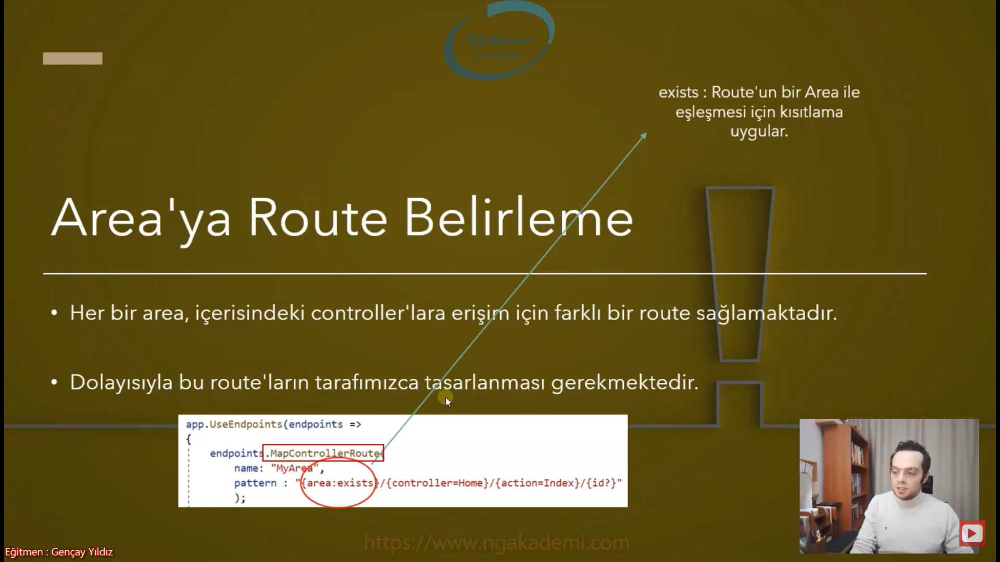
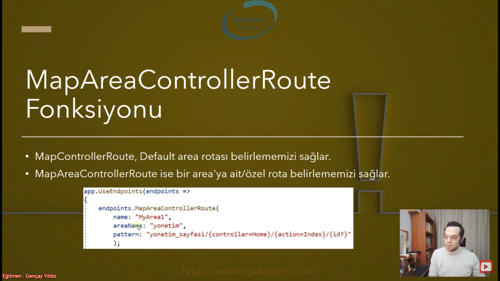
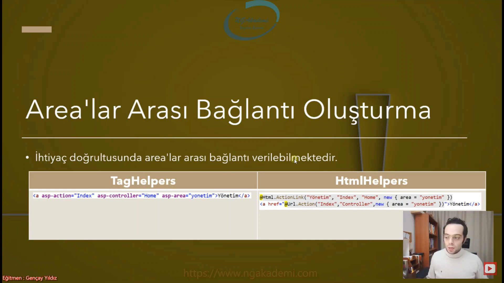

***
# 43) Asp.NET Core 5.0 - Baştan Sona Areas Yapılanması


## Area Nedir? Bir Web Uygulamasında Ne Amaçla Kullanılır?
- Web uygulamasında, farklı işlevsellikleri ayırmak için kullanılan özelliktir.

- Günümüzdeki herhangi bir web uygulamasını ele al. Bir web uygulamasında standart olarak bir normal kullanıcıların erişebildiği isteklerini yapabilidiği normal standart arayüz. Birde bu arayüzü yönetmemizi sağlayan arkada sadece yetkililerin erişebildiği/ulaşabildiği/işlem yapabildiği bir yönetim paneli. Temelde sıradan bir web sitesinde bile olması gereken 2 boyut budur. Tabiki de daha fazla farklı alanlarımız/yapılarımız olabilir. En temelde iki tane katman sayabiliriz. Biri yönetim paneli bir diğeri ise normal kullanıcıların erişebildiği arayüz. Dolayısıyla sen bu şekilde bir uygulama geliştireceksen Asp.NET Core mimarisinde bu katmanları area olarak ayarlayabilir geliştirebilirsin.

- Area farklı işlevselliklere uygulamanı ayırman için ve daha rahat daha efektif kodlama yapabilmen için sana bir özellik sağlıyor.

- Uygulamanın arayüzü sadece kullanıcıların erişebildiği belli bir işlevselliğe sahip ama yönetim paneli bambaşka bir işlevselliğe sahip. Dolayısıyla bunlar ayrı yapılanmalar ayrı işlevsellikler olduğu için sen arayüzü de yönetim panelini de farklı area'lar olarak tanımlayıp farklı area'larda geliştirebilirsin.

- Bu farklı işlevsellikler için farklı katmanda,bir route ayarlamamızı sağlayan ve bu katmanda o işleve özel yönetim sergileyen bir yapılanmadır.

- Bir web uygulaman var yönetim paneli bir area. Arayüz başka bir area Faturalandırma kısmı bambaşka bir area olarak tasarlanabilir. İstatistiksel kısım. İşlevsel olarak diğerlerini kendinden bağımsız bir şekilde geliştirmesi/geliştirilmesi gereken ayrı bir özen gereken farklı bir kısım bunların hepsi area olarak tasarlanabilir. Yani sen bir web uygulamasını ortaya koyarken Bu uygulamanın farklı işlevselliklerini ayrı area'larda tasarlayıp daha rahat şekilde yönetebilirsin.



- Her bir area, içerisinde View, Controller ve Model katmanı barındırabilir.

- Böylece Asp.NET Core uygulamalarında yönetilebilir küçük ve işlevsel gruplar oluşturulabilir.

- Sen baktığın zaman normal bir hepsiburada.com görüyor olabilirsin ama hepsiburada.com'u benim erişebildiğim kısmı farklı bir area'yken oranın yetkililerinin erişebildiği arka planda yönetim paneli dediğimiz kısmıda farklı area. Yani bunları daha da küçük parçalarda arealarda yönetip daha efektif çözümler hızlı geliştirmeler yapılabilmektedir.

- Area bölüm alan demek bir web uygulamasında mümkün mertebe küçük kendine özel spesifik işlemlerine alanlarına bölmeye yarayan bir özelliktir.



## Area Nerelerde Kullanılabilir?
- Yönetim panelleri,

- Faturalandırma sayfaları,

- İstatiksel paneller,

- İşlevsel modüller,

- Uygulamada mantıksal olarak ayrılabilen üst düzey işlevsel bileşenler

- Vs...

- İstediğin yerde area'yı kullan ama her sayfada her işlemde her noktada area'yı kullanmakta lüzumsuz bir kullanış tarzı olacaktır. Dolayısıyla buradaki anahtar cümle mantıksal olarak ayrılabilen üst düzey işlevsel bileşenler. Mantıklı parçalama yapman lazım. Örneğin Yönetim paneli arayüz. Yönetim paneli mantıksal olarak ayrılan üst düzey farklı bir işlevsel bir bileşen olduğu için farklı area'ya koyabilirsin. Personellerle ürünleri listelemek istiyorum. İkisini de arayüzde listeleyeceksen kategorileri listeleyeceksin ürünleri listeleyeceksin. Dolayısıyla kategorilerle ürünler olması gereken sadece 1 tane area'da bu çalışmayı yaparsın bunları ayrı ayrı area'da yapma gibi bir lüksün yok. Yaptın diyelim saçmalamış olursun.

- Herşeyi mantığıyla kullanmak lazım.



- Area Çok Katmanlı Mimari Değildir!

- Amacın herşeyi katmanlara bölmek değil. 

- Area dediğin yapılanma normalde web'de yani PL'de yani presentation layer katmanındaki içinde ayrı bir klasördür. Sana temelde o işlemi yapmanı sağlayan işlevsel alan ayrı bir rota sağlar. O rota üzerinden sen oradaki controller'lara erişirsin. 

- Area çok katmanlı mimarinin yanından bile geçmez. Web uygulamasındayız hala. Çok katmanlı mimari dediğinde nedir mantık? İşte business mantığını web uygulamasının dışında ayrı bir business layer'a kütüphaneye verirsin. Benzer mantıkla veritabanını başka bir kütüphaneye verirsin. Benzer mantıkla servisler olur farklı bir yere verirsin vs. vs. vs. Yani area çok ktanmanlı mimari olmamasının en önemli göstergesi çok katmanlı mimaride isteği sadece senin web uygulaman alacaktır. Ama area'da bütün area'lar istek alabilir. Çok katmanlı mimari de DAL ya da BL o istekleri alamaz. Yalnızca PL üzerinden o istekleri erişebiliriz. Oradaki BL'yi tetikleyeceksen senin web uygulaman ya da client'ın neyse onun üzerinden erişebilirsin sadece.

- Burada katmandan kasıt MVC'de controller view model katmanı var ya oradaki katman seviyesinde kullanıyoruz. MVC uygulaması içinde ayrı bir katman oluşturuyoruz. Çok katmanlıdaki katman değil burada kastettiğimiz



## Area Oluşturma



- Bir arayüzümüz var ve bu arayüz üzerinde biz kullanıcıyla arayüz üzerinden etkileşime giriyoruz. Kullanıcı arayüz üzerinde ürün listeleyebilir sepete ekleme yapabilir senle iletişime geçebilir ya da kendi profil bilgilerini vs. yönetiyor olabilir. Amma velakin orada sepetteki bilgileri görebilmemizi sağlayan yetkili insansak eğer ya da ürünleri arka planda web sitesine yüklememizi sağlayan bir panel olduğunu düşünelim. Şimdi bu panel eğer ki uygulamanın ana dizinindeyse yani kendi area'sındaysa biz bu area içinde hem yönetim işlemlerini yapsam hem arayüz işlemlerini yapsam hem faturalandırma işlemlerini yapsam mantıksal olarak ayrılması gereken bütün operasyonların hepsini burada yapsam burası olsa 100 200 tane controller ne kadar yönetilebilir ne kadar doğru bir yaklaşım olacaktır? Olmayacaktır. Biz diyoruz ki Ya kardeşim yönetim paneliyle ilgili kodlarımız belirli klasörün altında olsun. Faturalandırma ile ilgili kodlarımızda orada istek alacak bütün yapılanma vs. Faturalandırma ilgili bir klasörün altında olsun. Yani faturalandırma area'sının altında olsun.

- Area oluşturabilmek için Areas isimli bir klasör oluşturmalıyız.

- Area dediğimiz yapılanma MVC teknolojisinde kullanılıyor bu yaklaşımın dışında kullanıldıüını fazla göremezsiniz. MVC yaklaşımına daha uyumlu bir özellikten bahsediyoruz.

- Her bir area kendi içinde controller'a view'e ve model'a sahiptir. Yani küçük bir hücre gibi düşünebilirsiniz. Web hücresi gibi düşünebilirsiniz


## Area Attribute'u
- Area içerisindeki controller Area Attribute'u ile işaretlenmelidir.

- Area'lar arasında ortak olan controller'lar olabilir. Ortak derken farklı area'larda aynı isimde controllerlar olabilir.

- Bir uygulamada aynı isimde bir tane controller olması gerekiyor. Çünkü burada dizin önemli değil eğer ki controllerımız herhangi bir dizindeyse derinliği derecesi önemli değil uygulama içerisinde reflection'la buluyor ve ona göre ayağa kaldırılıyor. Uygulama içinde 2 tane farklı namespace'te aynı isimde controller bulundu ve bu controllera istek geldi diyelim. Hangisinden ayağa kaldıracak isteği bunun kararını veremiyor. Çünkü senin area'nın yönetim paneli area'sı olduğunu bildirmen gerekiyor.
 
- Böylece ilgili alanın uygulamadaki adı resmiyette belirtilmiş olacaktır.

-  Aksi taktirde farklı area'larda ki controller'lardan aynı isimde olanların çakışma ihtimalleri vardır.

- Ana arayüzünde ürünler sayfan var sadece kullanıcı ürünler sayfası üzerinden ürünlere erişip listeleme yapabiliyor. İşlem yapabiliyor. Yönetim panelinde de ürünler diye bir sayfan olacak orada da sen yönetici olarak yetkili bir adam olarak kullanıcıdan daha fazla yetkiyle işlem yapabileceksin. Dolayısıyla bu ikisinide ürünler isminde bir controller üzerinden yönetmek en doğal hakkın. Yani ben uygulamada area kullanıyorum çakışma olmasın diye gidip controller isimlerini farklı bir şekilde yönetimi zorlaştıracak şekilde seçmem ister istemez area kullanmanında amacından saptırıyor. Dolasıyla burada yapman gereken Area attirbute'uyla hangi controller'ın hangi area'yada olduğunu bildirmen gerekiyor.

- Biz herhangi bir area belirtmediğimiz sürece ana route area yani ana dizindeki uygulamanın HomeController'ı geçerli olacaktır.

```C#
//*********************** yonetim_paneli --> HomeController ***********************
using Microsoft.AspNetCore.Mvc;

namespace AreaExample.Areas.yonetim_paneli.Controllers
{
    [Area("yonetim_paneli")]// Sen ana dizinin controller'ı değilsin sen yönetimPaneli isimli areanın controller'ısın. Dolayısıyla ne zaman buna bir istek gelir o zaman sen tetiklenceksin.
    // Çakışma ihtimali olan controller'ları bu şekilde ayırırız.
    // İsimlendirirken hangi area ise o ismi vermek daha iyidir.
    // Senin uygulamaya koymuş olduğun controller'lar yapısal olarak hangi klasörün içerisinde olduğu önemli değil. Controller'ı sen area attribute'uyla işaretlediğin zaman bu attribute sayesinde sen esasında bu controller'a farklı bir rota vermiş oluyorsun. Asıl area'nın getirmiş olduğu özellik bu.
    public class HomeController : Controller
    {
        public IActionResult Index()
        {
            return View();
        }
    }
}
//*********************** fatura_paneli --> HomeController ***********************
using Microsoft.AspNetCore.Mvc;

namespace AreaExample.Areas.fatura_paneli.Controllers
{
    [Area("fatura_paneli")]// Bu controller'ları sen area'larla işaretlemesen bu uuygulamada aynı isimde birden fazla controller olamaz. Oluyorsa eğer bunları [Area()] ile işaretlemen lazım.
    public class HomeController : Controller
    {
        public IActionResult Index()
        {
            return View();
        }
    }
}
```



## Area'ya Route Belirleme
- Her bir area, içerisindeki controller'lara erişim için farklı bir route sağlamaktadır.

- Dolayısıyla bu route'ların tarafımızca tasarlanması gerekmektedir.

- Startup'taki/program.cs'teki `UseEndpoint()` middleware'ine gideceğiz. Burada `MapControllerRoute()` fonksiyonu üzerinden hangi area'nın hangi route'u kullanacağını belirleyebiliriz. 

- `"{area}/{controller=Home}/{action=Index}/{id?}"`=> `MapControllerRoute()` fonksiyonu ile yapmış olduğumuz rota bütün area'lar için uygulamadaki tüm area'lar için default olarak tanımlanmış bir rotadır diyebiliriz.

- Nasıl ki `controller` `action` sistem/mimari tarafından özelleştirilmiş bir parametreyse de `area` da özelleştirilmiş bir parametredir ve uygulamadaki area'lara karşılık gelir.

- exists : Route'un bir Area ile eşleşmesi için kısıtlama uygular. 

- Bu uygulamada farklı bir rota oluşturdum bu rota üzerinden hem klasör dizininde bir çalışma yapabiliyorum. Hem de esasında ilgili controller'ları farklı rotalarda tetikleyebiliyorum. Bunu zaten normalde de yapabiliriz. Onun için area'lar çok çok mükemmmel bir özellik değil yani varolan bir özelliği daha net şekilde kullanabiliriz? Esasında sen elindeki herhangi bir klasördeki bir controller'a özelleştirilmiş bir rota verebilir misin? verebilirsin. Ama bunu böyle genel şekilde veremezsin. Yani her birine tek tek vermek lazım. Ama area'lar sayesinde sen bir area attribute'unun bir grup oluşturdun diyelim elinde birçok controller var hepsini aynı değerdeki area attribute'u ile işaretledin diyelim bunların hepsini tek bir özel rota verebiliyorsun. Area bunu sağlıyor bir alan oluşturuyor onlara tek bir bütün, bir grup olarak değerlendirmeyi sağlayabiliyor.

- Area attribute'unda yazan değer önemlidir klasör isimleri değil.

- Bir de ayrıyetten area'lara özel de rota oluşturabilmekteyiz.

```C#
//*********************** Program.cs ***********************
app.UseEndpoints(endpoints =>
{
    endpoints.MapControllerRoute(
            name: "areaDefault",
            pattern: "{area:exists}/{controller=Home}/{action=Index}/{id?}"// bu şekilde gelen bir rotada eğer ki en başta area geliyorsa hangi area'ysa onun altındaki controller'ı ve action'ı tetiklesin demiş oluyorum.
            // exists => elimizdeki area'larla eşleştirmeyi sağlaması için bu constraint'i uygularız.
            //Bu rotada hangi area bildirilmişse o tetiklenmiş olacaktır.
            );

    endpoints.MapControllerRoute(
        name: "default",
        pattern: "{controller=Home}/{action=Index}/{id?}");
});
```



## MapAreaControllerRoute Fonksiyonu
- MapControllerRoute, Default area rotası belirlememizi sağlar.

- MapAreaControllerRouteise bir area'ya ait/özel rota belirlememizi sağlar.

- burada kullanılan areaName parametresi area attribute'unda bildirdiğin değerle aynı olmalıdır. Hangi area'ların tetikleneceği yani buradaki rotanın area'lara ait olduğunu bildirirken areaName üzeriden buradaki parametreyi değerlendirmiş oluyorsun. Bir önceki kullanımda area parametresine karşılık burada areaName parametresi gelmektedir.

- Area'lara global bir tanımlama değil area'lara özel bir tanımlama yapmak için kullanılır.

- Area dediğimiz yapılanma bizim için bir gruplama işlemi bir rota belirleme işlemini sağlayabiliyor.

```C#
app.UseEndpoints(endpoints =>
{
    endpoints.MapAreaControllerRoute(
        name:"yonetim",
        areaName: "yonetim_paneli",//Area attribute'unda yazılmış bu değere sahip olan controller'larda geçerli olacaktır.
        // bu area değerine sahip tüm controller'lar buradaki pattern tarafından pattern'daki rotayı benimseyeceklerdir.
        pattern:"admin/{controller=Home}/{action=Index}"
        );//yonetim_paneli area değerin sahip olan bütün controller'lar bu rotadan değer alabileceklerdir. Bu rota üzerinden istek alabileceklerdir.

    endpoints.MapAreaControllerRoute(
       name: "fatura",
       areaName: "fatura_paneli",
       pattern: "fatura/{controller=Home}/{action=Index}");

   endpoints.MapControllerRoute(
        name: "default",
        pattern: "{controller=Home}/{action=Index}/{id?}");
});
```



## Area'lar Arası Bağlantı Oluşturma
- İhtiyaç doğrultusunda area'lar arası bağlantı verilebilmektedir.

- Area'lar arasında link oluşturmak için bunu taghelper ve htmlhelper'la sağlayabiliyoruz.

- `@Html.ActionLink("Yönetim","Index","Home", new {area = "yonetim"})` => `ActionLink()` kullanıyorsak 4. parametredeki `new {area = "yonetim"}` new parametresiyle area property'sini bildirerek hangi area'daki ilgili controller'ın ilgili action'ına erişemk istiyorsam bu şekilde bildirmem yeterli olacaktır.

- `<a href=@Url.Action("Index","Controller", new {area = "yonetim"})>Yönetim</a>` => `Url.Action` kullanıyorsak 3. parametrede `new {area = "yonetim"}` işlemini yapmanız gerekecektir.

- `<a asp-action="Index" asp-controller="Home" asp-area="yonetim">Yönetim</a> `=> Taghelper'da ise asp-area taghlper'ı mevcut burada hangi area altındaki controller action'a link oluşturacaksanız bu şekilde belirtmeniz yeterli olacaktır.



## Area'lar Arası Veri Taşıma
- Birden fazla area'nız var ve bir area'da ürettiğiniz herhangi bir değeri farklı bir area'ya gönderme ihtiyacı hissettiniz böyle bir durumda veri taşıma kontrollerinden `TempData`'yı kullanabilirsiniz.

- `TempData` action'lar arasında veri taşımamızı sağlayan bir veri taşıma kontrolüdür. Dolayısıyla herhangi bir area'nın altındaki controller'ın altındaki action'da üretilen bir değeri ya da yakalanan bir datayı farklı bir area'daki controller'a taşımak istiyorsanız yine `TempData`yı kullanabilirsiniz.

- Farklı yöntemlerde kullanabilirsiniz statik bir metodoloji de uygulayabilirsiniz yani elinizde herhangi bir statik değer olabilir. Bir property ayarlayabilirsiniz oraya koyduğunuz değeri farklı area'da çekebilirsiniz. Genellikle ama `TempData` ile verilerimizi taşırız.

- Area yapılanması çok aman aman önemli bir yapılanma değil belki ama bir MVC uygulamasında controller'larımızı gruplamamızı ve gruplayarak belirli rotalara tabi tutmamızı sağlayan bir özelliktir.

```C#
//*********************** fatura_paneli --> HomeController ***********************
public class HomeController : Controller
{
    public IActionResult Index()
    {
        var data = TempData["data"].ToString();
        return View();
    }
}

//*********************** yonetim_paneli --> HomeController ***********************
public class HomeController : Controller
{
    public IActionResult Index()
    {
        TempData["data"] = "sebepsiz boş yere ayrılacaksan...";
        //return RedirectToAction("Index","Home");// Eğer bu şekilde hiçbir bildiride bulunmazsak herhangi bir area bildirisinde bulunmazsak mevcudiyetteki o anki area hangisiyse onun
altında ilgili action'ı arayacaktır. İlgili controller nesnesi üretip ona göre actipn tetikleyecektir.
        return RedirectToAction("Index", "Home", new {area = "fatura_paneli" });
    }
}

```


## C# Examples
```C#
//*********************** yonetim_paneli --> HomeController ***********************
using Microsoft.AspNetCore.Mvc;

namespace AreaExample.Areas.yonetim_paneli.Controllers
{
    [Area("yonetim_paneli")]// Sen ana dizinin controller'ı değilsin sen yönetimPaneli isimli areanın controller'ısın. Dolayısıyla ne zaman buna bir istek gelir o zaman sen tetiklenceksin.
    // Çakışma ihtimali olan controller'ları bu şekilde ayırırız.
    // İsimlendirirken hangi area ise o ismi vermek daha iyidir.
    // Senin uygulamaya koymuş olduğun controller'lar yapısal olarak hangi klasörün içerisinde olduğu önemli değil. Controller'ı sen area attribute'uyla işaretlediğin zaman bu attribute sayesinde sen esasında bu controller'a farklı bir rota vermiş oluyorsun. Asıl area'nın getirmiş olduğu özellik bu.
    public class HomeController : Controller
    {
        public IActionResult Index()
        {
            TempData["data"] = "sebepsiz boş yere ayrılacaksan...";
            //return RedirectToAction("Index","Home");// Eğer bu şekilde hiçbir bildiride bulunmazsak herhangi bir area bildirisinde bulunmazsak mevcudiyetteki o anki area hangisiyse onun altında ilgili action'ı arayacaktır. İlgili controller nesnesi üretip ona göre actipn tetikleyecektir.
            return RedirectToAction("Index", "Home", new {area = "fatura_paneli" });
        }
    }
}

//*********************** fatura_paneli --> HomeController ***********************
using Microsoft.AspNetCore.Mvc;

namespace AreaExample.Areas.fatura_paneli.Controllers
{
    [Area("fatura_paneli")]// Bu controller'ları sen area'larla işaretlemesen bu uuygulamada aynı isimde birden fazla controller olamaz. Oluyorsa eğer bunları [Area()] ile işaretlemen lazım.
    public class HomeController : Controller
    {
        public IActionResult Index()
        {
            var data = TempData["data"].ToString();
            return View();
        }
    }
}

//*********************** program.cs ***********************
using Microsoft.AspNetCore.Builder;

var builder = WebApplication.CreateBuilder(args);

// Add services to the container.
builder.Services.AddControllersWithViews();

var app = builder.Build();

// Configure the HTTP request pipeline.
if (!app.Environment.IsDevelopment())
{
    app.UseExceptionHandler("/Home/Error");
    // The default HSTS value is 30 days. You may want to change this for production scenarios, see https://aka.ms/aspnetcore-hsts.
    app.UseHsts();
}

app.UseHttpsRedirection();
app.UseStaticFiles();

app.UseRouting();

app.UseAuthorization();

app.UseEndpoints(endpoints =>
{
    endpoints.MapAreaControllerRoute(
        name:"yonetim",
        areaName: "yonetim_paneli",//Area attribute'unda yazılmış bu değere sahip olan controller'larda geçerli olacaktır.
        // bu area değerine sahip tüm controller'lar buradaki pattern tarafından pattern'daki rotayı benimseyeceklerdir.
        pattern:"admin/{controller=Home}/{action=Index}"
        );//yonetim_paneli area değerin sahip olan bütün controller'lar bu rotadan değer alabileceklerdir. Bu rota üzerinden istek alabileceklerdir.

    endpoints.MapAreaControllerRoute(
       name: "fatura",
       areaName: "fatura_paneli",
       pattern: "fatura/{controller=Home}/{action=Index}");

   //endpoints.MapControllerRoute(
   //        name: "areaDefault",
   //        pattern: "{area:exists}/{controller=Home}/{action=Index}/{id?}"// bu şekilde gelen bir rotada eğer ki en başta area geliyorsa hangi area'ysa onun altındaki controller'ı ve action'ı tetiklesin demiş oluyorum.
   //        // exists => elimizdeki area'larla eşleştirmeyi sağlaması için bu constraint'i uygularız.
   //        //Bu rotada hangi area bildirilmişse o tetiklenmiş olacaktır.
   //        );

   endpoints.MapControllerRoute(
        name: "default",
        pattern: "{controller=Home}/{action=Index}/{id?}");
});

app.Run();
``` 
