# 44) Asp.NET Core 5.0 - Derinlemesine ViewModel & DTO Yapılarının İncelemesi
- Viewmodel ve DTO dediğimiz bu yapılanmalar herhangi bir mimariye ya da dile bağlı yapılanmalar değildir. Bunlar yazılımsal terminolojik kavramlar.

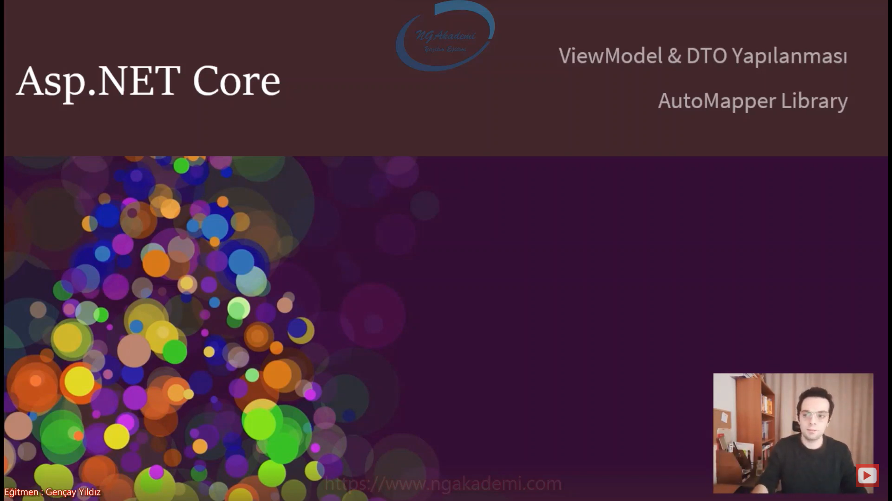

## ViewModel Nedir?
- ViewModel, temelde iki farklı senaryoya karşılık sorumluluk üstlenen ve biz yazılım geliştiricilerin işini kolaylaştıran operasyonel nesnelerdir.
    1. Senaryo => OOP yapılanmasında bir modelin kullanıcıyla etkileşimi neticesinde kullanılan ve esas datanın memberlarını temsil eden ve süreçte ilgili model yerine veri taşıma/transfer operasyonunu üstlenen bir nesnedir.
    2. Senaryo => Birden fazla modeli/değeri/veriyi tek bir nesne üzerinde birleştirme görevi gören nesnedir.

- ViewModel adı üstünde View'in sunum yaptığımız kısmın modeli.

- Backend'de üretilen herhangi bir data'yı direkt view'e gönderir misiniz? Muhtemelen göndermezsiniz göndermemeniz gerekiyor.

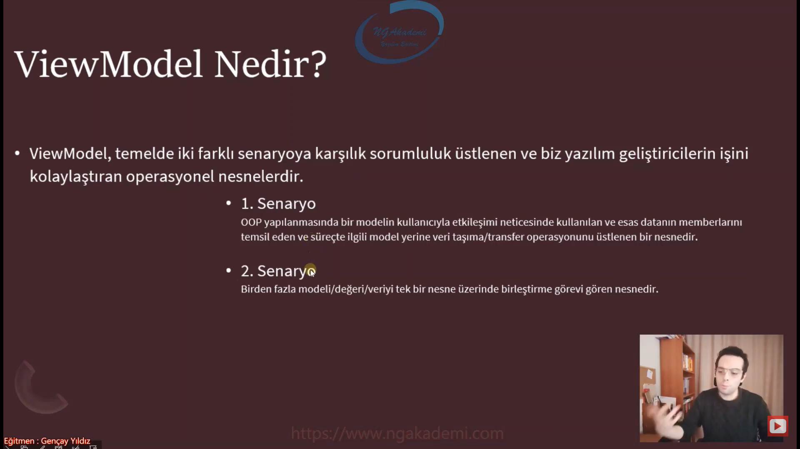

- Diyelim ki ben backend'de bir veri ürettim ürettiğim veri a b c d değerlerine sahip bir nesne ürettim ya da bir veri bütünlüğü oluşturdum farketmiyor. Elimdeki bu veriyi ben view'e gönderirken eğer ki view'de sadece a ve c kısmıı kullanacaksam ben bu veriyi topyekün buraya göndermek istemem. Dolayısıyla sadece a ve c'yi göndermek isterim. İşte böyle bir durumda ben bu veriyi topyekün buraya göndermektense bunu view'deki ilgili kullanılacak datalara uygun bir şekilde modele dönüştürürüm. İşte bu model bizim için ViewModel olacaktır. Nihayetinde view'de a ve c kullanılıyorsa sadece öyle bir nesne oluşturacağım ki ben içinde sadece a ve c alanlarını barındıracak ve ilgili dataları ilgili alanlara atayacağım. Mesela a'yı a'ya c'yi c'ye atayacağım. Bu viewmodel nesnesini direkt view'e gönderiyor olacağım. İşte bu nesne viewle muhattap olacak. Nihayetinde bu nesne view'de kullanılan datalara view'in ihtiyacı olan dataları taşıyan onun temsil eden bir model değil mi?

- View'de veritabanından backend'den gelecek olan dataları view'e uygun bir şekilde modelleyerek göndermemizi sağlayan transfer nesnesine biz viewmodel diyoruz.

- Backend'de birden fazla data oluşturdun şimdi birden fazla oluşturduğun bu dataları senin bir yere göndermen lazım. Herhangi bir tüketiciye herhangi bir view'e göndermen lazım. İşte bunların hepsini tek tek göndermektense biz bunları tek bir nesnenin altında topluyoruz. Şidmi bu toplamış olduğum nesneleri modelliyorum ve view'e gönderirken bu nesneleri bu şekilde gönderiyorum. Nihayetinde view buradaki viewmodel dediğimiz nesneyi alacak ve içerisinde birden fazla nesneye bu şekilde erişiyor olacak. Bu viewmodel sayesinde birden fazla nesne tek seferde biz tuple olarak yani çoklu nesne olarak gönderebiliyoruz. Tabi tuple nesnesiyle de gönderebilirsiniz ama burada viewmodel nesnesinde göndermeyi tercih edebilirsiniz.

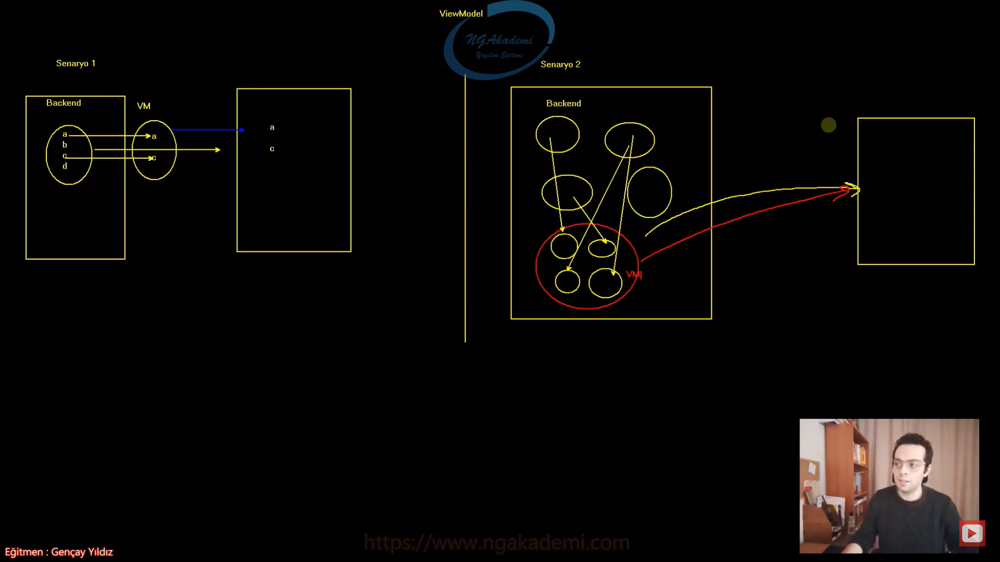

## DTO(Data Transfer Object) Nedir?
- DTO(Data Transfer Object)

- Veri transferini yapmamızı sağlayan bir nesnedir.

- Herhangi bir davranışı olmayan ve uygulamanın çeşitli yerlerinde yalnızcabir veri tüketimi ve iletimi için kullanılan, veritabanındaki herhangi bir verinin transfer nesnesidir/karşılığıdır/görünümüdür.

- İlgili veriyi sen bir yere göndereceksen o verinin sadece görünümü lazım olan kısmını gönderiyorsun.

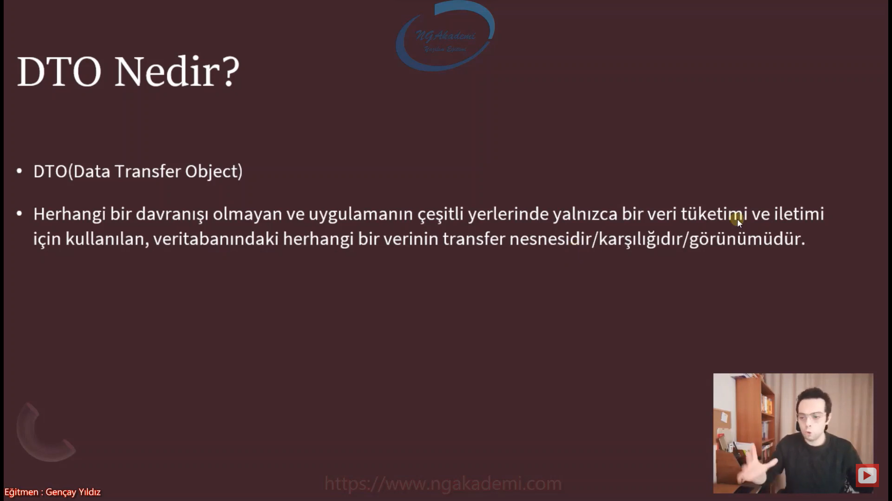

## ViewModel - DTO Nesne Karşılaştırması
|ViewModel|DTO|
|---------|---|
|Kullanıcıya sunulacak verinin view'e uygun/view'in beklediği şekilde tasarlanmış modelidir.|Bir verinin(genellikle veritabanından gelen verinin) transfer modellemesidir. Transfer edilecek olan ilgili verideki sadece ihtiyaç olunan dataları temsil eder.|
|Veriyi görünüm/sunum/presentation için anlamlı hale getirir.|Görünüm/sunum/presentation için kullanılabilir lakin bunun dışında uygulamanın herhangi bir katmanında çeşitli veri tüketimi ve transferi içinde kullanılmaktadır.|
|İçerisinde bir veya birden fazla DTO temsil edebilir.|Herhangi bir fonksiyonellik barındırmaz.|
|DTO'ya nazaran daha karmaşıktır|Salt veriyi temsil eder.|

- Bir yandan buradaki view'e illaki MVC'deki view olarak düşünmene gerek yok bu client'ta olabilir herhangi bir client'ın beklediği tarzda bir data da olabilir. Sen client'a datayı gönderirken bu datayı hangi türde gönderiyorsan o view'in beklemiş olduğu o client'ın beklemiş olduğu türe biz viewmodel diyoruz. Nihayetinde beklediği şekilde ilgili veriyi formatlandırıp gönderiyorsun işte o formatlandırma yapısı bizim için view'in modeli oluyor.

- Sen bir veriyi bir yerden başka bir yere transfer ederken buradaki transfer süreci illaki view olmasına gerek yok işte burada can alıcı noktalardan biri bu. Şimdi viewmodel sadece view'e gönderilen nesneleri temsil ederken DTO sadece view'e göndermene gerek yok çok katmanlı mimaride örneğin DAL'dan BL'ye ya da BL'den herhangi bir yere veri gönderiyorsan o verinin transfer sürecinde dönüşümü sağlayıp sadece transfer edilecek dataları taşıyacak olan nesne DTO'dur.

- ViewModel view'e veri gönderir DTO backend'de istediğin herhangi bir yere veri taşımasıyla kullandığın türdür/nesnedir.

- ViewModel direkt sunum ypaarken kullandığımız bir nesneyken DTO hem sunum yaparkende kullanabilirsiniz hem de backend'de programatik dönüşümlerde/transferlerde kullandığımız bir nesnedir.

- Uygulama içinde veri transferi yapacaksan ViewModel demiyoruz biz ona DTO diyoruz.

- Viewmodel'da veriyi view'e(görünüme) gönderirken gönderdiğin veri üzerinde işlem yapmanı sağlayan fonksiyonlar barındırabilmekte ama DTO sadece ham veridir salt veridir. Haliyle içinde fonksiyon barındırılmaz sadece transfer edersin.

- Elindeki bir DTO'yu sen view katmanına client'a gönderirken bunu ve bunun gibi birden çok DTO'yu tek bir ViewModel altında toplayıp gönderebilirsin. DAha kompleks bir tasarıma sahiptir ViewModel. Ama DTO salt bir veridir. Direkt veritabanındaki verinin karşılığıdır. Sadece gönderilecek olan verileri kendi içerisinde temsil eder.

- ViewModel'la DTO birbirlerine çok benziyor. Yani ikisini ayırırken ViewModel içerisinde fonksiyon barındırabiliyor ama DTO barındırmıyor.

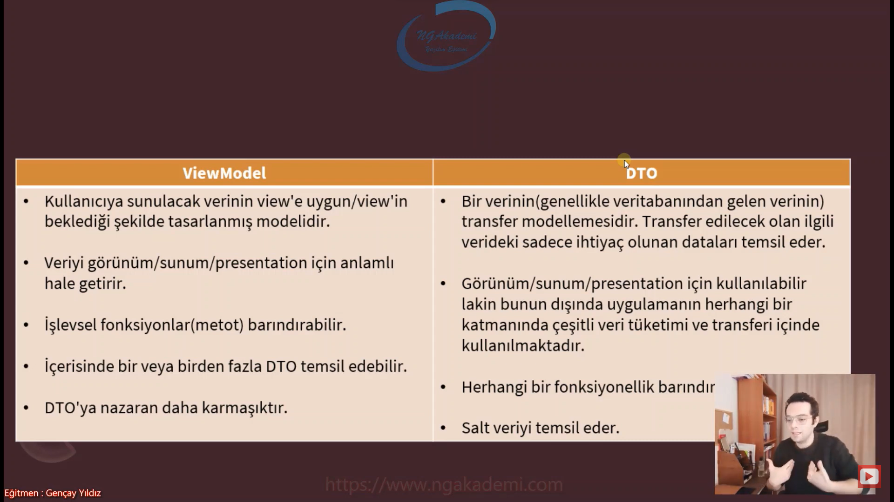

## ViewModel ve DTO'da ki Temel Amaç Nedir?
- ViewModel'da backend'de üretilen veri tek bir viewmodel üzerinde birden fazla veriyi tek bir viewmodel tasarlıyoruz ve bunu view'e bu şekilde gönderiyoruz. ViewModel içerisinde function'da bulunabiliyor. Backend'de üretilen birden fazla datayı ayrı ayrı göndermekten ziyade backend'de üretilmiş herhangi bir veriyide sen viewmodel üzerinde yani herhangi bir nesneyi de viewmodel üzerinde ilgili view'e gönderebilecek datalarını ayıklayıp bir nesne oluşturup o şekilde de gönderebilirsin. Yani içinde fonksiyonda olabilir.

- DTO nesnesi genellikle biz view'e gönderilen nesne olarak kullanmayız belki ama yine kullanabiliyorsun. Genellikle SQL'den gelen dataların işte backend içindeki herhangi bir noktadan başka bir noktaya transferi sürecinde sadece kullanılacak olan datalarını temsil eden nesnedir.

- SQL'den data gelmiş gelen datanın belli başlı verilerini kullanacağım örneğin personel diye bir liste gelmiş. Gelen bu personel nesnesinin/listesinin her bir nesnesinin içerisindeki adı soyadını sağa sola transfer etmek istiyorsam ve bunu sadecec backend içinde yapacaksam biz bunu data transfer object olarak tanımlıyoruz.

- Nihayetinde şöyle bir değerlendirdiğimizde ViewModel'la DTO birbirlerine çok benziyor. Amma velakin ikisinin arasındaki derin fark birinde function tanımlanırken diğerinde tanımlanmıyor biri birden fazla DTO'yu içerisinde temsil edebilirken bir diğerinde sadece ilgili taşıyacağı verinin içindeki alanları temsil etmek var başka bişey yok.

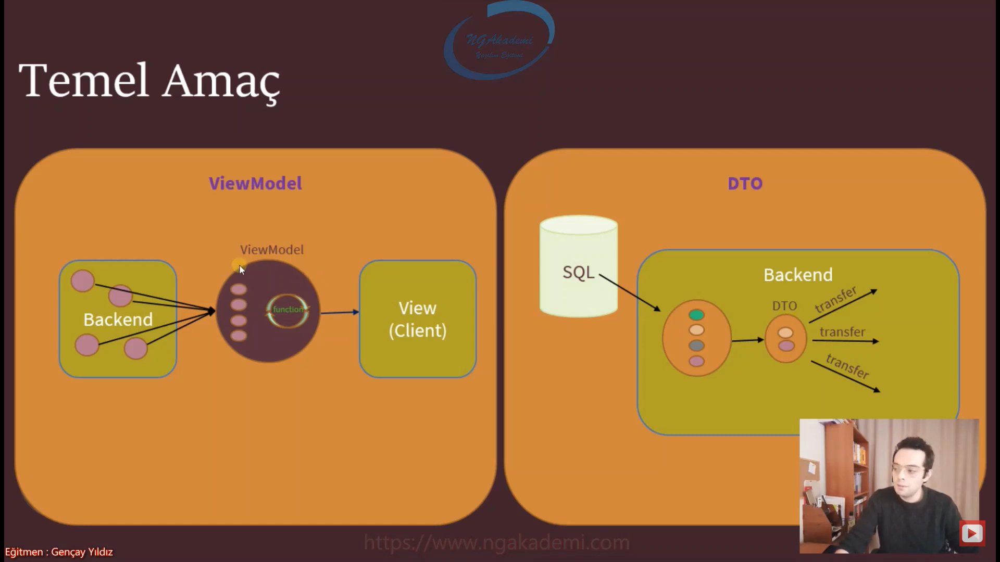

## Senaryo 1 - Bir Model’in View’de ki Etkileşimine Uygun Parçasını Temsil Etme
- Bir Model’in View’de ki Etkileşimine Uygun Parçasını Temsil Etme

- Benim elimde bir model var ve etkileşime girmiş olduğu view'deki veri transferine uygun bir parçayı temsil ediyor. Şimdi ben ne alıyorum view'den bir personelin adını ve soyadını alıyorum değil mi? Şidmi etkileşime giren bu nesnenin uygun parçaları sadece adı ve soyadı işte ben orada PersonelCreateVM isminde bir viewmodel oluşturdum. Bu viewmodel'ın içerisinde ilgili personeldeki sadece adı ve soyadına karşılık gelen alanları temsil ediyorum.

- Esasında zaten %99 bu amaçla kullanacaksınız.

- Best practices açısından veritabanından gelen veriler/datalar direkt olarak ilgili view'lere client'lara gönderilmez. MVC'de de çalışsan API'da da çalışsan direkt veritabanından elde etmiş olduğun MVC model türündeki verileri direkt client'a ya da view'e göndermezsin bunları viewmodel'a belirli formatlara dönüştürür o farmatlarla artık view'de hangi verileriyle kullanacaksan onlara dönüştürerek o şekilde gönderirsin ki daha efektif çözümler sağlayabilesin.

```C#
//******************* PersonelController *******************
public class PersonelController : Controller
{
    [HttpPost]
    public IActionResult Index(PersonelCreateVM personelCreateVM)
    {
        //....
        return View();
    }
    public IActionResult Listele()
    {
        List<PersonelListeVM> personeller = new List<Personel>()
        {
            new(){Adi = "A", Soyadi = "B"},
            new(){Adi = "A1", Soyadi = "B"},
            new(){Adi = "A2", Soyadi = "B"},
            new(){Adi = "A3", Soyadi = "B"},
            new(){Adi = "A4", Soyadi = "B"},
            new(){Adi = "A5", Soyadi = "B"}

        }.Select(p => new PersonelListeVM() { Adi = p.Adi, Soyadi = p.Soyadi, Pozisyon = p.Pozisyon }).ToList();//Viewmodel'ım neyse ilgili kullanacağı muhattap olacağı veri türü neyse sadece o verilerle o verileri taşıyan bir nesne oluşturdum onu ilgili view'e client'a gönderiyorum.

        return View(personeller);
    }
}

//******************* Personel *******************
//Entity Model: veritabanında herhangi bir tabloya karşılık gelen model
public class Personel
{
    public int Id { get; set; }
    public string Adi { get; set; }
    public string Soyadi { get; set; }
    public string Pozisyon { get; set; }
    public int Maas { get; set; }
    public bool MedeniHal { get; set; }
}

//******************* PersonelCreateVM *******************
public class PersonelCreateVM//Ekstradan fazladan bir alan tutmuyor buradaki viewmodel'imiz ne taşıyacaksa o alana karşılık gelen property'lere sahip.
{
    //ViewModel'da sadece taşınacak olan veri temsil edilir.
    public string Adi { get; set; }
    public string Soyadi { get; set; }
}
//Viewmodel ve DTO nesneleri kendi içerisinde modelledikleri datanın hangi verilerini/property'lerini alıyorlarsa birebir aynı isimde vermeye dikkat edin çünkü automapper gibi hazır kütüphanelerle dönüşümler sağlanırken burada birebir eşleşen isimler kullanılıyor. Ama bu zorunlu değildir. Farklı isimde kullanmayı çok fazla tavsiye etmeyiz.
//Aynı ismi kullandığın sürece kodun gelişim ve bakım süresi de oradaki maliyette düşürülmüş olacaktır.

//******************* PersonelListeVM *******************
public class PersonelListeVM//View'de kullanılacak olan datanın hangi verileri kullanılıyorsa onları temsil eden bir viewmodel oluşturdum haliyle benim controller'ım bu viewmodel'a uygun bir şekilde verileri üretmeli ve o şekilde view'e göndermeli ya da API'dan client'a göndermeli.
{
    public string Adi { get; set; }
    public string Soyadi { get; set; }
    public string Pozisyon { get; set; }
}

//******************* Index.cshtml *******************
@model PersonelCreateVM

<form asp-action="Index" asp-controller="Personel" method="post">
    <input type="text" asp-for="Adi" /><br />
    <input type="text" asp-for="Soyadi" /><br />
    <button>Gönder</button>
</form>

// sen  buradan bir veri göndereceksin içerisinde Adı var Soyadı var Medeni Hali var. Maaşı var Pozisyonu var.
// burada bir nesne oluşturacak sen bunun sadece adını ve soyadını kullanacaksın diğerleri nerede diğerlerini kullanmayacaksın Madem öyle diğerlerini kullanmayacaksan bu view'le bu view'den besleyen backend'in arasında iletişimi sağlayacak olan model Personel olmamalı dolayısıyla sadece adını ve soyadını taşıyacak bir model tasarlamalıyız. İşte bu model view'i baz alarak tasarlanıyor. Biz buna viewmodel diyoruz. 
// View'de kullanılacak olan veriler illaki view'e gönderilen veriler olmak zorunda değil. View'den gelecek olan verileri de karşılayacak olan model'a biz viewmodel diyoruz. View'e gönderilecek ve View'den gelecek olan her iki türlü/yönlü transferi sağlayacak olan nesneye viewmodel nesnesi diyoruz. 
// Dolayısıyla bizim öyle bir nesne oluşturmamız lazım ki buradaki lüzumsuz içeriklere sahip olmamalı sadece ben buradan hangilerini gönderiyorsam ve buraya hangileri geliyorsa onları temsil eden bir nesne olması gerekiyor dolayısıyla bu nesneye biz viewmodel nesnesi diyoruz. 
// Her bir eyleme/view'e karşılık viewmodel oluşturmamız gerekecek. 
// Hangi eyleme karşılık viewmodel oluşturuyorsan isminde bildirmen senin avantajına olacaktır. 

//******************* Listele.cshtml *******************
@model List<PersonelListeVM>//Haliyle bu nesne senin bu view'de kullanacağın dataları taşıyacağından dolayı ekstra bir veri yoğunluğu olmayacak bir veri karışıklığıda söz konusu olmayacaktır. Daha efektif daha best practice'lere uygun bir kod bir çözüm getirmiş olacağız.

<ul>
    @foreach (PersonelListeVM personel in Model)
    {
        <li>@personel.Adi @personel.Soyadi @personel.Pozisyon</li>
    }
</ul>
```


- Kullanıcıya sunulan hiçbir veri direkt olarak veritabanındaki entity türünden olmamalıdır. Bu tarz durumlarda ViewModel kullanılmalıdır.

- Senin göndereceğin herhangi bir veri bir kitap verisi bir ürün verisi bir personel farketmiyor artık hangi veriyi gönderiyorsan gönder bu veriyi view'deki ilgili verinin kullanılacak alanlarına uygun alanları temsil eden bir viewmodella göndermeni kesinlikle tavisye ediyoruz. 

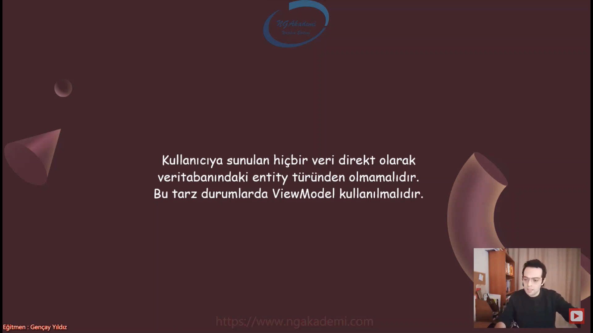

## Senaryo 2 - Birden Fazla Nesneyi Tek Bir Nesneye Bağlama 
- Birden fazla nesneyi (ki bu nesneler birbirlerinden farklı türlerde olabilir farklı işlevselliklere sahip olablir) tek bir nesne altında birleştirerek buradaki birleştirme bildiğiniz referans mantığı referans ederek o şekilde bir yere transfer etmeyi view'e göndermeyi vs. sağlayan nesne görevidir. Bunu da viewmodel'la gerçekleştirmekteyiz.

```C#
//*********************** HomeController ***********************
public IActionResult Get()
{
    //Üç tane veriyi Get'in view'ine göndermek istiyorsam gerçekleştirebileceğim 2 tane yol vardır.
    // Tuple nesne kullanabilirim. Tuple nesnesiyle gönderebilirim.
    //Tuple nesnesiyle zaten viewmodel'ın 2. sorumluluğu aynı işlemi görmekte yani birden fazla farklı türdeki nesneleri ya da aynı türde de olabilir birden fazla nesneyi tek bir nesnede birleştirmemizi
sağlayan bir işlem görüyor çoklu nesne oluşturmamızı sağlıyor.
    (Personel, Musteri, Urun) nesne = (new Personel(), new Musteri(), new Urun());

    //Fiziksel bir viewmodel oluşturarakta bu birleştirme işlemini gerçekleştirebilirsin.
    XVM xVM = new XVM() { Personel = new(), Musteri = new(), Urun = new() };
    return View();
}

//*********************** XVM ***********************
public class XVM// Bu nesne sayesinde 3 tane nesneyi tek bir nesnede toplayıp ona göre işlem gerçekleştirip bir yere transfer edebiliyorum vs.
{
    public Personel Personel { get; set; }
    public Urun Urun { get; set; }
    public Musteri Musteri { get; set; }
}
```


## Sözleşme/Kontrat Mantığı Nedir?
- Backend'de üretilen bir verinin client'a gönderilmesi için tasarlanan ViewModel o işlemin sözleşmesi/kontratı olmaktadır.

- Backend'de üretilen herhangi bir veriyi ister MVC'de ister API'da farketmiyor client'a sunarken bu göndereceğin veriyi viewmodel'la gönderiyorsan eğer bu viewmodel'ın türü bir sözleşme olarak nitelendirilir. Yani bir kontrattır.

- Backend'de üretmiş olduğum veriyi örneğin bu veride a b ve c alanlarına sahip olsun. ve bu verilerde ViewModel'da olsun. Farklı değerlerden üretip böyle bir formatlandırma yaptım. Böyle viewmodel nesnesini oluşturdum. Herhangi bir client'a gönderdiğimde client gelecek olan verinin oluşturduğum ViewModel formatında olacağını bilecektir. haliyle burada da kendine has hangi teknolojiyle kullanıyorsanız client'ta bu veriyi karşılayacak bir model/entity oluşturmanız gerekiyor. Bu oluşturduğunuz model viewmodel'in muadili olacaktır. Client'taki view'de de bir tane model oluşturmamız gerekiyor ki gelecek olan veriye birebir aynı şekilde aynı imzalara sahip bir imza oluşturmamız gerekiyor ki bu bizim gelecek olan veriyi tam olarak karşılayabilsin. İşte biz buna sözleşme diyoruz. Şimdi senin client'ın gelecek olan veriyi tam olarak modellemeyen örneğin c olmayan bir model oluşturursa a'yı alır b'yi alır ama c'yi alamaz. Yani tam olarak gelecek veriyi karşılayacak bir sözleşme bir kontrat'a ihtiyacım var. İşte buradaki kontrat'ın türü a b c değerlerini barındıran viewmodel olacaktır. Her iki tarafta da olması gereken bir türdür.

- Client'ında angular/react/vue.js/JQuery/Ahmet/Mehmet olabilir farketmiyor backend'den gelecek olan datayı bu client'larda karşılayacak bir tane nesne oluşturacaksın bu senin artık prensibin olacak oluşturmuş olduğun bu nesneyi yani sınıf/entityle ilgili veriyi karşılayacaksın. Hem backend'de hem de client'ta olan bu sınıf sayesinde ikiside farklı dillerde/platformlarda olabilir ama içerik olarak sözleşme yani bir kontrat temelli olacak. Yani sen C# dilinde göndermiş olduğun class türündeki nesneyi client'ta typescript türünden yakalayabileceksin ikisinde de aynı mahiyette yani a b c alanlarını karşılayabilecek bir tür olacağından dolayı bir sözleşme olacaktır.

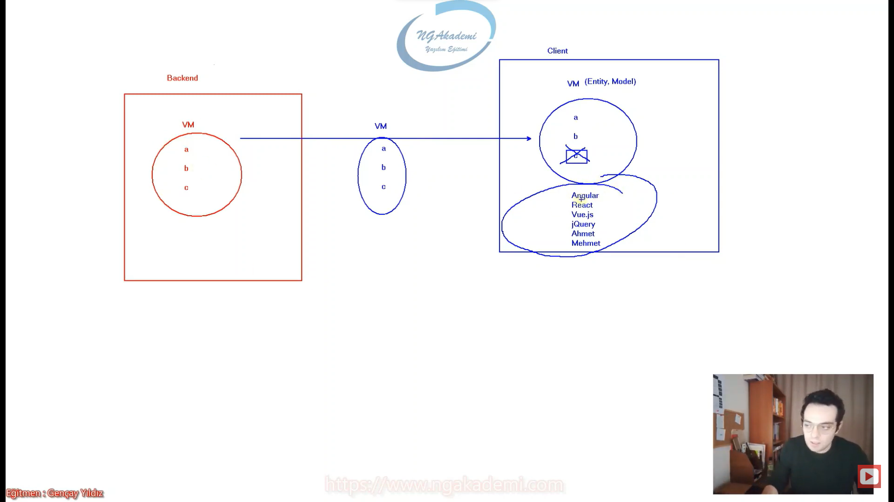

- Haliyle Backend'den gelecek datayı client'ın uygun formatta karşılayabilmesi için kesinlikle o türden bir nesne oluşturması gerekecektir.

- Angular'da React'ta çalışıyorsanız API'dan gelen backend'den gelen datayı karşılayacak kesinlikle aynı içeriğe sahip bir model tasarlamayı unutmayın.

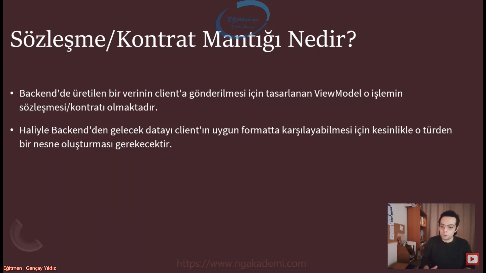

## ViewModel'lar da Validation Durumları
- Viewmodel'da kullanıcıya sunacağın veriyi bir viewmodel'da tasarlayıp o şekilde gönderiyordun aynı şekilde kullanıcının sana göndereceği veriyi de o viewmodel türünden alıyorsun. Dolayısıyla kullanıcıdan sana gelen verileri viewmodel türünde aldın. Aldığın bu veriyi şimdi bir şekilde doğrulaman lazım değil mi yani iş kuralı gereği doğrulaman gerekiyor. Kontrol etmen gerekiyor. İşte biz bu kontrollere validation'lar diyoruz. 

- Kullanıcıdan alınan verileri kesinlikle veritabanı tablolarının karşılığı olan entity modelleri şeklinde karşılamayacağız. Viewmodel türünde karşılayacağız. Viewmodel olarak alınan bu verilerin üzerinde gelecek olan veriyi ben anlık olarak o viewmodelda validasyona tabi tutmalıyım. Nihayetinde sen bunu başka bir yerde validasyona tutamazsın. Ya da tutuyorsan zaten saçma sapan bir işlem yapıyorsun. Hangi türde veriyi taşıyosan o türün üzerinde validasyon işlemlerini gerçekleştirmen en doğrusu olacaktır.

- Kullanıcıdan alınan veriler iş kuralı gereği kontrol edilirler. Bizler bu kontrollere validation diyoruz.

- Kullanıcılardan gelen veriler kesinlikle veritabanı tablolarının karşılığı olan entity modelleri olmamalıdır! ViewModel olarak alınmalıdır! Ve tüm validation'lar bu ViewModel nesneleri üzerinde gerçekleştirilmelidir.

```C#
//**************************** PersonelCreateVM ****************************
public class PersonelCreateVM
{
    [Required]
    public string Adi { get; set; }
    [Required]
    public string Soyadi { get; set; }
}
//Amma velakin bir personel eklenirken personel ekleme esnasında kullanmış olduğumuz buradaki viewmodel'ım sayesinde ilgil verileri alıyorum ya işte bu veriler gelirken benim iş kurallarım gereği bu veriler doğrulanabilir verilerse eğer haliyle bunu buradaki viewmodel üzerinde gerçekleştirmem gerekecek.
//Validasyonları standart olarak iki farklı türde uygulayabiliriz. Data Annotations dediğimiz yapılanmayı kullanıyorduk bir diğeri de validation dediğimiz kütüphaneyi kullanıyorduk.
//Elinde viewmodel varsa bu viewmodel üzerinden gelen veriyi kesinlikle viewmodel'da check etmen gerekecektir.
//Bu viewmodel ilgili gelecek olan verilerin boş olup olmadığını zaten bana söyleyecek ve benimle o anki operasyon neyse personel ekleme durumunda gelen personel bilgisi her neyse ona göre gerekli validasyonları kontrol edecek. YUani maaşıyla yok personelin pozisyonuyla ilgili bir validasyon varsa personel ekleme durumunda o validasyonluk bir işimiz yok dolayısıyla ona bakmayacaktır. Biz olayı daha da özelleştirmiş spesifik hale getirmiş oluyoruyz bu şekilde yani viewmodel nereden bakarsanız bakın web uygulamalarında API yapılanmalarında vs olmazsa olmaz diyebiliriz.

//**************************** PersonelController ****************************
[HttpPost]
public IActionResult Index(PersonelCreateVM personelCreateVM)//Kullanıcıdan gelen verilerin sadece Adı ve Soyadı olması beklenirken kullanıcı ilgili forma gireecği verilere ben validasyon kontrolü yapmış olsaydım eğer ki parametre Personel olsaydı o durumda validasyonda takılı kalacaktık. Personel'in sadece adını soyadını kullanıyorsun view'de ama pozisyon ve medeni hali var bunlarda her ne kadar kullanmasanda validasyona takılacağından dolayı ilgili validasyonu bir türlü geçemeyecektik. Haliyle böyle durumlar yaşamayalım biz sadece yapmış olduğumuz operasyona özel veri modelleri oluşturalım diye zaten viewmodel oluşturuyoruz.
//Dolayısıyla bu viewmodel yapılanmsaında validasyonlar hangi operasyondaysan o operasyona göre tasarlanmalı. Sen veri mi oluşturacaksın yani bir personel mi ekleyeceksin o zaman personel eklşemeye dair validasyonları senin PersonelCreateVM'da olmalı. Personel güncelleme mi yapacaksın personel güncellemeye dair viewmodel'da validasyonları uygulaman gerek. Bütün operasyonlara karşılık viewmodel oluşturabilirsiniz ve bu operasyonlara karşılık gelecek validasyonları ilgili viewmodel'larda tasarlamanız gerekecektir.
{
    //....
    return View();
}

```

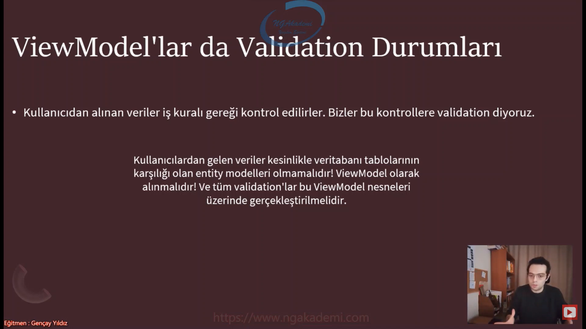

## ViewModel'ı Entity Model'a Nasıl Dönüştürebiliriz?
- Kullanıcıdan gelen dataları ViewModel ile karşıladıktan sonra bu ViewModel'da ki verileri veritabanına kaydetmek isteyebiliriz. Bu durumda,bu verileri Entity Model'a dönüştürmemiz gerekecektir. Bunun için aşağıdaki yöntemlerden herhangibiri kullanılabilir:
    * Manuel Dönüştürme (ameleus yöntemi)
    * Implicit Operator Overload İle Dönüştürme
    * Explicit Operator Overload İle Dönüştürme
    * Reflection İle Dönüştürme
    * AutoMapper Kütüphanesi İle Dönüştürme

- Eğer ki entitymodel'ı direkt temsil eden içinde fonksiyon ya da herhangi bir farklı nesnenin ya da bir DTO nesnesinin referansını barındırmayan nesnelere viewmodel demiyoruz da DTO nesnesi diyoruz. 

- Kullanıcıdan gelen salt dataları temsil eden viewmodel'lar bizim için esasında DTO nesneleridir. Viewmodel DTO'dan biraz daha geniş kapsamplı nitelendirebileceğimiz nesnedir diyebiliriz.

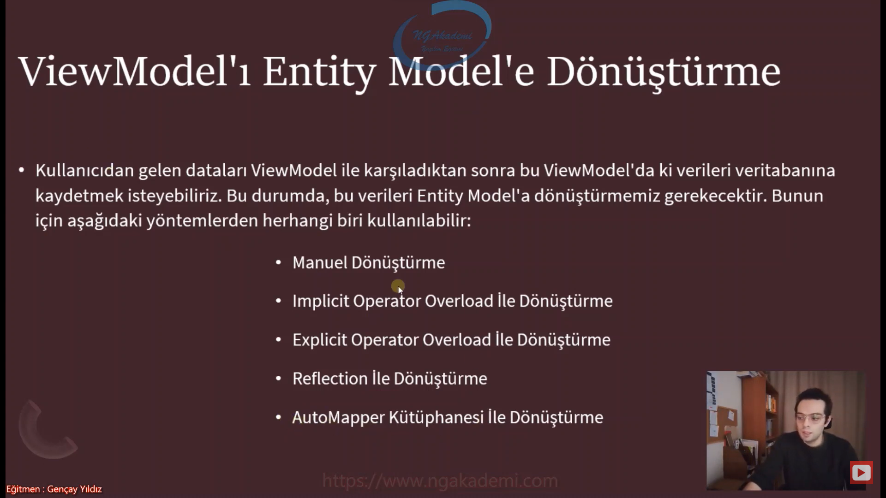

## Manuel Dönüştürme
- Her şeyin ameleus yani elle manuel bir şekilde gerçekleşmesi
```C#
[HttpPost]
public IActionResult Index(PersonelCreateVM personelCreateVM)
{
    //....
    Personel p = new() { Adi = personelCreateVM.Adi, Soyadi = personelCreateVM.Soyadi };// Object initializer üzerinden olur. Öbür türlü referans üzerinde olur. İlgili property'lere erişip hangi property'e atama işlemi sağlayacaksanız bu şekilde viewmodel üzerinden ilgili atamayı yapmanız yeterli olacaktır.

    return View();
}
```
## Implicit Operator Overload İle Dönüştürme​
- Eğer ki bu dönüşüm süreçlerinde Implicit operatörleri overload ederek kullanmak istiyorsanız her iki nesneden birinin sınıfında çalışmanız yeterli olacaktır. Gidipte ekstradan diğerinde çalışmana gerek yok.

```C#
//***************** PersonelController *****************
[HttpPost]
public IActionResult Index(PersonelCreateVM personelCreateVM)
{
    #region Implicit
    Personel personel = personelCreateVM;// İleri programlamada implicit ve explicit operatör yapılanması sayesinde ilgili sınıfları aralarında polimorfizm ilişki olmaksızın farklı türdeki sınıfları birbirlerine atayabilmekteyiz.
    PersonelCreateVM vm = personel;
    #endregion

    return View();
} 
//***************** Personel *****************
public class Personel

{
    public int Id { get; set; }
    public string Adi { get; set; }
    public string Soyadi { get; set; }
    public string Pozisyon { get; set; }
    public int Maas { get; set; }
    public bool MedeniHal { get; set; }

    #region PersonelCreateVM -> Personel & Personel -> PersonelCreateVM Implicit Operator Overload (implicit/gizli/Bilinçsiz) 
    public static implicit operator PersonelCreateVM(Personel model)//Parametredeki nesne verilen isimdeki nesneye dönüştürülücektir.
    {
        return new PersonelCreateVM() 
        {
            Adi = model.Adi,
            Soyadi = model.Soyadi,
        };
    }

    public static implicit operator Personel(PersonelCreateVM model)//Parametredeki nesne verilen isimdeki nesneye dönüştürülücektir.
    {
        return new Personel()
        {
            Adi = model.Adi,
            Soyadi = model.Soyadi,
        };
    }
    //Bu çalışmalar sayesinde implicit yani bilinçsiz bir şekilde tür dönüşümünü sağlamış oldum.
    //Bu işlemleri birebir PersonelCreateVM sınıfında da gerçekleştirebilirdim. Bu yapılanmanın özelliği herhangi bir sınıfta bu dönüşümü yapabilmen.
    #endregion
}
```

## Explicit Operator Overload İle Dönüştürme​
- Eğer ki bu dönüşüm süreçlerinde Implicit operatörleri overload ederek kullanmak istiyorsanız her iki nesneden birinin sınıfında çalışmanız yeterli olacaktır. Gidipte ekstradan diğerinde çalışmana gerek yok.

```C#
// ******************** Personel ********************

public class Personel
{
    public int Id { get; set; }
    public string Adi { get; set; }
    public string Soyadi { get; set; }
    public string Pozisyon { get; set; }
    public int Maas { get; set; }
    public bool MedeniHal { get; set; }

   
    #region PersonelCreateVM -> Personel & Personel -> PersonelCreateVM Explicit Operator Overload (explicit/Açık/Bilinli) 
    public static explicit operator PersonelCreateVM(Personel model)//Parametredeki nesne verilen isimdeki nesneye dönüştürülücektir.
    {
        return new PersonelCreateVM()
        {
            Adi = model.Adi,
            Soyadi = model.Soyadi,
        };
    }

    public static explicit operator Personel(PersonelCreateVM model)//Parametredeki nesne verilen isimdeki nesneye dönüştürülücektir.
    {
        return new Personel()
        {
            Adi = model.Adi,
            Soyadi = model.Soyadi,
        };
    }
    //Bilinçli ve bilinçsiz tür dönüşümlerindeki mevzunun ta kendisi.
}
// ******************** PersonelController ********************
public class PersonelController : Controller
{
    [HttpPost]
    public IActionResult Index(PersonelCreateVM personelCreateVM)
    {
        #region Explicit
        Personel p1 = (Personel)personelCreateVM;
        PersonelCreateVM p2 = (PersonelCreateVM)p;
        #endregion
        return View();
    } 
}
```

## Reflection İle Dönüştürme
- Herhangi bir sınıfın struct'ın interface'in içine girip ilgili türün içerisinde programatik olarak bir tarama yapmamızı sağlayan ve memberlar üzerinde işlemler gerçekleştirmemizi sağlayan bir ileri düzey tekniktir. Dolayısıyla biz bu tekniği kullanarakta elimizdeki Viewmodel'larla entitymodel'lar arasında veri transferini sağlayabiliriz.

```C#
// *************************** TypeConversion ***************************
public static class TypeConversion
{
    public static TResult Conversion<T, TResult>(T model) where TResult : class, new()
    {
        TResult result = new TResult();
        typeof(T).GetProperties().ToList().ForEach(p =>
        {
            PropertyInfo property = typeof(TResult).GetProperty(p.Name);
            property.SetValue(result, p.GetValue(model));
        });
        return result;
    }
}
// *************************** PersonelController ***************************
[HttpPost]
public IActionResult Index(PersonelCreateVM personelCreateVM)
{
    #region Reflection
    Personel p3 = TypeConversion.Conversion<PersonelCreateVM, Personel>(personelCreateVM);
    PersonelCreateVM vm2 = TypeConversion.Conversion<Personel, PersonelCreateVM>(p3);
    #endregion
    return View();
} 
```

## AutoMapper Kütüphanesi İle Dönüştürme
- Profil oluşturuyorsun hangi sınıf hangi türe dönüştürülecek bunun profilini bildirmen lazım.

```C#
// **************** Program.cs **********************
builder.Services.AddAutoMapper(typeof(PersonelProfil));//Bu kütüphanenin servisini ekliyorum.

// **************** PersonelProfil **********************
public class PersonelProfil : Profile //Profile sınıflarının Automapper kütüphanesi altındaki Profile sınıfından türemesi gerekmektedir.
//Bu sınıfı herhangi bir yerde bildirmeme gerek yok çünkü Automapper'da arka planda reflection'ı kullanıyor reflection üzerinden ilgili sınıfları bulup ona göre dönüşümü sağlıyor.
{
    
    public PersonelProfil()
    {
        CreateMap<Personel, PersonelCreateVM>().ReverseMap();
    }
}

// **************** PersonelController **********************
[HttpPost]
public IActionResult Index(PersonelCreateVM personelCreateVM)
{
    #region Automapper
    Personel p5 = _mapper.Map<Personel>(personelCreateVM);
    PersonelCreateVM pcvm = _mapper.Map<PersonelCreateVM>(p5);
    #endregion
    return View();
} 
```

## C# Examples
```C#
// ********************************** Program.cs **********************************
using ViewModelExample.AutoMappers;

var builder = WebApplication.CreateBuilder(args);

// Add services to the container.
builder.Services.AddControllersWithViews();

builder.Services.AddAutoMapper(typeof(PersonelProfil));//Bu kütüphanenin servisini ekliyorum.

var app = builder.Build();

// Configure the HTTP request pipeline.
if (!app.Environment.IsDevelopment())
{
    app.UseExceptionHandler("/Home/Error");
    // The default HSTS value is 30 days. You may want to change this for production scenarios, see https://aka.ms/aspnetcore-hsts.
    app.UseHsts();
}

app.UseHttpsRedirection();
app.UseStaticFiles();

app.UseRouting();

app.UseAuthorization();

app.MapControllerRoute(
    name: "default",
    pattern: "{controller=Home}/{action=Index}/{id?}");

app.Run();

// ********************************** PersonelController **********************************
using AutoMapper;
using Microsoft.AspNetCore.Mvc;
using ViewModelExample.Business;
using ViewModelExample.Models;
using ViewModelExample.Models.ViewModels;

namespace ViewModelExample.Controllers
{
    public class PersonelController : Controller
    {
        private readonly IMapper _mapper;

        public PersonelController(IMapper mapper)// Bu kütüphaneyi kullanabilmek için constructor'da bu IMapper'ı çağırmam gerekiyor. İlgili nesne dependency injection ile geleecktir.
        {
            _mapper = mapper;
        }

        [HttpPost]
        #region ViewModel'lar da Validation Durumları
        public IActionResult Index(PersonelCreateVM personelCreateVM)//Kullanıcıdan gelen verilerin sadece Adı ve Soyadı olması beklenirken kullanıcı ilgili forma gireecği verilere ben validasyon kontrolü yapmış olsaydım eğer ki parametre Personel olsaydı o durumda validasyonda takılı kalacaktık. Personel'in sadece adını soyadını kullanıyorsun view'de ama pozisyon ve medeni hali var bunlarda her ne kadar kullanmasanda validasyona takılacağından dolayı ilgili validasyonu bir türlü geçemeyecektik. Haliyle böyle durumlar yaşamayalım biz sadece yapmış olduğumuz operasyona özel veri modelleri oluşturalım diye zaten viewmodel oluşturuyoruz.
        //Dolayısıyla bu viewmodel yapılanmsaında validasyonlar hangi operasyondaysan o operasyona göre tasarlanmalı. Sen veri mi oluşturacaksın yani bir personel mi ekleyeceksin o zaman personel eklşemeye dair validasyonları senin PersonelCreateVM'da olmalı. Personel güncelleme mi yapacaksın personel güncellemeye dair viewmodel'da validasyonları uygulaman gerek. Bütün operasyonlara karşılık viewmodel oluşturabilirsiniz ve bu operasyonlara karşılık gelecek validasyonları ilgili viewmodel'larda tasarlamanız gerekecektir.
        {
            #region (Amelaus)Manuel Dönüştürme
            //....
            Personel p = new() { Adi = personelCreateVM.Adi, Soyadi = personelCreateVM.Soyadi };// Object initializer üzerinden olur. Öbür türlü referans üzerinde olur. İlgili property'lere erişip hangi property'e atama işlemi sağlayacaksanız bu şekilde viewmodel üzerinden ilgili atamayı yapmanız yeterli olacaktır. 
            #endregion
            #region Implicit
            Personel personel = personelCreateVM;// İleri programlamada implicit ve explicit operatör yapılanması sayesinde ilgili sınıfları aralarında polimorfizm ilişki olmaksızın farklı türdeki sınıfları birbirlerine atayabilmekteyiz.
            PersonelCreateVM vm = personel;
            #endregion
            #region Explicit
            Personel p1 = (Personel)personelCreateVM;
            PersonelCreateVM p2 = (PersonelCreateVM)p;
            #endregion
            #region Reflection
            Personel p3 = TypeConversion.Conversion<PersonelCreateVM, Personel>(personelCreateVM);
            PersonelListeVM plvm = TypeConversion.Conversion<Personel, PersonelListeVM>(p3);
            #endregion
            #region Automapper
            Personel p5 = _mapper.Map<Personel>(personelCreateVM);
            PersonelCreateVM pcvm = _mapper.Map<PersonelCreateVM>(p5);
            #endregion
            return View();
        } 
        #endregion
        #region Senaryo 1 - Bir Model’in View’de ki Etkileşimine Uygun Parçasını Temsil Etme
        public IActionResult Listele()
        {
            List<PersonelListeVM> personeller = new List<Personel>()
            {
                new(){Adi = "A", Soyadi = "B"},
                new(){Adi = "A1", Soyadi = "B"},
                new(){Adi = "A2", Soyadi = "B"},
                new(){Adi = "A3", Soyadi = "B"},
                new(){Adi = "A4", Soyadi = "B"},
                new(){Adi = "A5", Soyadi = "B"}

            }.Select(p => new PersonelListeVM() { Adi = p.Adi, Soyadi = p.Soyadi, Pozisyon = p.Pozisyon }).ToList();//Viewmodel'ım neyse ilgili kullanacağı muhattap olacağı veri türü neyse sadece o verilerle o verileri taşıyan bir nesne oluşturdum onu ilgili view'e client'a gönderiyorum.

            return View(personeller);
        }
        #endregion

        #region Senaryo 2 - Birden Fazla Nesneyi Tek Bir Nesneye Bağlama 
        public IActionResult Get()
        {
            //Üç tane veriyi Get'in view'ine göndermek istiyorsam gerçekleştirebileceğim 2 tane yol vardır.
            // Tuple nesne kullanabilirim. Tuple nesnesiyle gönderebilirim.
            //Tuple nesnesiyle zaten viewmodel'ın 2. sorumluluğu aynı işlemi görmekte yani birden fazla farklı türdeki nesneleri ya da aynı türde de olabilir birden fazla nesneyi tek bir nesnede birleştirmemizi sağlayan bir işlem görüyor çoklu nesne oluşturmamızı sağlıyor.
            (Personel, Musteri, Urun) nesne = (new Personel(), new Musteri(), new Urun());

            //Fiziksel bir viewmodel oluşturarakta bu birleştirme işlemini gerçekleştirebilirsin.
            XVM xVM = new XVM() { Personel = new(), Musteri = new(), Urun = new() };
            return View();
        } 
        #endregion
    }
}

// ********************************** Personel **********************************
using System.ComponentModel.DataAnnotations;
using ViewModelExample.Models.ViewModels;

namespace ViewModelExample.Models
{
    #region Senaryo 1 - Bir Model’in View’de ki Etkileşimine Uygun Parçasını Temsil Etme
    //Entity Model: veritabanında herhangi bir tabloya karşılık gelen model
    public class Personel// Personel class'ı benim entity model'ım. Şimdi ben bunun üzerinde gerekli validasyonları yaparım yapmam o benim o anki ihtiyacıma bağlı. 
    #endregion
    {
        public int Id { get; set; }
        [Required]
        public string Adi { get; set; }
        public string Soyadi { get; set; }
        [Required]
        [StringLength(13)]
        public string Pozisyon { get; set; }
        public int Maas { get; set; }
        [Required]
        public bool MedeniHal { get; set; }

        #region PersonelCreateVM -> Personel & Personel -> PersonelCreateVM Implicit Operator Overload (implicit/gizli/Bilinçsiz) 
        //public static implicit operator PersonelCreateVM(Personel model)//Parametredeki nesne verilen isimdeki nesneye dönüştürülücektir.
        //{
        //    return new PersonelCreateVM() 
        //    {
        //        Adi = model.Adi,
        //        Soyadi = model.Soyadi,
        //    };
        //}

        //public static implicit operator Personel(PersonelCreateVM model)//Parametredeki nesne verilen isimdeki nesneye dönüştürülücektir.
        //{
        //    return new Personel()
        //    {
        //        Adi = model.Adi,
        //        Soyadi = model.Soyadi,
        //    };
        //}
        ////Bu çalışmalar sayesinde implicit yani bilinçsiz bir şekilde tür dönüşümünü sağlamış oldum.
        ////Bu işlemleri birebir PersonelCreateVM sınıfında da gerçekleştirebilirdim. Bu yapılanmanın özelliği herhangi bir sınıfta bu dönüşümü yapabilmen.
        #endregion
        #region PersonelCreateVM -> Personel & Personel -> PersonelCreateVM Explicit Operator Overload (implicit/Açık/Bilinli) 
        public static explicit operator PersonelCreateVM(Personel model)//Parametredeki nesne verilen isimdeki nesneye dönüştürülücektir.
        {
            return new PersonelCreateVM()
            {
                Adi = model.Adi,
                Soyadi = model.Soyadi,
            };
        }

        public static explicit operator Personel(PersonelCreateVM model)//Parametredeki nesne verilen isimdeki nesneye dönüştürülücektir.
        {
            return new Personel()
            {
                Adi = model.Adi,
                Soyadi = model.Soyadi,
            };
        }
        //Bilinçli ve bilinçsiz tür dönüşümlerindeki mevzunun ta kendisi.
        #endregion
    }
}

// ********************************** PersonelCreateVM **********************************
using System.ComponentModel.DataAnnotations;

namespace ViewModelExample.Models.ViewModels
{
    #region Senaryo 1 - Bir Model’in View’de ki Etkileşimine Uygun Parçasını Temsil Etme
    public class PersonelCreateVM//Ekstradan fazladan bir alan tutmuyor buradaki viewmodel'imiz ne taşıyacaksa o alana karşılık gelen property'lere sahip.
    {
        //ViewModel'da sadece taşınacak olan veri temsil edilir.
        [Required]
        public string Adi { get; set; }
        [Required]
        public string Soyadi { get; set; }
    }
    //Viewmodel ve DTO nesneleri kendi içerisinde modelledikleri datanın hangi verilerini/property'lerini alıyorlarsa birebir aynı isimde vermeye dikkat edin çünkü automapper gibi hazır kütüphanelerle dönüşümler sağlanırken burada birebir eşleşen isimler kullanılıyor. Ama bu zorunlu değildir. Farklı isimde kullanmayı çok fazla tavsiye etmeyiz.
    //Aynı ismi kullandığın sürece kodun gelişim ve bakım süresi de oradaki maliyette düşürülmüş olacaktır. 
    #endregion
    #region ViewModel'lar da Validation Durumları
    //Amma velakin bir personel eklenirken personel ekleme esnasında kullanmış olduğumuz buradaki viewmodel'ım sayesinde ilgil verileri alıyorum ya işte bu veriler gelirken benim iş kurallarım gereği bu veriler doğrulanabilir verilerse eğer haliyle bunu buradaki viewmodel üzerinde gerçekleştirmem gerekecek.
    //Validasyonları standart olarak iki farklı türde uygulayabiliriz. Data Annotations dediğimiz yapılanmayı kullanıyorduk bir diğeri de validation dediğimiz kütüphaneyi kullanıyorduk.
    //Elinde viewmodel varsa bu viewmodel üzerinden gelen veriyi kesinlikle viewmodel'da check etmen gerekecektir.
    //Bu viewmodel ilgili gelecek olan verilerin boş olup olmadığını zaten bana söyleyecek ve benimle o anki operasyon neyse personel ekleme durumunda gelen personel bilgisi her neyse ona göre gerekli validasyonları kontrol edecek. YUani maaşıyla yok personelin pozisyonuyla ilgili bir validasyon varsa personel ekleme durumunda o validasyonluk bir işimiz yok dolayısıyla ona bakmayacaktır. Biz olayı daha da özelleştirmiş spesifik hale getirmiş oluyoruyz bu şekilde yani viewmodel nereden bakarsanız bakın web uygulamalarında API yapılanmalarında vs olmazsa olmaz diyebiliriz. 
    #endregion
}

// ********************************** XVM **********************************
namespace ViewModelExample.Models.ViewModels
{
    #region Senaryo 2 - Birden Fazla Nesneyi Tek Bir Nesneye Bağlama 
    public class XVM// Bu nesne sayesinde 3 tane nesneyi tek bir nesnede toplayıp ona göre işlem gerçekleştirip bir yere transfer edebiliyorum vs.
    {
        public Personel Personel { get; set; }
        public Urun Urun { get; set; }
        public Musteri Musteri { get; set; }
    } 
    #endregion
}

// ********************************** PersonelListeVM **********************************
namespace ViewModelExample.Models.ViewModels
{
    #region Senaryo 1 - Bir Model’in View’de ki Etkileşimine Uygun Parçasını Temsil Etme
    public class PersonelListeVM//View'de kullanılacak olan datanın hangi verileri kullanılıyorsa onları temsil eden bir viewmodel oluşturdum haliyle benim controller'ım bu viewmodel'a uygun bir şekilde verileri üretmeli ve o şekilde view'e göndermeli ya da API'dan client'a göndermeli.
    {
        public string Adi { get; set; }
        public string Soyadi { get; set; }
        public string Pozisyon { get; set; }
    } 
    #endregion
}

// ********************************** PersonelProfil **********************************
using AutoMapper;
using ViewModelExample.Models;
using ViewModelExample.Models.ViewModels;

namespace ViewModelExample.AutoMappers
{   //Bu sınıfı herhangi bir yerde bildirmeme gerek yok çünkü Automapper'da arka planda reflection'ı kullanıyor reflection üzerinden ilgili sınıfları bulup ona göre dönüşümü sağlıyor.
    public class PersonelProfil : Profile //Profile sınıflarının Automapper kütüphanesi altındaki Profile sınıfından türemesi gerekmektedir.
    {
        public PersonelProfil()
        {
            CreateMap<Personel, PersonelCreateVM>().ReverseMap();
        }
    }
}

// ********************************** TypeConversion **********************************
using System.Reflection;

namespace ViewModelExample.Business
{
    public static class TypeConversion
    {
        public static TResult Conversion<T, TResult>(T model) where TResult : class, new()
        {
            TResult result = new TResult();
            typeof(T).GetProperties().ToList().ForEach(p =>
            {
                PropertyInfo property = typeof(TResult).GetProperty(p.Name);
                property.SetValue(result, p.GetValue(model));
            });
            return result;
        }
    }
}

// ********************************** Musteri **********************************
namespace ViewModelExample.Models
{
    public class Musteri
    {
    }
}

// ********************************** Urun **********************************
namespace ViewModelExample.Models
{
    public class Urun
    {
    }
}

// ********************************** Listele.cshtml **********************************
#region Senaryo 1 - Bir Model’in View’de ki Etkileşimine Uygun Parçasını Temsil Etme
@model List<PersonelListeVM>//Haliyle bu nesne senin bu view'de kullanacağın dataları taşıyacağından dolayı ekstra bir veri yoğunluğu olmayacak bir veri karışıklığıda söz konusu olmayacaktır. Daha efektif daha best practice'lere uygun bir kod bir çözüm getirmiş olacağız.

<ul>
    @foreach (PersonelListeVM personel in Model)
    {
        <li>@personel.Adi @personel.Soyadi @personel.Pozisyon</li>
    }
</ul>
#endregion

// ********************************** Index.cshtml **********************************
#region Senaryo 1 - Bir Model’in View’de ki Etkileşimine Uygun Parçasını Temsil Etme
@model PersonelCreateVM

<form asp-action="Index" asp-controller="Personel" method="post">
    <input type="text" asp-for="Adi" /><br />
    <input type="text" asp-for="Soyadi" /><br />
    <button>Gönder</button>
</form>

@* sen  buradan bir veri göndereceksin içerisinde Adı var Soyadı var Medeni Hali var. Maaşı var Pozisyonu var.*@
@* burada bir nesne oluşturacak sen bunun sadece adını ve soyadını kullanacaksın diğerleri nerede diğerlerini kullanmayacaksın Madem öyle diğerlerini kullanmayacaksan bu view'le bu view'den besleyen backend'in arasında iletişimi sağlayacak olan model Personel olmamalı dolayısıyla sadece adını ve soyadını taşıyacak bir model tasarlamalıyız. İşte bu model view'i baz alarak tasarlanıyor. Biz buna viewmodel diyoruz. *@
@* View'de kullanılacak olan veriler illaki view'e gönderilen veriler olmak zorunda değil. View'den gelecek olan verileri de karşılayacak olan model'a biz viewmodel diyoruz. View'e gönderilecek ve View'den gelecek olan her iki türlü/yönlü transferi sağlayacak olan nesneye viewmodel nesnesi diyoruz. *@
@* Dolayısıyla bizim öyle bir nesne oluşturmamız lazım ki buradaki lüzumsuz içeriklere sahip olmamalı sadece ben buradan hangilerini gönderiyorsam ve buraya hangileri geliyorsa onları temsil eden bir nesne olması gerekiyor dolayısıyla bu nesneye biz viewmodel nesnesi diyoruz. *@
@* Her bir eyleme/view'e karşılık viewmodel oluşturmamız gerekecek. *@
@* Hangi eyleme karşılık viewmodel oluşturuyorsan isminde bildirmen senin avantajına olacaktır. *@
#endregion

```