# 45) Asp.NET Core 5.0 - appsettings.json Dosyası Nedir? Ne İse Yarar?
- Asp.Net Core uygulamalarını yapılandırmamızı sağlayan appsettings.json dosyası üzerine konuşuyor olacağız.

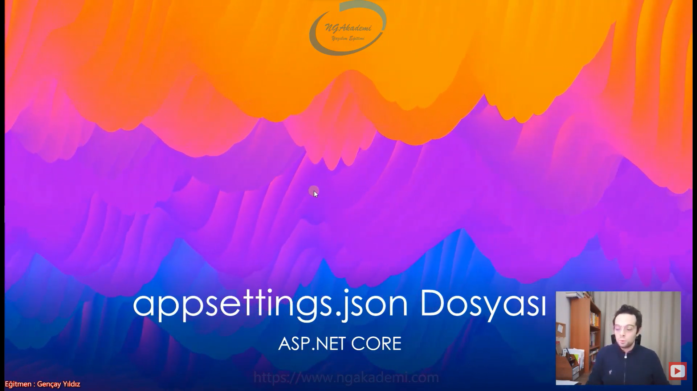

## appsettings.json Dosyası Nedir? Ne İşe Yarar?​
- Asp.Net core uygulamalarında/ herhangi bir uygulamada çalışmamızı sergilerken yapacağımız operasyona göre yahut ortama göre yazılımın parametrelerine göre konfigürasyonlar yapmak isteyebiliriz. Dolayısıyla sen eğer ki Asp.Net Core uygulamasında çalışıyorsan Asp.Net Core'un yapılandırılmasını yani konfigürasyonunu sağlayan bir dosyadır.

- APPSETTINGS.JSON DOSYASI, ASP.NET CORE UYGULAMALARINI YAPILANDIRMA ARAÇLARINDAN BİRİSİDİR.

- Birden fazla yapılandırma aracımız vardır.


## Yapılandırma Ne Demektir?
- Yapılandırma, bir uygulamanın herhangi bir ortamda gerçekleştireceği davranışlarını belirlememizi sağlayan statik değerin tanımlanmasıdır.

- Ben günlük hayatta yapacağım eylemlere göre kendimi nasıl ayarlıyorsam/yapılandırıyorsam yazılımda yapacağı eyleme ve o eylemlerin ortamına göre kendini yapılandırıp ayarlayabilmektedir. Örneğin Musa akşam yemeğine gidecek. Haliyle ne yapıyorum akşam yemeğine giderken yani o ortama giderken o ortamla ilgili giyiniyorum parfüm sıkıyorum saçlarımı ona göre tarıyorum yani hazırlanıyorum kendimi yapılandırıyorum.

- Yapılandırma dediğiniz sizin yapacağınız eyleme göre ortama göre değişiklik gösterebilir. Benzer mantıkla ortama eyleme göre değişiklik gösterdiği gibi sizin aksiyon alacağınız operasyon neyse o operasyona göre de farklı yapılandırma değerleriniz olabilir. Şimdi yemeğe gidicem benim ortamım yemek ortamı ona göre giyindim. Amma velakin yemeğe giderken kullanacağım taşıt araba mı olacak otobüs mü olacak taksiyle mi gidicem motorla mı gidicem yoksa ata mı binip gidicem artık bunu da hangi parametreyi seçeceğimi de yapılandırıp ona göre belirlemem lazım.

- Yapılandırma genellikle algoritmanın dışında lakin algoritmada kullanılacak olan değerleri belirleme sürecidir.


- Benim yemeğe gidebilmek için ata ya da arabaya binip binmeyeceğimin kararını vermek algoritmam değil. Ama algoritmamda kullanılacak parametreyi belirleyen bir parametredir/değerdir. Akşam yemeğine gidebilmem gittikten sonra orada yemeği yemem bir işin fiiliyatı algoritmadır. Ama giymiş olduğum takım elbise ya da saçlarımın ne tarafa tarandığı vs. Bunlar oradaki ortamla ilgili belirli değerlerdir. Lakin yapılacak eylemle ilgili yani yemeği yemeyle ilgili şeyler değildir.

- Eski Asp.NET uygulamalarında kullanılan web.config yahut Global.asax gibi dosyalar standart framework'ün yapılandırmasında kullanılan ortamlardı.

- Bizim için Startup/Program.cs dosyası da bir konfigürasyon/yapılandırma dosyasıdır.

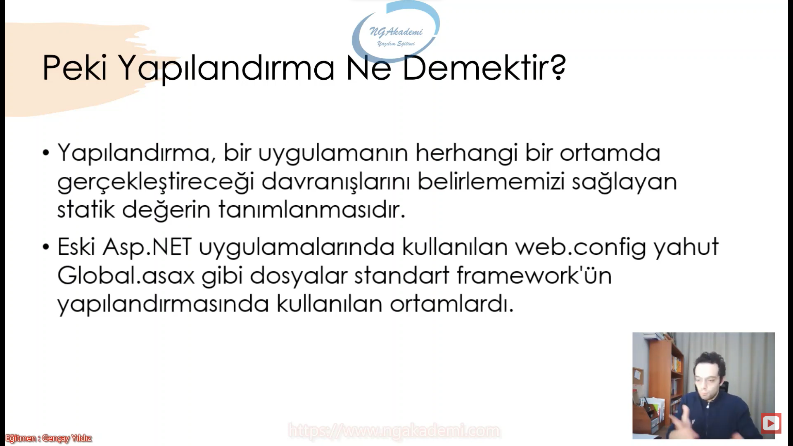

## Konfigürasyon Değerleri Kodun İçerisinde Tanımlanmamalı!
- Şimdi siz kod geliştiriyorsunuz geliştireceğiniz kodda bazen mail göndermen gerekecek bazen yeri gelecek  veritabanına bağlanman gerekecek bazen yeri gelecek bir mesaj kuyruk sistemine değer göndermen gerekecek vs. vs. vs. Farklı mimarilerle distrubuted çalışmanız gerekecek vs. Böyle bir durumda bu operasyonlardan örneğin mail. Mail gönderme operasyonu yaparken senin maile mailin şifresine kime gönderileceğine ihtiyacın var vs. Şimdi statik olan değerler kodun içerisine saklanmaması lazım. Mail göndereceğin kodun içerisine gelipte mail'i gönderecek olan mail adresinle onun şifresinin yazılması ve bunun kodun içine gömmek best practice açısından doğru değildir. Alenen yanlıştır. Tamam kod derlenir çalışır ama yanlışsa yanlış bitti yani 2 + 2 = 5 değildir gibi bişey.

- Kodun içerisine veritabanına bağlantı yolu yazılamaycak işte mail göndereceksin mail gönderici ve şifresi yazılmayacak kullanıcı adı şifre yazılmayacak. Bu şekilde yazılması gereken değerler kodun dışında yönetilebilir yani yapılandırılabilir/konfigüre edilebilir şekilde bunların oluşturulup kodun içinde kullanılması gerekecek.

- Senin bir projen var. Elinde bir tane connection string'in var. Sen şimdi elindeki bu kullanacağın veritabanına yani bağlantı sağlaman gereken veritabanının veritabanı bağlantı sözcüğünü kodun içerisinde her yerde kullanman gerektiğini düşün Her veritabanına ihtiyacın olduğu yerde bunu kullandığını düşün. Şimdi bu kodun ne kadar yönetilebilir olacağını bir düşünsene. 

- Statik değerler kodun içerisine yazılırsa;
    * Yönetilebilirlik düşer. 
        + Bir gün veritabanı bilgin değişebilir. Veritabanının connection string'i yer değiştirebilir. Yani başka bir sunucuya taşıyabilirim Haliyle connection string değerlerim değişebilir. Yahut ismi değişebilir. Sunucu adı değişebilir. Parametreler değişebilir. Şimdi sen her değişiklikte bu connection string değerini kullandığın alanlara gidip tek tek ameleus şeklinde yani bir yazılımcısın ama hiç alakan yokmuş gibi gidipte tüm değerleri burada içine yazdıktan sonra yani bir yazılımcılık özelliği kalmıyor. Sen sadece Kod yazan bir adam olmuş oluyorsun. Halbuki yazılım geliştiren adam elindekileri daha efektif daha verimli bir şekilde kullanan adamdır. Sen bu değerleri her gördüğün yerde yazdığın zaman her bir değişikliği ilgili yazmış olduğun yerlerde tek tek gidip uygulaman gerekiyor. Biz buna ameleus felsefesi diyoruz yani bildiğiniz felsefeye sahip ama çok verimli bir felsefe değil. Elindeki statik değerleri sen kodun içerisine gidip manuel yazarsan birgün değişiklik gerektiği zaman inanılmaz derecede rezil rüsva bir şekilde gidip tek tek kodun içerisinden ilgili alanları bulup değiştirmen gerekecek. Haliyle yönetilebilirlik düşecektir. İnsanlık hali. eğer ki sen bütün iradeyi insanın yeteneğine o anki havasına o anki havanın şartlarına bırakıyorsan elbette ki insan olduğu için hata yapacak unuttuğu noktalar olacak. Haliyle sen bu uygulamayı derlediğin zaman production'a çıktığın zaman kullanıcı önünde hata alma riskin artacak. Nihayetinde değişikliği her yerde uyguladığını zannetsende gözünden kaçabilen yerler olacak. İster istemez kaçtığı zamanda her türlü rezilliği ya da kulağını çınlatan diyaloglara maruz kalacaksın.

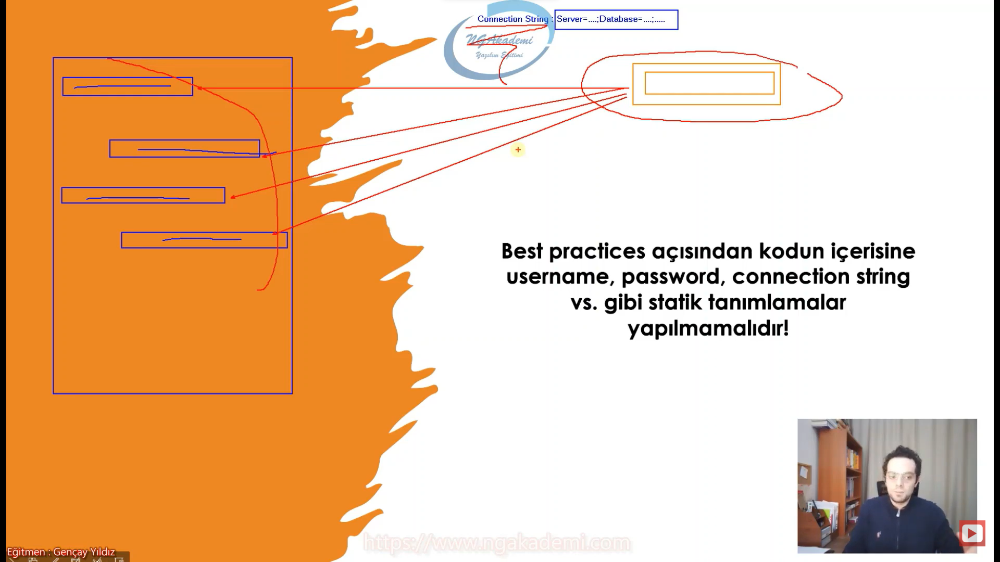

- Kodun içerisine statik yapılan tanımlamalar kodun kodsal özelliğini yitirmesini sağlar. Yani sen bu kodun içerisine tanımlama mı yapıyorsun yoksa bu kod yazılımsal bir işleve sahip olan bir kod mu? Baktığın zaman kodun şıklığı da önemli Hatta temiz kod deriz biz buna clean code. Clean code'luğunu da bozar yani oradaki kodun temizliğini arınmışlığını orada etkilemiş olacaksın bozmuş olacaksın dolayısıyla ilgili kodun içerisinde çıktı olamdığı sürece ya da algoritmanın bir neticesi olmadığı sürece metinsel, algoritmada o sırada dış parametreye göre kullanıalcak değerler hiçbir zaman kullanılmayacak.

- Veritabanı bilgisini kodun içinde kullanamacağım istersen bunu git veritabanına kaydet istersne git not defterine koy not defteri üzerinden bunları çek farketmiyor. Önemli olan merkezi bir yere yerleştir ve yerleştirdiğin merkezi yerden sana lazım olan konfigürasyonu yani ilgili değeri yani statik değeri tanımlamayı lazım olan noktalarda tek elden çek.

- Adamlar demiş ki ya kardeşim böyle bir durumda senin gidipte herhangi bir text dosyasından bunu çekmene gerek yok. Ya da veritabanına gidipte sırf bunun için bir bağlantı sağlayıp veritabanından çekmene gerek yok sen bunu gel bizim appsettings dediğimiz json dosyası üzerinden sağla. Yani buradaki connection string appsettings.json dosyası üzerinde olacak ve uygulamada sen bu dosya üzerinde yapmış olduğun connection string tanımlaması her lazım olan noktada ilgili dosyadan/kaynaktan/appsettings.json'dan çekeceksin.

- Uygulamada mail göndereceksin bu mailin kullanıcı adı ve şifresi uygulamanın bir ayarı/yapılandırması/konfigürasyonu değil mi? Benzer mantıkla uygulama içerisinde veritabanlarına bağlanıp işlem yapman lazım bu veritabanı connection string dediğimiz değer uygulamanın bir konfigürasyonu değil mi? Diyelim ki oauth 2.0 protokolüyle google üzerinden giriş yapman gerekiyor. Google sana client secret değeri veriyor. birde password veriyor verdiği değerler bu uygulama nihayetinde böyle aksiyonda bulunuyorsa bu değerler uygulamanın konfigürasyon değerleri değil mi? Uygulamanın çalışabilmesi için bu değerlerle çalıştırabilirsin. Bu değerler kilit noktalarda görev görüyor. Haliyle konfigürasyon değerleri oluyor.

- Konfigürasyon amaçlı kullandığınız yani statik tanımlama yaptığınız hiçbir değeri kodun içerisine gömmeyeceksiniz harici bir dosyaya koyacaksınız. İşte Asp.Net Core uygulamalarında bu harici dosya yani konfigürasyon değerlerini barındıran dosya appsettings.json dosyasıdır.

- Best practices açısından kodun içerisine username, password, connection string vs. gibi statik tanımlamalar yapılmamalıdır!

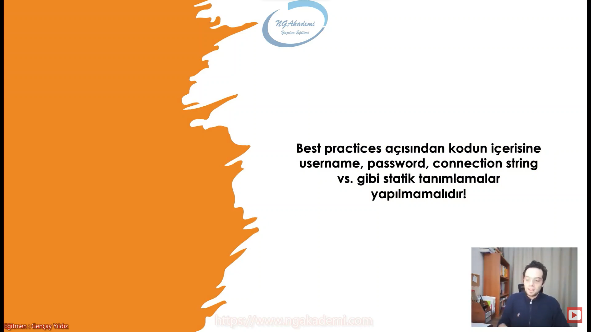

## Asp.NET Core'da ki appsettings.json Dışındaki Yapılandırma Araçları Nelerdir? ​
- Appsettings.json | appsettings.{Environment}.json

- Secrets.json(Secret Manager Tools)

- Environment Variables

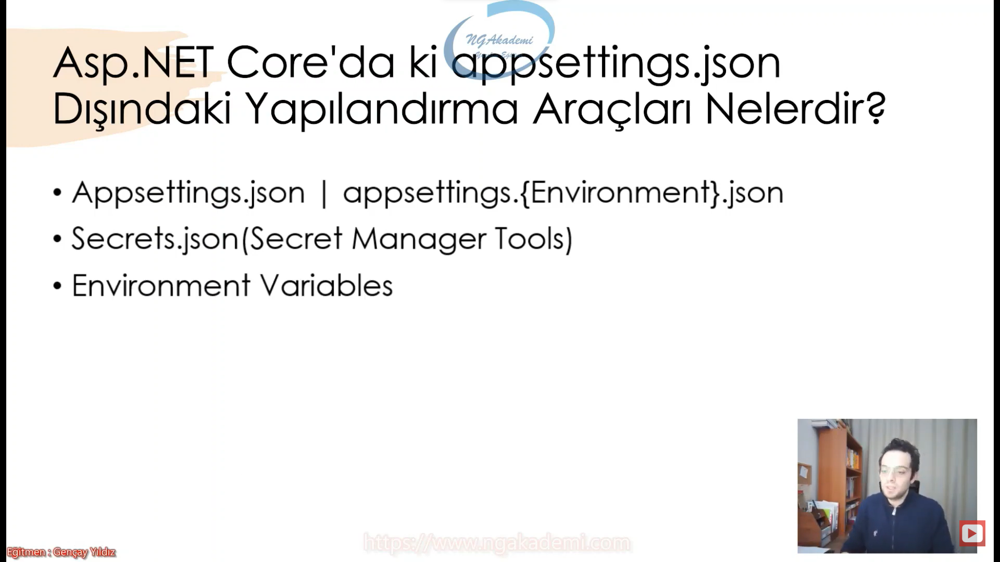

## appsettings.json Dosyasının Asp.NET Core Uygulamasındaki Davranışı 
- Bir Asp.Net Core uygulaması üzerinde appsettings.json dosyaları varsa eğer tabikide yeterli değil. Sizin bu dosyaları sisteme dahil edebilmeniz lazım. Yani uygulama ayağa kalktığında bu dosya içerisindeki konfigürasyonlardan beslenebilmesi için bu dosyaların sistem tarafından/mimari tarafından tanımlanmış olması gerekecek. Bu dosyayı program.cs dosyasında tanımlayacağız. 

- Program.cs'teki çağırılan fonksiyonlar default olarak uygulamanın ana dizinindeki appsettings.json ve appsettings.{environment}.json ilgili dosyaları çeken uygulamaya önbellek olarak yükleyen bir donanıma sahip. Yani siz uygulamada appsettings.json dosyası görüyorsanız bu uygulamayı ayağa kaldırdığınızda sistemde varolan appsettings.json ve türevleri olan tüm dosyalar önbelleğe yüklenecektir. Yüklenecek olan dosyanın kendisi değil içeriğidir yani konfigürasyonlar. Dolayısıyla yüklenen bu konfigürasyonlar önbelleğe yüklendiği zaman artık mimari yani ayağa kalkan web uygulaması yüklenen bu konfigürasyonlar üzerinden davranışını şekillendirecek.

- Özelleştirilmiş bir .json dosyasını uygulamaya dahil etmek istiyorsanız program.cs-içerisinde ilgili dosyanın bildirilmesi gerekiyor. `ConfigureAppConfiguration(b => b.AddJsonFile("hilmi.json"))` isimli fonksiyonu çağırıp ilgili özel .json dosyasını konfigürasyon dosyası olarak sisteme dahil edebiliriz. appsettings.json ismindeyse bunu bildirmenize gerek yok mimaride arka planda appsettings.json özel tanımlanmış bir isim olduğundan dolayı otomatik bulunup eklenmekte ve uygulama ayağa kaldırılırken ilgili konfigürasyon dosyası içindeki bütün konfigürasyonlar önbelleğe yüklenmektedir. Oradan da uygulama davranışını belirlemektedir.

```C#
//*************** Program.cs ************************
builder.Configuration.AddJsonFile("hilmi.json");
```

## appsettings.json Konfigürasyonu
- Nasıl Veri Eklenir?

- Eklenen Veri Nasıl Okunur?
    * IConfiguration Arayüzü Nedir?
    * Indexer İle Veri Okuma Nasıl Yapılır?
    * GetSection Metodu İle Veri Okuma Nasıl Yapılır?
        + Get Metoduyla Verileri Uygun Nesneyle Eşleştirme
    * : Operatörü Nedir?

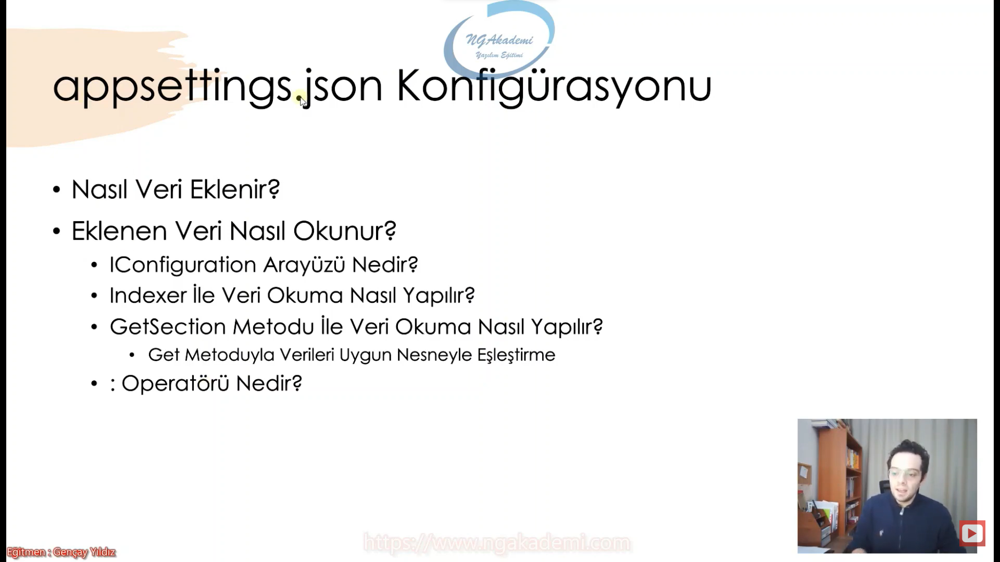

## appsettings.json'a Veri Ekleme
- appsettings.json dosyasında bir javascript objesi var yani bir json formatında bir yapılanma. Biz konfigürasyonlarımızı bu formatta tutmaktayız. Bu konfigürasyonda key ve value tarzında çalışıyorsun. Ve bu value değerleri de obje olarak tanımlanabilmektedir. Yani içerisinde de ayrı ayrı objeler tanımlayabilmekteyiz. Key-value davranışı söz konusudur.

```JSON
{
    "OrnekMetin": "sebepsiz boş yere ayrılacaksan...",//Sistemde anlamlı bir konfigürasyon olacatır. Nihayetinde sen bunu sistemde erişip kullanacak halde tanımlamış oldun.
    "Person": {
        "Name": "Musa",
        "Surname": "Uyumaz"
    }
}
```

## appsettings.json'dan Veri Okuma
- appsettings.json'da herhangi bir konfigürasyona erişmek istiyorsan eğer `IConfiguration` arayüzünü kullanabilirsin.

## IConfiguration Arayüzü Nedir?
- Asp.NET Core IoC provider'ında bulunan bir servistir. Bu servis uygulamadaki appsettings.json dosyasını okumakta ve içerisindeki value'ları bizlere getirmektedir. Dolayısıyla IoC'den bu servisi herhangi bir controller'da/sınıfta dependency injection ile talep edebilir ve appsettings.json dosyasındaki konfigürasyonları kullanabiliriz.

- `IConfiguration` .NET çekirdeğinde dahil olarak gelen bir arayüzdür. Dolayısıyla senin ekstradan bişey yapmana gerek yok. Salt bir şekilde açmış olduğun uygulamanın dependency injection provider'ında yani IoC'sinde otomatik olarak bulunan bir arayüzdür.

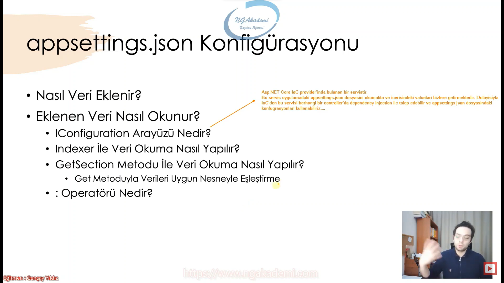

```C#
//**************************** HomeController ****************************
#region IConfiguration Arayüzü Nedir?
private readonly IConfiguration _configuration;
public HomeController(IConfiguration configuration)//Ben buradakine bağımlı olacağım yani bu IConfiguration'ı kullanacam bu nesneyi bunu ben new'lemek istemiyorum sen
bu bağımlılığı dışarıdan enjekte et. IoC'deki provider'dan ilgili nesneyi getiriyor. Gelen bu nesne buradaki parametre tarafından yakalanıyor. bu işlem neticesinde bunu bu uygulamada kullanabilmek istediğim yerde taşıyabilmek için global olarak tanımladığım readonly referans sayesinde işaretleyip her yerde global olarak kullanabilmekteyim.
{
    _configuration = configuration;
}
#endregion
```

## Indexer İle Veri Okuma Nasıl Yapılır?
- `IConfiguration` appsettings.json dosyası içerisindeki dataları otomatik çeken ve bize sunan bir nesne/servis. Dolayısıyla ben bunun üzerinde indexer'ım ile vermiş olduğum key'e karşılık gelen değeri elde edebilmekteyim.

- `:` operatörü buradaki ağaç yapılanmasında alt nesnelere/elemanlara/tanımlamalara erişebilmek için kullanılır.

- Uygulama ayağa kalkma sürecinde ilk adımda program.cs tetiklenirken appsettings.json ya da appsettings.json gibi diğer json formatındaki bütün konfigürasyon dosyaları tanımlananların hepsi uygulama ayağa kalkarken öncelikle içerisindeki konfigürasyonlar uygulamaya çekiliyor ve önbellekte yani inmemory'de tutuluyor. Artık hangi sunucuda bu uygulamayı ayağa kaldırıyorsanız o sunucunun inmemory'sinde ilgili değerler depolanacaktır. Haliyle bu çalışma zamanında `IConfiguration` gidipte dosyadan okumuyor inmemory'den okuyor.

- appsettings.json içerisinde mümkün mertebe Türkçe karakter kullanmamalıyız. Haliyle bir konfigürasyon evrensel olmalı yani gidipte oraya Türkçe karakter yazmayacaksın. Mümkün mertebe latince karakterler kullanacaksın. Benzer mantıkla konfigürasyondaki herhangi bir key'in altında metinsel değer yoksa bir obje varsa o key'i direkt çağırdığınızda `null` değer dönecektir. Çünkü bu `string` ile alakalı bir yapılanma değildir. Amma velakin bir key'e karşılık altında obje varsa bu objenin içindeki herhangi bir alanı çağırırken `:` operatörünü kullanıp `_configuration["Person:Name"]` bu şekilde o alanın değerini elde edebilirsiniz.  

```C#
//**************************** HomeController ****************************
public IActionResult Privacy()
{
    #region Indexer İle Veri Okuma Nasıl Yapılır?
    string? val1 = _configuration["OrnekMetin"];
    string? val2 = _configuration["Person"];
    string? val3 = _configuration["Person:Name"];
    string? val4 = _configuration["Person:Surname"];
    string? val5 = _configuration["Logging:LogLevel:Microsoft.Hosting.Lifetime"];
    #endregion
    return View();
}
```

## GetSection Metodu İle Veri Okuma Nasıl Yapılır?
- `_configuration.GetSection("Person")` yapılanması sayesinde siz vermiş olduğunuz key'e karşılık olan değeri bir section alan olarak elde edebiliyorsunuz. Bu değeri biz `IConfigurationSection` olarak yani bir konfigürasyon alanı olarak bizlere getirir. Dolayısıyla ben bu değeri `GetSection()` ile kullanıyorsam `string` olarak getirme gibi bir derdi olmayacağı için `null` dönmeyecektir.
​
- Indexer'da yapmış olduğumuz gibi direkt ilgili alanın key'in karşılığındaki değeri `string` olarak beklemediğimizden dolayı bir değer getirecektir.

- Indexer kullanıyorsan direkt değer odaklı bir konfigürasyon değerini çağırma işlemini yapmış oluyorsun. Değer odaklı çağırma yani direkt bana şu key'e karşılık olan konfigürasyon değerini getir kardeşim yorma beni demenin yoludur Indexer. Ya da ilgili konfigürasyon alanı ile ilgili daha fazla bilgi edinmek istiyorsanız `GetSection()` üzerinden alanı çağırabilirsiniz. Tabi bunu çağırdıktan sonra `Value` property'sini kullanmalıyız ki ilgili değeri sizlere getirsin.

```C#
//**************************** HomeController ****************************
public IActionResult Privacy()
{
    #region GetSection Metodu İle Veri Okuma Nasıl Yapılır?
    var v6 = _configuration.GetSection("Person");
    var v7 = _configuration.GetSection("Person:Name");
    #endregion
    return View();
}
```

## Get Metoduyla Verileri Uygun Nesneyle Eşleştirme​
- `Get()` fonksiyonu diyor ki sen bana bir tane type ver vermiş olduğun type'a karşılık ben sana ilgili appsettings.json'daki nesneyi döndüreyim diyor. Senin appsettings.json'da bir nesnen var buradaki kalıba uygun bir tane entity/viewmodel oluştur. Ya da DTO nesnesi oluştur. Bunu taşıyabilecek bir temsilci oluştur. Bu nesneyi bana ver ben sana ilgili ayarları geri döndüreyim.

- appsettings.json dosyasının içerisindeki konfigürasyonları sistemde daha efektif bir şekilde elde edebilmek için options pattern dediğimiz bir tasarım desenimiz var. Bu tasarım deseni Asp.Net Core mimarisinde dahili bir şekilde gelmektedir. Bu tasarımın nihai amacı esasında burada `Get` fonksiyonuyla ne yapıyorsak birebir o olacaktır. appsettings.json dosyasının içerisindeki tüm konfigürasyon yapılanmasını bize sınıf olarak bize bir sınıfın nesnesi/instance'ı olarak döndürebilecek bir tasarım deseni.

- `:` operatörü ise ilgili section'larımın arasında atlamamızı sağlayan yani bir section içerisindeki farklı bir alanı temsil etmemizi sağlayan bir operatördür.
 
```C#
//**************************** HomeController ****************************
public IActionResult Privacy()
{
    var v8 =_configuration.GetSection("Person").Get(typeof(Person));//Sen önce burada hangi section ile çalışacağını bildir ardından Get üzerinden ilgili section bir objeyse value olarak bir string dönmeyecekse bunu Get olarak belirli bir türde elde edebilirsin.
    var v9 = _configuration.GetSection("Person:Name").Get(typeof(String));
}
```
## Environment'a Göre appsettings.json Dosyası Ayarlama​
- Environment Asp.NET Core uygulamasının runtime'daki davranışını belirleyen değişkenleri kapsayan bir konu. 

- Environment variables(değişkenler) dediğimiz yapılanmsa sayesinde biz Asp.NET Core mimarisinde geliştirdiğimiz uygulamanın çalışma ortamını belirleyebilmekteyiz ve hani ortamdan ortama göre farklı değişkenler parametreler devreye sokabilmekteyiz.

- Asp.NET Core uygulamasına sağ tıklayıp Properties dediğimizde karşımıza uygulamaya dair konfigürasyon yapabildiğimiz uygulama ayarlarını yapabildiğimiz(derleyici/versiyonlama vs. ile ilgili olsun) bir dosya gelmekte. Bu pencerede Debug'a geldiğimizde Environment Variables isimli pencere var.

- Bu uygulama ne seviyesinde Development yani geliştirme sürecinde haliyle biz şu anda ortam olarak development ortamındayız. Eğer ki gelip Production yazarsan artık bu yayınlanıp publish edilip yayınlanmış halidir. Yani yayınlanan ortama karşılık gelecektir. Ne Production ne de Development ikisinin arası yani genellikle testlerin yapıldığı ortamı tarif etmek için Staging dediğimiz ortam aklımıza gelecektir. Bunların dışında custom ortamlarda belirleyebilirsin. Ama genellikle mimari tarafından ve mimaride yapmış olduğunuz çalışmaya göre eğer ki gerçek bir uygulama gerçekleştirme esnasındaysanız burası Development olarak tanımlanır. Eğer ki yayınladıysanız Production olarak yayınlanır eğer ki test sürecindeyseniz Staging olarak tanımlama yapılmaktadır.

- Dolayısıyla biz Environtment değişkenleri kullanırken genellikle ortamdan ortama farklı environment değişkenler devreye sokabiliriz. Yani bizim daha farklı değişkenlerimiz olabilir.

- appsettings.json tüm ortamlarda ister development olsun ister production olsun ister Ahmet Mehmet farketmiyor tüm ortamlarda ortak erişilebilir konfigürasyonları barındırırken appsettings.development.json sadece development ortamında konfigürasyonlara erişmenizi sağlar.

- Konfigürasyonları parçaladığınızda bir ortamdan diğerine erişim yapamazsınız amma velakin tüm ortamlarda erişebileceğiniz konfigürasyonlar appsettings.json içerisine tanımlanır. Dolayısıyla bu şekilde ortam ayırıcı özelliğe sahiptir Asp.NET Core mimarisi. Bununla ilgili ekstra bir çalışma yapmanız gerek yok. Haliyle bir tanımlama yapmana gerek yok yine appsettings ile başladığı için environment olduğu bilinecek mimari tarafından tüm hepsi sistem tarafından beslenilecek ve ilgili yayında ya da development sürecinde bu dosyalar konfigürasyonları kullanılabilir hale gelecektir.

- Biz genel konfigürasyonlarımızı appsettings.json'da yapıyoruz.


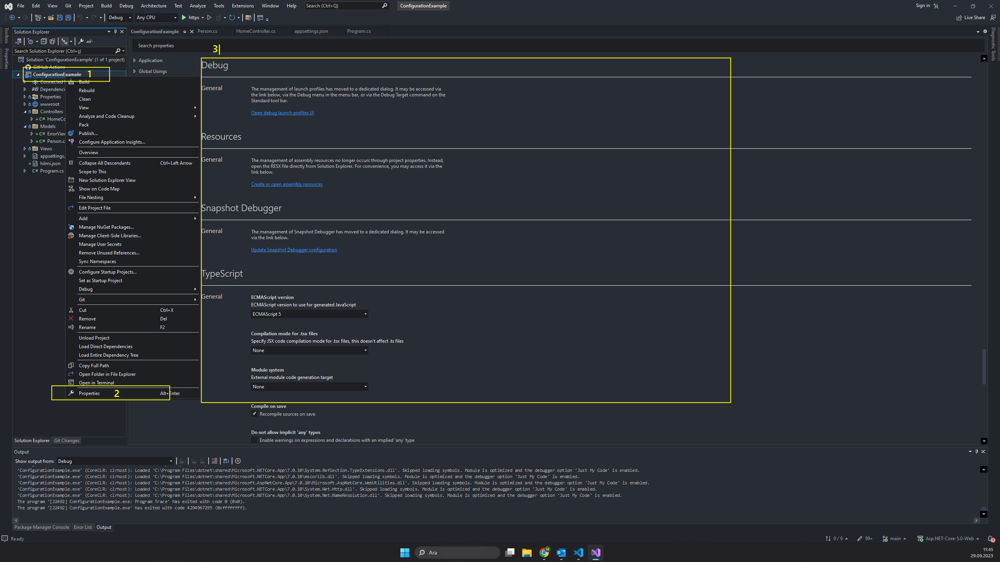
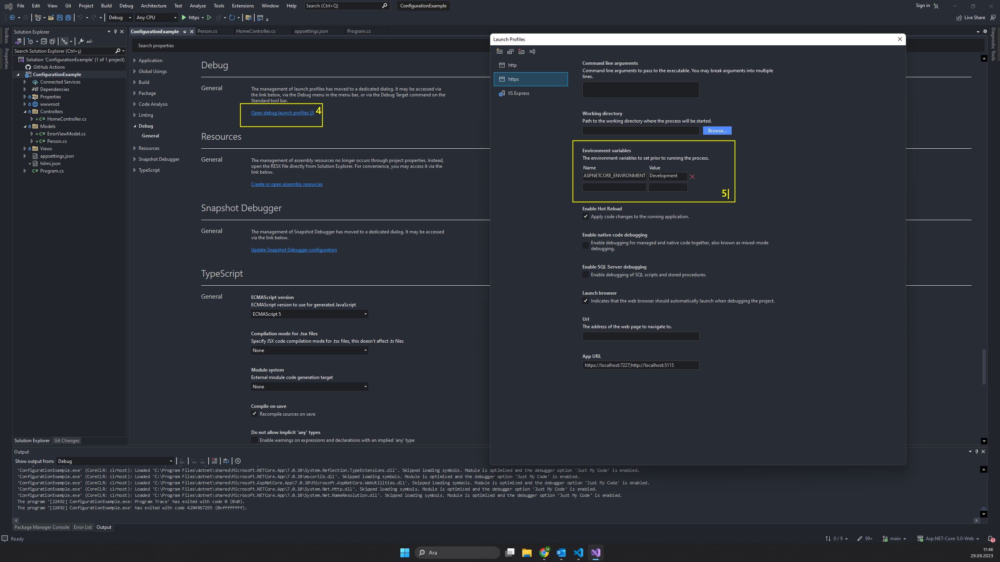

## C# Examples
```C#
//**************************** HomeController ****************************
using ConfigurationExample.Models;
using Microsoft.AspNetCore.Mvc;
using System.Diagnostics;

namespace ConfigurationExample.Controllers
{
    public class HomeController : Controller
    {
        #region IConfiguration Arayüzü Nedir?
        private readonly IConfiguration _configuration;
        public HomeController(IConfiguration configuration)//Ben buradakine bağımlı olacağım yani bu IConfiguration'ı kullanacam bu nesneyi bunu ben new'lemek istemiyorum sen bu bağımlılığı dışarıdan enjekte et. IoC'deki provider'dan ilgili nesneyi getiriyor. Gelen bu nesne buradaki parametre tarafından yakalanıyor. bu işlem neticesinde bunu bu uygulamada kullanabilmek istediğim yerde taşıyabilmek için global olarak tanımladığım readonly referans sayesinde işaretleyip her yerde global olarak kullanabilmekteyim.
        {
            _configuration = configuration;
        }
        #endregion

        public IActionResult Index()
        {
            return View();
        }

        public IActionResult Privacy()
        {
            #region Indexer İle Veri Okuma Nasıl Yapılır?
            string? val1 = _configuration["OrnekMetin"];
            string? val2 = _configuration["Person"];
            string? val3 = _configuration["Person:Name"];
            string? val4 = _configuration["Person:Surname"];
            string? val5 = _configuration["Logging:LogLevel:Microsoft.Hosting.Lifetime"];
            #endregion
            #region GetSection Metodu İle Veri Okuma Nasıl Yapılır?
            var v6 = _configuration.GetSection("Person");
            var v7 = _configuration.GetSection("Person:Name");
            #endregion

            #region Get Metoduyla Verileri Uygun Nesneyle Eşleştirme​
            var v8 =_configuration.GetSection("Person").Get(typeof(Person));//Sen önce burada hangi section ile çalışacağını bildir ardından Get üzerinden ilgili section bir objeyse value olarak bir string dönmeyecekse bunu Get olarak belirli bir türde elde edebilirsin.
            var v9 = _configuration.GetSection("Person:Name").Get(typeof(String));
            #endregion
            return View();
        }

        [ResponseCache(Duration = 0, Location = ResponseCacheLocation.None, NoStore = true)]
        public IActionResult Error()
        {
            return View(new ErrorViewModel { RequestId = Activity.Current?.Id ?? HttpContext.TraceIdentifier });
        }
    }
}

//**************************** appsettings.json ****************************
{
  "Logging": {
    "LogLevel": {
      "Default": "Information",
      "Microsoft.AspNetCore": "Warning",
      "Microsoft.Hosting.Lifetime": "Information"
    }
  },
  "AllowedHosts": "*",
  //************************* appsettings.json'a Veri Ekleme *************************
  "OrnekMetin": "sebepsiz boş yere ayrılacaksan...", //Sistemde anlamlı bir konfigürasyon olacatır. Nihayetinde sen bunu sistemde erişip kullanacak halde tanımlamış oldun.
  "Person": {
    "Name": "Musa",
    "Surname": "Uyumaz"
  }
  //**************************************************
}

//**************************** Program.cs ****************************
var builder = WebApplication.CreateBuilder(args);

#region appsettings.json Dosyasının Asp.NET Core Uygulamasındaki Davranışı 
builder.Configuration.AddJsonFile("hilmi.json");
#endregion

// Add services to the container.
builder.Services.AddControllersWithViews();

var app = builder.Build();

// Configure the HTTP request pipeline.
if (!app.Environment.IsDevelopment())
{
    app.UseExceptionHandler("/Home/Error");
    // The default HSTS value is 30 days. You may want to change this for production scenarios, see https://aka.ms/aspnetcore-hsts.
    app.UseHsts();
}

app.UseHttpsRedirection();
app.UseStaticFiles();

app.UseRouting();

app.UseAuthorization();

app.MapControllerRoute(
    name: "default",
    pattern: "{controller=Home}/{action=Index}/{id?}");

app.Run();

//**************************** Person ****************************
namespace ConfigurationExample.Models
{
    public class Person
    {
        public string Name { get; set; }
        public string Surname { get; set; }
    }
}
```

***
# 46) Asp.NET Core 5.0 - Options Pattern İle Konfigürasyonları Dependency Injection ile Yapılandırma
- appsettings.json dosyasındaki yapmış olduğumuz konfigürasyon ayarlarını uygulamaya hızlı bir şekilde enjekte edebilmemizi yani dependency injection'ı kullanabilmemizi ve o şekilde daha pratik çalışmamızı sağlar.

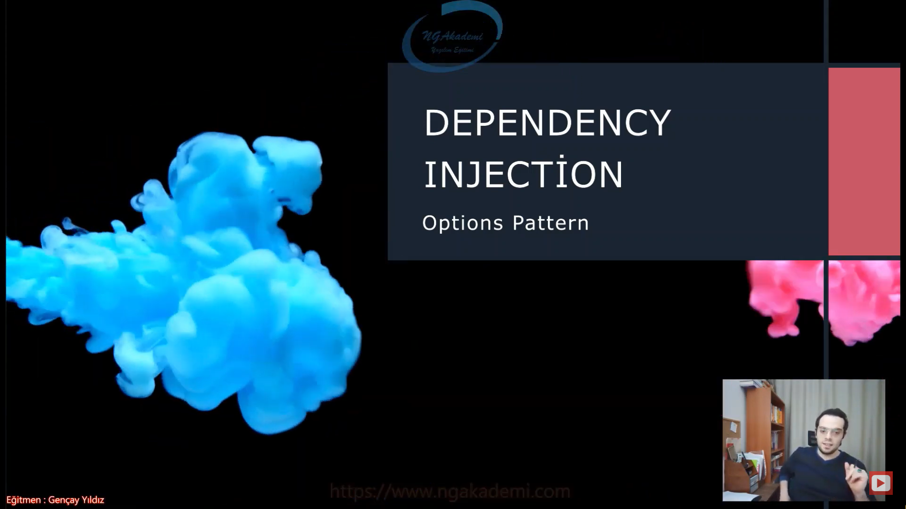

- Bu desen sayesinde appsettings.json dosyasındaki kayıtları yapılandırılmış şekilde ilgili uygulamanın IoC container'ına koyacağız ve bunu sonraki süreçlerde ihtiyaç doğrultusunda pratik olacak şekilde dependency injection'ı kullanarak talep edebileceğiz.

- Asp.NET Core uygulamalarında konfigürasyonel hiçbir metinsel değer kodun içerisine yazılmaz. Bu değerler appsettings.json dosyasında yazılır.

```C#
//**************************** HomeController ****************************
public class HomeController : Controller
{
    #region Konfigürasyon Verilerini IConfiguration üzerinden Okuma
    private readonly IConfiguration _configuration;
    public HomeController(IConfiguration configuration)
    {
        _configuration = configuration;
    }
    public IActionResult Index()
    {
        string? host = _configuration["MailInfo:Host"];
        string? port = _configuration["MailInfo:Port"];
        MailInfo? mailInfo = _configuration.GetSection("MailInfo").Get<MailInfo>();//Tasarladığınız model hani Get metodunu kullanırken sana ilgili konfigürasyonu yapılandırıp(yani  ilgili konfigürasyonu ilgili fonksiyonları kullanarak sen MailInfo türünden bir nesne elde ediyorsun Bu senin açından oradaki konfigürasyon dosyalarını dil açısından yapılandırılıp  yani nesnel karşılığını elde ediyorsun böyle yapınaldırmış oluyorsun.) getiriyor ya işte bu durumda birebir bizim konfigürasyon isimleriyle property isimleri aynı olması gerekiyor.  Eğer ki bir fark olursa ilgili eşleştirme yapılamayacağından dolayı Property'ler null değerinde gelebilir.
        //Options pattern buradaki yapılandırmayı dependency injection üzerinden tek elden yapmamızı sağlayan bir kolaylık sağlıyor. Sana her MailInfo lazım olduğunda _configuration. GetSection("MailInfo").Get<MailInfo>(); bu işlemi yapmak zorundasın. Yani her lazım olduğu yerde IConfiguration'ı enjekte edeceksin. Bu işlemden sonra geleceksin GetSection ("MailInfo") diyip Get<MailInfo>(); deyip işlemi yapman gerekecek. Ölme eşşeğim ölme :)
        return View();
    }
    #endregion
}
//**************************** appsettings.json ****************************
"MailInfo": {
    "Port": 587,
    "Host": "smtp.gmail.com",
    "EmailInfo": {
      "Email": "musa.uyumaz73@gmail.com",
      "Password": "12345"
    }
}
```

- `MailInfo? mailInfo = _configuration.GetSection("MailInfo").Get<MailInfo>();` => Tasarladığınız model hani Get metodunu kullanırken sana ilgili konfigürasyonu yapılandırıp(yani ilgili konfigürasyonu ilgili fonksiyonları kullanarak sen MailInfo türünden bir nesne elde ediyorsun Bu senin açından oradaki konfigürasyon dosyalarını dil açısından yapılandırılıp yani nesnel karşılığını elde ediyorsun böyle yapınaldırmış oluyorsun.) getiriyor ya işte bu durumda birebir bizim konfigürasyon isimleriyle property isimleri aynı olması gerekiyor. Eğer ki bir fark olursa ilgili eşleştirme yapılamayacağından dolayı Property'ler null değerinde gelebilir.
    * Options pattern buradaki yapılandırmayı dependency injection üzerinden tek elden yapmamızı sağlayan bir kolaylık sağlıyor. Sana her MailInfo lazım olduğunda _configuration.GetSection("MailInfo").Get<MailInfo>(); bu işlemi yapmak zorundasın. Yani her lazım olduğu yerde IConfiguration'ı enjekte edeceksin. Bu işlemden sonra geleceksin GetSection("MailInfo") diyip Get<MailInfo>(); deyip işlemi yapman gerekecek. Ölme eşşeğim ölme :)
    * Biz bir yerden sonra bu yöntemden de kaçacağız diyeceğiz ki ya kardeşim benim sürekli belirli noktalarda kullandığım konfigürasyonel değerler var. Ben bu değerleri dependency injection'da kullanabilmek istiyorum. İşte dependency injection'da direkt nesne olarak bu değerleri talep edebilmem için benim bu konfigürasyonel yapıları appsettings.json içerisindeki belirli parçaları IoC yapılanmasının container'ına bir nesne karşılığı koymam lazım. İşte bunu koyabilmeni ve istediğin zaman çağırabilmeni sağlayan yapılanmaya options pattern diyoruz. 

- Options Pattern appsettings.json dosyasındaki konfigürasyonları Dependency Injection ile kullanmamızı sağlayan ve yapılandırılmış olan nesnel modellerle ilgili konfigürasyonları temsil etmemizi sağlayan bir tasarım desenidir.

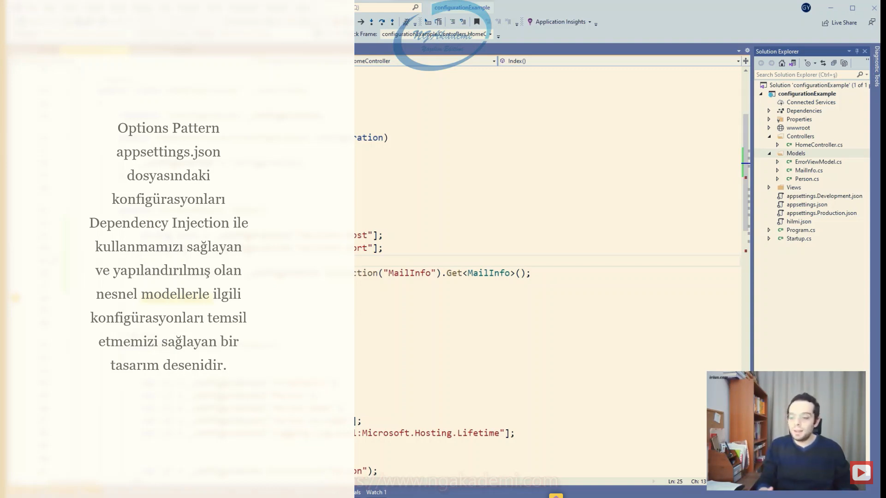

- Bunu birden fazla kez farklı konfigürasyonel yapılanmalar içinde n adet nesneye çevirebilecek yapılandırmalar sağlayabilirsiniz. 

```C#
//**************************** Program.cs ****************************
#region Konfigürasyon Verilerini Options Pattern İle Okuma
builder.Services.Configure<MailInfo>(builder.Configuration.GetSection("MailInfo"));// Bu fonksiyonda GeSection ile gerekli değeri veriyoruz. appsettings'teki hangi nesneyi hedef göstereceksen hangi bölümü yani ayarı/konfigürasyonu hedef göstereceksen onun ismini bildiriyorsun. Altındakileri Zaten bildirmiş olduğun generic türe dönüşüm yapılıp IoC container'ına ilgili nesne verilmiş olacaktır.
//Birden fazla konfigürasyonel değeri program.cs üzerinden bu şekilde farklı türlerdeki class'lara yapılandırıp istediğimiz zaman lazım olanı çağırabilirsiniz. 
#endregion

//**************************** HomeController ****************************
MailInfo _mailInfo;
public HomeController(IOptions<MailInfo> mailInfo)
{
    _mailInfo = mailInfo.Value;
}
public IActionResult Index()
{
    MailInfo mailInfo = _mailInfo;
    return View();
}

//**************************** MailInfo ****************************
{
    public class MailInfo
    {
        public string Host { get; set; }
        public string Port { get; set; }
        public EmailInfo EmailInfo { get; set; }
    }
    public class EmailInfo
    {
        public string Email { get; set; }
        public string Password { get; set; }
    }
}

```

- Bu şekilde yapılan çalışmalarda biz özellikle konfigürasyon değerlerine erişebilmek için bunları karışık bir şekilde `IConfiguration` üzerinden değil de Options Pattern'ı kullanarak elde etmeyi tercih ediyoruz Çünkü bu hem daha düzenli hem de yapılandırılmış bir çalışma sunduğu için daha hızlı hareket etmemizi sağlayacaktır. Kodun bakımı ve kodun esnekliği/temizliği açısından daha doğru olacaktır. Çünkü eğer ki biz appsettings.json dosyasının içindeki değerleri  `IConfiguration` ile her kodun içinde çağırmış olsaydım bu da bir konfigürasyon değerinin içeride çağırılması olacaktı. Dolayısıyla bunu tek bir yerden çağırıyorum. Haliyle bir gün gelirde appsettings.json içindeki değerler/key'ler değişirse en azından tek bir yerden bunu yönettiğim için birtek orayı değiştirmem yeterli olacaktır. 50 tane yerde sen ilgili konfigürasyonu çağırıyorsan hem konfigürasyon değerleri üzerinde sana hız kazandıran ve gerçekten yapılandırmanı güçlü bir şekilde sağlayan bu yapılanmanın o isimleride konfigürasyonel değer oldukları için metinsel olarak kodun içerisine gömülmüş oluyorlar. Birgün değişebilir/silinebilir. İşte böyle durumlarda bu kodların hepsini temizleniz ya da değiştirmeniz gerekir. Bunların hepsini Options Pattern sayesinde tek elden yine yönetebilmiş oluyorsunuz.

## C# Example
```C#
//**************************** Program.cs ****************************
using ConfigurationExample.Models;

var builder = WebApplication.CreateBuilder(args);

// Add services to the container.
builder.Services.AddControllersWithViews();

#region Konfigürasyon Verilerini Options Pattern İle Okuma
builder.Services.Configure<MailInfo>(builder.Configuration.GetSection("MailInfo"));// Bu fonksiyonda GeSection ile gerekli değeri veriyoruz. appsettings'teki hangi nesneyi hedef göstereceksen hangi bölümü yani ayarı/konfigürasyonu hedef göstereceksen onun ismini bildiriyorsun. Altındakileri Zaten bildirmiş olduğun generic türe dönüşüm yapılıp IoC container'ına ilgili nesne verilmiş olacaktır.
                                                                                   //Birden fazla konfigürasyonel değeri program.cs üzerinden bu şekilde farklı türlerdeki class'lara yapılandırıp istediğimiz zaman lazım olanı çağırabilirsiniz. 
#endregion

var app = builder.Build();

// Configure the HTTP request pipeline.
if (!app.Environment.IsDevelopment())
{
    app.UseExceptionHandler("/Home/Error");
    // The default HSTS value is 30 days. You may want to change this for production scenarios, see https://aka.ms/aspnetcore-hsts.
    app.UseHsts();
}

app.UseHttpsRedirection();
app.UseStaticFiles();

app.UseRouting();

app.UseAuthorization();

app.MapControllerRoute(
    name: "default",
    pattern: "{controller=Home}/{action=Index}/{id?}");

app.Run();

//**************************** HomeController ****************************
using ConfigurationExample.Models;
using Microsoft.AspNetCore.Mvc;
using Microsoft.Extensions.Options;
using System.Diagnostics;

namespace ConfigurationExample.Controllers
{
    public class HomeController : Controller
    {
        #region Konfigürasyon Verilerini IConfiguration üzerinden Okuma
        //private readonly IConfiguration _configuration;

        //public HomeController(IConfiguration configuration)
        //{
        //    _configuration = configuration;
        //}

        //public IActionResult Index()
        //{
        //    string? host = _configuration["MailInfo:Host"];
        //    string? port = _configuration["MailInfo:Port"];

        //    MailInfo? mailInfo = _configuration.GetSection("MailInfo").Get<MailInfo>();//Tasarladığınız model hani Get metodunu kullanırken sana ilgili konfigürasyonu yapılandırıp(yani ilgili konfigürasyonu ilgili fonksiyonları kullanarak sen MailInfo türünden bir nesne elde ediyorsun Bu senin açından oradaki konfigürasyon dosyalarını dil açısından yapılandırılıp yani nesnel karşılığını elde ediyorsun böyle yapınaldırmış oluyorsun.) getiriyor ya işte bu durumda birebir bizim konfigürasyon isimleriyle property isimleri aynı olması gerekiyor. Eğer ki bir fark olursa ilgili eşleştirme yapılamayacağından dolayı Property'ler null değerinde gelebilir.
        //    //Options pattern buradaki yapılandırmayı dependency injection üzerinden tek elden yapmamızı sağlayan bir kolaylık sağlıyor. Sana her MailInfo lazım olduğunda _configuration.GetSection("MailInfo").Get<MailInfo>(); bu işlemi yapmak zorundasın. Yani her lazım olduğu yerde IConfiguration'ı enjekte edeceksin. Bu işlemden sonra geleceksin GetSection("MailInfo") diyip Get<MailInfo>(); deyip işlemi yapman gerekecek. Ölme eşşeğim ölme :)
        //    return View();
        //}
        #endregion
        #region Konfigürasyon Verilerini Options Pattern İle Okuma
        MailInfo _mailInfo;
        public HomeController(IOptions<MailInfo> mailInfo)
        {
            _mailInfo = mailInfo.Value;
        }
        public IActionResult Index()
        {
            
            return View();
        }
        #endregion
        public IActionResult Privacy()
        {
            return View();
        }

        [ResponseCache(Duration = 0, Location = ResponseCacheLocation.None, NoStore = true)]
        public IActionResult Error()
        {
            return View(new ErrorViewModel { RequestId = Activity.Current?.Id ?? HttpContext.TraceIdentifier });
        }
    }
}

//**************************** MailInfo ****************************
namespace ConfigurationExample.Models
{
    public class MailInfo
    {
        public string Host { get; set; }
        public string Port { get; set; }
        public EmailInfo EmailInfo { get; set; }
    }
    public class EmailInfo
    {
        public string Email { get; set; }
        public string Password { get; set; }
    }
}

//**************************** appsettings.json ****************************
{
  "Logging": {
    "LogLevel": {
      "Default": "Information",
      "Microsoft.AspNetCore": "Warning"
    }
  },
  "AllowedHosts": "*",
  "MailInfo": {
    "Port": 587,
    "Host": "smtp.gmail.com",
    "EmailInfo": {
      "Email": "musa.uyumaz73@gmail.com",
      "Password": "12345"
    }
  }
}

```

***
# 47) Asp.NET Core 5.0 - Secret Manager Tools İle Hassas Verilerin Korunması
- Siz belirli konfigürasyonel değerler tutuyorsunuz web uygulamalarında bu konfigürasyonel değerler appsettings.json'da tutuluyor. `appsettings.json`'ın davranışını bildiğinizde burada bir risk olduğunu göreceksiniz. Sen geldin herhangi bir x konfigürasyonel değerini gittin `appsettings.json`'a koydun. Eyvallah zaten yeri orasıdır. Zaten koyman gereken yer odur Ama `appsettings.json` konfigürasyonel değerlerin tutulduğu yerlerden bir tanesidir. Diğer yerler de var. Diğer yerlerden bir tanesi de Secret Manager Tools dediğimiz yapılanma.

- `appsettings.json` dediğimiz dosya içerisine koymuş olduğunuz konfigürasyonu bütün sistemde merkezi bir şekilde yönetmemizi sağlayan bir dosya. Amma velakin biz geliştirdiğimiz web uygulamasını bir gün çıktısını alacağız yani publish diyeceğiz biz buna yayınlanılabilir yani production ortamına uygun hale getireceğiz yayınlanabilir hale getireceğiz ve bunu gidicez bir sunucuya ya da bir cloud'daki herhangi bir yere atıp kullanıcılarımıza hizmet vermeye başlayacağız. Yani sunuma/production'a çıkacağız. Haliyle sen bir web uygulamasını Asp.NET Core uygulamasını publish ettiğin zaman çıktıda `appsettings.json` dosyası da bulunacaktır. Sen uygulamanda konfigürasyonel yapıları`appsettings.json`'a koyduğunda `appsettings.json` publish çıktısında bulunan bir dosya demek. `appsettings.json` uygulama production ortamına gönderilirken gönderilen bir dosya demek.

- `appsettings.json` içerisinde kritik verilerinizin olduğunu düşünün şifreleriniz connection string değerleriniz işte third party'lerle iletişim sağlamanızı sağlayan belirli id secret değerleriniz vs. Yani kritik değerleriniz başkasının eline geçtiği zaman kullanabilir ve sizi her türlü rezillikle sonuçlandırabilir değerlerinizin olduğunu düşünelim. Şimdi sen uygulamanın çıktısını aldığın zaman bu çıktıda `appsettings.json` olacak ve bu `appsettings.json`ın içinde bu değerler olacak. Adam açtığı zaman bunları görebilecek. Sen bunu sunucuya gönderdiğinde diyelim li bir gün sunucuna biri sızdı ya da sunucunun sahibi dedi ki ulan bir bakayım ben şu adamın dosyalarına dedi. Senin kritik verilerin orada gözüküyor. Kritik verilerin `appsettings.json`'ı açtığı zaman adamın karşısında olacak. Diyecek ki vay be bu adamın connection string'i demek ki buymuş tamam bizde alalım kullanıcı adı ve şifresi herşeyi burada bu adamın. Kötü niyetli bir insan senin sunucunu elde ettiği zaman bütün bilgilerini hap bilgi olarak `appsettings.json`'da tutuyorsan eğer kötü niyetli insana bunu vermiş olma ihtimalin var. Dolayısıyla biz kritik yani hassasiyet arz eden konfigürasyonel verilerimizi `appsettings.json`'da tutmuyoruz. `appsettings.json`'da hassasiyet arz etmeyen konfigürasyonel değerleri tutuyoruz.

- Hassasiyet arz eden kritik benim için bir başkasının eline geçtiği zaman her türlü risk konusu olabilecek verilerimizi mümkün mertebe `appsettings.json`'da tutmayacaksınız. Çünkü `appsettings.json` uygulamanın publish neticesinde çıktıda yer alan ve herhangi bir kişi tarafından tıklandığında açılıpta içi görülebilen bir dosyadır. Dolayısıyla biz kritik verilerimizi uygulamada niye sunucuya gönderelim?

- Kritik konfigürasyonel değerlerin varsa cidden risk taşıyorsa bu değerleri `appsettings.json` içinde mümkün mertebe tutmaman gerekiyor.

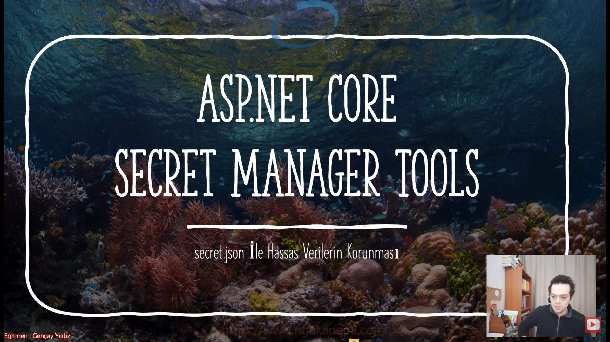

## Secret Manager Tools Nedir?
- Web uygulamalarında development ortamında kullandığımız bazı verilerimizin canlıya deploy edilmesini istemeyebiliriz. Nihayetinde canlıya deploy edildiğinde iyi ya da kötü niyetli bir kişi tarafından bu verilerimiz elde edilebilir kah o anda kah daha sonraki süreçlerde her türlü saboteye sebep olunabilir.

## Kritik/Hassas Veriler Neler Olabilir?
- Bu verilerimiz;
    * Veritabanı bilgilerini barındıran connection string bilgisi,
    * Herhangi bir kritik arz eden token değeri,
    * Facebook veya Google gibi third party authentication işlemleri yapmamızı sağlayan client secret id değerler
    * vs.
- olabilir.

- Connectionstring senin web uygulamanla veritabanı sunucusu arasında bağlantıyı sağlayan yani veritabanıyla ilgili bütün bilgileri tutan hangi server/kullanıcı adı/şifre bunların hepsi connectionstring'in üzerinde var. Sen gidip bunu `appsettings.json` içerisine koyarsan kötü niyetli bir kişiye böyle hani rapor niteliğinde sunmuş gibi verirsen bunu sunucuya adam elde ettiği aman bakar senin connectionstring'in içerisinden bütün veritabanına dair bilgilerini elde edebilir ve veritabanına sızma bile denmez direkt giriş yapabilir. Haliyle bunun gibi bir bilgi `appsettings.json` içine koyulup gönderilmemelidir.

- Senin için uygulamanda önem arz eden bir değer varsa bunu da `appsettings.json`'a koymaman gerekiyor.

- OAuth 2.0 protokolleriyle yok facebook'tan login yok google'dan login yani bunun gibi third party authentication işlemleri yapabildiğimiz operasyonlar var. şimdi bunu yapabilmen için bu işin detayında şu vardır facebook ya da google twitter instagram farketmiyor bunların hepsi sana bir client id ile secret id dediğimiz değerler verir ve senin uygulamanı bu değerler üzerinden tanılar. Haliyle bu değerler bu dev firmalar tarafından sana ait sadece sana ait olan değerlerdir. Bu değerlerini gidip `appsettings.json` içerisine koyarsan düşünsene facebook için sana ait olan değeri kötü niyetli adamın eline kaptırdın adam her türlü seni sabote edebilir. Facebook'a karşı kullanabilir vs. Dolayısıyla biz bu tür değerleri `appsettings.json` içine koyup kendimizi riske atmak istemeyiz.

-  Bu veriler developer ortamında kullanılırken, production ortamında kötü niyetli kişilerin uygulama dosyalarına erişim sağladıkları durumlarda elde edemeyecekleri vaziyette bir şekilde ezilmeleri gerekmektedir.

- İşte bunun için Secret Manager Tool geliştirilmiştir

- Web uygulamalarında static olan verileri tekrar tekrar yazmak yerine bir merkezde depolayarak kullanmayı tercih ediyoruz.

- Asp.NET Core uygulamalarında bu merkez genellikle `appsettings.json` dosyası olmaktadır.

- `appsettings.json` konfigürasyonel bir dosya olsada kritik arz eden hassasasiyet arz eden konfigürasyon değerlerini biz `appsettings.json`'da tutabiliriz tutarsak başımızın ağrıma ihtimali var. 

- Her ne olursa olsun uygulama publish edildiği taktirde çıktıdan erişilebilir bir dosya olduğu için `appsettings.json` bizim hassasiyet kritik arz eden değerlerimizi bu erişileyemeyecek bir şekilde ayrı bir ezilebilir/daha farklı bir yerden verilmesi lazım. Biz kritik verilerimizi `appsettings.json`'da tutmuyoruz secret manager tools'ta tutuyoruz. 

- Bu dosya içerisine yazılan değerler her ne olursa olsun uygulama publish edildiği taktirde çıktıdan erişilebilir vaziyette olacaktır.

- Dolayısıyla bizler static verilerimizi `appsettings.json` içerisinde tutabiliriz lakin kritik arz eden veriler için burasının pekte ehemmietli bir yer olmadığı aşikardır diyebiliriz.

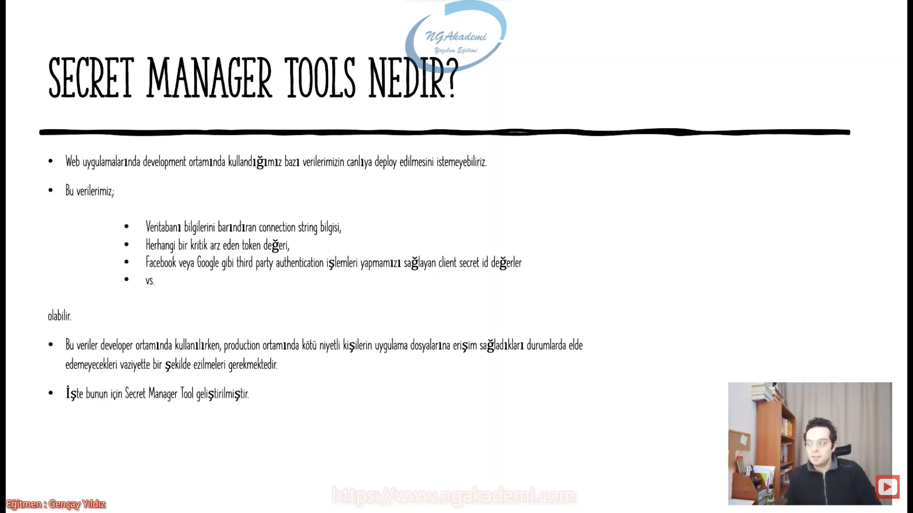
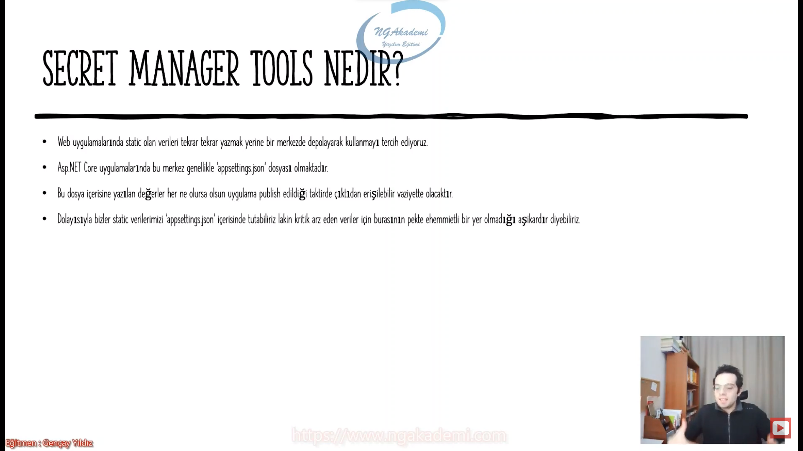

## appsettings.json Üzerinde Tutulan Hassas Verilerin Riskini Gözlemleyelim
- Benim inanılmaz derecede önemli olan verilerimi `appsettings.json`'a koyduğum zaman biz bunu production'a gönderecek hale getirmiş oluyoruz. Nihayetinde `appsettings.json` bu uygulamanı publish ettiğin zaman çıktılarda bulunabilecek ve tıklandığı zaman açılıpta içindeki değerleri gösterebilecek bir konuma sahip.


```JSON
//************************ appsettings.json ************************
{
    "MailBilgileri": {
        "Kullanici": "musa@gmail.com",
        "Sifre": "12345"
    }
}
```

## Secret Manager Çalışma Mantığı
- Sen bu uygulamayı geliştirdiğin development ortamı senin bilgisayarın değil mi? Bu uygulamayla ilgili eğer ki Secret Manager'ı kullanıyorsan (`secret.json`) visual studio üzerinde bu dosyayı kullanırken bu bilgisayarda belirli bir dizinde bu konfigürasyonel dosya tutulur. Bu dosya her bir uygulamaya özel bir secret id değeriyle beraber tutulur ki uygulamalar arasında fark yaratabilmek için. Dolayısıyla senin buraya koymuş oldğun kritik değerler development ortamında sadece erişilebilir production ortamına çıkarken `secret.json` dediğimiz dosya publish neticesinde ilgili çıktılarda bulunmayacağından dolayı production'da bu dosylaar bu konfigürasyonlar gönderilmeyecektir. Haliyle senin için kritik arz eden verilerin production ortamına sunulmayacağından dolayı riski minimize etmiş olacaksın. yani en azından kendi ellerinle çaldırmayacaksın. Diyeceksin kardeşim eğer derdin benim verilerimi elde etmekse daha farklı yöntemler denemen gerekiyor. Yani hap bilgi olarak benim için riskli olan değerleri vermiyorum. `appsettings.json`dan göndermiyorum diyeceksin.

- `secret.json`'a yazdığımız değerler bizim için daha güvenli olacağından dolayı production'a gönderilmiş olmayacak. Ama bu veriler sadece development ortamında geçerli olmuş olacak. O yüzden production'da ise biz o değerleri environment değişken olarak vereceğiz. Production'da ortam değişkeni olarak sisteme dahil edeceğiz. Sisteme bu şekilde dahil ettiğimizde kötü niyetli kullanıcı sunucuyu elde etse bile environment değişkenleri göremeyeceğinden dolayı haliyle elde edilen sadece kod dosyaları olacak. Ama ana kritik bilgiler elde edilememiş olacak.

- Sen hem development ortamında kritik verilerini `secret.json`da tutarak development ortamında geliştirmeni hızlı bir şekilde yapabiliyorsun hem de production'a aldığın zamanda production'da da buradaki kritik verilerini environment olarak verdiğinden dolayı production'daki riski de minimize etmiş oluyorsun `appsettings.json` da sadece kritik arz etmeyen ana konfigürasyonel verilerin kalıyor.

- `secret.json` dediğimiz dosya development ortamında konfigürasyonel kritik verileri tutan bir dosya bunu publish ettiğinde publish dosyalarıonın arasında bulunmaz haliyle production ortamına bu gönderilmez haliyle production ortamında çalınabilme riski olan kritik verilerin oraya gönderilmediği için veriler minimize edilmiş olur buradaki risk. Bu verileri production ortamında kullanabilmek için bir zahmet environment değişkenler olarak oraya vereceğiz.

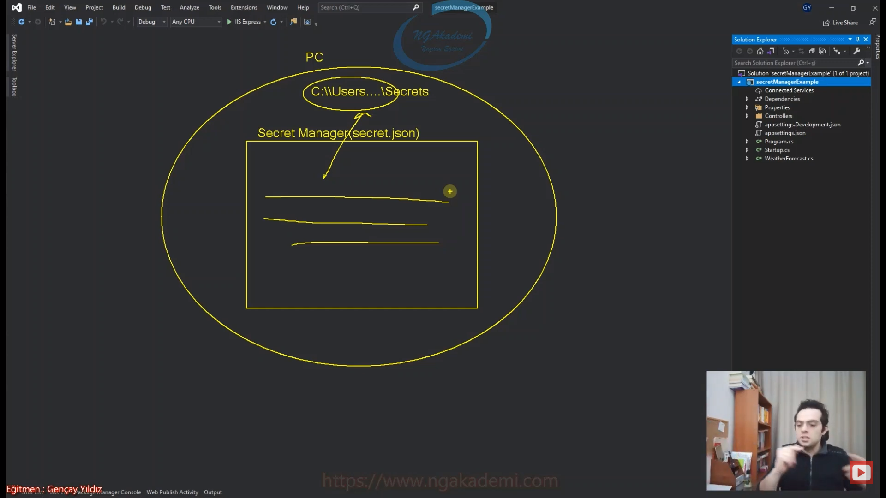

## Secret Manager Nasıl ve Nereden Açılır? (secrets.json)

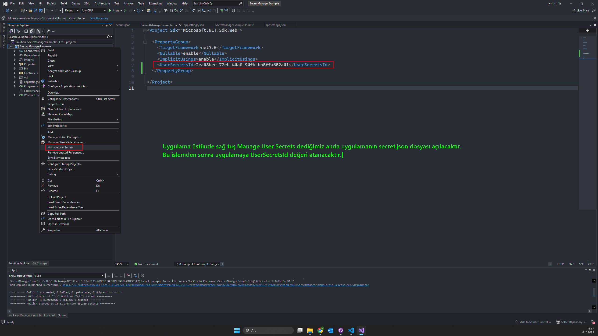

## Secrets Id Nedir?
- Orada binlerce dosya olabilir bunların arasından hangisi uygulamaya özeldir bunu development ortamında ayırabilmek için Secrets Id'yi kullanıyoruz.

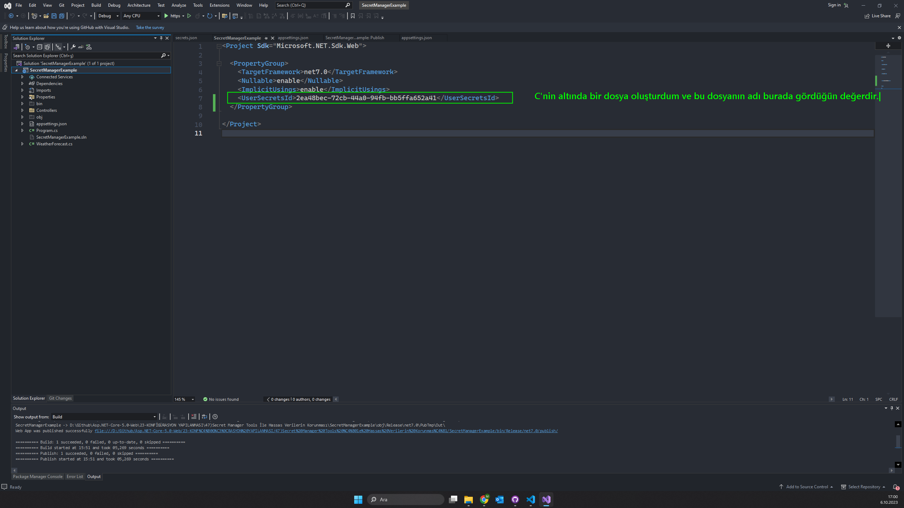

## secrets.json'da ki Verilere Nasıl Erişebilirim?
- Erişim dediğiniz yapılanmaların hepsi yine IConfiguration üzerinden geçerli olacaktır. Yani `appsettings.json`'a nasıl erişiyorsanız `secrets.json`a da birebir aynı şekilde erişebilirsiniz. IConfiguration interface'ini kullanarak.

- Options Pattern'ıda burada birebir kullanabiliyorsunuz.

```JSON
//************************ secrets.json ************************
{
  "MailBilgileri": {
    "Kullanici": "musa@gmail.com",
    "Sifre": "12345"
  }
}
```

## Konfigürasyonel Yapılanmalardaki Yaşam Döngüsü Nasıldır?
- Konfigürasyonel yapılanmada `appsettings.json` diyorsun ki sen ya kardeşim IConfiguration interface'i ile ben herhangi bir aramada bulunduğumda herhangi bir konfigürasyonel değeri elde etmeye çalıştığımda  `appsettings.json`'dan getirir. Bilki `appsettings.json`'dan önce `secret.json`a bakar. Eğer burada yoksa `appsettings.json`'dan getirir. Benzer mantıkla öncelikle environment'a bakar. Environment'te yoksa `secret.json`a bakar `secret.json`da yoksa `appsettings.json`a bakar.

- Aslında konfigürasyon değerini elde etme davranışı `appsettings.json`da nasılsa birebir hepsinde aynı Options Pattern mı kullanmak istiyorsun hepsinde birebir kullanabiliyorsun. Bütün yazılımsal davranışların hepsi hepsinde bütün konfigürasyonel yapılanmalarda aynı olacaktır.

## secrets.json'dan Veri Okuma
- İkisinde de aynı değerler varsa eğer hangisi öncelikle tetikleniyorsa onu getirir. Yani environment -> secret.json -> appsettings.json


```C#
//************************ HomesController ************************
readonly IConfiguration _configuration;

public HomesController(IConfiguration configuration)
{
    _configuration = configuration;
}

public void Index()
{
    string kullanici = _configuration["MailBilgileri:Kullanici"];
    string sifre = _configuration["MailBilgileri:Sifre"];
}
```


## Secret Manager Verileri Nerede Depolamaktadır?
- `C:\Users\{username}\AppData\Roaming\Microsoft\UserSecrets\{secret id}`

- `C:\Users\{username}\AppData\Roaming\Microsoft\UserSecrets\{secret id}` => buranın altında uygulamanıza ait development ortamındaki secret manager dosyalarını bulabilirsiniz.

## secrets.json Üzerinde Tutulan Hassas Verilerin Protection'a Gönderilmemesini İnceleyelim
## Production'da Hassas/Kritik Veriler Nasıl Girilecek Sorunsalı?
- Sen sunucuda uygulamanı ayağa kaldırdın ya sunucuda bizim environment değişkenlerimiz var. Buradan bu değerleri diyecez ki biz al gardaşım sana mail bilgisi al gardaşım connection string'i al sana client secret'ın al sana facebook'tan aldığın bilmem ne değerin yani biz environment değişken olarak vereceğiz kötü niyetli eleman sunucuya sızdığı zaman environment değişkenlerini göremeyeceğinden dolayı çünkü bu yazılımsal olarak sunucunun belleğinde tutulacağından dolayı fiziksel bir dosya olarak göremeyeceğimizden dolayı buradaki kritik bilgilere yine erişemeyecektir.

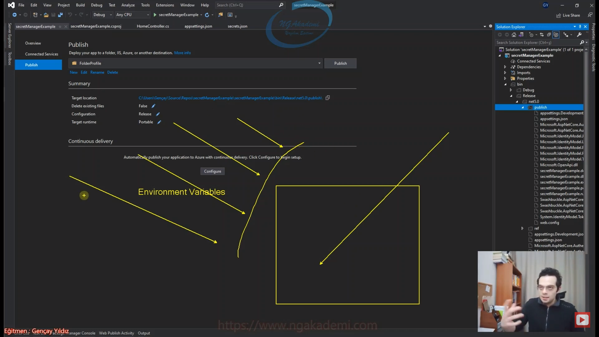

## SqlConnectionStringBuilder Sınıfının Kullanımı(Genel Kültür)
- Dağınık connectionstring  değerlerini development ortamında SqlConnectionStringBuilder sınıfı sayesinde de hızlı bir şekilde toparlayabilirsiniz

```C#
//************************ HomesController ************************
#region SqlConnectionStringBuilder Sınıfının Kullanımı(Genel Kültür)
private readonly IConfiguration _configuration;

public HomesController(IConfiguration configuration)
{
    _configuration = configuration;
}

public void Index2()
{
    string connection = _configuration.GetConnectionString("SQL");
    SqlConnectionStringBuilder builder = new(connection);
    builder.UserID = _configuration["SQL:KullaniciAdi"];
    builder.Password = _configuration["SQL:Sifre"];

    string x = builder.ConnectionString;
} 
#endregion

//************************ appsettings.json ************************
"ConnectionStrings": {
  "SQL": "Server=123.123.123.123;Database=ExampleDB;"
}
//************************ secret.json ************************
"SQL": {
  "Sifre": "12345",
  "KullaniciAdi": "musa"
}
```

## C# Examples
```C#
//************************ secret.json ************************
{
  "MailBilgileri": {
    "Kullanici": "musa@gmail.com",
    "Sifre": "12345"
  },
  "SQL": {
    "Sifre": "12345",
    "KullaniciAdi": "musa"
  }
}

//************************ appsettings.json ************************
{
  "Logging": {
    "LogLevel": {
      "Default": "Information",
      "Microsoft.AspNetCore": "Warning"
    }
  },
  "AllowedHosts": "*",
  "ConnectionStrings": {
    "SQL": "Server=123.123.123.123;Database=ExampleDB;"
  }
  
}

//************************ HomesController ************************
using Microsoft.AspNetCore.Http;
using Microsoft.AspNetCore.Mvc;
using System.Data.SqlClient;

#region Secret Manager Verileri Nerede Depolamaktadır?
//C:\Users\{username}\AppData\Roaming\Microsoft\UserSecrets\{secret id} buranın altında uygulamanıza ait development ortamındaki secret manager dosyalarını bulabilirsiniz. 
#endregion

namespace SecretManagerExample.Controllers
{
    [Route("api/[controller]")]
    [ApiController]
    public class HomesController : ControllerBase
    {
        #region secrets.json'dan Veri Okuma
        //readonly IConfiguration _configuration;

        //public HomesController(IConfiguration configuration)
        //{
        //    _configuration = configuration;
        //}

        //public void Index()
        //{
        //    string kullanici = _configuration["MailBilgileri:Kullanici"];
        //    string sifre = _configuration["MailBilgileri:Sifre"];
        //} 
        #endregion
        #region SqlConnectionStringBuilder Sınıfının Kullanımı(Genel Kültür)
        private readonly IConfiguration _configuration;

        public HomesController(IConfiguration configuration)
        {
            _configuration = configuration;
        }

        public void Index2()
        {
            string connection = _configuration.GetConnectionString("SQL");
            SqlConnectionStringBuilder builder = new(connection);
            builder.UserID = _configuration["SQL:KullaniciAdi"];
            builder.Password = _configuration["SQL:Sifre"];

            string x = builder.ConnectionString;
        } 
        #endregion
    }
}
```

***
# 48) Asp.NET Core 5.0 - Environment Nedir? Nasıl Kullanılır? (Docker Üzerinden Örneklendirme)


## Environment Nedir?
- Environment bir ihtiyaca istinaden kullanılan bir yapılanma.

- Bir web uygulamasında, uygulamanın bulunduğu aşamalara dayalı, davranışı kontrol etmek ve yönlendirmek isteyebiliriz.

- Biz bir uygulamayı geliştirirken o uygulamanın gelişim sürecinde kullandığımız gelişim süreci olan bir noktası var.Ardından bu uygulamayı belirli testlere tabi tutacağımız bir alan bir zaman olacak. Bir de bu uygulamanın yayınlandığı zaman olacak. İşte biz bu zamanlara aşamalar diyelim. Benim uygulamayı geliştirdiğim aşama yayınladığım aşama yayına çıkmadan önce gerekli kontrollerin testlerin yapıldığı aşama. Biz bu aşamalara environment aşama yahut ortam diyeceğiz. 

- Uygulamayı geliştiriyorsunuz gerekli planları projeleri yapıyorsunuz algoritmalarınızı yapıyorsunuz şimdi uygulamayla ilgili bir inşa sürecindeysen inşa ortamı diyebilirsin. Ya da geliştirme ortamı diyebilirsin. Bu ortama adamlar demişler ki ya kardeşim evrensel bir isim verelim ne olsun Development olsun. 

- Development ortamında yapacağımız bütün çalışmalarımız bitti artık ne yapacaksın yayına çıkacaksın. Yayına çıkarken istersen sen buna sunum ortamı de istersen yayın ortamı de istersen ahmet ortamı de farketmiyor ama adamlar demişler ki kardeşim biz buna Production ortamı diyelim. 

- Development ortamından Production ortamına çıkarken arada belirli testler/kontroller/hazırlık süreçleri yapman gerekecek. Haliyle biz buna da Staging ortamı diyoruz. Yani staj ortamı yani hazırlık süreci.

- Temelde 3 tane ortam bunun dışında da ortam oluşturabilirsin. Kendine göre farklı ortamlar oluşturabilirsin.

- Uygulama geliştirme sürecinde mi yayın sürecinde mi yoksa bir test/staj sürecinde mi bunlardan hangisindeysen aşamasına göre davranışı farklı şekilde kontrol etmek yahut farklı yönlendirmeler yapmak isteyebilirsin. Dolayısıyla biz bu tarz çalışmaları Environment dediğimiz yapılanma sayesinde gerçekleştiriyoruz.

- Benim bir tane veritabanım var. Bu uygulama da Hepsiburada.com olsun. Hepsiburada.com'un sunucudaki/serverdaki bir tane SQL veritabanı olsun. Eğer ki sen Production ortamında kullanılan veritabanını development ya da staging ortamlarında kullanmaya çalışırsan muhtemelen büyük rezillik yaşama şansın var. Şimdi development geliştirme sürecinde sen gerçek yayındaki ana uygulamanın şu anda herkesin erişebildiği hepsiburada uygulamasının veritabanına ulaşabiliyorsan eğer development sürecinde yapmış olduğun herhangi bir yanlışlıkta orası etkilecektir. Ya da uygulamayı yazdım test edeyim dediğinde baktığında gerçek veritabanı üzerinde ekleme yapacak ya da silme yapacak. Dolayısıyla böyle durumlarda deriz ki kardeşim sen development ortamındaysan git local'deki SQL Server'ı kullan eğer ki Staging'teysen de git şuradaki SQL Server'ı kullan ama bu uygulama artık production'daysa gerçek sunucudaki SQL Server'ı kullan deriz. Dolayısıyla bunu ayırabilmek için environment'ı kullanmamız gerekiyor. Kodun içinde bunu ayırabilmek için hangi ortamda çalılıyorsa o kod ona göre yönlendirme yapmak istiyorsan environment yapılanmasını kullanman gerekiyor. 

- Zaten environment'ın karşılığı ortam/çevre demek. Sen yazılımın hangi çevredeyse o çevreye göre davranışını şekillendirmesi gerekiyor ki bu lazım olan bişeydir. Yani bir uygulama development sürecinde kullandığı veritabanıyla production ortamındaki kullandığı veritabanı eğer ki aynıysa büyük risk taşıyor demektir.

- Environment'larınızda hangi ortamdaysanız uygulamada o ortama göre veritabanını tercih edebilirsiniz. İstediğin herhangi bir environment değişken belirleyerek ortamına göre farklı operasyonlar gerçekleştirebiliriz.
 
- İşte bunun Environment dediğimiz değişkenler mevcuttur.

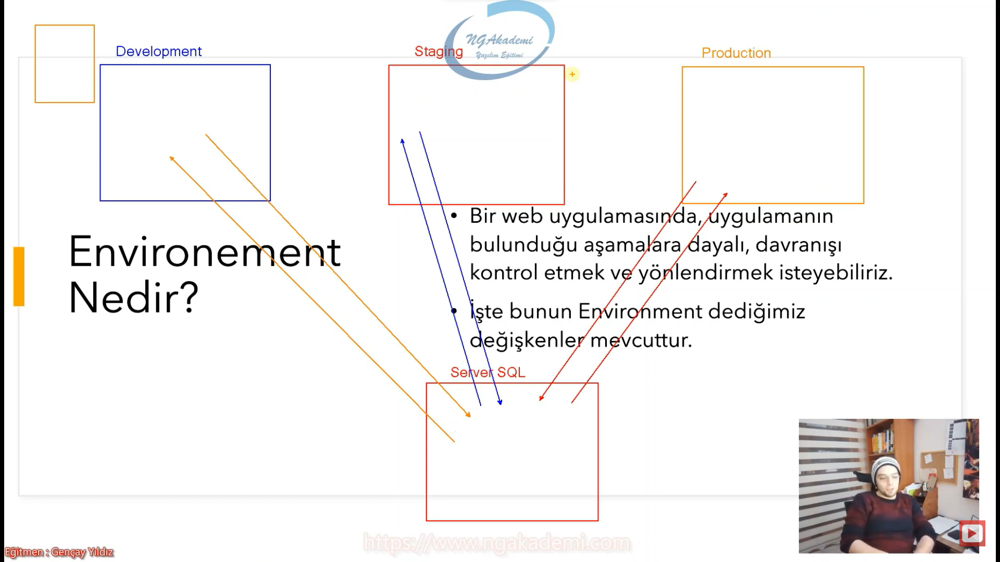

## Environment Variables Nedir?
- Asp.NET Core uygulamalarının runtime'da ki davranışını belirlememizi sağlayan değişkenlerdir. 

- Ortamına göre farklı değişkenler devreye sokabiliyorsunuz.

- Development süreci Production süreci var. İkisinin farklı veritabanlarını kullanması gerekiyor değil mi? İşte bu veritabanlarının ortamına göre bilgilerini connection string'lerini tutuyorsanız biz buna environment değişkenler diyoruz. Development ortamındaki connection string'in ahanda budur Production ortamına geçiyorsan eğer connection string'in ahanda budur diyorsan eğer bunu diyebilmeni sağlayacak olan değişkenler environment değişkenlerdir.

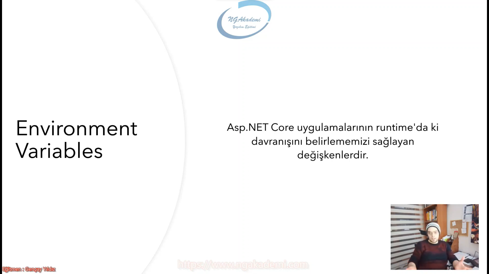
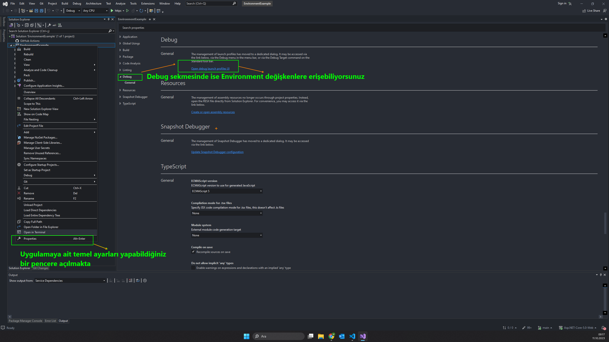

- Properties/launchSettings.json dosyasından da envrionment'lara erişebilirsiniz.

## ASPNETCORE_ENVIRONMENT Nedir?
- ASPNETCORE_ENVIRONMENT => Uygulamanın hangi ortamda olduğunu uygulamanın ayağa kalktığı ortamın hangisi olduğunu bildiren environment değişkendir. 

- Uygulamayı Production'a aldığında yani publish ettiğinde gerekli işlemleri yapıp uygulamanın çıktısını aldığında uygulamanın kendi fıtratında ASPNETCORE_ENVIRONMENT değişken otomatik Production olarak algılanacaktır. Nihayetinde senin publish ettiğin dosyayı gidip herhangi bir hostinge ya da cloud yapılanmasına atıp orada yayına çıkacağından dolayı ilgili alanda ilgili ortamın ASPNETCORE_ENVIRONMENT bilgisi Production olarak olduğunu görebilirsin. Amma velakin development ortamında da varsayılan Development olarak geldiğini bilesin. Staging yapmak için yazman gerekecektir. Yani müdahale etmen gerekecektir.

- Uygulama development ortamında ayağa kalktı haliyle ben bunda veritabanına bağlanacaksam Local'imdeki veritabanına bağlanmam en doğrusu olacaktır. Eğer ki ben bunun çıktısını aldım yani publish ettim. Publish edipte ilgili cloud ya da hosting'e koyduğum zaman hosting environment'ı production olacaktır. Production'sa da şu connection string'e git bağlan dememiz gerekecektir.

- ASPNETCORE_ENVIRONMENT değişkeni İlgili uygulamanın hangi ortamda ayağa kalkacağını ifade eden bir environment variable'dır.

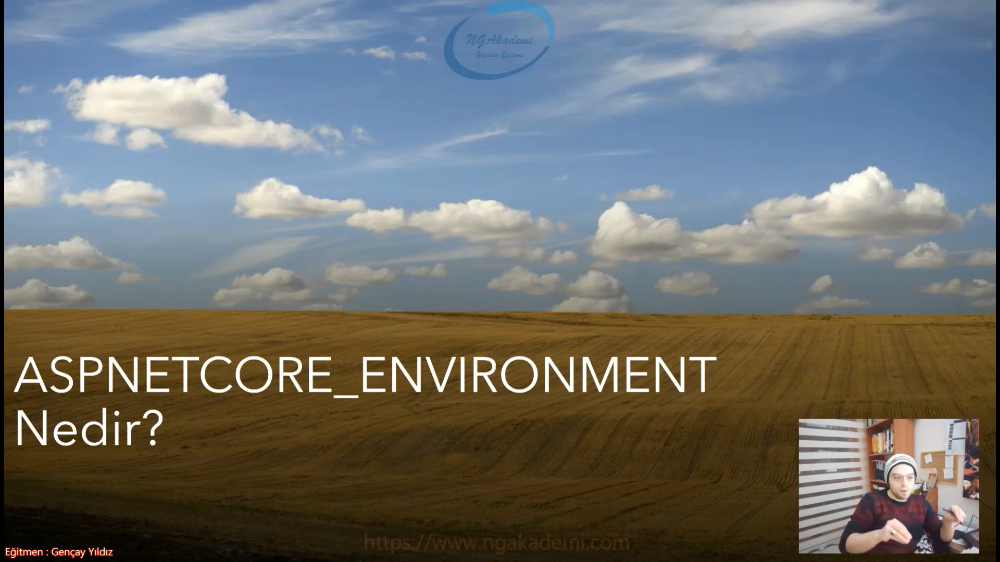

## IWebHostEnvironment Arayüzü İle Runtime Environment Ortamına Erişim
- Uygulamanın hangi environment'ta olduğuna dair bilgileri `IWebHostEnvironment` arayüzü ile alabiliriz.

- `IWebHostEnvironment` arayüzü ile runtime'da hangi environment'aysanız o environment'a dair bilgiler edinebilirsiniz.

- `IWebHostEnvironment` arayüzü Asp.NET Core çekirdeğinde dahili gelen bir arayüzdür ve IoC mekanizmasında direkt kullanabiliyorsunuz. Ioc'den dependency injection ile talepte bulunabiliyorsunuz.

- Environment sayesinde akışta yönlendirme/kontrol yapılanması/davranış değişiklikleri yapabilirsiniz.

```C#
// ****************** HomeController ******************
private IWebHostEnvironment _webHostEnvironment;
public HomeController(IWebHostEnvironment webHostEnvironment)
{
    _webHostEnvironment = webHostEnvironment;
}

public IActionResult Index()
{
    #region IWebHostEnvironment Arayüzü İle Runtime Environment Ortamına Erişim

    if (_webHostEnvironment.IsDevelopment())
    {
        ViewBag.Env = "Development";
    }
    else if (_webHostEnvironment.IsProduction())
    {
        ViewBag.Env = "Production";
    }
    else if (_webHostEnvironment.IsStaging())
    {
        ViewBag.Env = "Staging";
    }
    else if (_webHostEnvironment.IsEnvironment("Ahmet"))
    {
        ViewBag.Env = "Ahmet";
    }

    _webHostEnvironment.IsDevelopment();// uygulamanın çalıştığı ortamı bu şekilde öğrenebilmekteyiz.
    _webHostEnvironment.IsEnvironment("Ahmet"); 
    #endregion

    return View();
}

// ****************** Index.cshtml ******************
<h3>@ViewBag.Env</h3>
```

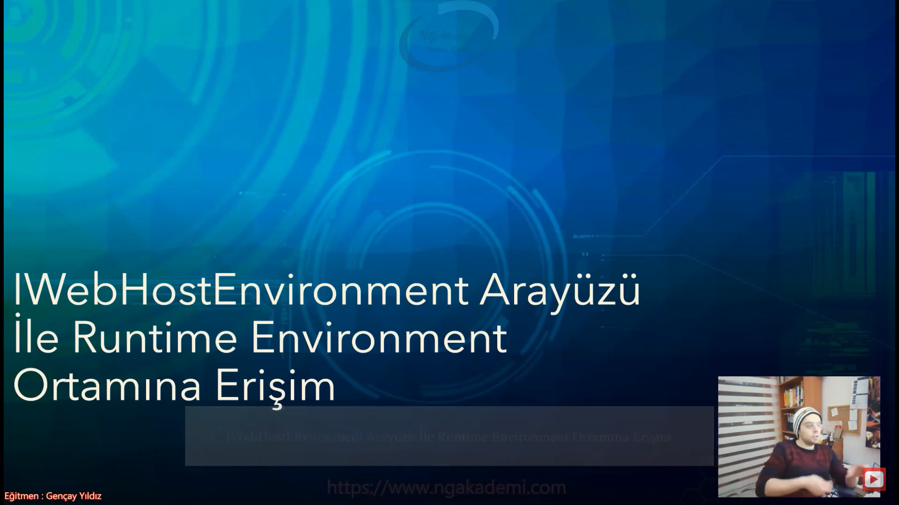

## Environment​ Değişkenlerin secrets.json ve appsettings.json Dosyalarını Ezmesi ​
- Environment'lar secret.json dosyasındaki konfigürasyonel değerler ve appsettings.json dosyasındaki konfigürasyonel değerlerin hepsi aynı şekilde okunmaktadır. Yani sen gelip `IConfiguration` arayüzünden bir referans oluşturursun. Oluşturduğun bu referans üzerinden zaten bir değişkenin değerini okumak istiyorsan o değişken hangisindeyse oradan gelecektir.

- `IConfiguration` üzerinden bir referansla `configuration["a"]` dediğin zaman gidecek herşeyden önce Environment Variable'lar arasından bakacak. Burada yoksa gidecek `secret.json` dan bakacak. Eğer burada da yoksa `appsettings.json` üzerinde arayacaktır. Bunda da yoksa ilgili değer gelmeyecektir.

- Environment değişkenler `secret.json` ve `appsettings.json` tanımlamalarını ezerler. 

- Environment değişkenler bu dosyaları eziyorlar. Çünkü bu değişkenler bu dosyaların altında tanımlanmış aynı benzer isimlere karşılık gelen değerleri/variable'ları/konfigürasyonel tanımları ezip kendilerindeki değerleri döndüreceklerdir.

- Kritik verilerimiz bizim için Environment ortamlarında tutulması gereken verilerdir. Kritik veriler her daim envrionment'larda tutulmalı çünkü environment'ler çıktı olarak Production'a gönderilmez. Production'da da verilmesi gereken değerlerdir.

- Sen environment tutuyorsun uygulamanın publish'ini aldığın zaman publish çıktılarında bulunmaz ya da cloud'da vermen gerekiyor buradaki değerleri. Sanal bir şekilde verdiğin için haliyle bu değerler hiçbir zaman ulaşılabilir değerler olmayacaktır. Uygulama ayakta olduğu sürece kullanılabilir memory'deki değerler olacaktır. Kötü niyetli kişiler tarafından erişilebilir değerlerimizi environment'tan vermemiz her daim en dorğusu olacak. Nihayetinde `appsettings.json`da çalışmanın riskini biliyorsunuz. Secret Manager'da development ortamında kullanılıyor-. Dolayısıyla Secret Manager'daki tuttuğunuz değerler konfigürasyonel değerler development ortamındaki bilgisayarda kalacak. Haliyle sizin bunları production ortamına çekebilmeniz orada çağırabilmeniz için en doğrusu envrionment'ları kullanmanız gerekecektir.
 
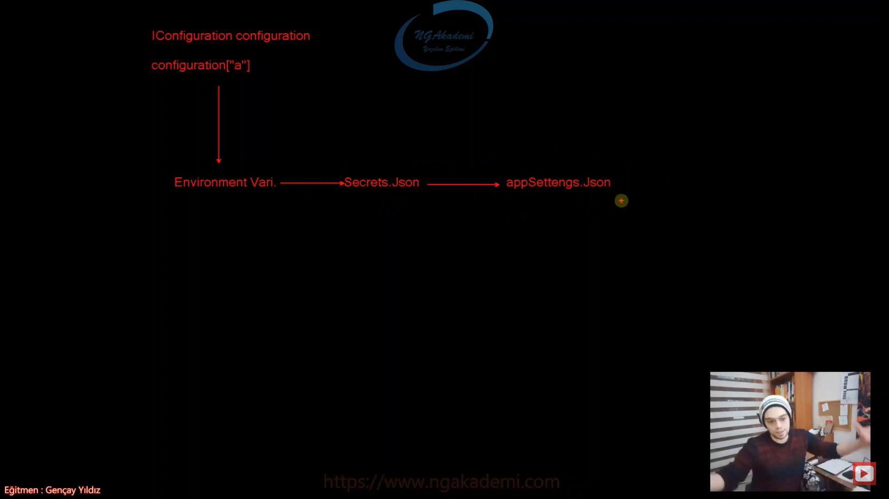

```C#
// ****************** HomeController ******************
#region Environment​ Değişkenlerin secrets.json ve appsettings.json Dosyalarını Ezmesi ​
private IWebHostEnvironment _webHostEnvironment;
private IConfiguration _configuration;
public HomeController(IWebHostEnvironment webHostEnvironment, IConfiguration configuration)
{
    _webHostEnvironment = webHostEnvironment;
    _configuration = configuration;
}
public IActionResult Index()
{
    string? aDegeri = _configuration["a"];
    return View();
}


// ****************** Environment Variables ******************
|a| => A Environment|
// ****************** secret.json ******************
{
  "a": "A Secret"
}
// ****************** appsettings.json ******************
{
    "a": "A appsettings"
}
#endregion

```


## .cshtml'de Environment Kontrolü​

```C#
// ****************** index.cshtml ******************
#region .cshtml'de Environment Kontrolü​
<environment names="Development, Production"> 
    Development veya Production Ortamındayız
</environment>

<environment names="Ahmet">
    Ahmet Ortamındayız
</environment>
#endregion
```

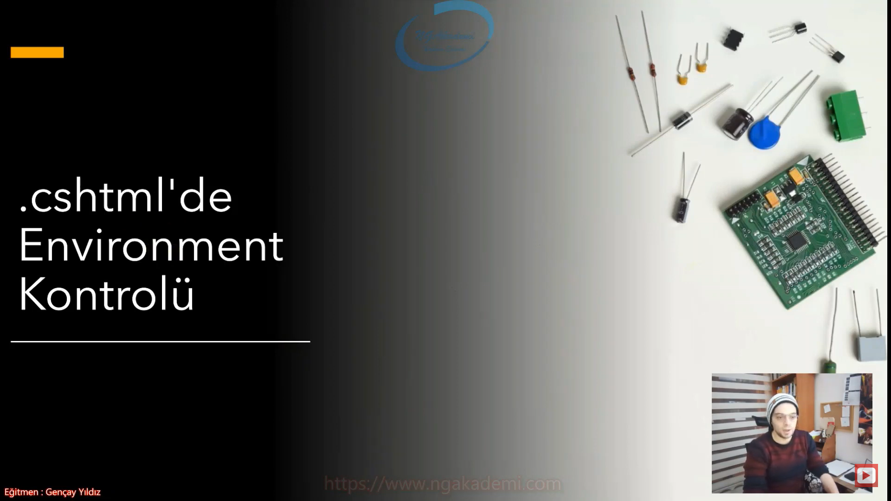

## Docker Üzerinden Örnek
- Uygulamayı dockerize etmemiz gerekiyor. Bunun için uygulamada docker'a bu uygulamayı taşıabilmemiz için bize yardımcı olacak olan bir dosya eklememiz lazım Docker file isminde.

- Image dosyası docker yapılanmasında uygulamayı docker'da ayağa kaldırabilmemizi sağlayacak olan temel yapılanmadır. Container'larımızın temel yapılanmasıdır.

- `docker build -t webuygulamasi:v1 .` 

- `docker run -p 1071:1453 ---name cont1 webuygulamasi:v1`

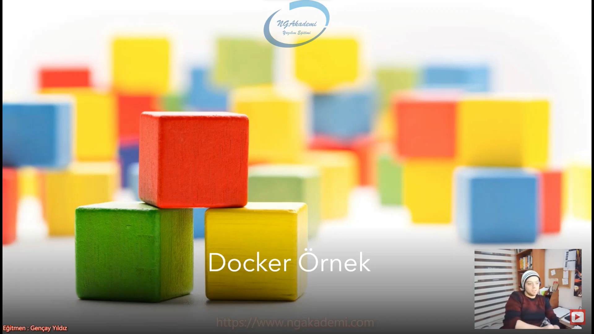

```bash
FROM mcr.microsoft.com/dotnet/sdk # bu talimatlarda kullanacağımız bir image dosyası olacak bu image dosyasında kullanılacak bir image'imiz olacak sdk image'i bunun sayesinde ben docker kısmında docker'da container'larımda ilgili uygulama üzerinde gerekli bir build/publish/restore işlemlerini gerçekleştirebileceğim
WORKDIR /app # docker ortamında bir klasör oluşturup içine gireceğiz. 
COPY . . # Şu anda bulunan dosyalarımızı o anki içinde girdiğimiz klasörün içine kopyalayacağız.
RUN dotnet restore # Ardından restore edeceğiz.
RUN dotnet publish EnvironmentExample.csproj -c Release -o out # Ardından publish edeceğiz. Publish ederken dikkat edin bu uygulamanın .csproj dosyasını publish ediyoruz. ve release olarak bir çıktısını alıyorum.
WORKDIR out # Ardından yeniden bir klasör oluşturuyoruz. Bu klasörün içine giriyoruz.
ENV ASNETCORE_URLS="http://*:1453" # Klasör içinde uygulamayı ayağa kaldırıyorum 1453 portunda 
ENTRYPOINT ["dotnet", "EnvironmentExample.dll"] # ve ENTRYPOINT talimatıyla bu dll'i dotnet'le ayağa kaldırıyorum.
```

## C# Examples
```C#
// ****************** index.cshtml ******************
@{
    ViewData["Title"] = "Home Page";
}

<div class="text-center">
    <h1 class="display-4">Welcome</h1>
    <p>Learn about <a href="https://docs.microsoft.com/aspnet/core">building Web apps with ASP.NET Core</a>.</p>
</div>


<h3>@ViewBag.Env</h3>

#region .cshtml'de Environment Kontrolü​
<environment names="Development, Production"> 
    Development veya Production Ortamındayız
</environment>


<environment names="Ahmet">
    Ahmet Ortamındayız
</environment>
#endregion

// ****************** Environment Variables ******************
|a| => A Environment|

// ****************** secret.json ******************
{
  "a": "A Secret"
}
// ****************** appsettings.json ******************
{
  "Logging": {
    "LogLevel": {
      "Default": "Information",
      "Microsoft.AspNetCore": "Warning"
    }
  },
  "AllowedHosts": "*",
  "a": "A appsettings"
}

// ****************** HomeController ******************
using EnvironmentExample.Models;
using Microsoft.AspNetCore.Mvc;
using System.Diagnostics;

namespace EnvironmentExample.Controllers
{
    public class HomeController : Controller
    {
        #region IWebHostEnvironment Arayüzü İle Runtime Environment Ortamına Erişim
        //private IWebHostEnvironment _webHostEnvironment;

        //public HomeController(IWebHostEnvironment webHostEnvironment){
        //    _webHostEnvironment = webHostEnvironment;
        //} 
        #endregion
        #region Environment​ Değişkenlerin secrets.json ve appsettings.json Dosyalarını Ezmesi ​
        private IWebHostEnvironment _webHostEnvironment;
        private IConfiguration _configuration;
        public HomeController(IWebHostEnvironment webHostEnvironment, IConfiguration configuration)
        {
            _webHostEnvironment = webHostEnvironment;
            _configuration = configuration;
        }
        #endregion
        public IActionResult Index()
        {
            string? aDegeri = _configuration["a"];

            #region IWebHostEnvironment Arayüzü İle Runtime Environment Ortamına Erişim

            //if (_webHostEnvironment.IsDevelopment())
            //{
            //    ViewBag.Env = "Development";
            //}
            //else if (_webHostEnvironment.IsProduction())
            //{
            //    ViewBag.Env = "Production";
            //}
            //else if (_webHostEnvironment.IsStaging())
            //{
            //    ViewBag.Env = "Staging";
            //}
            //else if (_webHostEnvironment.IsEnvironment("Ahmet"))
            //{
            //    ViewBag.Env = "Ahmet";
            //}

            //_webHostEnvironment.IsDevelopment();// uygulamanın çalıştığı ortamı bu şekilde öğrenebilmekteyiz.
            //_webHostEnvironment.IsEnvironment("Ahmet");
            #endregion

            return View();
        }

        public IActionResult Privacy()
        {
            return View();
        }

        [ResponseCache(Duration = 0, Location = ResponseCacheLocation.None, NoStore = true)]
        public IActionResult Error()
        {
            return View(new ErrorViewModel { RequestId = Activity.Current?.Id ?? HttpContext.TraceIdentifier });
        }
    }
}

// ****************** DockerFile ******************
FROM mcr.microsoft.com/dotnet/sdk # bu talimatlarda kullanacağımız bir image dosyası olacak bu image dosyasında kullanılacak bir image'imiz olacak sdk image'i bunun sayesinde ben docker kısmında docker'da container'larımda ilgili uygulama üzerinde gerekli bir build/publish/restore işlemlerini gerçekleştirebileceğim
WORKDIR /app # docker ortamında bir klasör oluşturup içine gireceğiz. 
COPY . . # Şu anda bulunan dosyalarımızı o anki içinde girdiğimiz klasörün içine kopyalayacağız.
RUN dotnet restore # Ardından restore edeceğiz.
RUN dotnet publish EnvironmentExample.csproj -c Release -o out # Ardından publish edeceğiz. Publish ederken dikkat edin bu uygulamanın .csproj dosyasını publish ediyoruz. ve release olarak bir çıktısını alıyorum.
WORKDIR out # Ardından yeniden bir klasör oluşturuyoruz. Bu klasörün içine giriyoruz.
ENV ASNETCORE_URLS="http://*:1453" # Klasör içinde uygulamayı ayağa kaldırıyorum 1453 portunda 
ENTRYPOINT ["dotnet", "EnvironmentExample.dll"] # ve ENTRYPOINT talimatıyla bu dll'i dotnet'le ayağa kaldırıyorum.
```

