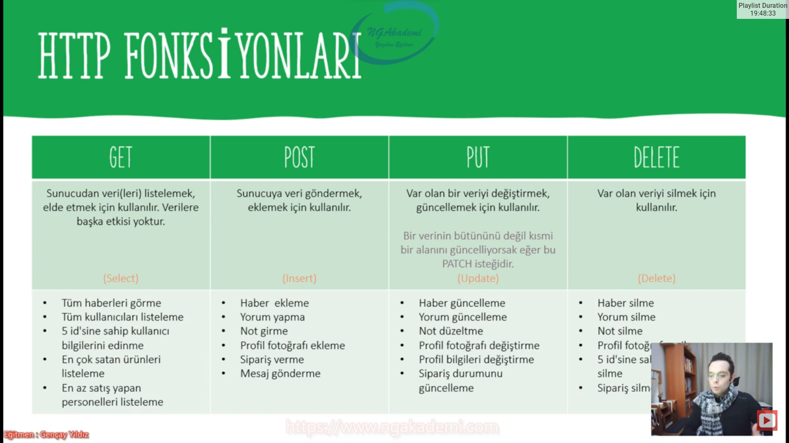

***
# 5) Asp.NET Core 5.0 - Http Protokolü Nedir? Çalışma Mantığı Nasıldır?

- User'ımız client'ı kullanarak hosting'teki herhangi bir web sitesine domain aracılığıyla request atıyordu ve bu request neticesinde de response'u alıp response'un içerisinde render edilmiş web sitenin/web uygulamasının result'unu elde edip client'ta görebiliyordu kullanabiliyordu tarayıcı üzerinde ilgili web sitesi açılıyordu.

- Burada client'la server arasında ilişkiyi sağlayabilmesi için bir protokole ihtiyacımız var. Protokol dediğimiz yapılanma iki farklı yapılanmanın ortak buluşmasıdır. 
    * Yani protokol dediğimiz kavram normalde biz Türkler birde Sudanlılar var. İki ülkenin kültürü farklı dili farklı herşeyi farklı ama ortak bir protokolde buluşuyor değil mi bizim devlet büyüklerimiz. Ortak protokolde buluşulmasının sebebi ortak bir kültür oluşturuluyor orada. Ne onlar bizim kültüre geliyor ne biz onların kültürüne gidiyoruz. Ortak bir kültürde yani protokolde buluşuluyor.

- Client farklı bir yapılanma server bambaşka bir yapılanma dolayısıyla client'la server arasındaki ilişkiyi buradaki haberleşmeyi sağlayan model bizim için HTTP protokolüdür. HTTP protokolü client ile server arasındaki haberleşmeyi sağlayan bir protokoldür.
    * Sen normalde bir web uygulaması mı yapacaksın HTTP protokolünü öğren mevzu zaten bitiyor ondan sonra zaten çok fazla derin bir çalışma yapmana gerek yok. Ondan sonra programatik çalışman gerekecek.

- HTTP, client ile server arasındaki ilişkiyi 9 farklı fonksiyonla gerçekleştirir.
    * Get
    * Head
    * Post
    * Put
    * Delete
    * Trace
    * Options
    * Connect
    * Patch
- Bu fonksiyonlar davranışsal olarak yapmak istediğimiz edinmek istediğimiz verilere göre tercih edilen fonksiyonlardır.
    * Örneğin ben kullandığım client üzerinden herhangi bir veriyi ya da verileri elde etmek istiyorsam `Get` fonksiyonuyla ilgili request'i gerçekleştiririm.
    * Benzer mantıkla sunucuya veri göndereceksem `Post` fonksiyonuyla gerçekleştiriyoruz.
    * Sunucudan veri sileceksek `Delete` fonksiyonuyla gerçekleştiriyoruz.
    * Sunucudan herhangi bir veriyi güncelleyeceksek `Put` fonksiyonuyla gerçekleştiriyoruz.

***
# 6) Asp.NET Core 5.0 - HTTP Fonksiyonları (GET - POST - PUT - PATCH - DELETE)
- HTTP protokolü client ile server arasındaki iletişimi sağlayan bir protokoldü. Dolayısıyla bu iletişim esnasında HTTP diyor ki ya kardeşim client senin server'dan istediğin şey ne ise ona uygun bir tane fonksiyonla o isteği gerçekleştir.

- Sunucuya ilk defa gönderilen verileri biz `Post` fonksiyonuyla göndeririz var olan bir veri üzerinde bir değişiklik yapacaksak eğer bu `Post` olmuyor artık bu güncelleme operasyonu oluyor bunun için `Put` fonksiyonunu kullanıyoruz.

- Elinizdeki verinin bütününü değiştiriyorsanız yani verinin bütün her şeyi değişiyorsa bu bir `Put`tur. Lakin varolan verinin sadece belirli bir kısmı/kısmi bir noktası değişiklik gösteriyorsa biz bunu `Patch` ile sağlarız.

- Siparişi silmek bir `Delete` iken siparişin durumunu `False`'a çekmek ya da aktiflik durumunu pasifleştirmek bir `Put` işlemidir.

|`GET`|`POST`|`PUT`|`DELETE`|
|---|---|---|----|
|Sunucudan veri(leri) listelemek, elde etmek için kullanılır. Verilere başka etkisi yoktur|Sunucuya veri göndermek,eklemek için kullanılır|Var olan bir veriyi değiştirmek, güncellemek için kullanılır|Var olan veriyi silmek için kullanılır|
|Sunucudan verileri alır client'a salt bir şekilde verileri gönderirsin.|Sunucuya client veri gönderecekse göndereceği bu veri body cinsinden bir veri gönderecekse bu veri ilk defa sunucuya gidecekse  `Post` ile bu işlemi gerçekleştiriyoruz.|Bir verinin bütününü değil kısmi bir alanını güncelliyorsak eğer bu `PATCH` isteğidir.||
|`Select`|`Insert`|`Update`|`Delete`|
| Tüm haberleri görme| Haber ekleme| Haber güncelleme| Haber silme|
| Tüm kullanıcıları listeleme| Yorum yapma| Yorum güncelleme| Yorum silme|
| 5 id'sine sahip kullanıcı bilgilerini edinme| Not girme| Not düzeltme| Not silme|
| En çok satan ürünleri listeleme| Profil fotoğrafı ekleme| Profil fotoğrafı değiştirme| Profil fotoğrafını silme|
| En az satış yapan| Sipariş verme| Profil bilgileri değiştirme| 5 id'sine sahip kullanıcıyı silme|
| personelleri listeleme| Mesaj gönderme| Sipariş durumunu güncelleme| Sipariş silme|

