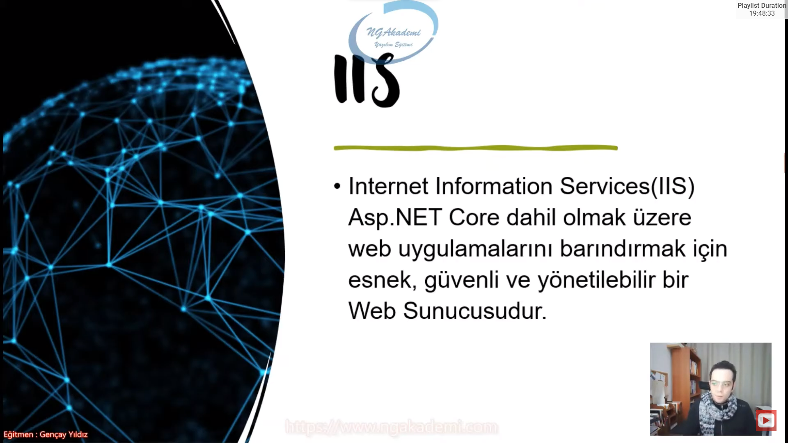
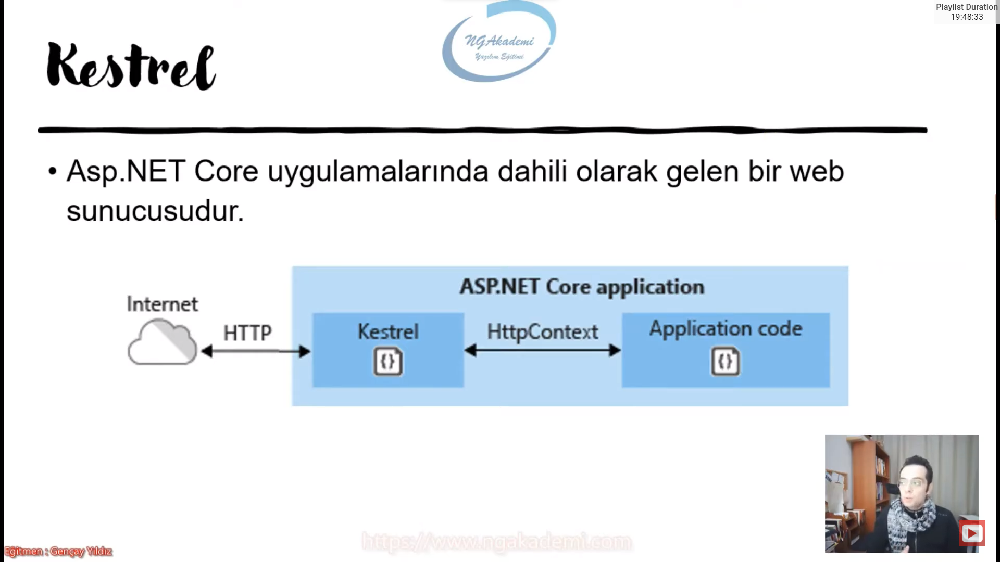
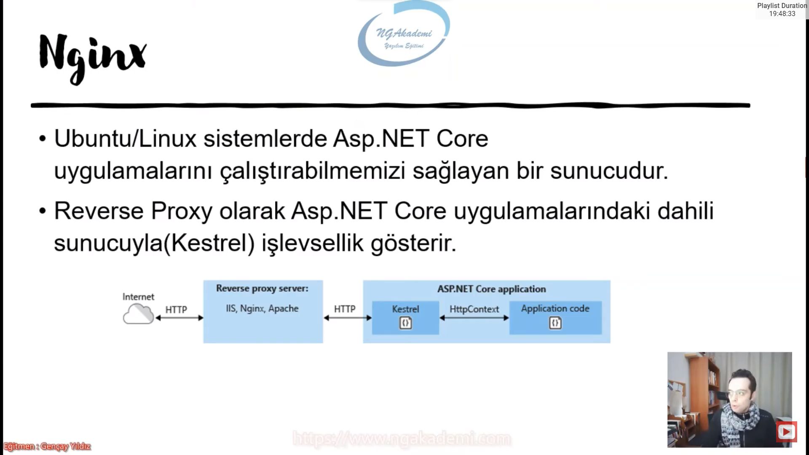
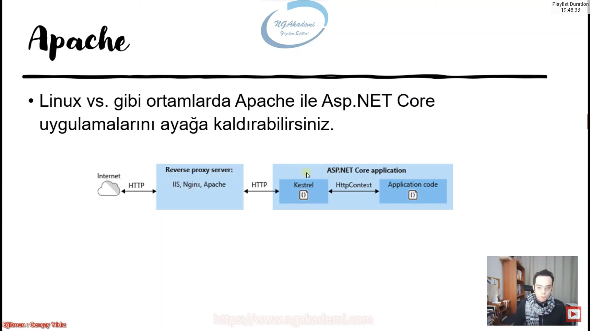
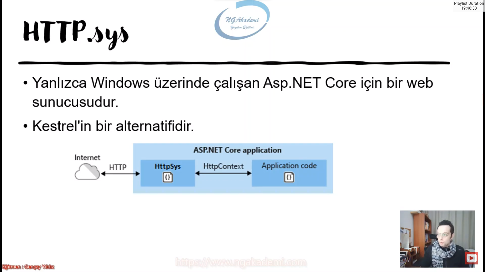
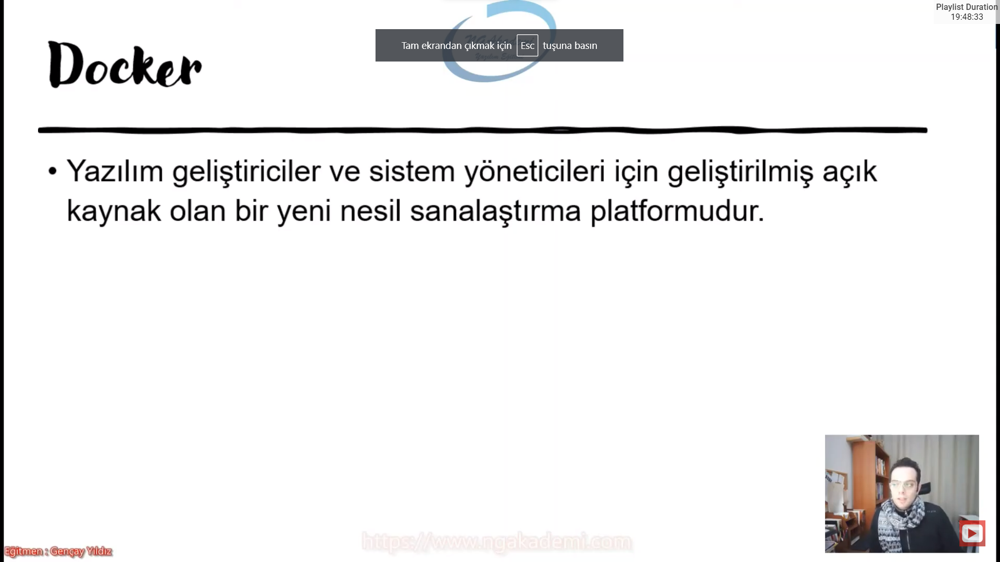

***
# 7) Asp.NET Core 5.0 - Sunucu Çeşitleri(IIS - Kestrel - Nginx - Apache - HTTP.sys - Docker)

- Biz web uygulamalarını bitirmişiz elimizde bir ürün olmuş ve bu ürünü hostinglerde kah cloud yapılanmasında ne tarz sunucularda yayınlayacağımızın derdine düştüğümüzde bu bilgilere ihtiyacımız olacaktır.

## IIS
- Internet Information Services(IIS) Asp.NET Core dahil olmak üzere web uygulamarını barındırmak için esnek, güvenli ve yönetilebilir bir Web sunucusudur.

- IIS bizim sunucu alternatiflerimizden birisidir. Hatta yeganesidir çok fazla tercih etmekteyiz.

## Kestrel
- Asp.NET Core uygulamalarında dahili olarak gelen bir web sunucusudur.

- Asp.NET Core kendi bünyesinde kendi sunucusunu taşıyabilen bir uygulamadır.

- Uygulama kendi bünyesinde sunucusunu taşır. Yani IIS olmadan herhangi bir Microsoft platformuna bağımlı olmaksızın kendi bünyesinde sunucusunu taşıdığı için kendi kendini ayağa kaldırabiliyor ve linux gibi ubuntu gibi noktalarda temasa geçebiliyor. Yani oralarda kullanılabiliyor.

## Nginx
- Ubuntu/Linux sistemlerde Asp.NET Core uygulamalarını çalıştırabilmemizi sağlayan bir sunucudur.

- Reverse Proxy olarak Asp.NET Core uygulamalarındaki dahili sunucuyla(Kestrel) işlevsellik gösterir.

- IIS, Nginx, Apache gibi bütün sunucular diğer işletim sistemlerinde kestrelle iletişim kurabilecek şekilde tasarlayabiliyoruz.

- Dolayısıyla ben hangi platformda çalışırsam çalışayım hangi işletim sisteminde çalışırsam çalışayım işletim sistemine olan bağımlılık ortadan kaldırılıyor bunların kestrel'de olan senkronizasyonu sayesinde ilgili uygulamayı ayağa kaldııp kullanabiliyorum.

## Apache
- Linux vs. gibi ortamlarda Apache ile Asp.NET Core uygulamalarını ayağa kaldırabilirsiniz.

- Kestrel ile bir ilişkisi söz konusudur.

- Nginx ile Apache'yi genellikle ubuntu kullananlar için tavsiye edebiliriz.

## HTTP.sys
- Yanlızca Windows üzerinde çalışan Asp.NET Core için bir web sunucusudur.

- Kestrel'in bir alternatifidir.

- Yine uygulama içerisinde gelecektir.

## Docker
- Yazılım geliştiriciler ve sistem yöneticileri için geliştirilmiş açıkkaynak olan bir yeni nesil sanalaştırma platformudur.

- Genellikle microservices yapılanmasında çalışırken elimizdeki birden fazla servisi ayağa kaldırabilmek için kullandığımız bir sanallaştırma platformu. Gayet efektif bir çözüm sağlamamızı sağlar.

- Docker aslında tek başına bir sunucu değildir. Bir sanallaştırma platformu kendi içerisinde biz sunucu kurup o sunucuda ayağa kaldırabiliyoruz uygulamalarımızı. Dolayısıyla çalıştığımız platformdan da bağımsız bir şekilde farklı çalışmalar farklı sunucular tercih edebiliyoruz.

- Sanallaşma platformununda gayesi senin bulunduğun platformun dışında ondan bağımsız farklı platformlar yaratabilmendir.

- Biz genellikle kestrel ya da IIS sunucularını tercih edeceğiz.
