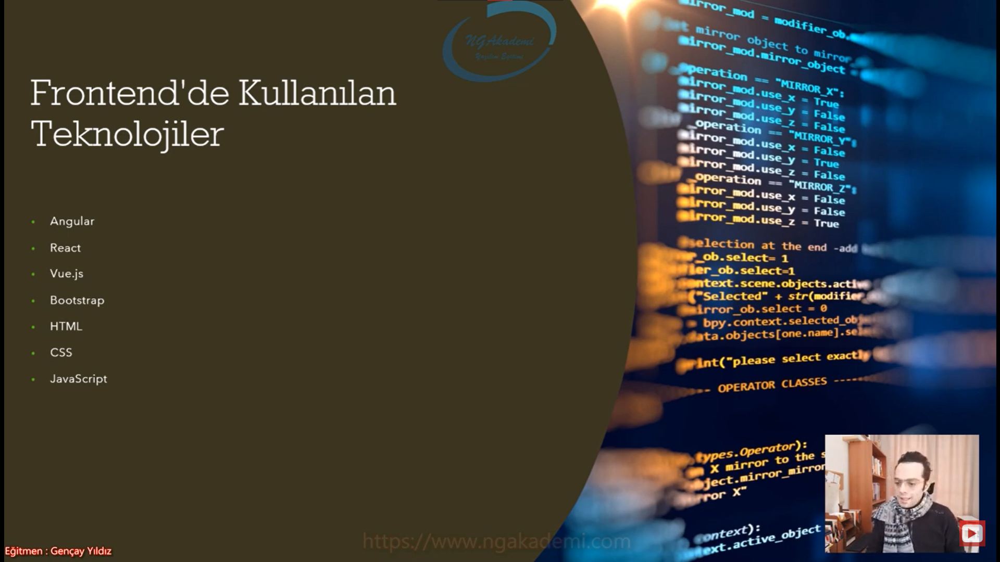

***
# 8) Asp.NET Core 5.0 - Backend - Frontend Kavramları

- Frontend kısmı görsel kısım backend kısmı işin kompleks/yoğun/karışık olan kısmı gibi zannedilir. Zannedilen noktaya katılmıyoruz

- Frontend dediğimiz kısım olayın bir tek görsel kısmı değildir. Verileri anlamlı hale getirdiğimiz kısmıdır. Verileri anlamlı hale getirmek demek illaki görselleştirmek demek illaki düzenli hale getirmek demek değildir. Sen veriyi üretmiyorsan veri sana bir yerden geliyorsa ve gelen veriyi bir şekilde kullanıyorsan orası frontenddir. Veriyi anlamlı hale getirdiğin noktadır. Her daim düzenli olmak zorunda değildir(benim nazarımda).

- Backend işin mutfağıdır. Ama her daim yine kompleks olmak zorunda değildir. Veriyi üretendir. Bazen frontend'den daha yavan/sade/dinamik bir şekilde geliştirilebilir olmaktadır. 

- Backend veriyi üretir frontend üretilmiş veriyi sunar. İster görsel olarak sunar ister farklı bir şekilde olayı anlamlı hale getirir.

- Backend illaki frontend'den daha kompleks/karışık/zahmetli bir yer olmak zorunda değildir. Backend'de de iş yapıyoruz frontend'de de iş yapıyoruz. Yeri geliyor frontend'deki çalışmalar backend'deki çalışmalardan daha kompleks olabiliyor. Dolayısıyla olayı komplekslik üstünden değerlendirirsek yanlış bir değerlendirme olacaktır.

- Frontend ve Backend'i ayırırken şu kıstas üzerinden ayırmalısınız Frontend veriyi anlamlı hale getiren ama veriyi üretmeyen kısımdır. Backend ise veriyi üreten kısımdır. Veriyi üreten adam backend arka planda oluyor. Frontend ise veriyi sunan veriyi anlamlı hale getiren veriyi yeri geldi mi görsel olarakta kullanan kısımdır. 
   * İşin mutfağı mı daha zordur yoksa gerçekten sunum kısmı mı?
   * Cumhurbaşkanı geldi işin aşçı kısmı mı zordur sunum kısmı mı?

## Backend Server Side 
- Uygulamanın arka planı, mutfağıdır.

- Algoritmik ve mimarisel kodların yazıldığı alandır.

- Veritabanı işlemleri vs. backend'de geliştirilir.

- Verinin/bilginin üretildiği yerdir.

- Üretilecek olan veriler veritabanından/uzaktaki bir servisten vb gelecek bunların hepsi backend'de yapılır ve backend'de gerçekleştirilen bu işlemlerin temel amacı veriyi yani bilgiyi üretmektir.

- Backend genellikle böyle client'ların user'ların gidipte görebileceği kaynağını araştırabileceği ulaşabileceği alan değildir. Backend genellikle sunucuda ya da cloud ortamlarda tutulur. O şekilde yani biz orayı tüketiriz. Orada işlemler yaparız genellikle erişimin direkt birincil elden yapıldığı alanlar değildir

## Backend'de Kullanılan Teknolojiler
- Node.JS

- PHP

- Ruby

- Java

- C#(.NET - Asp.NET Core)

- Python

- C++

- C

- Scala

- Golang

- Bir backend bazen başka bir backend'in frontend'i olabilir.

- Veriyi tüketen yani veriyi üretmeyen adam veri başka bir yerde üretilip gönderiliyorsa bana ben backend olmuyorum haliyle veriyi gönderen backend oluyor. Bazen bir backend bir başka backend'in frontend'i olabiliyor. Onu tüketebiliyor.

- Backend'lerde farklı backend'leri ileride biz bunlara API diyeceğiz servis diyeceğiz bunları kullanarak bunlara bağlantı sağlayarak onlardan ilgili üretilmiş verileri elde edip gene kendisi ekstradan üstüne bir veri inşa edip gerçek frontend'lere gönderebilir. Yani backend'ler yeri geliyor frontend maksadıyla da kullanılabiliyor. 
 
- Nihayetinde alınan veriyi anlamlı hale getirecekse illaki her zaman backend dili olarak kullanılan birşey ebediyyen backend olmak zorunda değil.

- Mikroservices'lar bunun üzerine kurulu. Service tabanlı mimarilerin hepsi bunun üstüne kurulu. Farklı bir service'ten veriyi alıyorsun. Haliyle senin o anki backend'in veriyi üretmekten sorumlu olmuyor.

## Frontend Client Side
- Uygulamanın önyüzü, grafiksel arayüzüdür.

- Görsel kısmıdır makyajıdır.

- Backend'de üretilen veri Frontend'e gönderilir ve uygun şekilde kullanıcıya sunulur.

## Frontend'de Kullanılan Teknolojiler
- Angular

- React

- Vue.js

- Bootstrap

- HTML

- CSS

- JavaScript

