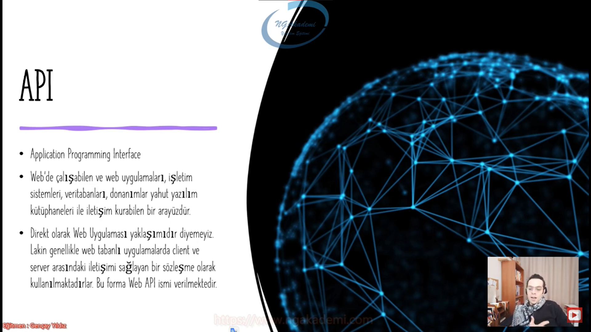
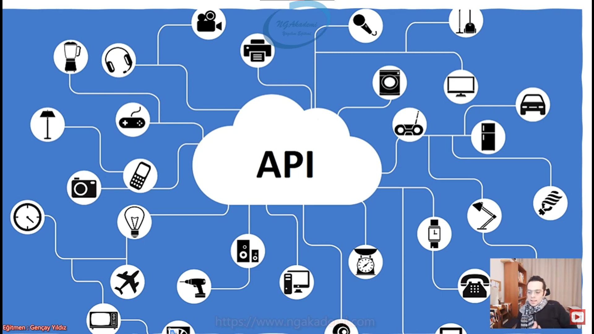

***
# 9) Asp.NET Core 5.0 - Olay Tabanlı Web Geliştirme Yaklaşımı
- Biz bir web uygulaması geliştirirken geliştirme yaklaşımımıza göre mimariyi şekillendiririz.

- Belirli yaklaşımlar var bu yaklaşımlardan herhangi birini kabul ediyorsun o kabul ettiğin yaklaşıma göre mimarini ona göre kodluyorsun ona göre şekillendiriyorsun ona göre planlamalarını yapıyorsun.

- Olay güdümlü programlama veya Olay yönlendirmeli programlama da denmektedir.

- Programın akışını kullanıcı eylemlerine göre yönlendiren programlama yaklaşımıdır.
  * Örneğin  akşam odaya girdin kapkaranlık değil mi? Şimdi ışığın yanması için bir olaya ihtiyacın var nedir bu? Düğmeye basmak. Ben düğmeye bastığım zaman bu olay gerçekleştiği zaman sonuç olarak ışık yanar. Düğmeye basılması bir olayken bu olay neticesinde neticesinde bir iş yapılıyor işte ışığın yanmasıdır. 

- Kullanıcı eylemlerine uygun bir şekilde olaylar tanımlanmıştır. Bu olaylar çalıştırılacak kodu barındırmaktadırlar.

- Uygulama hızlı bir şekilde inşa edilebilir. Lakin bakım ve sonraki gelişim süreci oldukça maliyetli olan bir yaklaşımdır.

- Olay tabanlı yaklaşımda kullanıcının kişinin eylemleri ön plandadır.

- Sende bu programlama yaklaşımında yapacağın işleri belirli eylemlere bağlıyorsun dolayısıyla eylemleri/olayları tanımlıyorsun ardından o olaylar gerçekleştiğinde yapılacaklar işlemler neyse o işlemleri arkada yapıyorsun.

- bakım ve sonraki gelişim süreci oldukça maliyetli olacağından dolayı günümüzde pek fazla mimarisel çalışmalarda tercih etmemekteyiz. Asp.NET'in eski mimarisi olan Web Form mimarisi vardı onun temeli olay tabanlı yaklaşımdı. Hızlı bir şekilde gelişim yapabiliyorduk. Kodlar ve sunum aşaması iç içe olduğundan dolayı ciddi manada bir maliyete sebep oluyordu. Kurumsal bir çalışma yapmamıza müsaade etmiyordu. Bundan dolayı Web Formu tercih etmiyorduk MVC yaklaşımı ya da daha farklı yaklaşımlar tercih ediyoruz.

- Olay tabanlı programlamada iki tane aktör vardır.
    * Olay/Event
    * İş/Operasyon

- Butona tıklandığına çıkış yapması;
  - Olay : Butona Tıklanması
  - İş : Çıkış Yapılması

- Düğmeye basıldığında lambanın yanması;
  - Olay : Düğmeye basılması
  - İş : lambanın yanması

- Linke tıklandığında ayın en çok satılan ürünlerin sorgulanması;
  - Olay : Linke tıklamak
  - İş : ayın en çok satılan ürünlerin sorgulanması

- Yani bir olay gerçekleşecek ve olayın neticesinde bir iş yapılacaktır.

***
# 10) Asp.NET Core 5.0 - Model - View - Controller(MVC) Yaklaşımı
- MVC pattern'ını kullanan bir yaklaşımdır.

- Üretilen veri ile gösterim yani sunum katmanı arasında bir soyutlama esas alınmıştır.

- MVC pattern'ı Microsoft tarafından üretilmemiştir. Böyle bir yanlış algı vardır.

- MVC, Microsoft'un kurulduğu yıllardan (1979 yılından) beri tasarlanmış bir kalıptır.

- MVC Model, View ve Controller olarak 3 katmandan oluşan stratejiden ibarettir.

- MVC esasında bir framework değildir. MVC esasında bir design pattern.

- Belirli bir senaryoya uygun uygulanabilir tasarım desenidir. Asp.NET bu tasarım deseninin üzerine oturtulmuş bir mimari/framework bize sunmaktadır.

- 3 katmandan oluşur;
  * Model => Veritabanı işlemlerini yaptığımız katman
  * View => Görsellik sunum işlerini yaptığımız katman
  * Controller => Bu süreçte istekleri karşılayan gerekli işlemlerin gerçekleştirildiği Model ile View arasında köprüsel işlemlerin üstlenildiği bir katman.

- Kullanıcı ilgili web sitesine bir istek gönderdiği zaman bu Controller tarafından karşılanır. Eğer ki Controller varsa veritabanı işlemi Model'a gider ilgili veritabanı işlemini yapar elde ettiği ürettiği veriyi View'a gönderir. View'de ilgili veriyi görsel bir şekilde HTML CSS'e çevirecek şekilde basar ve sonucu yeniden User'a döndürür.

- Asp.NET Core yapılanmasında API ile MVC tasarımı birleştirilmiştir yani aynı altyapıda çalıştırılmaktadır.

- !!!!!!! Her türlü kavgaya girdiğinizde bilin ki kaybeden siz olursunuz !!!!!!!

***
# 11) Asp.NET Core 5.0 - Application Programming Interface(API) Yaklaşımı
-  Application Programming Interface(Uygulama Programlama Arayüzü)
 
- Web'de çalışabilen ve web uygulamaları, işletim sistemleri, veritabanları, donanımlar yahut yazılım kütüphaneleri ile iletişim kurabilen bir arayüzdür.

- Direkt olarak Web Uygulaması yaklaşımıdır diyemeyiz. Lakin genellikle web tabanlı uygulamalarda client ve server arasındaki iletişimi sağlayan bir sözleşme olarak kullanılmaktadırlar. Bu forma Web API ismi verilmektedir

- Web uygulamasının dışında da kullanılan bir yapılanmadır. Her yerde kullanabilirsiniz.

- API web üzerinde çalışan bir backend. 
 
- HTTP protokolü üzerinden her yerden istek alabilir.

- Eğer ki sen bir API'a web sayfası/sitesi/uygulaması üzerinden istek gönderiyorsan buradaki client'ın web uygulamsı oluyor server API olmuş oluyor. İşte burada API'a gönderdiğin istek neticesinde sana gelecek olan veriler burada sözleşme olarak nitelendirilebilir.
  * Nihayetinde bana tüm personelleri getir diye API'a istek yapıyorsun bu istek neticesinde sunucudan yani API'dan sana personeller belirli formatta geliyor. Gelen bu formatın türünü vs. sözleşme diye nitelendirebiliyoruz. Orada entity kavramı bizim için bir sözleşme/kontrakt'a karşılık geliyor.

- Eğer ki API'a web uygulamalarında kullanıyorsak biz bunlara Web API diyoruz.

- Nesnelerin interneti denen olay bunun temellerinden gelir.
  * Herhangi bir mikrofonu, tableti, televizyonu, matkapı her şeyi bir API'a bağlayıp internetten yönetilebilir ya da farklı nesnelerle iletişim kurabilir hale getirebilirsiniz. Eğer ki bu nesnelerden biri Web'se biz buna Web API diyoruz ve orada o yaklaşım üzerinden de ilgili web uygulmasını geliştirebilmekteyiz. Yani bu demektir ki API'la sen birçok nesneyi internete bağlayabilirsin internetten veriyi tüketebilirsin aynı şekilde bu nesnelerden bir tanesi de herhangi bir Web Uygulaması olabilir. 
   
- Web uygulaması da API'a bağlanıp API üzerinden API yaklaşımıyla gerekli çalışmalarını gerçekleştirebilir.
  * Günümüzde kullandığımız angular, react olsun bunun gibi UI tabanlı yani frontend tabanlı web mimarilerinde arkada backend olarak biz API kullanıyoruz.

- API'da bir web geliştirme mimarisidir.

