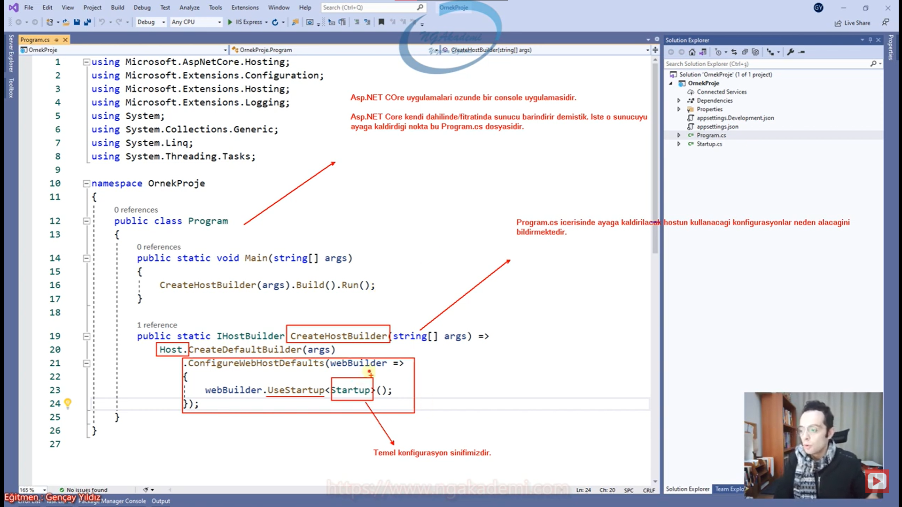
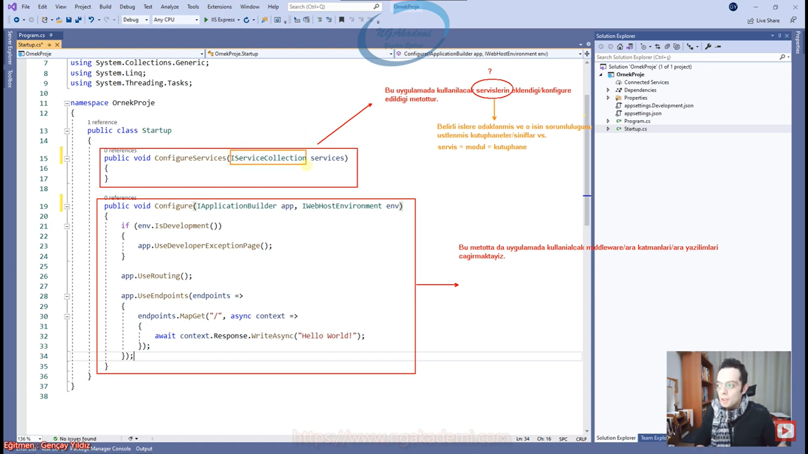
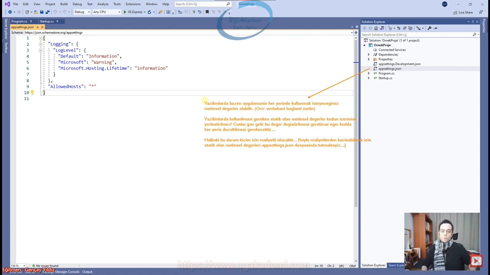

# 12) Asp.NET Core 5.0 - Proje Oluşturma ve Dosya Yapısı
- Esasında Asp.NET Core bir `Console` uygulamasıdır. Fıtratı `console`dur.

- Asp.NET Core özünde bir `Console` uygulamasıdır.

- Bu `console` esasında yapılandırılmış varsayılanlarla web barındırıcısı oluşturmak için bir yöntem bir metot çağırıyor. İşte o metot `CreateHostBuilder` metodudur.

- Kestrel sunucusunu ayağa kaldırmak için burada `CreateHostBuilder` metodunu tetiklemen gerekiyor. Aynı şekilde IIS sunucusunu da burada benimseyebiliriz. Bununla ilgili konfigürsayonlar var.

- Asp.NET Core içerisinde `Program.cs` barındırdığı için özünde bir `Console` uygulamasıdır. O `Console` ki Asp.NET Core'un kendi dahilinde/fıtratında barındırmış olduğu sunucuyu ayağa kaldırır.

- `CreateHostBuilder` metodu `Program.cs` içerisinde ayağa kaldırılacak hostun kullanacağı konfigürasyonları nereden alacağını bildirir.

- `Startup.cs` temel konfigürasyon sınıfımızdır.

- `Startup.cs` dediğimiz bizim web uygulamasında belirli konfigürasyonları yaptığımız bir dosyadır.

- `ConfigureServices` fonksiyonu uygulamada kullanılacak servislerin eklendiği/konfigüre edildiği metottur.

- `Configure` fonksiyonu ise uygulamada kullanılacak middleware dediğimiz ara katmanlarımızı/yazılımlarımızı çağırmaktayız.

- Asp.NET Core modüler bir yapılanmaya sahiptir. Belirli işleme/amaca odaklanmış özel tasarlanmış sınıflar hepsi bizim nazarımızda servis diye nitelendirilir.

- Belirli işlere odaklanmış ve o işin sorumluluğunu üstlenmiş kütüphaneler/sınıflar vs.

- Ben bir web uygulaması yapacağım şu anda ki yapacağım web uygulamasında ödeme desteği var mı? yok. Oturup ödemeyle ilgili işte gerekli konfigürasyonları falna yazsam kaç ayımı alır Allah bilir. Ama bununla ilgili bir paket bulduk diyelim bir kütüphane bulduk. Bu kütüphaneyi ben bu uygulamaya dahil edebilmem için yani bu modülü bu uygulamaya dahil edebilmem için `ConfigureServices` metodunda bunu çağırmam lazım. Yani modülü uygulamaya eklemem lazım. İşte biz bu modüle/kütüphaneye servis diyoruz.

- `appsettings.json` uygulamada belirli statik değerleri tuttuğumuz bir konfigürasyon dosyası.
  * Örneğin veritabanıyla ilgili bir ConnectionString değerini tutarken gidipte kodun içerisine onu yazmıyorsun bu dosyada tutuyorsun ki heryerden çağırabilesin.

- Yazılımlarda bazen uygulamanın her yerinde kullanmak isteyeceğimiz metinsel değerler olabilir.(Örn: veritabanı bağlantı metni) Bu değerler birden fazla yer tarafından tüketilebilir. Dolayısıyla sen gidipte her yere bu değerleri yerleştirirsen gün gelince bu değeri değiştirmen gerekirse eğer  gidip bütün yerleştirdiğin yerlerden tek tek bunları toparlayıp ondan sonra tekrardan yayına çıkman derlemen lazım vs.

- Biz yazılımlarda kullanılması gereken metinsel statik değerleri kodun içine değil `appsettings.json` içine yerleştiririz.

- Yazılımlarda kullanılması gereken statik olan metinsel değerler kodun içerisine yerlşetirilmez.! ünkü gün gelir bu değer değiştirilmesi gerekirse eğer kodda her yerin düzeltilmesi gerekecektir.... Halbuki bu durum bizim için maliyetli olacaktır... Böyle maliyetlerden kaçınabilmek için statik olan metinsel değerleri `appsettings.json` dosyasında tutmaktayız.

- Bir web uygulaması oluşturursun oluşturduğun web uygulaması oluşturma aşaması development seviyesidir. Sen unu yayına aldığın zaman yayınlamış olursun. Ortam dediğimiz kavram geliştirdiğimiz uygulamanın bulunduğu seviyedir. Ya geliştirme sürecindedir. ya da yayında olduğu süreçtir Hosting'te ya da cloud'da olduğu süreçtir. İşte bu ortamlara göre biz belirli değişkenler farklı ortamlara göre belirli değişkenler tanımlayıp operasyonlar gerçekleştirebiliyoruz.

- Dependency uygulamada kullandığımız harici/dahili kütüphaneler.

- Uygulama ayağa kalktığında öncelikle `program.cs` tetiklenecek gerekli host build edilecek ardından gerekli konfigürasyonlar alınacak ve uygulama hangi davranışı/modeli/yaklaşımı benimsiyorsa o yaklaşımda onun davranışında gerekli şekilde çalışmaya başlayacaktır.