***
# 13) Asp.NET Core 5.0 - MVC Nedir? Asp.NET Core MVC Pipeline'ı Nasıldır?
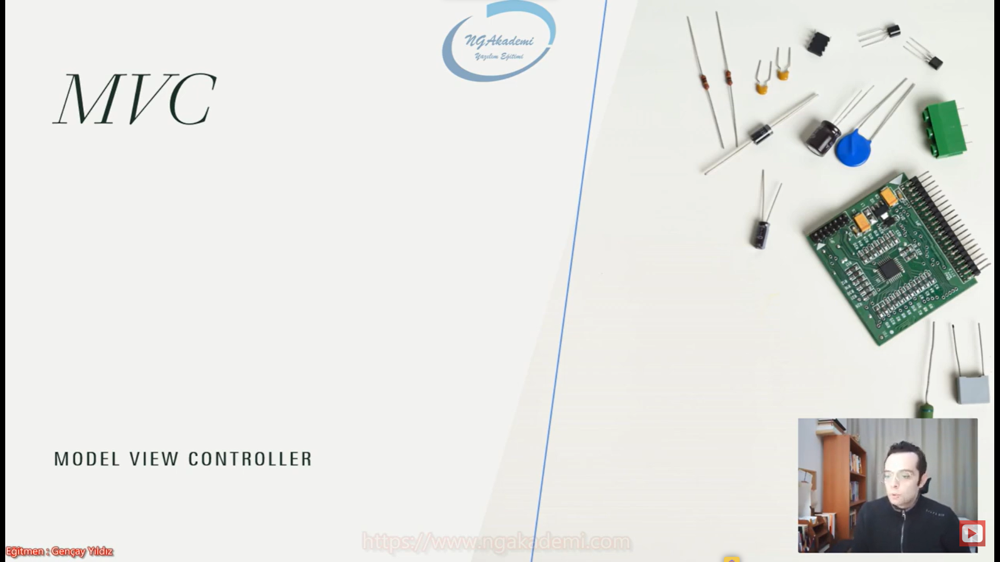

- MVC, birbirinden bağımsız üç katmanı esas alan bir Mimarisel Desen(Architectural Pattern)'dir.

- Özünde Observer, Decorator gibi design pattern'ları kullanan bir mimarisel desendir.

- Microsoft bu desen üzerine oturtulmuş Asp.NET Core MVC mimarisini geliştirmiştir.

- Mimarisel desen design pattern'lardan daha kapsamlıdır diyebiliriz. İçerisinde bir veya birden fazla design pattern'ın kullanıldığı ve belirli bir mimarinin oturtulduğu desenlerdir. Daha geniş kapsamlıdır.

- Design pattern dediğimiz tasarım desenleri belirli senaryolara uygun yerleştirilirken mimarisel desenler ise genel yaklaşımımızı belirlerler.

- Mimari desenler içerisinde bir veya birden daha fazla tasarım deseni barındıran desenlerdir.

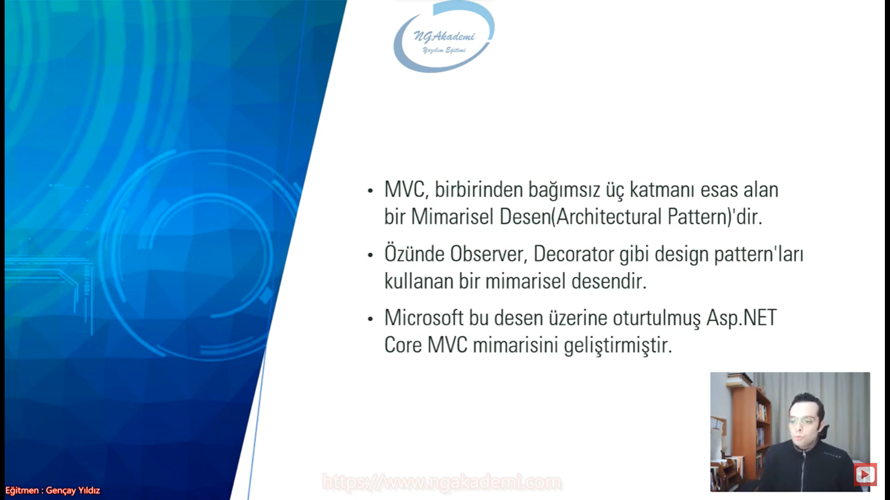

- Model : İşlenecek olan veriyi temsil eden katmandır. Genellikle veritabanı işlemlerinin yapıldığı katmandır.
    * Entity Framework Core, Entity Models, Ado.NET, Repository, Veritabanı İşlemleri
    * Model web'de de çalışsan herhangi bir platformda da çalışsan işlenecek olan veriyi temsil eden bir katman.
    * Veri ile alakalı bütün mevzuların hepsi Model katmanında tutulacak işlemler yapılacaktır.

- View :  İstek neticesinde elde edilen verileri görselleştirecek, görsel çıktısını verecek katmandır.
    * HTML, CSS, JavaScript, Razor, Resim, Müzik, Video
    * Sunum katmanıdır.

- Controller : Gelen request'leri karşılayacak olan ve request'in içeriğine göre gerekli model işlemlerini üstlenecek olan katmandır. Algoritmaları, servisleri, veritabanını'ı vs. çağırarak/çalıştırarak/sorgulayarak istenilen veriyi üretmekten ve ihtiyaç dahilinde üretilen bu veriyi View ile görselleştirmekten sorumludur. İstek neticesinde elde edilen ve işlenen veriyi tekrar client'a response olarak döndürür.
    * Controller her daim gelen istekleri karşılayacaktır. Dolayısıyla gelen istekleri karşıladıktan sonra isteğin mahiyetine uygun veri işlemlerini yapacak.
    * Verinin üretiminden sorumludur.
    * Verinin görselleştirilip görselleştirilmeme sorumluluğu da controller'dadır.

- Yapacağın işleme göre barındıracağın veri yapılarını ya da işlemleri belirli algoritmaları vs yapacağın işlemleri kategorize ediyorsun örneğin model'da model'la ilgili işlemler barındırılırken view'da adı üzerinde görsel/sunumla alakalı işlemler yapılıyor. Controller'da ise bunları kontrol etmek yani belirli şeyleri organize etmek. MVC tasarım deseni temelde yapısal olarak bir kodun işlenme sürecinde bunun sunulmasını bunun üretilmesini değer üretilme sürecini yahut yönetilmesini birbirlerinden soyutlamamız gerekiyor. Belirli başlıklar altında işte MVC ile biz bunları birbirinden soyutluyoruz.

- MVC illa ki web'te uygulanan bir tasarım deseni değildir. MVC'yi herhangi bir programda/platformda herhangi bir programlama dilinde de kullanabilirsiniz.

- Veri MVC'de temsil edilen ayrı bir katmanda işlenen ayrı bir katman olarak nitelendirilen bir değer/olgu. 

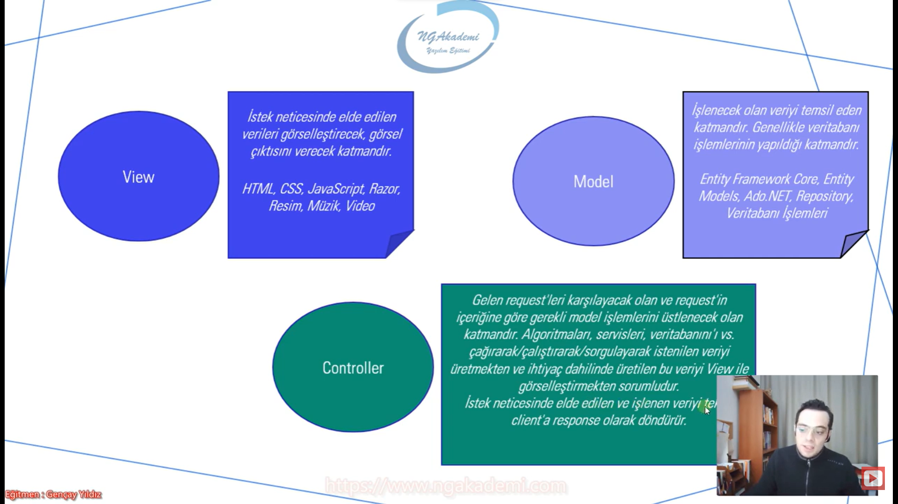

- User'ımız client'ı üzerinden bir istekte bulunuyor. Bu istek neticesinde controller gelen isteğin mahiyetine bakıyor eğer ki bu istekte bir veritabanı ihtiyacı varsa veriler dış kaynaktan alınacaksa yahut bir model kullanılacaksa model katmanına gider. Model'a diyor ki ya kardeşim bana şöyle şöyle veriler lazım bu veriler sende bunları bana üret gönder. Model'da ilgili verileri üretiyor tekrardan controller'a gönderiyor. Controller verileri aldıktan sonra Eğer ki bu verileri View katmanına gönderip belirli bir görsellik işlemi yapacaksa View katmanına gönderiyor. Yani ihtiyaç doğrultusuna View'a gitti. Belirli bir giyinim yaptık belirli bir görsellik sunum hazırlandı ilgili veriler daha da anlamlı hale getirildi vs. Yeniden controller'a bu veriler döndürüldü. Model'a gider. Model'dan geri controller'a gelen veriler tekrardan View'e gönderilir. View'den geri controller'a getirilir. View'den gelen sonuç tekrardan controller'dadır. Controller'da elde edilen sonuçlar tekrardan client'a gönderilecektir. Artık veri hazırdır çünkü.

- Controller kontrol edendir komutandır. Gelen isteği kontrol ediyor. Dolayısıyla bir zorunluluğu yok. Controller hiçbir zaman View'a ve Model'a gitmek zorunda değildir.

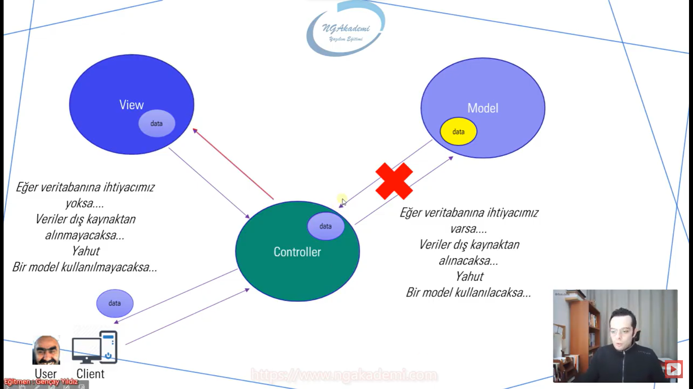

- Client isteği yaptı kampanyalı ürünler diye Controller katmanı senin yapmış olduğun bu isteği karşılayacaktır. Controller diyor ki kampanyalı ürünler nerde? veritabanında o zaman Model'la işimiz var. O zaman gidiyor Model'a ya kardeşim sen bana bir kampanyalı ürünleri ver. Çünkü bu herif kampanyalı ürünleri istiyor. Dolayısıyla Model bize ilgili veriyi üretiyor. Al buyur kampanyalı ürünlerimiz bunlar haliyle üretilen veriyi tekrardan controller'a gönderiyor. Controller diyor ki bak View benim elimde böyle bir veri var sen bu veriyi bir al bunu bir adam et/şekillendir/makyajını yap ondan sonra bana geri gönder. View veriyi alıyor gerekli işlemleri yapıyor ardından Controller'a geri gönderiyor. Biz bu işleme render diyeceğiz. View ilgili dataları render ediyor. Burada razor teknolojisini vs. kullanabiliyoruz. Render edilen sonuçtan ViewResult dediğimiz bir sonuç üretiliyor. Üretilen bu sonuç sana gelen sonuçta ViewResult'ta View'ın result'u yani sunumunun sonucu. İçinde senin gönderdiğin değerlerinin HTML, CSS'le, Javascript'le Razor'la artık neyse render edilip çıktısı verilmiş bir result olarak sana sunuluyor. Gelen sonuç artık tam olarak ideal veri elimizde mi elimizde. Bu verileri sana bu şekilde getirmiş olacaktır.

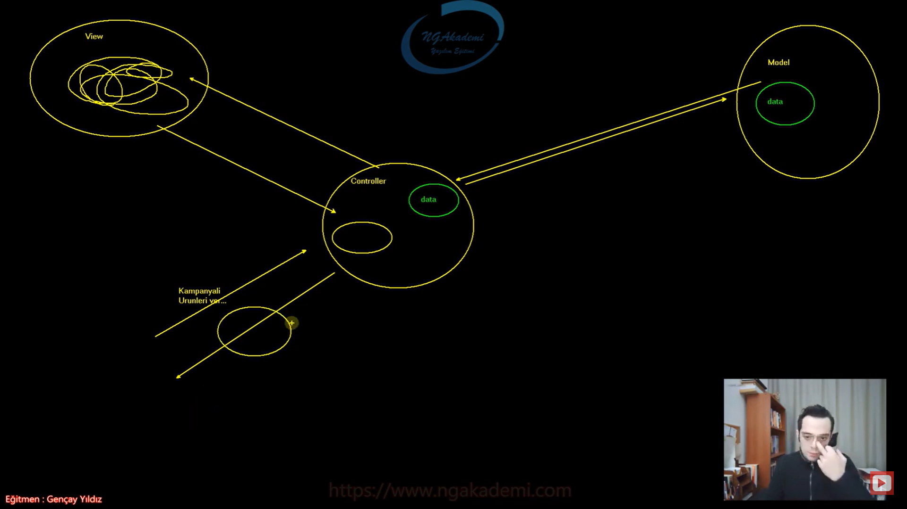

- Request geldi senin sunucun bunu karşılayacak. 
    1. Kestrel örneğin karşılayacak. 
    2. Önce Middleware dediğimiz yapılar devreye giriyor. Sonra buradaki yazılımların alayı geçecek bu mevzudan. 
    3. Geçtikten sonra routing dediğimiz bir modül/middleware/ara yazılım var. Routing'de gerekli route işlemleri/endpointler vs falan bunlar ayıklanacak.
        * Request'in hangi endpointi o isteği ayıracak hangi alana istek yapıldığını burada ayırır. Biz buna endpoint diyeceğiz.
        * Yani belirli bir link üzerinden yapılacak bu istek yapılan bu isteğin binlerce controller'ın binlerce istek alanının Action method diyeceğiz biz onlara. Bunların arasından hangisine yapıldığını kampanyalı ürün de var bir yandan en çok satan ürün de var hangisine yapıldığını işte burada ayırt eder. 
        * Rotayı burada belirliyor yani gelen istek hangi istek yani mahiyeti ne? neyi istiyor?
        * Burada gelen isteğin mahiyeti anlaşılıyor.
    4. Anlaşıldıktan sonra ilgili Controller ayağa kaldırılır. Kontrol edici var dı ya MVC'nin C boyutu burada devreye giriyor. Controller isteği karşıladı.
        * Senin yapmış olduğun istek neticesinde işlem yapacağın controller ayağa kaldırılır hepsi değil!
        * Ardından bu Controller'ın içerisinde Action dediğimiz metotlar var. Controller bizim için sınıftır. Bu Action'larda bir metot olacak.
    5. Controller ayağa kalktı bu controller'ın içerisinde senin isteğine gerçekten cevap verecek olan oradaki aksiyonu olması gerektiği gibi alacak olan Action metodları var. 
        * Action metot ilgili operasyonu gerçekleştirecek gerekli model'la bağlanacak gerekirse View'e gönderecek vs.
    6. Burada sonuç üretilecek yani model'dan gittin sen model'a bağlandın model'dan ilgili verileri aldın ya da kendin ürettin ya da uzaktan bir servisten aldın vs. Action metot tetiklendikten sonra ilgili veri üretilecek üretilen veri ya direkt client'a gönderilecek ya da View'e gönderilecek View'de render edilecek burada render edilen view'ın sonucunda ViewResult elde edeceksiniz bunu da client'a gönderecek. Ya direkt gönderebilirsin data result olarak ya da viewresult olarak gönderebilirsin. Ya da hiçbişey göndermeyebilirsin. İsteği alırsın başarılı bir şekilde sonlandıradabilirsin.

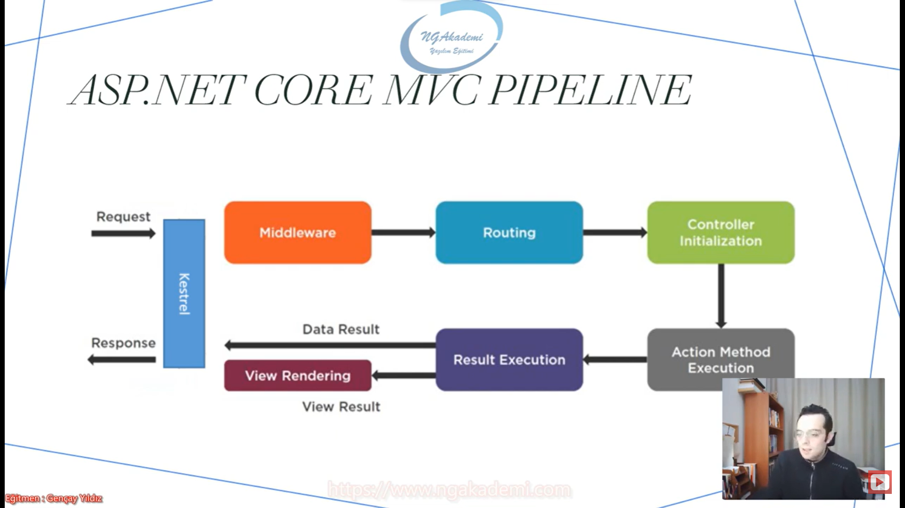

***
# 14) Asp.NET Core 5.0 - MVC Proje Altyapısı Oluşturma ve Temel Konfigürasyonları Sağlama
- MVC'de gelen isteği karşılayan bir controller'ımız vardı. Bu controller ihtiyaca binaen Model'a gidiyordu. Model'dan ilgili veriyi alıyordu. Eğer varsa ki bu veri üzerinde bir görselleştirme çalışması bunun için View'e gidiyordu. View'den artık giydirilmiş makyaj yapılmış veriyi alıp tekrardan request'i yapan client'a response ediyordu.

- Boş bir ASP.Net Core uygulamasında MVC design pattern'ını kullanabilmek MVC mimarisinde davranış sergileyebilmesi için yani sistem alacağı request'leri MVC davranışıyla alabilmesi controller'ların devreye girebilmesi için startup.cs'te ya da güncel olarak program.cs'te service olarak uygulamaya eklemeliyiz.

- MVC ASP.Net Core'da artık bir modül olarak gelmiştir bir service olarak gelmiştir ona göre tasarlanmıştır. Dolayısıyla sen eklersen MVC davranışı sergilenecek eklemezsen de artık hangi davranışı sergileyeceksen onu sergileyecektir. 

- `services.AddControllersWithViews();` ekleyerek service'imizi dahil etmiş oluruz.

- Model sadece veritabanları işlemlerinin yapıldığı bir katmandır service değildir.

- Asp.NET Core uygulamasında MVC mimarisini kullanabilmek için uygulama da Controller ve View yapılanmalarının eklenmesi gerekmektedir. Bunun için öncelikle `services.AddControllersWithViews()` service uygulamaya ekleniyor. Böylece uygulama MVC davranışı sergileyebilecektir. 

- Gelen isteği karşılayabilmemiz için bu isteğin davranışını daha iyi daha rahat bir şekilde oturtabilmemiz için ilk önce bir rota ayarlaması yapmamız gerekmektedir. Bununla ilgili belirli middleware'ları tasarlamamız gerekmektedir.

- `app.UseRouting()` burada gelen isteğin hangi controller'lara göre ayrılacağı burada belirleniyor. Rotalarımız burada devreye sokuluyor. Gelen isteğin rotası bu middleware sayesinde belirlenir.

- `app.UseEndpoints()` endpoint kavramı istek yaparken yapmış olduğumuz adresin tek noktası/istek/varış noktası. Endpoint kavramı buradaki varış noktası istek yapılacak adresi temsil eder. Dolayısıyla biz `app.UseEndpoints()`te yapacağımız isteklerin hangi adres tarafından karşılanacağının şablonlarını burada belirtmemiz gerekiyor.
    * bu endpoint middleware'ının içerisinde tasarladığımız şablonlar bu uygulamaya gelen isteklerin hangi formatta gelebileceğini belirliyor.

- Endpoint : Yapılan isteğin varış noktası. Url İstek adresi... Biz istek yaparken o adrese Url'e endpoint diyeceğiz. 

- Bu uygulamaya gelen isteklerin hangi rotalar/şablonlar eşliğinde gelebileceğini buradan bildireceğiz.

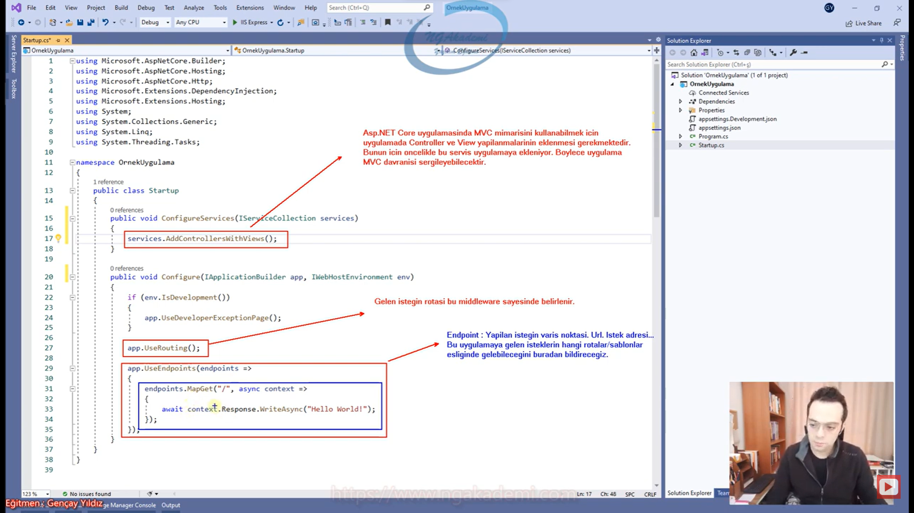

- `MapDefaultControllerRoute()` İstek yapacağımız temel/default/varsayılan rotayı belirler.

- `{controller=Home}/{action=Index}/{id?}` => Default olan endpoint şeması...
    * Bu uygulamaya yapılacak olan istekler bu şemaya uygun şekilde yapılacaktır.
    * Bir endpoint içerisinde Süslü parantezin içinde belirtilen keyword'ler özel anlam ifade ederler. Yani belirli parametredirler. Controller ve Action sistem tarafından ön tanımlı parametrelerdir.  Controller ve Action gelen isteğin hangi controller'ın hangi action'ını tetikleyeceğini ifade eder.
    * Controller bir sınıf action ise controller sınıfının içindeki bir metottur.
    * Eğer hiçbir Url'e hiçbir parametre vermeden direkt görmek istersek hangi controller'ı hangi action'ı tetikleyeceği default tanımlamalar üzerinden yapılır.
    * Eğer ki controller boş geliyorsa Home action'da boş geliyorsa Index action'ını tetiklemesi gerektiğini burada ifade etmektedir.
    * Endpoint tanımlamasında süslü parantez içerisinde parametre tanımlanabilmektedir. Bu parametreler herhangi bir isimde olabilir.
    * Controller ve Action parametreleri ön tanımlı olan parametrelerdir. Yani bunların sistem mimari neye karşılık geldiklerini bilir. 
    * Biz kendimize özel farklı parametreler tanımlayabiliriz.

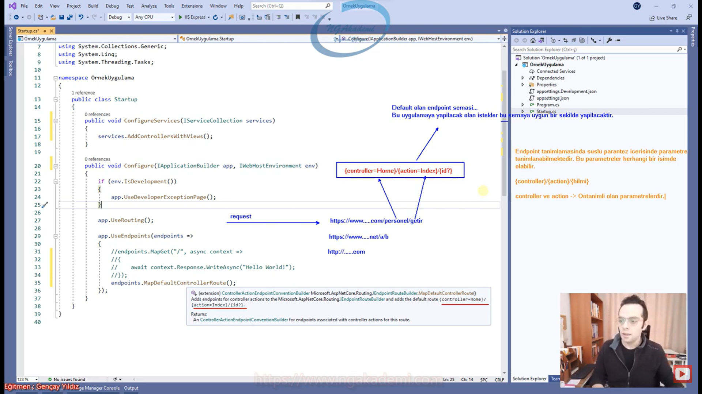

- Bir web uygulamasında temel MVC konfigürasyonunu yaptıktan sonra artık gelen istekleri karşılayabilmeniz için öncelikle controller tasarlamanız gerekiyor.

## Controller
- Uygulamaya gelen istekleri karşılayabilmek için kullandığımız sınıflardır.

- MVC uygulamarında controller sınıflarında Controllers klasörü altında tutulurlar.

- Senin MVC uygulamana gelecek olan isteği karşılayacak olan controller İlla ki Controllers klasörü altında bulunmak zorunda değil. Sen buna istediğin bir isim verebilirsin. Nihayetinde arkada gelen istek controller initialize edilirken reflection sayesinde mimaride buluyor dolayısıyla hangi isimde bir klasöre koyduğun önemli değil Ama genellikle controller klasörünün içerisine koymak adettendir.

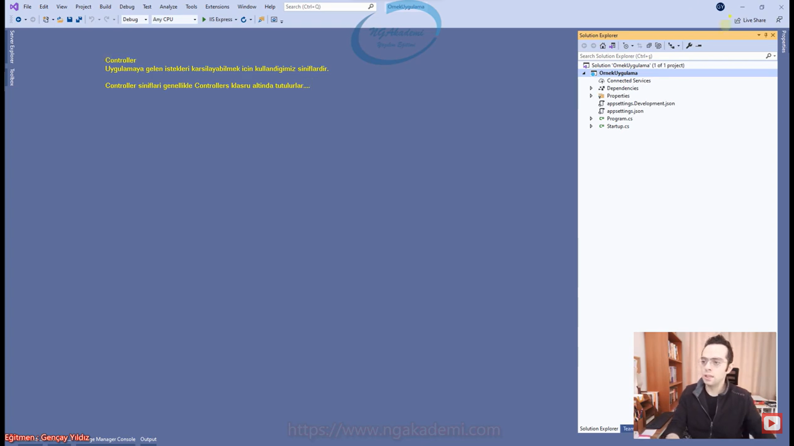
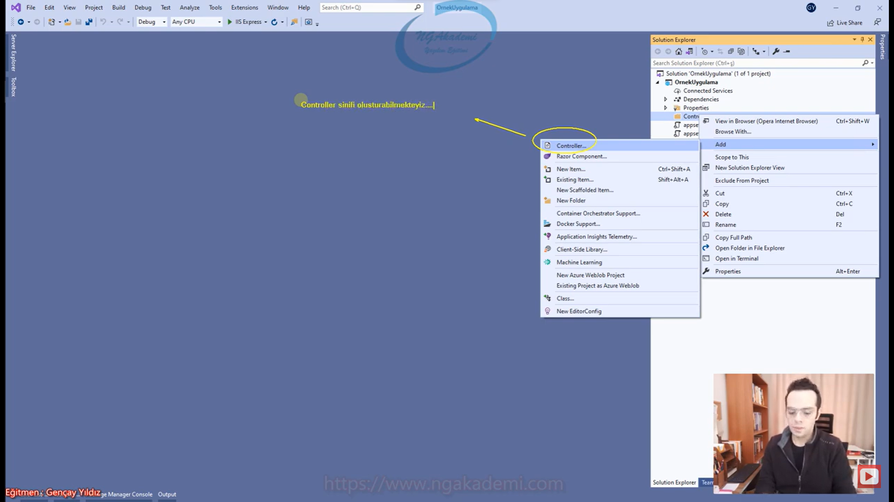

- Controller sınıflarının isimlerinin sonuna Controller eki koyulması gelenekseldir....

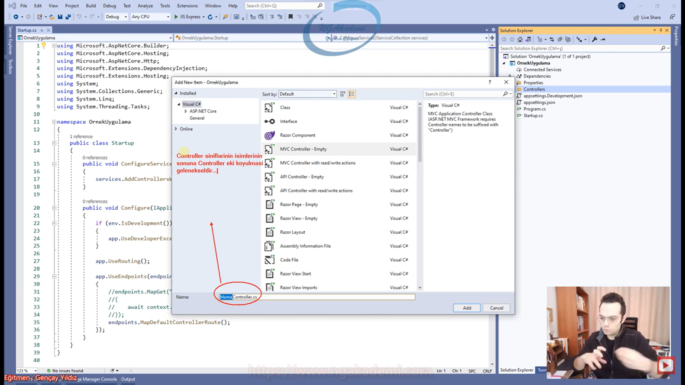

- Bir sınıfın Request karşılayabilir fıtrata sahip olabilmesi için Controller sınıfından kalıtım alması gerekir.

- Bir sınıfı request alabilir response döndürelebilir yani controller yapabilmek için o sınıfı Controller `class`ından türetmemiz gerekmektedir.

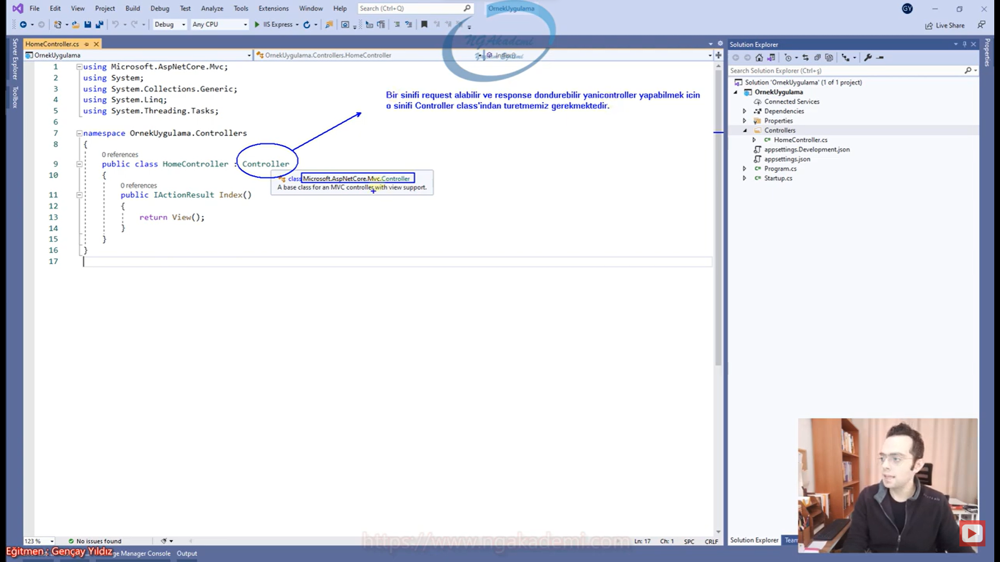

- Bir sınıf içerisinde operatif olarak metotları çalıştırır. Sınıf tek başına kendisi operasyon gerçekleştiremez. Algoritmalar operasyonlar bütün herşey metotlarda çalışması gerekiyor.

- İlgili controller içindeki o metot sana o hizmeti sunacaktır. ilgili isteğe karşılığı verecektir. Dolayısıyla biz buradaki isteklerimizi metotlarla karşılarız. Bir controller'ın içinde istekleri karşılayan metotlara biz action metot diyoruz.

- Controller sınıfları içerisinde tanımlanan tümmmm metotlar artık action metot olarak nitelendirilecektir.

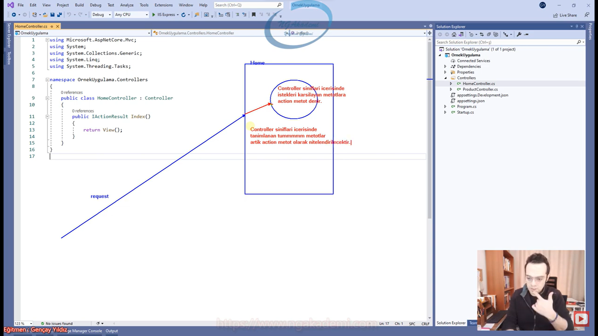

- Action metot : Controller'a gelen isteği karşılayan ve gerekli operasyonları gerçekleştiren metotlardır...

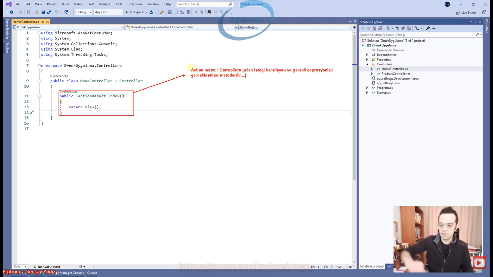

- Sen bir request gönderdiğinde araya kestrel giriyor request'i alıyor gerekli middleware'lar ayağa kaldırılıyor falan filan derken routing modül'de hangi endpoint olduğu ortaya çıkıyor. Hangi rotaya gideceğin belli oluyor bu endpoint'ten sonra reflection ile istek yolladığın controller ilgili uygulama da aranıyor. Bulunduğu taktirde de ondan bir nesne/instance oluşturuluyor ve ardından ilgili action'ı yani ilgili action'a karşılık gelen metodu invoke ediliyor.

- MVC'de Model, View, Controller esasında bir klasördür. Bu klasörün içindeki kah sınıf dosyalarından kah özel razor dosyalarından ibaret çalışan belirli dosyalar var. Yani senin isteğini karşılayan katmanlar klasörlerden ibaret. 

- Controller sınıflarındaki action metotlarının kullanacağı view'lar bunların kesinklikle Views isimli bir klasörde tanımlanmış olması gerekiyor.

- Bir Controller'a ait View'ların ilgil Controller isminin altında bulunması gerekir.

- Default olarak ilgili Action'a ait bir View oluşturacaksanız birebir action'la aynı isimde olması gerekiyor.

- View dosyaları .cshtml uzantılı dosyalardır. C#'la yani .cshtml dosyalarıyla html kodlarının birlikte kullanılabildiği bir format demektir. Biz bu formata Razor teknolojisi diyeceğiz. Razor teknolıojisi sayesinde sen hem html'i hem de C#'ı tek bir dosya üzerinde kullanabiliyorsun.

- Razor ASP.NET Core MVC mimarisinde View'i kodlayabilmemiz için View'de hızlı bir şekilde UI tabanlı çalışmalar gerçekleştirebilmemiz için geliştirilmiş bir teknolojidir. HTML içerisinde C# kodlarını yazmamızı sağlayan bir teknolojidir Razor teknolojisi

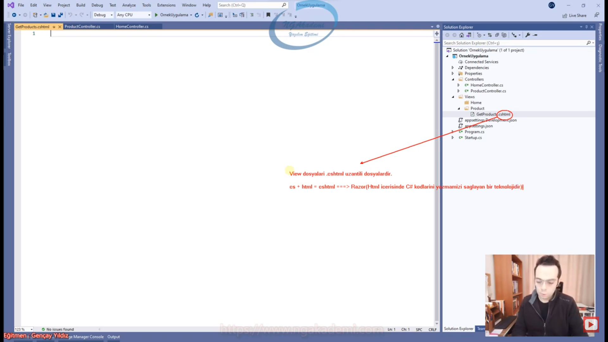

- İlgili adres tetiklendiğinde/isteği gönderdiğinde ilgili action bunu karşılıyor action kendi view'ini render ettirip sonucu viewresult'u bize döndürüyor ve tarayıcımız bunu yorumlayıp bana gösteriyor.

- View fonksiyonu bu actiona ait view(.cshtml) dosyasını tetikleyecek olan fonksiyondur.

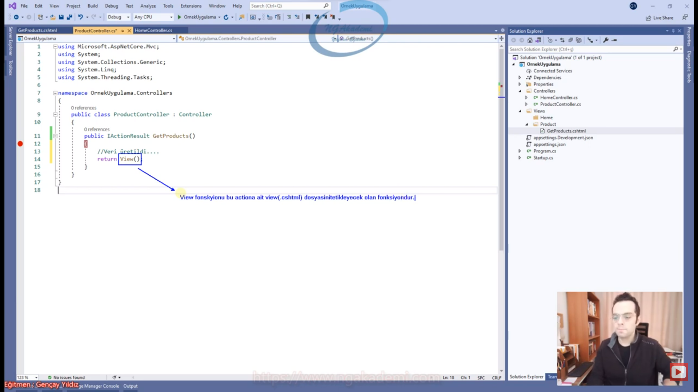

- Model katmanı özünde bir klasörden ibarettir. Models'ın altında senin context'in olur entity'lerin olur. Models altındaki sınıfları kullanmaya aslında Models'a gitmek diyoruz.

- Controller'da Model klasöründeki bir sınıfı/nesneyi kullanman/çağırman/işlem yapman Controller'dan Model'a gitmen anlamına geliyor. Stratejik olarak sen oraya gitmiş gibi gözüksende esasında sadece oradaki sınıfları kullanmaktan ibarettir MVC'deki Model katmanını kullanmak.
