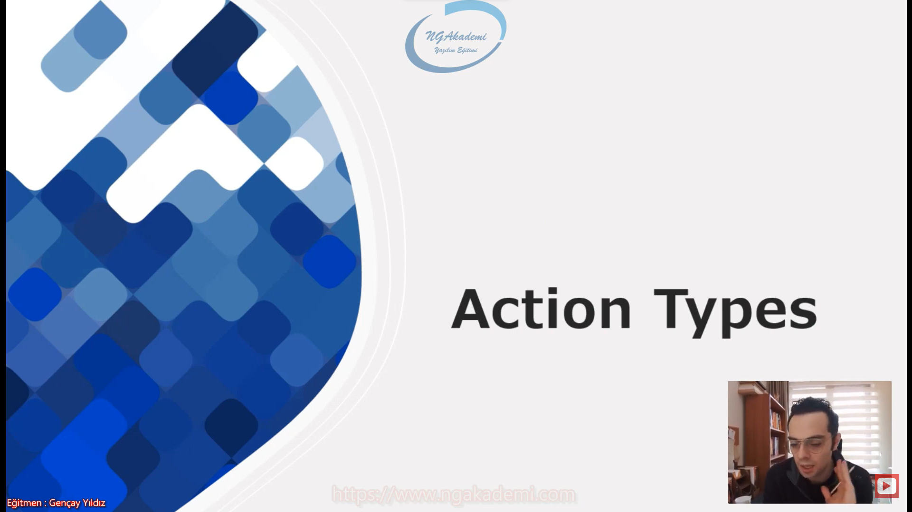
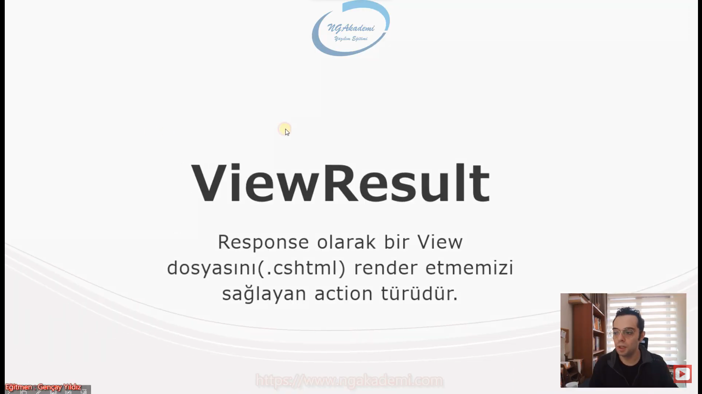
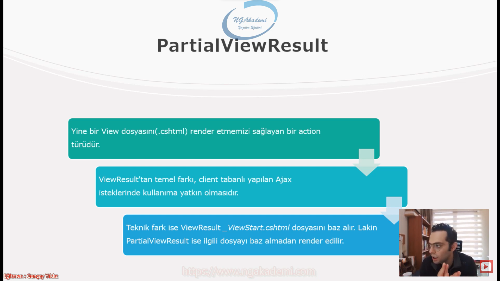
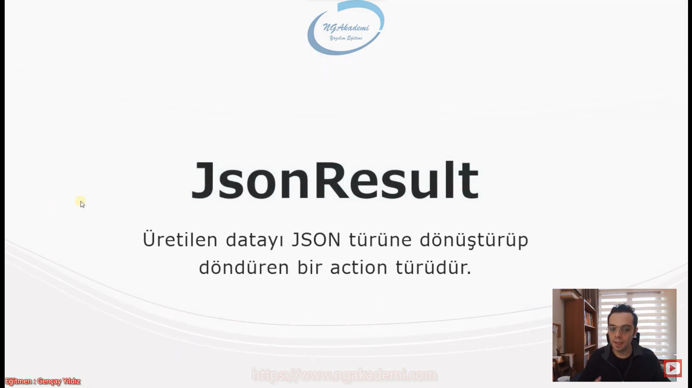
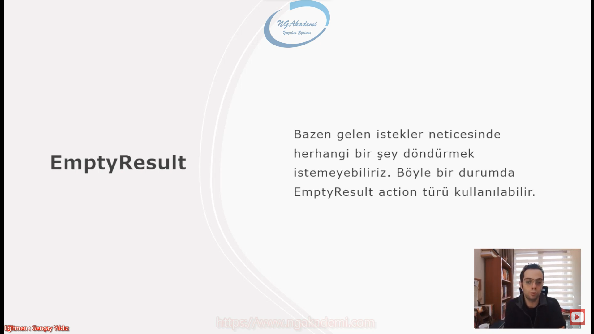
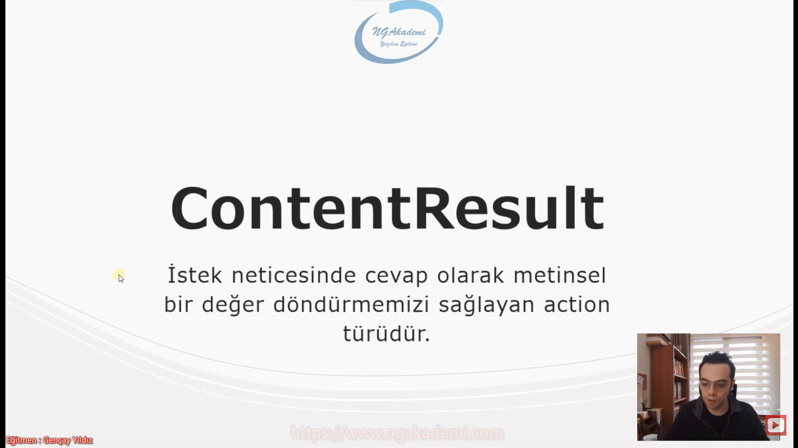
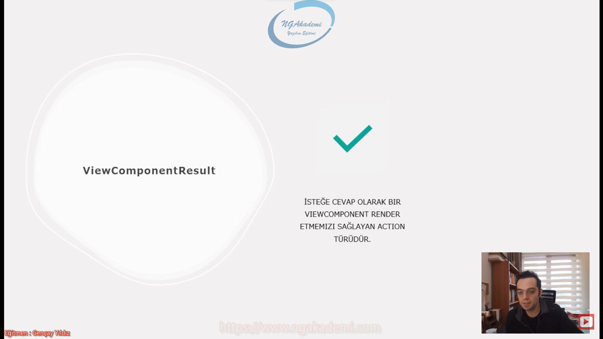
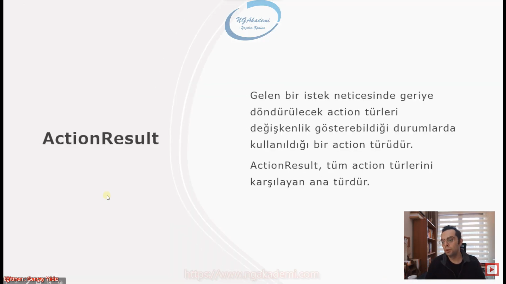
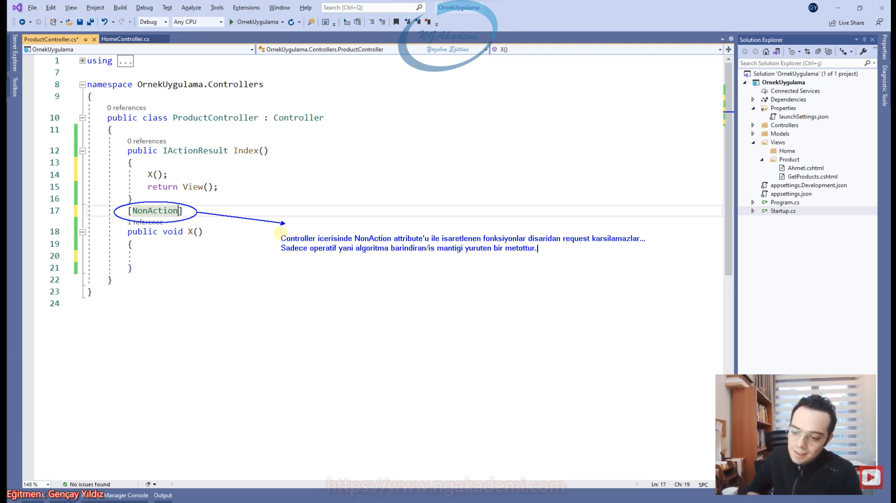

***
# 15) Asp.NET Core 5.0 - Action Türleri Nelerdir?
- Client'tan gelen request'i controller karşılar. Controller request'in mahiyetine uygun olan/bu işlemi yapacak olan action'a yönlendiriyor yani ilgili fonksiyon tetikleniyor bu fonksiyon ihtiyaca binaen bütün operasyonu/aksiyonu alıyor. Gerektiği taktirde model'a gidiyor Model'da ilgili veri üretiliyor ve elde ediyor. Gerekirse View'e gidiyor View'de ilgili veriyi makyajını yapıyor tekrar elde ediyor ve en nihayetinde client'a istediği veriyi bir şekilde döndürmüş oluyor. İşte buradaki operasyonu action üstlenir. Controller sadece bu action'ların tutulduğu bir sınıf bizim nazarımızda.



- Bir developer geri dönüş türlerine uygun değer üretmemiz gerekiyorsa bu değerleri üretecek fonksiyonlar bizim base class'ımız tarafından bizlere sunulmaktadır.

- Sen hangi türde client'a değer döndüreceksen bu türe uygun fonksiyonu çağırman yeterli ekstradan bişey yapmana gerek yok.

## ViewResult
- Response olarak bir View dosyasını(.cshtml) render etmemizi sağlayan action türüdür.

- View'i render ettikten sonra sonuç ViewResult olarak elde ediliyor. ve bunu client'a gönderiyorduk.

- Bir action fonksiyonu ViewResult geriye döndürüyorsa bu bir View render etmek ve ilgili render edilen sonucu ViewResult'u client'a göndermek ister.

- ViewResult'ta View'i render etmek istiyorsanız base `class`taki `View()` fonksiyonunu kullanmanız yeterli olacaktır.

- `View()` fonksiyonu bildiğiniz üzere ilgili controller ismine karşılık gelen Views klasörü altındaki bir klasörün içerisindeki action metodunun ismine karşılık gelen .cshtml'i render eden otomtik bu path dizinini baz alıp çalışan ve oradaki render ettiği View'i bize sonucunu ViewResult olarak döndüren bir fonksiyondur.

```C#
public ViewResult GetProducts()
{
    ViewResult result = View();
    return result;
}
```



## PartialViewResult
- Yine bir View dosyasını(.cshtml) render etmemizi sağlayan bir action türüdür.

- ViewResult'tan temel farkı, client tabanlı yapılan Ajax isteklerinde kullanıma yatkın olmasıdır.

- Teknik fark ise ViewResult _ViewStart.cshtml dosyasını baz alır. Lakin PartialViewResult ise ilgili dosyayı baz almadan render edilir.

- Sen ViewResult kullanıyorsan bu ViewResult backend'de client'tan yapılan istek client tabanlı değilse biz ViewResult kullanıyoruz. Eğer ki Client tabanlıysa ajax teknolojisiyle gerçekleştiriliyorsa sen PartialViewResult kullanarak sonucu üretmelisin.

- Web sayfanın genelini sana oluşturan ViewResult ama bu web sayfandaki belirli bir local noktayı sana oluşturacak olan PartialViewResult.

- _ViewStart.cshtml içerisinde layout dediğimiz genel tasarımını tutan bir başlangıç View'idir. Dolayısıyla ViewResult bu başlangıç View'iyle beraber render edildiği için genel sayfayı render eder. Sen genel sayfayı değil belirli bir alanı render edip onun çıktısını o alanda kullanmak istiyorsan sayfanın genelini render etmeden parçasını belirli bir parçasına odaklı render işlemi yapmak istiyoean yani _ViewStart.cshtml dosyasını baz almak istemiyorsan PartialViewResult kullanman gerekiyor.

```C#
public PartialViewResult GetProducts()
{
    PartialViewResult result = PartialView();
    return result;
}
```



## JsonResult
- Üretilen datayı JSON türüne dönüştürüp döndüren bir action türüdür.

- Sen Client'a gelen istek neticesinde bir .json formatında değer döndüreceksen JsonResult döndürebilirsin.

- `Json()` fonksiyonu kendisi otomatik Json'a dönüşüm yaptığı için sen ekstradan bişey yapmana gerek yok. Json dönüşümlerinin sorumluluğunu biz üstlenmeyiz.

- JsonResult kullanıyorsan eğer sonuç sana .json formatında sayfanın formatıda .json olarak yüklenecektir. Onun için biz genellikle isteklerimizi JsonResult'ta bu şekilde yapmayız client tabanlı yaparız. Client tabanlı alırsın ki gelen .json nesneyi hani tarayıcıda manuel bir şekilde istek yaparak bütün herşeyi .json formatta görmektense Client tabanlı alıp client'ta işlemeyi tercih ederiz.

```C#
public JsonResult GetProducts()
{
    JsonResult result = Json(new Product
    {
        Id = 5,
        ProductName="Terlik",
        Quantity = 15
    });
    return result;
}
```



## EmptyResult
- Bazen gelen istekler neticesinde herhangi bir şey döndürmek istemeyebiliriz. Böyle bir durumda EmptyResult action türü kullanılabilir.

- Client'tan istek geldi istek işlendi ama kullanıcıya bir değer döndürmek istemiyorum tamam kardeşim bitti isteğini aldım ben senin yani tamam bitti bile demek istemiyorum böyle bir durumda geriye boş bir result döndürebilirsiniz. Geriye boş bir result döndürmek hani cevapsız gibi düşünmeyin response var ama result'u yok. 

- Response'u vardır ama Response'un içerisinde result döndürmemiş oluruz.

- HTTP Protokolü üzerinden sen request yaptığın zaman o Allah'ın emri bir tane response olacak. İyi ya da kötü bir response olur. Ama bu response içerisinde result taşır taşımaz.

- EmptyResult'un birde muadili vardır. `void` keywordüyle de aynı işlemi yapabilirsiniz. `void` keywordüyle de yine response oluşturmadan/olmadan gerekli çalışmayı yapabiliyorsunuz. Bu da aynı mahiyettedir. Muadili diyebiliriz.

```C#
public EmptyResult GetProducts()
{
    return new EmptyResult();
}

public void GetProducts()
{
}
```



## ContentResult
- İstek neticesinde cevap olarak metinsel bir değer döndürmemizi sağlayan action türüdür.

- Bunu da genellikle Client tabanlı çalışmalarda kullanırız.

- ContentResult sonucu sana text/plain olarak gönderir. 

- Formatı HTML'den ziyade bir text'tir.

- ContentResult, JsonResult gibi result'ları genellikle Client tabanlı tercih ederiz. O şekildeki operasyonlarda kullanırız çünkü ben normal bir web sitesinin web sayfasının formatınız bozmak istemem. Kullanıcıya bir değer döndüreceksem HTML'i render edilmediği bir sayfa olarak döndürmek istemem.

- ContentResult, JsonResult bunları biz genelde ajax tabanlı işlemlerde tercih ediyoruz.

```C#
public ContentResult GetProducts()
{
    ContentResult result = Content("Sebepsiz boş yere ayrılacaksan....");
    return result;
}
```



## ViewComponentResult
- İsteğe cevap olarak bir ViewComponent Render etmemizi sağlayan action türüdür.

- ViewComponent performanslı bir yapıdır.



## ActionResult
- Gelen istek neticesinde geriye döndürülecek action türleri değişkenlik gösterebildiği durumlarda kullanılan bir action türüdür.

- ActionResult, tüm action türlerini karşılayan ana türdür.

- Bütün Result türlerinin base `class`ıdır.

- Action türlerinin atasıdır.

- Farklı türleri döndürebilmen için sana ortak türleri sana sağlayan ActionResult türüdür.

- ActionResult ortak bir tür sağlar. Dolayısıyla genellikle ActionResult'u kullanır ve tercih ederiz.

- IActionResult ise ActionResult'un bir `interface`i arayüzü. IActionResult, ActionResult bunların hepsinin base'idir. Dolayısıyla ortak tür sağlamak istiyorsanız ve daha hızlı bir şekilde polimorfizm kurallarına dayanarak çalışma sergileme istiyorsanız IActionResult, ActionResult'u kullanabilirsiniz



## C# Examples
```C#
public class ProductController : Controller
{
    #region ViewResult
    public ViewResult GetProducts()
    {
       ViewResult result = View();
       return result;
    }
    #endregion
    #region PartialViewResult
    public PartialViewResult GetProducts()
    {
       PartialViewResult result = PartialView();
       return result;
    }
    #endregion
    #region JsonResult
    public JsonResult GetProducts()
    {
       JsonResult result = Json(new Product
       {
           Id = 5,
           ProductName="Terlik",
           Quantity = 15
       });
       return result;
    }
    #endregion
    #region EmptyResult
    public EmptyResult GetProducts()
    {
       return new EmptyResult();
    }
    #endregion
    #region ContentResult
    public ContentResult GetProducts()
    {
       ContentResult result = Content("Sebepsiz boş yere ayrılacaksan....");
       return result;
    }
    #endregion
    #region ActionResult
    public ActionResult GetProducts()
    {
        if (true)
        {
            //......
            return Json(new object());
        }
        else if (true)
        {
            return Content("asfasasdasd");
        }
        return View();
    }
    #endregion
    #region IActionResult

    #endregion
}
```

***
# 16) Asp.NET Core 5.0 - NonAction ve NonController Attributeları
- Controller'ların gelen request'leri karşılıyan action'ların ise bu request'ler gereği gerekli operasyonları tetikleyen fonksiyonlardır.

- Controller'ların temel yegane amacı sadece request'leri karşılamaktır. Yani Controller dediğiniz sınıf kendi içerisinde ekstradan bir iş mantığı yürütmemelidir. Bir algoritma yürütmemelidir. Sadece request'i karşılamalı ve bu request'in gereği olan o algoritmaları barındıran servisleri çağırmalı yahut bir başka deyişle tetiklemelidir.

- Controller işin komutanıdır. İş yapanı değildir. İş mantığı başka yerlerde başka servislerde başka sınıflarda tanımlanmış olması gerekir. 

- Controller'ların içinde kesinlikle iş mantıkları olmamalıdır. İş mantıkları başka sınıflarda başka katmanlarda başka servislerde API'larda vs olacak Controller sadece bunların gerekli organizasyonunu sağlayacaktır.

- Controller kontrol edendir iş yapan değil.

- Action metotları ise Controller'ların yaverleri gibi düşünülebilir. Yani burada işi yapacak olan servislerin veritabanı işlemini yapacak olan Model'ların yahut gerekli View çalışmalarının yapılacağı olan katmanların tetiklenmesinde gerekli yönlendirmeyi sağladığımız algoritmik operasyonları sağladığımız metotlarımız action metotlarıdır. 

- Controller içerisindeki action'lar gerekli noktalara yönlendirme yapar amma velakin iş yapmaz. Action'lar iş yapmak için değil iş yapan iş mantığını yürüten sınıfları servisleri çağırmak için vardır.

- Nihayetinde Controller'ın içerisindeki metot türü ne olursa olsun bir action metottur.

- Action bir metotsa yani dışarıdan gelen request'i karşılayabiliyorlarsa kesinlikle bir iş mantığı üstlenmemeli iş mantığını üstlenen servislere ya da katmanlara gerekli taleplerde bulunmalıdır.

- Eğer ki ihtiyacınız bir controller sınıfı içerisinde oluşturulan metot iş mantığı yürüten metotsa yani request karşılamaktan ziyade bir işe odaklı çalışıyorsa ki biz bunu tavsiye etmeyiz yani metotlar controller'ların içerisindeki action'lar genellikle request alacaklarından dolayı iş mantıklarını action'larda tanımlamayız. Başka sınıflarda tanımlarız amma velakin diyelim ki böyle bir ihtiyacınız oldu ya da diyelim ki böyle bir tasarımda çalışıyorsunuz ve MVC'de controller'ın içerisindeki bir metot sadece iş mantığını üstlenecektir. Request'i üstlenmemesi gerekecektir.

- Controller sınıflarının içlerinde tanımlanmış olan metotların iş mantığı amaçlı kullanılmasını yani dışarıdan gelen request'in alınmasını engellemek istiyorsak sadece iş mantığıyla o amaçla kullanacaksak ilgili metodun bir action metot olmadığını bildirmemiz gerekiyor. Bunun içinde `NonAction` attribute'u kullanılır. 

- Controller'da `NonAction` attribute'u ile işaretlenen fonksiyonlar dışarıdan request almazlar.

- Controller'lardaki fonksiyonların default hali bir action'dır. Eğer ki `NonAction` ile işaretlerseniz artık bu bir action olmayacaktır. Sadece operatif yani algoritma barındıran/iş mantığı yürüten bir metottur.

- Microservice yapılanmalarında bazen event tabanlı çalışmalar yapabiliyoruz. Kuyruğa gelen bir mesajı tüketebilmek için bazen Controller içerisinde bir iş mantığındaki fonksiyonu tetiklemeniz gerekebilir. İşte böyle durumda ilgili fonksiyonun dışarıdan request almasına gerek kalmaz onun için onu `NonAction` yaparız ki sadece kuyruğa mesaj geldiğinde oradaki mesajları tüketebilmesi için kullanılan bir fonksiyon olacağı için dışarıdan request'leri kapatırız yani `NonAction` ile işaretleriz. İçeride gerekli tüketimler yapılır.



```C#
[NonAction]
public void X()
{
}
```

- Sistemde varolan tüm controller'lar dışarıdan istek alabilmektedirler. Siz hem controller tanımlayıp hem de dışarıdan istek almasını istemiyorsanız ilgili controller'da `NonController` attribute'u ile işaretleyebilirsiniz.

- Bir metodun istek karşılayabilmesi için onun action olması gerekir.

- Bir controller'ı `NonController` ile işaretlersek eğer içinde action olsun olmasın farketmiyor bir controller olmadığını ifade etmiş olacağız sadece controller'dan türeyen controller sınıfı olduğunu söylüyoruz ama iş mantığıyla kullanacaksanız komple controller'ı Business mantığında çalışmalar yapacaksanız ve bunun dışarıdan bir request almasını istemiyorsanız `NonController` ile Controller'ı işaretlerseniz eğer ilgili controller artık normal bir sınıf olan Controller olacaktır. Yani artık işlevsel bir controller olmayacak normal sıradan bir sınıf olacaktır. Dışarıdan istek alamayacaktır.

```C#
[NonController]
public class ProductController : Controller
{
    public IActionResult Index()
    {
        X();
        return View();
    }
    [NonAction]
    public void X()
    {
    }
}
```

## C# Examples
```C#
[NonController]
public class ProductController : Controller
{
    public IActionResult Index()
    {
        X();
        return View();
    }
    [NonAction]
    public void X()
    {
    }
}
```
