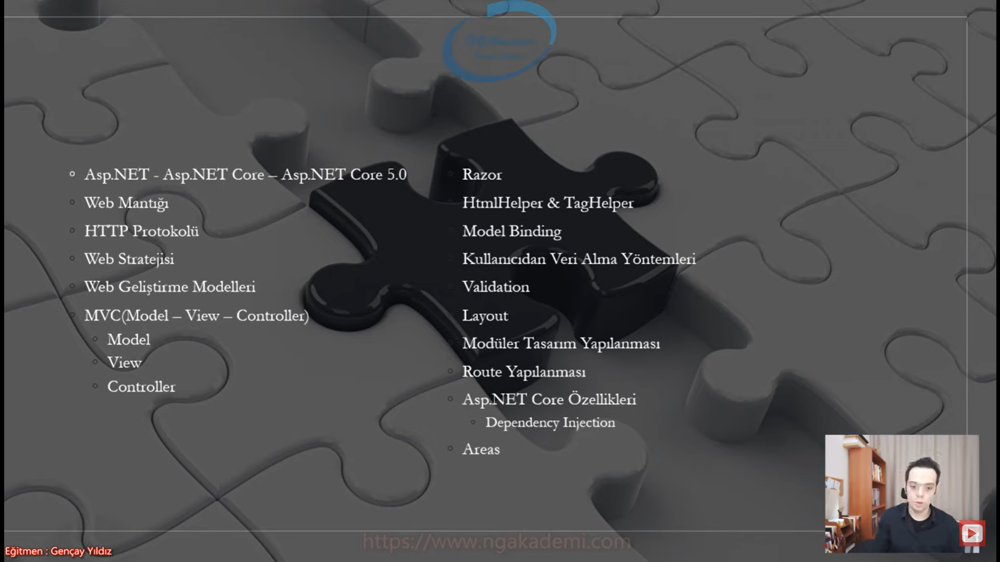
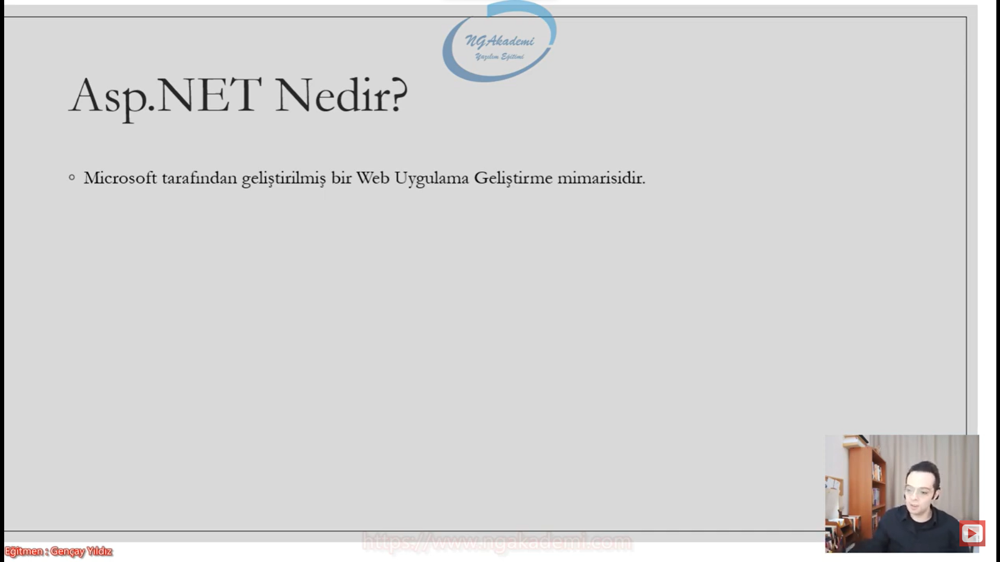
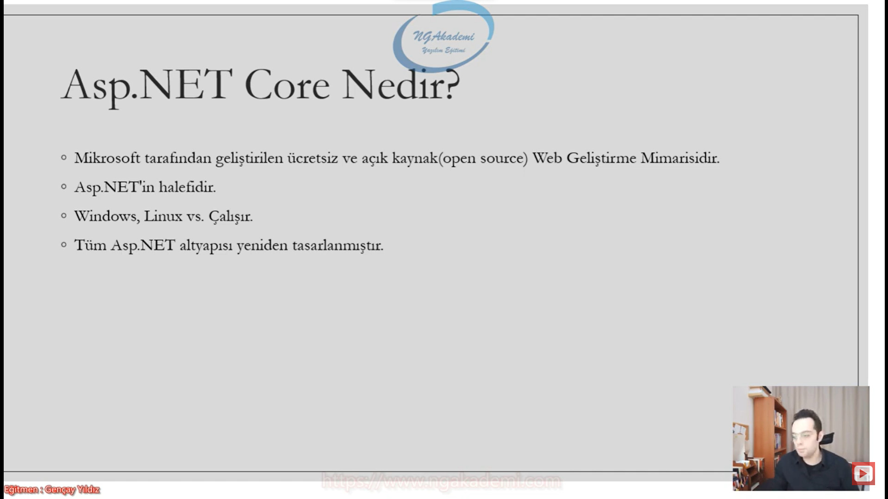
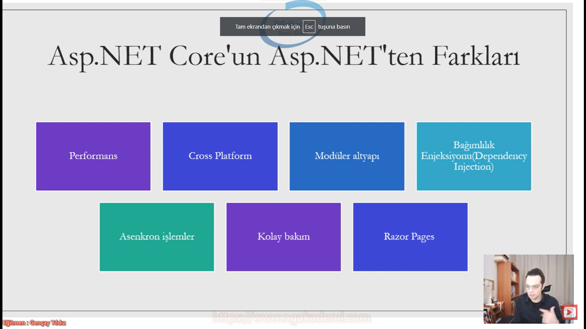
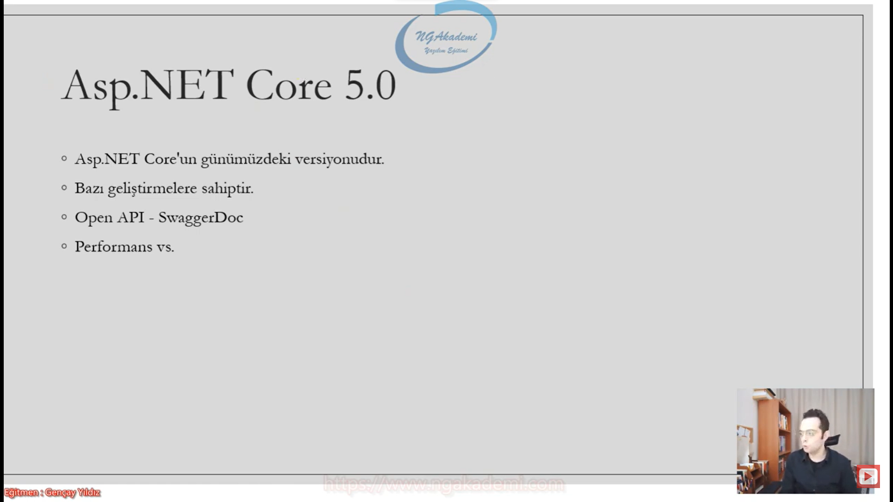

# Özel Ders Formatında A'dan Z'ye Asp.NET Core 5.0 Web

***
# [Bu notları Gençay Yıldız hocamın sayesinde izlediğim bu playlistten öğrendim.](https://www.youtube.com/playlist?list=PLQVXoXFVVtp33KHoTkWklAo72l5bcjPVL)  Herkesin izlemesini tavsiye ederim. Mükemmel bir anlatım. Böyle mükemmel bir içerikli [Türkçe kaynağı](https://www.youtube.com/c/Gen%C3%A7ayY%C4%B1ld%C4%B1z) hiçbir yerde bulamazsınız.
***

***
# 1) Asp.NET Core 5.0 Eğitimi

***
# 2) Asp.NET Core 5.0 - Asp NET Core Nedir?
- Bizim buradaki amacımız Web'te çalışan uygulama geliştirmek

- Nasıl ki biz console uygulamasında çalışacaksak gidip Console application oluşturuyorsak ya da bir görsel arayüzü olan form üzerinde işlemlerimizi yapacaksak Windows Form Application'ı oluşturuyorsak yahut mobil üzerinden çalışmalar gerçekleştireceksek android vs gibi teknolojilerde çalışıyorsak Web'de de çalışıyorsanız web'de bir uygulama gerçekleştirecekseniz web'in fıtratına uygun bir teknolojide çalışmanız gerekiyor. Dolayısıyla bu teknolojiler Java'nın kendine ait web teknolojisi olabilir. php dediğimiz programlama dili olabilir. Yahut Microsoft tarafından geliştirilmiş ASP.NET teknolojisi mimarisi olabilir.

## Asp.NET Nedir?
 
- Microsoft tarafından geliştirilmiş bir Web Uygulama Geliştirme mimarisidir.

- Mimari programlama dili demek değildir.

- ASP.NET bir programlama dili değil programlama dili olan C# ile kodlanabilen web uygulaması geliştirme mimarisidir. Mimari dediğiniz belli bir yaklaşımı kabul etmiş/benimsemiş bir programlama dili desteklenen ve belirli bir amaca hizmet eden bir yapılanmadır. Mesela ASP.NET'te olduğu gibi.
    * Örneğin Sen ASP.NET ile gidip bir form uygulaması yapamazsın. tek başına ASP.NET ile yine salt işlem yapamazsın veritabanı işlemi yapamazsın vs. ya da bir algoritma oluşturamazsın. 

- ASP.NET bir mimari C# ile biz bu mimari üzerinde kodlamalar yapıp profesyonel kurumsal web uygulamaları geliştirebilmekteyiz.

## Asp.NET Core Nedir?
- Microsoft tarafından geliştirilen ücretsiz ve açık kaynak(open source) Web Geliştirme Mimarisidir.

- Asp.NET'in halefidir. Nihayetinde Asp.NET'in kurmuş olduğu düzenin nizamın üzerine gelen bir mimaridir.

- Windows, Linux vs. çalşır.

- Tüm Asp.NET altyapısı yeniden tasarlanmıştır.

- Asp.NET windows'ta çalışırken Asp.NET Core Windows Linux gibi diğer platformlar'da çalışabilir.

## Asp.NET Core'un Asp.NET'ten Farkları 

|Asp.NET|Asp.NET CORE|
|---|---|
|Performansı düşüktür|Daha performanslıdır|
|Sadece Windows'ta çalışmaktadır.|Cross platformdur. Her yerde çalışabilmektedir.|
|Yapısal olarak herşey bir bütündür|Modüler altyapıda gelmiştir|
|IOC yapılanmasını harici kütüphane olarak kullanıyorduk|Kendi dahilinde barındırmaktadır. Dependency Injection tasarımını otomatik olarak oluşturmamızı sağlar.|
||Asenkron işlemler |
||Kolay Bakım|
||Razor Pages|

- Modüler dediğimiz yapılanma bir araba düşünün arabanın farı olsun tekeri olsun direksiyonu olsun hepsi arabada bir bütün olursa şimdi modüler değilse arabanın hepsi bir bütünse ufacık bir noktasında bile oluşacak ufacık bir arıza olası bir hata arabanın topyekün bütününü ilgilendirecektir. Halbuki tekerleğin modüler olması akünün modüler olması direksiyonun modüler olması sadece bu alanlarla ilgili lokal problemlerde o alanda çalışıp genelde problemi çözmemizi sağlamaktadır. Modüler yapılanma parça bütün ilişkisidir. Yani siz sistemde kullanacağınız ufacık bir modülü sisteme devreye sokabilir ya da onu devreden çıkarabilirsiniz. Sistemin genelini etkilemez. Sistemde kullanılacak ufak bir operasyonu sağlayan modül örneğin Image Processing modülü bunu takıyorsun uygulama artık Image Processing destekliyor çıkartıyorsun desteklemiyor. İşte bu da bize yönetilebilirlik kazandırır.

- Bir şeyin modüler olmaması her şeyin kendi bünyesinde sahip olmasıdır. Dolayısıyla bu da yönetilebilirlik geliştirebilirlik ve bunun gibi diğer durumlar diğer ölçütleri ciddi manada maliyetli hale getirmektedir.

## Asp.NET Core 5.0
- Bazı geliştirmelere sahiptir

- Open API - SwaggerDoc

- Performans vs.

- Belirli sorgulamaların daha da geliştirilmiş halleri

- Asp.NET'i kapsar.

